# 6. Comparaciones v1 vs v3 clinica

## 6.1. Cargar archivos y tratamiento


```python
import pandas as pd

# 1. Rutas originales
ruta_df_visita1_final = r"C:\Users\randy\Desktop\MC2\TFM\data\tablas_generadas\procesadas\procesadas_final\df_visita1_final.csv"
ruta_df_visita3_final = r"C:\Users\randy\Desktop\MC2\TFM\data\tablas_generadas\procesadas\procesadas_final\df_visita3_final.csv"
ruta_microbiota_CLR_clusters = r"C:\Users\randy\Desktop\MC2\TFM\data\tablas_generadas\procesadas\procesadas_microbiota\microbiota_CLR_clusters.csv"
ruta_df_visita4_final = r"C:\Users\randy\Desktop\MC2\TFM\data\tablas_generadas\procesadas\procesadas_final\df_visita4_final.csv"

# 2. Carga de DataFrames manteniendo sus nombres
df_visita1_final = pd.read_csv(ruta_df_visita1_final)
df_visita3_final = pd.read_csv(ruta_df_visita3_final)
microbiota_CLR_clusters = pd.read_csv(ruta_microbiota_CLR_clusters)
df_visita4_final = pd.read_csv(ruta_df_visita4_final)

# 3. Confirmación
print("✔️ df_visita1_final:", df_visita1_final.shape)
print("✔️ df_visita3_final:", df_visita3_final.shape)
print("✔️ microbiota_CLR_clusters:", microbiota_CLR_clusters.shape)
print("✔️ df_visita4_final:", df_visita4_final.shape)
microbiota_CLR_clusters

```

    ✔️ df_visita1_final: (297, 95)
    ✔️ df_visita3_final: (314, 97)
    ✔️ microbiota_CLR_clusters: (297, 241)
    ✔️ df_visita4_final: (314, 152)
    


<div>
<style scoped>
    .dataframe tbody tr th:only-of-type {
        vertical-align: middle;
    }

    .dataframe tbody tr th {
        vertical-align: top;
    }

    .dataframe thead th {
        text-align: right;
    }
</style>
<table border="1" class="dataframe">
  <thead>
    <tr style="text-align: right;">
      <th></th>
      <th>id</th>
      <th>visita0</th>
      <th>fechanac</th>
      <th>sexo</th>
      <th>nivelestudios</th>
      <th>situacionlaboral</th>
      <th>horariolaboral</th>
      <th>numerohijos</th>
      <th>madobesidad</th>
      <th>maddiabetes</th>
      <th>...</th>
      <th>masagrasatroncodxa1</th>
      <th>masagrasaandroidedxa1</th>
      <th>masagrasaginoidedxa1</th>
      <th>masavatdxa1</th>
      <th>volumenvatdxa1</th>
      <th>pas1_1</th>
      <th>pad1_1</th>
      <th>pas1_2</th>
      <th>pad1_2</th>
      <th>caloriasdieta</th>
    </tr>
  </thead>
  <tbody>
    <tr>
      <th>0</th>
      <td>1</td>
      <td>11/11/2015</td>
      <td>1/26/1961</td>
      <td>mujer</td>
      <td>estudios primarios</td>
      <td>Tiempo completo</td>
      <td>Partido</td>
      <td>3.0</td>
      <td>No antecedentes</td>
      <td>No antecedentes</td>
      <td>...</td>
      <td>24587.0</td>
      <td>3945.0</td>
      <td>7129.0</td>
      <td>1796.0</td>
      <td>1904.0</td>
      <td>124.0</td>
      <td>77.0</td>
      <td>129.0</td>
      <td>87.0</td>
      <td>1400.0</td>
    </tr>
    <tr>
      <th>1</th>
      <td>2</td>
      <td>11/16/2015</td>
      <td>3/6/1984</td>
      <td>hombre</td>
      <td>bachiller o FP</td>
      <td>Tiempo completo</td>
      <td>3 turnos</td>
      <td>0.0</td>
      <td>No antecedentes</td>
      <td>No antecedentes</td>
      <td>...</td>
      <td>19940.0</td>
      <td>3686.0</td>
      <td>5703.0</td>
      <td>1694.0</td>
      <td>1796.0</td>
      <td>133.0</td>
      <td>106.0</td>
      <td>133.0</td>
      <td>65.0</td>
      <td>1900.0</td>
    </tr>
    <tr>
      <th>2</th>
      <td>3</td>
      <td>11/19/2015</td>
      <td>7/14/1962</td>
      <td>hombre</td>
      <td>estudios primarios</td>
      <td>Paro</td>
      <td>No procede</td>
      <td>2.0</td>
      <td>Si antecedentes</td>
      <td>Si antecedentes</td>
      <td>...</td>
      <td>28281.0</td>
      <td>5104.0</td>
      <td>5963.0</td>
      <td>3050.0</td>
      <td>3233.0</td>
      <td>175.0</td>
      <td>93.0</td>
      <td>178.0</td>
      <td>91.0</td>
      <td>1800.0</td>
    </tr>
    <tr>
      <th>3</th>
      <td>4</td>
      <td>11/18/2015</td>
      <td>5/12/1949</td>
      <td>hombre</td>
      <td>bachiller o FP</td>
      <td>Jubilado/a</td>
      <td>No procede</td>
      <td>3.0</td>
      <td>No antecedentes</td>
      <td>No antecedentes</td>
      <td>...</td>
      <td>22212.0</td>
      <td>4192.0</td>
      <td>4373.0</td>
      <td>3757.0</td>
      <td>3982.0</td>
      <td>128.0</td>
      <td>78.0</td>
      <td>145.0</td>
      <td>78.0</td>
      <td>1600.0</td>
    </tr>
    <tr>
      <th>4</th>
      <td>6</td>
      <td>11/20/2015</td>
      <td>3/30/1956</td>
      <td>mujer</td>
      <td>estudios primarios</td>
      <td>Tiempo completo</td>
      <td>2 turnos</td>
      <td>3.0</td>
      <td>Si antecedentes</td>
      <td>Si antecedentes</td>
      <td>...</td>
      <td>26111.0</td>
      <td>3975.0</td>
      <td>6186.0</td>
      <td>983.0</td>
      <td>1042.0</td>
      <td>140.0</td>
      <td>90.0</td>
      <td>140.0</td>
      <td>90.0</td>
      <td>1400.0</td>
    </tr>
    <tr>
      <th>...</th>
      <td>...</td>
      <td>...</td>
      <td>...</td>
      <td>...</td>
      <td>...</td>
      <td>...</td>
      <td>...</td>
      <td>...</td>
      <td>...</td>
      <td>...</td>
      <td>...</td>
      <td>...</td>
      <td>...</td>
      <td>...</td>
      <td>...</td>
      <td>...</td>
      <td>...</td>
      <td>...</td>
      <td>...</td>
      <td>...</td>
      <td>...</td>
    </tr>
    <tr>
      <th>292</th>
      <td>314</td>
      <td>2/13/2017</td>
      <td>10/15/1966</td>
      <td>hombre</td>
      <td>Universidad</td>
      <td>Tiempo completo</td>
      <td>Partido</td>
      <td>1.0</td>
      <td>Si antecedentes</td>
      <td>No antecedentes</td>
      <td>...</td>
      <td>14944.0</td>
      <td>2688.0</td>
      <td>3490.0</td>
      <td>1367.0</td>
      <td>1449.0</td>
      <td>138.0</td>
      <td>98.0</td>
      <td>123.0</td>
      <td>94.0</td>
      <td>1500.0</td>
    </tr>
    <tr>
      <th>293</th>
      <td>315</td>
      <td>2/13/2017</td>
      <td>9/10/1990</td>
      <td>mujer</td>
      <td>bachiller o FP</td>
      <td>A tiempo parcial</td>
      <td>2 turnos</td>
      <td>0.0</td>
      <td>No antecedentes</td>
      <td>No antecedentes</td>
      <td>...</td>
      <td>16720.0</td>
      <td>2942.0</td>
      <td>7260.0</td>
      <td>437.0</td>
      <td>463.0</td>
      <td>124.0</td>
      <td>78.0</td>
      <td>129.0</td>
      <td>72.0</td>
      <td>1500.0</td>
    </tr>
    <tr>
      <th>294</th>
      <td>316</td>
      <td>2/14/2017</td>
      <td>7/24/1965</td>
      <td>hombre</td>
      <td>estudios primarios</td>
      <td>Tiempo completo</td>
      <td>Partido</td>
      <td>3.0</td>
      <td>No antecedentes</td>
      <td>Si antecedentes</td>
      <td>...</td>
      <td>21521.0</td>
      <td>3727.0</td>
      <td>4991.0</td>
      <td>2787.0</td>
      <td>2954.0</td>
      <td>140.0</td>
      <td>76.0</td>
      <td>135.0</td>
      <td>76.0</td>
      <td>1700.0</td>
    </tr>
    <tr>
      <th>295</th>
      <td>317</td>
      <td>2/15/2017</td>
      <td>9/1/1976</td>
      <td>mujer</td>
      <td>bachiller o FP</td>
      <td>Tiempo completo</td>
      <td>Continuo</td>
      <td>2.0</td>
      <td>No antecedentes</td>
      <td>No antecedentes</td>
      <td>...</td>
      <td>24179.0</td>
      <td>4256.0</td>
      <td>9140.0</td>
      <td>1094.0</td>
      <td>1160.0</td>
      <td>150.0</td>
      <td>105.0</td>
      <td>140.0</td>
      <td>99.0</td>
      <td>1700.0</td>
    </tr>
    <tr>
      <th>296</th>
      <td>318</td>
      <td>2/15/2017</td>
      <td>8/6/1989</td>
      <td>mujer</td>
      <td>Universidad</td>
      <td>Paro</td>
      <td>No procede</td>
      <td>0.0</td>
      <td>Si antecedentes</td>
      <td>No antecedentes</td>
      <td>...</td>
      <td>28150.0</td>
      <td>5283.0</td>
      <td>9828.0</td>
      <td>1937.0</td>
      <td>2053.0</td>
      <td>123.0</td>
      <td>88.0</td>
      <td>120.0</td>
      <td>92.0</td>
      <td>1700.0</td>
    </tr>
  </tbody>
</table>
<p>297 rows × 95 columns</p>
</div>


### 1.1 Df visita 1

##### Eliminar columnas que no sirven


```python
columnas_a_eliminar_v1 = [
    'visita0', 'nivelestudios', 'situacionlaboral', 'horariolaboral', 'dislipemia',
    'hta', 'enftiroideas', 'hipotiroidismo', 'hipertiroidismo', 'ecv', 'acv',
    'enfdigestivas', 'higadograso', 'enfrespiratorias', 'enfrenales', 'depresion',
    'ansiedad', 'compalimentario', 'otrasenfpsiquia', 'tratahormonal', 'tumormaligno',
    'pesoembarazos', 'pad0_1', 'pas0_1', 'pad0_2', 'pas0_2', 'peso0', 'altura0',
    'BMI_0', 'dettratafarmaco', 'detsuplementnut', 'dejarfumar', 'cigarrillosdia',
    'cantalcohol', 'estadosalud', 'alergiainto', 'detalergiainto', 'mettotal_V0'
]


```


```python
# Eliminar columnas indicadas de df_visita1_final
df_visita1_final = df_visita1_final.drop(columns=columnas_a_eliminar_v1, errors='ignore')

print("✔️ Columnas eliminadas de df_visita1_final. Dimensiones actuales:", df_visita1_final.shape)

```

    ✔️ Columnas eliminadas de df_visita1_final. Dimensiones actuales: (297, 57)
    

##### Convertir columnas categoricas a numericas


```python
from datetime import datetime

# 1. Asegurarse de que ambas columnas estén en formato datetime
df_visita1_final['fechanac'] = pd.to_datetime(df_visita1_final['fechanac'], errors='coerce')
df_visita1_final['visita1'] = pd.to_datetime(df_visita1_final['visita1'], errors='coerce')

# 2. Calcular edad actual
hoy = pd.to_datetime(datetime.today())
df_visita1_final['edad'] = df_visita1_final['fechanac'].apply(
    lambda x: (hoy - x).days / 365.25 if pd.notnull(x) else None
)
df_visita1_final['edad'] = df_visita1_final['edad'].round(1)

# 3. Calcular días desde la visita 1 hasta hoy
df_visita1_final['dias_desde_visita1'] = df_visita1_final['visita1'].apply(
    lambda x: (hoy - x).days if pd.notnull(x) else None
)

print("✔️ Columna 'edad' creada desde 'fechanac'")
print("✔️ Columna 'dias_desde_visita1' creada desde 'visita1'")


```

    ✔️ Columna 'edad' creada desde 'fechanac'
    ✔️ Columna 'dias_desde_visita1' creada desde 'visita1'
    


```python
# Eliminar columnas innecesarias
df_visita1_final = df_visita1_final.drop(columns=['fechanac', 'visita1', 'iniciodieta'], errors='ignore')

print("✔️ Columnas 'fechanac' 'inicio_dieta' y 'visita1' eliminadas.")

```

    ✔️ Columnas 'fechanac' y 'visita1' eliminadas.
    


```python
# Detectar columnas categóricas automáticamente
columnas_categoricas = df_visita1_final.select_dtypes(include=['object', 'category']).columns.tolist()

print("🧩 Columnas categóricas encontradas:")
for col in columnas_categoricas:
    print(f"- {col} ({df_visita1_final[col].nunique()} categorías únicas)")

```

    🧩 Columnas categóricas encontradas:
    - sexo (2 categorías únicas)
    - madobesidad (2 categorías únicas)
    - maddiabetes (2 categorías únicas)
    - maddislipemia (2 categorías únicas)
    - madhipertension (2 categorías únicas)
    - madenftiroideas (2 categorías únicas)
    - madecv (2 categorías únicas)
    - madacv (2 categorías únicas)
    - madtumormaligno (2 categorías únicas)
    - padobesidad (2 categorías únicas)
    - paddiabetes (2 categorías únicas)
    - paddislipemia (2 categorías únicas)
    - padhipertension (2 categorías únicas)
    - padenftiroideas (2 categorías únicas)
    - padecv (2 categorías únicas)
    - padacv (2 categorías únicas)
    - padtumormaligno (2 categorías únicas)
    - diabetes (3 categorías únicas)
    - hipercoles (3 categorías únicas)
    - hipertrigli (2 categorías únicas)
    - hdlbajo (1 categorías únicas)
    - ldlalto (2 categorías únicas)
    - tratafarmaco (2 categorías únicas)
    - suplementnut (2 categorías únicas)
    - fumar (3 categorías únicas)
    - habitoalcohol (2 categorías únicas)
    - dieta (2 categorías únicas)
    


```python
# 1. Eliminar columna con solo una categoría
df_visita1_final = df_visita1_final.drop(columns=['hdlbajo'], errors='ignore')

# 2. Columnas a codificar (todas excepto la que eliminamos)
columnas_a_codificar = [
    'sexo', 'madobesidad', 'maddiabetes', 'maddislipemia', 'madhipertension', 'madenftiroideas',
    'madecv', 'madacv', 'madtumormaligno', 'padobesidad', 'paddiabetes', 'paddislipemia',
    'padhipertension', 'padenftiroideas', 'padecv', 'padacv', 'padtumormaligno', 'diabetes',
    'hipercoles', 'hipertrigli', 'ldlalto', 'tratafarmaco', 'suplementnut', 'fumar',
    'habitoalcohol', 'dieta'
]

# 3. Aplicar codificación: convertimos texto en números
for col in columnas_a_codificar:
    df_visita1_final[col] = df_visita1_final[col].astype('category').cat.codes

print("✔️ Codificación aplicada a columnas categóricas.")

```

    ✔️ Codificación aplicada a columnas categóricas.
    


```python
# 3. Confirmación
print("✔️ df_visita1_final:", df_visita1_final.shape)
```

    ✔️ df_visita1_final: (297, 55)
    

### 1.2 Df visita 3

#### Eliminar columnas que no sirven


```python
columnas_a_eliminar_v3 = [
    'visita0', 'nivelestudios', 'situacionlaboral', 'horariolaboral', 'dislipemia',
    'hta', 'enftiroideas', 'hipotiroidismo', 'hipertiroidismo', 'ecv', 'acv',
    'enfdigestivas', 'higadograso', 'enfrespiratorias', 'enfrenales', 'depresion',
    'ansiedad', 'compalimentario', 'otrasenfpsiquia', 'tratahormonal', 'tumormaligno',
    'pesoembarazos', 'pad0_1', 'pas0_1', 'pad0_2', 'pas0_2', 'peso0', 'altura0',
    'BMI_0', 'dettratafarmaco', 'detsuplementnut', 'dejarfumar', 'cigarrillosdia',
    'cantalcohol', 'estadosalud', 'alergiainto', 'detalergiainto', 'mettotal_V0'
]
```


```python
# Eliminar columnas indicadas de df_visita3_final
df_visita3_final = df_visita3_final.drop(columns=columnas_a_eliminar_v3, errors='ignore')

print("✔️ Columnas eliminadas de df_visita3_final. Dimensiones actuales:", df_visita3_final.shape)
```

    ✔️ Columnas eliminadas de df_visita3_final. Dimensiones actuales: (314, 59)
    

#### Convertir columnas categoricas a numericas


```python
from datetime import datetime

# 1. Asegurarse de que ambas columnas estén en formato datetime
df_visita3_final['fechanac'] = pd.to_datetime(df_visita3_final['fechanac'], errors='coerce')
df_visita3_final['visita3'] = pd.to_datetime(df_visita3_final['visita3'], errors='coerce')

# 2. Calcular edad actual
hoy = pd.to_datetime(datetime.today())
df_visita3_final['edad'] = df_visita3_final['fechanac'].apply(
    lambda x: (hoy - x).days / 365.25 if pd.notnull(x) else None
)
df_visita3_final['edad'] = df_visita3_final['edad'].round(1)

# 3. Calcular días desde la visita 3 hasta hoy
df_visita3_final['dias_desde_visita3'] = df_visita3_final['visita3'].apply(
    lambda x: (hoy - x).days if pd.notnull(x) else None
)

print("✔️ Columna 'edad' creada desde 'fechanac'")
print("✔️ Columna 'dias_desde_visita3' creada desde 'visita3'")

```

    ✔️ Columna 'edad' creada desde 'fechanac'
    ✔️ Columna 'dias_desde_visita3' creada desde 'visita3'
    


```python
# Eliminar columnas innecesarias
df_visita3_final = df_visita3_final.drop(columns=['fechanac', 'visita3', 'iniciodieta'], errors='ignore')

print("✔️ Columnas 'fechanac', 'iniciodieta' y 'visita3' eliminadas de df_visita3_final.")

```

    ✔️ Columnas 'fechanac', 'iniciodieta' y 'visita3' eliminadas de df_visita3_final.
    


```python
# Detectar columnas categóricas automáticamente
columnas_categoricas_v3 = df_visita3_final.select_dtypes(include=['object', 'category']).columns.tolist()

print("🧩 Columnas categóricas encontradas en df_visita3_final:")
for col in columnas_categoricas_v3:
    print(f"- {col} ({df_visita3_final[col].nunique()} categorías únicas)")

```

    🧩 Columnas categóricas encontradas en df_visita3_final:
    - sexo (2 categorías únicas)
    - madobesidad (2 categorías únicas)
    - maddiabetes (2 categorías únicas)
    - maddislipemia (2 categorías únicas)
    - madhipertension (2 categorías únicas)
    - madenftiroideas (2 categorías únicas)
    - madecv (2 categorías únicas)
    - madacv (2 categorías únicas)
    - madtumormaligno (2 categorías únicas)
    - padobesidad (2 categorías únicas)
    - paddiabetes (2 categorías únicas)
    - paddislipemia (2 categorías únicas)
    - padhipertension (2 categorías únicas)
    - padenftiroideas (2 categorías únicas)
    - padecv (2 categorías únicas)
    - padacv (2 categorías únicas)
    - padtumormaligno (2 categorías únicas)
    - diabetes (3 categorías únicas)
    - hipercoles (3 categorías únicas)
    - hipertrigli (2 categorías únicas)
    - hdlbajo (1 categorías únicas)
    - ldlalto (2 categorías únicas)
    - tratafarmaco (2 categorías únicas)
    - suplementnut (2 categorías únicas)
    - fumar (3 categorías únicas)
    - habitoalcohol (2 categorías únicas)
    - dieta (2 categorías únicas)
    


```python
# 1. Eliminar columna con solo una categoría
df_visita3_final = df_visita3_final.drop(columns=['hdlbajo'], errors='ignore')

# 2. Columnas categóricas a codificar
columnas_a_codificar_v3 = [
    'sexo', 'madobesidad', 'maddiabetes', 'maddislipemia', 'madhipertension', 'madenftiroideas',
    'madecv', 'madacv', 'madtumormaligno', 'padobesidad', 'paddiabetes', 'paddislipemia',
    'padhipertension', 'padenftiroideas', 'padecv', 'padacv', 'padtumormaligno', 'diabetes',
    'hipercoles', 'hipertrigli', 'ldlalto', 'tratafarmaco', 'suplementnut', 'fumar',
    'habitoalcohol', 'dieta'
]

# 3. Aplicar codificación
for col in columnas_a_codificar_v3:
    df_visita3_final[col] = df_visita3_final[col].astype('category').cat.codes

print("✔️ Codificación aplicada a columnas categóricas de df_visita3_final.")

```

    ✔️ Codificación aplicada a columnas categóricas de df_visita3_final.
    


```python
# 3. Confirmación
print("✔️ df_visita3_final:", df_visita3_final.shape)
```

    ✔️ df_visita3_final: (314, 57)
    

### 1.3 Df visita 4


```python
print("Columnas df_visita1_final:")
print(df_visita4_final.columns.tolist())
```

    Columnas df_visita1_final:
    ['id', 'glucosa1', 'glucosa3', 'colesterol1', 'colesterol3', 'hdlc1', 'hdlc3', 'trigliceridos1', 'trigliceridos3', 'alt1', 'alt3', 'ast1', 'ast3', 'acidourico1', 'acidourico3', 'ldlox1', 'ldlox3', 'hb1', 'hb3', 'hct1', 'hct3', 'vcm1', 'vcm3', 'rs1801282_PPARG', 'rs9939609_FTO', 'rs17782313_MC4R', 'suma_v1', 'suma_v3', 'suma_v4', 'cronotipo1', 'cronotipo3', 'cronotipo4', 'wctyg_1', 'wctyg_3', 'sumbeck_V1', 'sumbeck_V3', 'dx_depresion_V1', 'dx_depresion_V3', 'sumestado_V1', 'sumrasgo_V1', 'dx_ansiedad_estado_V1', 'dx_ansiedad_rasgo_V1', 'sumestado_V3', 'sumrasgo_V3', 'dx_ansiedad_rasgo_V3', 'dx_ansiedad_estado_V3', 'adiponectina_v1', 'adiponectina_v3', 'insulina_v1', 'insulina_v3', 'leptina_v1', 'leptina_v3', 'crp_v1', 'crp_v3', 'tsh_v1', 'tsh_v3', 'tnf_v1', 'tnf_v3', 'homa_ir1', 'homa_ir3', 'gluc_ins1', 'gluc_ins3', 'lep_adip1', 'lep_adip3', 'trighdl1', 'trighdl3', 'tyg1', 'tyg3']
    


```python
columnas_a_eliminar_v4 = [
    'visita0', 'fechanac', 'sexo', 'nivelestudios', 'situacionlaboral', 'horariolaboral',
    'numerohijos', 'madobesidad', 'maddiabetes', 'maddislipemia', 'madhipertension',
    'madenftiroideas', 'madecv', 'madacv', 'madtumormaligno', 'padobesidad', 'paddiabetes',
    'paddislipemia', 'padhipertension', 'padenftiroideas', 'padecv', 'padacv',
    'padtumormaligno', 'diabetes', 'dislipemia', 'hipercoles', 'hipertrigli', 'hdlbajo',
    'ldlalto', 'hta', 'enftiroideas', 'hipotiroidismo', 'hipertiroidismo', 'ecv', 'acv',
    'enfdigestivas', 'higadograso', 'enfrespiratorias', 'enfrenales', 'depresion',
    'ansiedad', 'compalimentario', 'otrasenfpsiquia', 'tratahormonal', 'tumormaligno',
    'pesoembarazos', 'pad0_1', 'pas0_1', 'pad0_2', 'pas0_2', 'peso0', 'altura0', 'BMI_0',
    'tratafarmaco', 'dettratafarmaco', 'suplementnut', 'detsuplementnut', 'fumar',
    'dejarfumar', 'cigarrillosdia', 'habitoalcohol', 'cantalcohol', 'estadosalud',
    'alergiainto', 'detalergiainto', 'mettotal_V0', 'iniciodieta', 'dieta', 'visita4',
    'peso4', 'BMI_4', 'cintura4_1', 'cintura4_2', 'cintura4_3', 'cadera4_1', 'cadera4_2',
    'cadera4_3', 'masagrasa4', 'masamagra4', 'aguacorporal4', 'pas4_1', 'pad4_1',
    'pas4_2', 'pad4_2'
]
df_visita4_final = df_visita4_final.drop(columns=columnas_a_eliminar_v4, errors='ignore')

print("✔️ Columnas de Visita 0 y Visita 4 eliminadas de df_visita4_final.")

```

    ✔️ Columnas de Visita 0 y Visita 4 eliminadas de df_visita4_final.
    

## 6.2. Obtener las tablas correspondientes a v1 y v3 pero con la bioquimica


```python
# 1. Seleccionar columnas que terminan en '1' y mantener 'id'
bioquimica_v1 = df_visita4_final[[col for col in df_visita4_final.columns if col.endswith('1') or col == 'id']]

# 2. Seleccionar columnas que terminan en '3' y mantener 'id'
bioquimica_v3 = df_visita4_final[[col for col in df_visita4_final.columns if col.endswith('3') or col == 'id']]

# 3. Unir bioquímica V1 a df_visita1_final
df_visita1_final = pd.merge(df_visita1_final, bioquimica_v1, on='id', how='left')

# 4. Unir bioquímica V3 a df_visita3_final
df_visita3_final = pd.merge(df_visita3_final, bioquimica_v3, on='id', how='left')

print("✔️ Bioquímica V1 unida a df_visita1_final")
print("✔️ Bioquímica V3 unida a df_visita3_final")
df_visita3_final
```

    ✔️ Bioquímica V1 unida a df_visita1_final
    ✔️ Bioquímica V3 unida a df_visita3_final
    


```python
from sklearn.preprocessing import LabelEncoder

# Eliminar cronotipo en ambos
df_visita1_final = df_visita1_final.drop(columns=['cronotipo1'], errors='ignore')
df_visita3_final = df_visita3_final.drop(columns=['cronotipo3'], errors='ignore')

# Codificar dx_depresion_V1
if 'dx_depresion_V1' in df_visita1_final.columns:
    le_v1 = LabelEncoder()
    df_visita1_final['dx_depresion_V1'] = le_v1.fit_transform(df_visita1_final['dx_depresion_V1'].astype(str))

# Codificar dx_depresion_V3
if 'dx_depresion_V3' in df_visita3_final.columns:
    le_v3 = LabelEncoder()
    df_visita3_final['dx_depresion_V3'] = le_v3.fit_transform(df_visita3_final['dx_depresion_V3'].astype(str))

print("✔️ 'cronotipo' eliminado y 'dx_depresion' codificado con LabelEncoder.")

```

    ✔️ 'cronotipo' eliminado y 'dx_depresion' codificado con LabelEncoder.
    

## 6.3. Unir tablas de visitas + microbiotaCLR_clusters

### Sacar ID de microbiotaCLR_clusters


```python
# Asignar nombre a la primera columna si no lo tenía (asumimos posición 0)
microbiota_CLR_clusters.rename(columns={microbiota_CLR_clusters.columns[0]: 'subject_code'}, inplace=True)

# Extraer el número y convertirlo a entero
microbiota_CLR_clusters['id'] = microbiota_CLR_clusters['subject_code'].str.extract(r'S(\d{3})')[0].astype(int)

print("✔️ Columna 'id' creada correctamente en microbiota_CLR_clusters.")

```

    ✔️ Columna 'id' creada correctamente en microbiota_CLR_clusters.
    

### Unir tablas mediante id


```python
# 1. Unir con df_visita1_final
df_visita1_final = pd.merge(df_visita1_final, microbiota_CLR_clusters[['id', 'cluster']], on='id', how='left')

# 2. Unir con df_visita3_final
df_visita3_final = pd.merge(df_visita3_final, microbiota_CLR_clusters[['id', 'cluster']], on='id', how='left')

print("✔️ Columna 'cluster' unida a df_visita1_final y df_visita3_final correctamente.")

```

    ✔️ Columna 'cluster' unida a df_visita1_final y df_visita3_final correctamente.
    


```python
# Renombrar DataFrames para mayor claridad
df_clinico_microbiota_v1 = df_visita1_final.copy()
df_clinico_microbiota_v3 = df_visita3_final.copy()

print("✔️ DataFrames renombrados a 'df_clinico_microbiota_v1' y 'df_clinico_microbiota_v3'")
df_clinico_microbiota_v1

```

    ✔️ DataFrames renombrados a 'df_clinico_microbiota_v1' y 'df_clinico_microbiota_v3'
    

## 6.4 Comparar V1 entre clusters


```python
import pandas as pd
from scipy.stats import ks_2samp, ttest_ind, mannwhitneyu

# 1. Eliminar filas sin cluster
df_v1_clusters = df_clinico_microbiota_v1.dropna(subset=['cluster']).copy()
df_v1_clusters['cluster'] = df_v1_clusters['cluster'].astype(int)

# 2. Filtrar variables numéricas (excluyendo id y cluster)
variables = df_v1_clusters.select_dtypes(include='number').drop(columns=['id', 'cluster', 'dieta'], errors='ignore').columns.tolist()

# 3. Separar los grupos por cluster
grupo0 = df_v1_clusters[df_v1_clusters['cluster'] == 0]
grupo1 = df_v1_clusters[df_v1_clusters['cluster'] == 1]

# 4. Comparar cada variable
resultados = []

for var in variables:
    x0 = grupo0[var].dropna()
    x1 = grupo1[var].dropna()

    # Solo comparar si ambos grupos tienen datos
    if len(x0) > 0 and len(x1) > 0:
        ks_p = ks_2samp(x0, x1).pvalue
        if ks_p > 0.05:
            test_name = "t-test"
            p_value = ttest_ind(x0, x1, equal_var=False).pvalue
        else:
            test_name = "Mann-Whitney"
            p_value = mannwhitneyu(x0, x1, alternative='two-sided').pvalue

        resultados.append({
            'variable': var,
            'p_value': round(p_value, 5),
            'test': test_name,
            'media_cluster_0': round(x0.mean(), 2),
            'media_cluster_1': round(x1.mean(), 2)
        })

# 5. Crear DataFrame de resultados ordenado
df_resultados_v1 = pd.DataFrame(resultados).sort_values(by='p_value')

# Mostrar top 10
print("🎯 Top 10 variables con diferencia entre clusters:\n")
print(df_resultados_v1.head(10))
df_clinico_microbiota_v1
```

    🎯 Top 10 variables con diferencia entre clusters:
    
              variable  p_value          test  media_cluster_0  media_cluster_1
    64         suma_v1  0.00236  Mann-Whitney            57.70            54.33
    51            edad  0.00829  Mann-Whitney            56.76            53.43
    15          padecv  0.01470        t-test             0.09             0.20
    10     padobesidad  0.07528        t-test             0.29             0.19
    75          crp_v1  0.08442        t-test             3.16             2.40
    82            tyg1  0.10184        t-test             1.03             1.11
    11     paddiabetes  0.10760        t-test             0.20             0.12
    65         wctyg_1  0.10815        t-test            12.34            12.09
    55           hdlc1  0.13854        t-test            54.45            57.06
    56  trigliceridos1  0.14591        t-test            92.30           100.48
    


<div>
<style scoped>
    .dataframe tbody tr th:only-of-type {
        vertical-align: middle;
    }

    .dataframe tbody tr th {
        vertical-align: top;
    }

    .dataframe thead th {
        text-align: right;
    }
</style>
<table border="1" class="dataframe">
  <thead>
    <tr style="text-align: right;">
      <th></th>
      <th>variable</th>
      <th>p_value</th>
      <th>test</th>
      <th>media_cluster_0</th>
      <th>media_cluster_1</th>
    </tr>
  </thead>
  <tbody>
    <tr>
      <th>64</th>
      <td>suma_v1</td>
      <td>0.00236</td>
      <td>Mann-Whitney</td>
      <td>57.70</td>
      <td>54.33</td>
    </tr>
    <tr>
      <th>51</th>
      <td>edad</td>
      <td>0.00829</td>
      <td>Mann-Whitney</td>
      <td>56.76</td>
      <td>53.43</td>
    </tr>
    <tr>
      <th>15</th>
      <td>padecv</td>
      <td>0.01470</td>
      <td>t-test</td>
      <td>0.09</td>
      <td>0.20</td>
    </tr>
    <tr>
      <th>10</th>
      <td>padobesidad</td>
      <td>0.07528</td>
      <td>t-test</td>
      <td>0.29</td>
      <td>0.19</td>
    </tr>
    <tr>
      <th>75</th>
      <td>crp_v1</td>
      <td>0.08442</td>
      <td>t-test</td>
      <td>3.16</td>
      <td>2.40</td>
    </tr>
    <tr>
      <th>...</th>
      <td>...</td>
      <td>...</td>
      <td>...</td>
      <td>...</td>
      <td>...</td>
    </tr>
    <tr>
      <th>39</th>
      <td>masamagradxa1</td>
      <td>0.85351</td>
      <td>t-test</td>
      <td>47612.71</td>
      <td>47850.03</td>
    </tr>
    <tr>
      <th>78</th>
      <td>homa_ir1</td>
      <td>0.85551</td>
      <td>t-test</td>
      <td>1.92</td>
      <td>1.89</td>
    </tr>
    <tr>
      <th>41</th>
      <td>masagrasatroncodxa1</td>
      <td>0.86918</td>
      <td>t-test</td>
      <td>19740.17</td>
      <td>19839.94</td>
    </tr>
    <tr>
      <th>7</th>
      <td>madecv</td>
      <td>0.96873</td>
      <td>t-test</td>
      <td>0.09</td>
      <td>0.09</td>
    </tr>
    <tr>
      <th>70</th>
      <td>dx_ansiedad_estado_V1</td>
      <td>0.97767</td>
      <td>t-test</td>
      <td>6.15</td>
      <td>6.16</td>
    </tr>
  </tbody>
</table>
<p>83 rows × 5 columns</p>
</div>


```python
ruta_resultados = r"C:\Users\randy\Desktop\MC2\TFM\data\tablas_generadas\procesadas\resultados\comparacion_clinica_v1_v3\resultados_comparacion_clusters_v1.csv"
df_resultados_v1.to_csv(ruta_resultados, index=False)

print(f"✔️ Resultados guardados en: {ruta_resultados}")

```

    ✔️ Resultados guardados en: C:\Users\randy\Desktop\MC2\TFM\data\tablas_generadas\procesadas\resultados\comparacion_clinica_v1_v3\resultados_comparacion_clusters_v1.csv
    

1. suma_v1 (p = 0.00236, Mann-Whitney)
Qué es: puntuación en el cuestionario de cronotipo (matutinidad-vespertinidad)

Media cluster 0: 57.7 → más matutinos

Media cluster 1: 54.33 → más vespertinos

Interpretación: Hay una diferencia significativa en los cronotipos entre clusters. Las personas del cluster 0 tienden a ser más matutinas que las del cluster 1.

🔬 Relevancia científica: Esto es coherente con literatura que vincula la microbiota con ritmos circadianos y metabolismo.

2. edad (p = 0.00829, Mann-Whitney)
Media cluster 0: 56.76 años

Media cluster 1: 53.43 años

Interpretación: Las personas del cluster 0 son significativamente mayores que las del cluster 1.

🔬 Esto también tiene sentido, ya que la microbiota se altera con la edad, y puede influir en la asignación a un cluster distinto.

3. padecv (p = 0.0147, t-test)
Qué es: presencia de enfermedad cardiovascular en el padre

Media cluster 0: 0.09

Media cluster 1: 0.2

Interpretación: El cluster 1 tiene mayor prevalencia de antecedentes familiares de enfermedad cardiovascular.

📈 Esto sugiere que este cluster podría estar más predispuesto genéticamente a alteraciones cardiometabólicas.

4. padobesidad (p = 0.07528, t-test)
Media cluster 0: 0.29

Media cluster 1: 0.19

Interpretación: Aunque no es estadísticamente significativa (p ≈ 0.075), parece haber más obesidad paterna en el cluster 0.

Podría indicar cierta predisposición familiar, pero necesitaría más datos o una muestra más grande para confirmarlo.

📌 CONCLUSIÓN
Estos resultados indican que los clusters de microbiota al inicio del estudio (V1):

Se asocian a diferencias fisiológicas y familiares reales

Cluster 0 → personas mayores, más matutinas, con menos antecedentes cardiovasculares

Cluster 1 → más jóvenes, más vespertinas, con mayor riesgo cardiovascular familiar

📘 Coherente con la hipótesis de que la microbiota se asocia con fenotipos metabólicos y cronobiológicos.

## 6.5 Análisis de cambios V3-V1

### Construir un nuevo df cambios


```python
# Mostrar nombres de columnas de V1
print("🧾 Columnas en df_clinico_microbiota_v1:\n")
for col in df_clinico_microbiota_v1.columns:
    print(col)

# Mostrar nombres de columnas de V3
print("\n🧾 Columnas en df_clinico_microbiota_v3:\n")
for col in df_clinico_microbiota_v3.columns:
    print(col)


```

    🧾 Columnas en df_clinico_microbiota_v1:
    
    id
    sexo
    numerohijos
    madobesidad
    maddiabetes
    maddislipemia
    madhipertension
    madenftiroideas
    madecv
    madacv
    madtumormaligno
    padobesidad
    paddiabetes
    paddislipemia
    padhipertension
    padenftiroideas
    padecv
    padacv
    padtumormaligno
    diabetes
    hipercoles
    hipertrigli
    ldlalto
    tratafarmaco
    suplementnut
    fumar
    habitoalcohol
    dieta
    pasos1
    peso1
    BMI_1
    cintura1_1
    cintura1_2
    cintura1_3
    cadera1_1
    cadera1_2
    cadera1_3
    masagrasa1
    masamagra1
    aguacorporal1
    masagrasadxa1
    masamagradxa1
    masaoseadxa1
    masagrasatroncodxa1
    masagrasaandroidedxa1
    masagrasaginoidedxa1
    masavatdxa1
    volumenvatdxa1
    pas1_1
    pad1_1
    pas1_2
    pad1_2
    caloriasdieta
    edad
    dias_desde_visita1
    glucosa1
    colesterol1
    hdlc1
    trigliceridos1
    alt1
    ast1
    acidourico1
    ldlox1
    hb1
    hct1
    vcm1
    suma_v1
    wctyg_1
    sumbeck_V1
    dx_depresion_V1
    sumestado_V1
    sumrasgo_V1
    dx_ansiedad_estado_V1
    dx_ansiedad_rasgo_V1
    adiponectina_v1
    insulina_v1
    leptina_v1
    crp_v1
    tsh_v1
    tnf_v1
    homa_ir1
    gluc_ins1
    lep_adip1
    trighdl1
    tyg1
    cluster
    
    🧾 Columnas en df_clinico_microbiota_v3:
    
    id
    sexo
    numerohijos
    madobesidad
    maddiabetes
    maddislipemia
    madhipertension
    madenftiroideas
    madecv
    madacv
    madtumormaligno
    padobesidad
    paddiabetes
    paddislipemia
    padhipertension
    padenftiroideas
    padecv
    padacv
    padtumormaligno
    diabetes
    hipercoles
    hipertrigli
    ldlalto
    tratafarmaco
    suplementnut
    fumar
    habitoalcohol
    dieta
    pasos3
    mettotal_v3
    peso3
    BMI_3
    cintura3_1
    cintura3_2
    cintura3_3
    cadera3_1
    cadera3_2
    cadera3_3
    masagrasa3
    masamagra3
    aguacorporal3
    masagrasadxa3
    masamagradxa3
    masaoseadxa3
    masagrasatroncodxa3
    masagrasaandroidedxa3
    masagrasainoidedxa3
    masavatdxa3g
    volumenvatdxa3cm
    pas3_1
    pad3_1
    pas3_2
    pad3_2
    adh_v2_v3
    caloriasdietamant
    edad
    dias_desde_visita3
    glucosa3
    colesterol3
    hdlc3
    trigliceridos3
    alt3
    ast3
    acidourico3
    ldlox3
    hb3
    hct3
    vcm3
    suma_v3
    wctyg_3
    sumbeck_V3
    dx_depresion_V3
    sumestado_V3
    sumrasgo_V3
    dx_ansiedad_rasgo_V3
    dx_ansiedad_estado_V3
    adiponectina_v3
    insulina_v3
    leptina_v3
    crp_v3
    tsh_v3
    tnf_v3
    homa_ir3
    gluc_ins3
    lep_adip3
    trighdl3
    tyg3
    cluster
    


```python
import numpy as np
# 1. Lista de variables V1 y sus equivalentes en V3 (manual, con corrección de nombres)
variables = {
    'peso': ('peso1', 'peso3'),
    'BMI': ('BMI_1', 'BMI_3'),
    'cintura_1': ('cintura1_1', 'cintura3_1'),
    'cintura_2': ('cintura1_2', 'cintura3_2'),
    'cintura_3': ('cintura1_3', 'cintura3_3'),
    'cadera_1': ('cadera1_1', 'cadera3_1'),
    'cadera_2': ('cadera1_2', 'cadera3_2'),
    'cadera_3': ('cadera1_3', 'cadera3_3'),
    'masagrasa': ('masagrasa1', 'masagrasa3'),
    'masamagra': ('masamagra1', 'masamagra3'),
    'aguacorporal': ('aguacorporal1', 'aguacorporal3'),
    'masagrasadxa': ('masagrasadxa1', 'masagrasadxa3'),
    'masamagradxa': ('masamagradxa1', 'masamagradxa3'),
    'masaoseadxa': ('masaoseadxa1', 'masaoseadxa3'),
    'masagrasatroncodxa': ('masagrasatroncodxa1', 'masagrasatroncodxa3'),
    'masagrasaandroidedxa': ('masagrasaandroidedxa1', 'masagrasaandroidedxa3'),
    'masagrasaginoidedxa': ('masagrasaginoidedxa1', 'masagrasainoidedxa3'),  # corrección
    'masavatdxa': ('masavatdxa1', 'masavatdxa3g'),  # corrección
    'volumenvatdxa': ('volumenvatdxa1', 'volumenvatdxa3cm'),  # corrección

    # Bioquímicas
    'glucosa': ('glucosa1', 'glucosa3'),
    'colesterol': ('colesterol1', 'colesterol3'),
    'hdlc': ('hdlc1', 'hdlc3'),
    'trigliceridos': ('trigliceridos1', 'trigliceridos3'),
    'alt': ('alt1', 'alt3'),
    'ast': ('ast1', 'ast3'),
    'acidourico': ('acidourico1', 'acidourico3'),
    'ldlox': ('ldlox1', 'ldlox3'),
    'hb': ('hb1', 'hb3'),
    'hct': ('hct1', 'hct3'),
    'vcm': ('vcm1', 'vcm3'),
    'adiponectina': ('adiponectina_v1', 'adiponectina_v3'),
    'insulina': ('insulina_v1', 'insulina_v3'),
    'leptina': ('leptina_v1', 'leptina_v3'),
    'crp': ('crp_v1', 'crp_v3'),
    'tsh': ('tsh_v1', 'tsh_v3'),
    'tnf': ('tnf_v1', 'tnf_v3'),
    'homa_ir': ('homa_ir1', 'homa_ir3'),
    'gluc_ins': ('gluc_ins1', 'gluc_ins3'),
    'lep_adip': ('lep_adip1', 'lep_adip3'),
    'trighdl': ('trighdl1', 'trighdl3'),
    'tyg': ('tyg1', 'tyg3'),

    # Psico
    'suma': ('suma_v1', 'suma_v3'),
    'wctyg': ('wctyg_1', 'wctyg_3'),
    'sumbeck': ('sumbeck_V1', 'sumbeck_V3'),
    'sumestado': ('sumestado_V1', 'sumestado_V3'),
    'sumrasgo': ('sumrasgo_V1', 'sumrasgo_V3'),
}

# 2. Crear df_cambios
df_cambios = pd.DataFrame()
df_cambios['id'] = df_clinico_microbiota_v1['id']
df_cambios['cluster'] = df_clinico_microbiota_v1['cluster']
df_cambios['dieta'] = df_clinico_microbiota_v1['dieta']

# 3. Calcular los deltas
for nombre_logico, (col_v1, col_v3) in variables.items():
    if col_v1 in df_clinico_microbiota_v1.columns and col_v3 in df_clinico_microbiota_v3.columns:
        serie_v1 = df_clinico_microbiota_v1.set_index('id')[col_v1]
        serie_v3 = df_clinico_microbiota_v3.set_index('id')[col_v3]
        
        # Solo calcular donde hay datos en ambas visitas
        delta = serie_v3.subtract(serie_v1, fill_value=np.nan)
        df_cambios[f'delta_{nombre_logico}'] = df_cambios['id'].map(delta)

print("✔️ df_cambios construido correctamente.")
print("📋 Primeras columnas calculadas:", df_cambios.columns.tolist()[3:10])

```

    ✔️ df_cambios construido correctamente.
    📋 Primeras columnas calculadas: ['delta_peso', 'delta_BMI', 'delta_cintura_1', 'delta_cintura_2', 'delta_cintura_3', 'delta_cadera_1', 'delta_cadera_2']
    


```python
# Eliminar pacientes que no tienen ningún delta (todos NaN excepto id, cluster, dieta)
cols_delta = [col for col in df_cambios.columns if col.startswith("delta_")]
df_cambios_filtrado = df_cambios.dropna(subset=cols_delta, how='all')

print("✔️ Filas sin ninguna información de cambio eliminadas.")
print(f"➡️ Pacientes antes: {df_cambios.shape[0]}, después: {df_cambios_filtrado.shape[0]}")
df_cambios_filtrado

```

    ✔️ Filas sin ninguna información de cambio eliminadas.
    ➡️ Pacientes antes: 297, después: 235
    

#### Explicación

construcción del DataFrame de cambios (deltas)
Con el objetivo de analizar la evolución clínica de los participantes a lo largo del estudio, se ha construido un nuevo DataFrame denominado df_cambios, que recoge el cambio individual de cada variable cuantitativa entre la visita 1 (V1, inicio del estudio) y la visita 3 (V3, tras la intervención).

Para ello, se siguió el siguiente procedimiento:

Selección manual de variables relevantes:
A partir de los DataFrames df_clinico_microbiota_v1 y df_clinico_microbiota_v3, que contienen los datos clínicos, antropométricos, bioquímicos y psicológicos de cada paciente en V1 y V3 respectivamente, se identificaron las variables que tienen sentido comparar longitudinalmente. Se excluyeron variables estáticas (como el sexo o los antecedentes familiares), así como aquellas que no cambian de forma esperada en el tiempo.

Homologación de nombres entre visitas:
Muchas variables presentan diferencias de nomenclatura entre V1 y V3 (por ejemplo, masagrasa1 vs masagrasa3, o errores tipográficos como masagrasaginoidedxa1 vs masagrasainoidedxa3). Para resolver esto, se construyó un diccionario que relaciona cada variable con sus nombres exactos en V1 y V3.

Cálculo de deltas personalizados:
Para cada variable emparejada correctamente, se calculó el delta como:

delta_variable = valor en V3− valor en V1
delta_variable=valor en V3−valor en V1
Estos deltas se almacenaron como nuevas columnas en el DataFrame df_cambios, junto con el identificador del paciente (id), su grupo de microbiota (cluster) y su grupo de dieta (dieta).

Gestión de valores perdidos:
Dado que algunos pacientes abandonaron el estudio antes de la visita 3, se originaron valores NaN en las columnas correspondientes. Para evitar sesgos, se conservaron solo aquellos individuos que tenían al menos un valor válido de delta (es decir, se eliminaron filas completamente vacías en cuanto a evolución clínica).

El resultado final es un DataFrame limpio, de estructura paciente-fila, en el que cada columna delta_* representa el cambio observado en esa variable a lo largo del estudio. Este conjunto de datos constituye la base para el análisis comparativo entre clusters solicitado por el investigador principal.

### Análisis estadístico de v3-v1

#### Para toda la cohorte


```python
import pandas as pd
from scipy.stats import ks_2samp, ttest_ind, mannwhitneyu

# 1. Eliminar filas sin cluster
df_cambios_validos = df_cambios_filtrado.dropna(subset=['cluster']).copy()
df_cambios_validos['cluster'] = df_cambios_validos['cluster'].astype(int)

# 2. Seleccionar solo columnas delta
delta_vars = [col for col in df_cambios_validos.columns if col.startswith("delta_")]

# 3. Separar clusters
grupo0 = df_cambios_validos[df_cambios_validos['cluster'] == 0]
grupo1 = df_cambios_validos[df_cambios_validos['cluster'] == 1]

# 4. Comparar cada delta
resultados_delta = []

for var in delta_vars:
    x0 = grupo0[var].dropna()
    x1 = grupo1[var].dropna()

    if len(x0) > 0 and len(x1) > 0:
        ks_p = ks_2samp(x0, x1).pvalue
        if ks_p > 0.05:
            test = "t-test"
            p = ttest_ind(x0, x1, equal_var=False).pvalue
        else:
            test = "Mann-Whitney"
            p = mannwhitneyu(x0, x1, alternative='two-sided').pvalue

        resultados_delta.append({
            'variable': var,
            'p_value': round(p, 5),
            'test': test,
            'media_cluster_0': round(x0.mean(), 2),
            'media_cluster_1': round(x1.mean(), 2)
        })

# 5. Crear DataFrame de resultados
df_resultados_delta_total = pd.DataFrame(resultados_delta).sort_values(by='p_value')

# 6. Mostrar resumen
print("🎯 Top 10 variables con diferencia de cambio entre clusters (toda la cohorte):\n")
print(df_resultados_delta_total.head(10))
df_resultados_delta_total

```

    🎯 Top 10 variables con diferencia de cambio entre clusters (toda la cohorte):
    
                  variable  p_value    test  media_cluster_0  media_cluster_1
    34           delta_tsh  0.02529  t-test             0.04            -0.18
    21          delta_hdlc  0.06947  t-test            -2.68            -4.75
    27            delta_hb  0.07710  t-test            -0.40            -0.21
    19       delta_glucosa  0.12428  t-test            -4.95            -3.30
    32       delta_leptina  0.15849  t-test           -14.99           -18.91
    41          delta_suma  0.16480  t-test             1.73             0.24
    36       delta_homa_ir  0.18270  t-test            -0.82            -0.59
    30  delta_adiponectina  0.18615  t-test             0.02             0.48
    31      delta_insulina  0.18896  t-test            -3.10            -2.34
    20    delta_colesterol  0.19375  t-test           -17.69           -22.34
    

#### Dieta 1


```python
import pandas as pd
from scipy.stats import ks_2samp, ttest_ind, mannwhitneyu

# 1. Filtrar solo dieta 1 y eliminar filas sin cluster
df_dieta1 = df_cambios_filtrado[df_cambios_filtrado['dieta'] == 0].dropna(subset=['cluster']).copy()
df_dieta1['cluster'] = df_dieta1['cluster'].astype(int)

# 2. Seleccionar variables delta
delta_vars = [col for col in df_dieta1.columns if col.startswith("delta_")]

# 3. Separar por cluster
grupo0 = df_dieta1[df_dieta1['cluster'] == 0]
grupo1 = df_dieta1[df_dieta1['cluster'] == 1]

# 4. Comparar cada delta
resultados_dieta1 = []

for var in delta_vars:
    x0 = grupo0[var].dropna()
    x1 = grupo1[var].dropna()

    if len(x0) > 0 and len(x1) > 0:
        ks_p = ks_2samp(x0, x1).pvalue
        if ks_p > 0.05:
            test = "t-test"
            p = ttest_ind(x0, x1, equal_var=False).pvalue
        else:
            test = "Mann-Whitney"
            p = mannwhitneyu(x0, x1, alternative='two-sided').pvalue

        resultados_dieta1.append({
            'variable': var,
            'p_value': round(p, 5),
            'test': test,
            'media_cluster_0': round(x0.mean(), 2),
            'media_cluster_1': round(x1.mean(), 2)
        })

# 5. Crear DataFrame de resultados ordenado
df_resultados_delta_dieta1 = pd.DataFrame(resultados_dieta1).sort_values(by='p_value')

# 6. Mostrar resumen
print("🎯 Top 10 variables con diferencia de cambio entre clusters (dieta 1):\n")
print(df_resultados_delta_dieta1.head(10))

```

    🎯 Top 10 variables con diferencia de cambio entre clusters (dieta 1):
    
                  variable  p_value    test  media_cluster_0  media_cluster_1
    26         delta_ldlox  0.02631  t-test            -5.04            -9.97
    28           delta_hct  0.07548  t-test            -1.33            -0.31
    33           delta_crp  0.07621  t-test            -0.32            -1.07
    19       delta_glucosa  0.10894  t-test            -5.72            -3.05
    41          delta_suma  0.11078  t-test             1.46            -1.38
    36       delta_homa_ir  0.13565  t-test            -1.08            -0.65
    31      delta_insulina  0.15017  t-test            -3.62            -2.36
    37      delta_gluc_ins  0.18127  t-test             8.72             5.76
    34           delta_tsh  0.22304  t-test             0.05            -0.13
    12  delta_masamagradxa  0.31353  t-test         -1319.30         -1061.29
    

#### Dieta 2


```python
# 1. Filtrar solo dieta 2 y eliminar filas sin cluster
df_dieta2 = df_cambios_filtrado[df_cambios_filtrado['dieta'] == 1].dropna(subset=['cluster']).copy()
df_dieta2['cluster'] = df_dieta2['cluster'].astype(int)

# 2. Seleccionar variables delta
delta_vars = [col for col in df_dieta2.columns if col.startswith("delta_")]

# ❗ Eliminar delta_tyg manualmente si está en la lista
delta_vars = [var for var in delta_vars if var != 'delta_tyg']

# 3. Separar por cluster
grupo0 = df_dieta2[df_dieta2['cluster'] == 0]
grupo1 = df_dieta2[df_dieta2['cluster'] == 1]

# 4. Comparar cada delta
resultados_dieta2 = []

for var in delta_vars:
    x0 = grupo0[var].dropna()
    x1 = grupo1[var].dropna()

    if len(x0) > 0 and len(x1) > 0:
        ks_p = ks_2samp(x0, x1).pvalue
        if ks_p > 0.05:
            test = "t-test"
            p = ttest_ind(x0, x1, equal_var=False).pvalue
        else:
            test = "Mann-Whitney"
            p = mannwhitneyu(x0, x1, alternative='two-sided').pvalue

        resultados_dieta2.append({
            'variable': var,
            'p_value': round(p, 5),
            'test': test,
            'media_cluster_0': round(x0.mean(), 2),
            'media_cluster_1': round(x1.mean(), 2)
        })

# 5. Crear DataFrame de resultados ordenado
df_resultados_delta_dieta2 = pd.DataFrame(resultados_dieta2).sort_values(by='p_value')

# 6. Mostrar resumen
print("🎯 Top 10 variables con diferencia de cambio entre clusters (dieta 2):\n")
print(df_resultados_delta_dieta2.head(10))
df_cambios_filtrado
df_dieta2

```

    🎯 Top 10 variables con diferencia de cambio entre clusters (dieta 2):
    
                         variable  p_value    test  media_cluster_0  \
    21                 delta_hdlc  0.03110  t-test            -3.50   
    32              delta_leptina  0.04881  t-test           -15.47   
    34                  delta_tsh  0.06839  t-test             0.03   
    16  delta_masagrasaginoidedxa  0.07421  t-test         -1057.44   
    27                   delta_hb  0.07741  t-test            -0.47   
    20           delta_colesterol  0.09661  t-test           -19.09   
    38             delta_lep_adip  0.10039  t-test            -1.41   
    33                  delta_crp  0.13696  t-test            -1.22   
    22        delta_trigliceridos  0.19553  t-test            -8.47   
    41                delta_wctyg  0.25094  t-test            -0.94   
    
        media_cluster_1  
    21            -7.11  
    32           -23.73  
    34            -0.25  
    16         -1264.67  
    27            -0.20  
    20           -27.11  
    38            -2.14  
    33            -0.57  
    22           -18.39  
    41            -0.77  
    


<div>
<style scoped>
    .dataframe tbody tr th:only-of-type {
        vertical-align: middle;
    }

    .dataframe tbody tr th {
        vertical-align: top;
    }

    .dataframe thead th {
        text-align: right;
    }
</style>
<table border="1" class="dataframe">
  <thead>
    <tr style="text-align: right;">
      <th></th>
      <th>id</th>
      <th>cluster</th>
      <th>dieta</th>
      <th>delta_peso</th>
      <th>delta_BMI</th>
      <th>delta_cintura_1</th>
      <th>delta_cintura_2</th>
      <th>delta_cintura_3</th>
      <th>delta_cadera_1</th>
      <th>delta_cadera_2</th>
      <th>...</th>
      <th>delta_homa_ir</th>
      <th>delta_gluc_ins</th>
      <th>delta_lep_adip</th>
      <th>delta_trighdl</th>
      <th>delta_tyg</th>
      <th>delta_suma</th>
      <th>delta_wctyg</th>
      <th>delta_sumbeck</th>
      <th>delta_sumestado</th>
      <th>delta_sumrasgo</th>
    </tr>
  </thead>
  <tbody>
    <tr>
      <th>1</th>
      <td>2</td>
      <td>0</td>
      <td>1</td>
      <td>-9.0</td>
      <td>-3.0</td>
      <td>-10.0</td>
      <td>-9.0</td>
      <td>-9.0</td>
      <td>-6.0</td>
      <td>-5.0</td>
      <td>...</td>
      <td>0.0</td>
      <td>1.0</td>
      <td>-1.0</td>
      <td>0.0</td>
      <td>0.0</td>
      <td>0.0</td>
      <td>0.0</td>
      <td>2.0</td>
      <td>-4.0</td>
      <td>-4.0</td>
    </tr>
    <tr>
      <th>3</th>
      <td>4</td>
      <td>0</td>
      <td>1</td>
      <td>-10.0</td>
      <td>-4.0</td>
      <td>-14.0</td>
      <td>-15.0</td>
      <td>-14.0</td>
      <td>-6.0</td>
      <td>-7.0</td>
      <td>...</td>
      <td>-2.0</td>
      <td>4.0</td>
      <td>-1.0</td>
      <td>0.0</td>
      <td>0.0</td>
      <td>-2.0</td>
      <td>-1.0</td>
      <td>-1.0</td>
      <td>1.0</td>
      <td>1.0</td>
    </tr>
    <tr>
      <th>4</th>
      <td>6</td>
      <td>0</td>
      <td>1</td>
      <td>-12.0</td>
      <td>-4.0</td>
      <td>-9.0</td>
      <td>-7.0</td>
      <td>-7.0</td>
      <td>-12.0</td>
      <td>-11.0</td>
      <td>...</td>
      <td>0.0</td>
      <td>2.0</td>
      <td>-2.0</td>
      <td>0.0</td>
      <td>0.0</td>
      <td>-4.0</td>
      <td>-1.0</td>
      <td>-5.0</td>
      <td>NaN</td>
      <td>NaN</td>
    </tr>
    <tr>
      <th>6</th>
      <td>8</td>
      <td>0</td>
      <td>1</td>
      <td>-4.0</td>
      <td>-1.0</td>
      <td>-4.0</td>
      <td>-6.0</td>
      <td>-5.0</td>
      <td>-2.0</td>
      <td>-2.0</td>
      <td>...</td>
      <td>0.0</td>
      <td>0.0</td>
      <td>0.0</td>
      <td>0.0</td>
      <td>0.0</td>
      <td>NaN</td>
      <td>-1.0</td>
      <td>NaN</td>
      <td>NaN</td>
      <td>NaN</td>
    </tr>
    <tr>
      <th>11</th>
      <td>13</td>
      <td>1</td>
      <td>1</td>
      <td>-3.0</td>
      <td>-1.0</td>
      <td>-4.0</td>
      <td>-4.0</td>
      <td>-4.0</td>
      <td>-7.0</td>
      <td>-7.0</td>
      <td>...</td>
      <td>0.0</td>
      <td>8.0</td>
      <td>-1.0</td>
      <td>0.0</td>
      <td>0.0</td>
      <td>-6.0</td>
      <td>0.0</td>
      <td>-5.0</td>
      <td>-5.0</td>
      <td>4.0</td>
    </tr>
    <tr>
      <th>...</th>
      <td>...</td>
      <td>...</td>
      <td>...</td>
      <td>...</td>
      <td>...</td>
      <td>...</td>
      <td>...</td>
      <td>...</td>
      <td>...</td>
      <td>...</td>
      <td>...</td>
      <td>...</td>
      <td>...</td>
      <td>...</td>
      <td>...</td>
      <td>...</td>
      <td>...</td>
      <td>...</td>
      <td>...</td>
      <td>...</td>
      <td>...</td>
    </tr>
    <tr>
      <th>279</th>
      <td>299</td>
      <td>0</td>
      <td>1</td>
      <td>-12.0</td>
      <td>-5.0</td>
      <td>-12.0</td>
      <td>-12.0</td>
      <td>-12.0</td>
      <td>-10.0</td>
      <td>-10.0</td>
      <td>...</td>
      <td>-1.0</td>
      <td>18.0</td>
      <td>-6.0</td>
      <td>0.0</td>
      <td>0.0</td>
      <td>1.0</td>
      <td>-1.0</td>
      <td>-8.0</td>
      <td>1.0</td>
      <td>-4.0</td>
    </tr>
    <tr>
      <th>280</th>
      <td>300</td>
      <td>0</td>
      <td>1</td>
      <td>-7.0</td>
      <td>-2.0</td>
      <td>-8.0</td>
      <td>-8.0</td>
      <td>-8.0</td>
      <td>-11.0</td>
      <td>-11.0</td>
      <td>...</td>
      <td>1.0</td>
      <td>-10.0</td>
      <td>-1.0</td>
      <td>0.0</td>
      <td>0.0</td>
      <td>5.0</td>
      <td>-2.0</td>
      <td>-7.0</td>
      <td>0.0</td>
      <td>-1.0</td>
    </tr>
    <tr>
      <th>285</th>
      <td>305</td>
      <td>0</td>
      <td>1</td>
      <td>-10.0</td>
      <td>-4.0</td>
      <td>-12.0</td>
      <td>-11.0</td>
      <td>-11.0</td>
      <td>-17.0</td>
      <td>-17.0</td>
      <td>...</td>
      <td>-1.0</td>
      <td>3.0</td>
      <td>-1.0</td>
      <td>0.0</td>
      <td>0.0</td>
      <td>0.0</td>
      <td>-2.0</td>
      <td>-6.0</td>
      <td>4.0</td>
      <td>-1.0</td>
    </tr>
    <tr>
      <th>287</th>
      <td>308</td>
      <td>0</td>
      <td>1</td>
      <td>-8.0</td>
      <td>-3.0</td>
      <td>-11.0</td>
      <td>-10.0</td>
      <td>-10.0</td>
      <td>-6.0</td>
      <td>-6.0</td>
      <td>...</td>
      <td>-1.0</td>
      <td>14.0</td>
      <td>-1.0</td>
      <td>0.0</td>
      <td>0.0</td>
      <td>10.0</td>
      <td>-1.0</td>
      <td>-2.0</td>
      <td>-2.0</td>
      <td>-1.0</td>
    </tr>
    <tr>
      <th>292</th>
      <td>314</td>
      <td>0</td>
      <td>1</td>
      <td>-7.0</td>
      <td>-3.0</td>
      <td>-10.0</td>
      <td>-11.0</td>
      <td>-11.0</td>
      <td>-5.0</td>
      <td>-4.0</td>
      <td>...</td>
      <td>-1.0</td>
      <td>17.0</td>
      <td>-1.0</td>
      <td>-1.0</td>
      <td>0.0</td>
      <td>-1.0</td>
      <td>0.0</td>
      <td>-1.0</td>
      <td>NaN</td>
      <td>NaN</td>
    </tr>
  </tbody>
</table>
<p>109 rows × 49 columns</p>
</div>


### Guardar todos los df


```python
# Ruta base para guardar los CSV
base_path = r"C:\Users\randy\Desktop\MC2\TFM\data\tablas_generadas\procesadas\resultados\comparacion_clinica_v1_v3"

# Guardar resultados de análisis de deltas
df_resultados_delta_total.to_csv(f"{base_path}\\resultados_deltas_total.csv", index=False)
df_resultados_delta_dieta1.to_csv(f"{base_path}\\resultados_deltas_dieta1.csv", index=False)
df_resultados_delta_dieta2.to_csv(f"{base_path}\\resultados_deltas_dieta2.csv", index=False)

print("✔️ Resultados de los deltas guardados correctamente:")
print(" - resultados_deltas_total.csv")
print(" - resultados_deltas_dieta1.csv")
print(" - resultados_deltas_dieta2.csv")

```

    ✔️ Resultados de los deltas guardados correctamente:
     - resultados_deltas_total.csv
     - resultados_deltas_dieta1.csv
     - resultados_deltas_dieta2.csv
    


```python
# Ruta destino
ruta_comparacion = r"C:\Users\randy\Desktop\MC2\TFM\data\tablas_generadas\procesadas\procesadas_comparacion"

# Guardar los DataFrames principales
df_cambios.to_csv(f"{ruta_comparacion}\\df_cambios.csv", index=False)
df_cambios_filtrado.to_csv(f"{ruta_comparacion}\\df_cambios_filtrado.csv", index=False)
df_clinico_microbiota_v1.to_csv(f"{ruta_comparacion}\\df_clinico_microbiota_v1.csv", index=False)
df_clinico_microbiota_v3.to_csv(f"{ruta_comparacion}\\df_clinico_microbiota_v3.csv", index=False)

print("✔️ Tablas base del análisis guardadas correctamente en:")
print(" - df_cambios.csv")
print(" - df_cambios_filtrado.csv")
print(" - df_clinico_microbiota_v1.csv")
print(" - df_clinico_microbiota_v3.csv")

```

    ✔️ Tablas base del análisis guardadas correctamente en:
     - df_cambios.csv
     - df_cambios_filtrado.csv
     - df_clinico_microbiota_v1.csv
     - df_clinico_microbiota_v3.csv
    

## 6.6 Gráficos

### Barplots


```python
import seaborn as sns
import matplotlib.pyplot as plt

def barplot_top5(df_resultados, titulo):
    # Ordenar por p_value y tomar top 5
    top5 = df_resultados.sort_values(by='p_value').head(5).copy()
    top5 = top5.sort_values(by='p_value', ascending=True)

    # Crear el gráfico
    plt.figure(figsize=(8, 5))
    sns.barplot(data=top5, y='variable', x='p_value', palette='Set2')
    plt.xlabel('p-value')
    plt.ylabel('Variable')
    plt.title(titulo)
    plt.tight_layout()
    plt.show()

# Barplots separados
barplot_top5(df_resultados_delta_total, "🎯 TOP 5 CAMBIOS MÁS SIGNIFICATIVOS - TODA LA COHORTE")
barplot_top5(df_resultados_delta_dieta1, "🥦 TOP 5 CAMBIOS MÁS SIGNIFICATIVOS - DIETA 1")
barplot_top5(df_resultados_delta_dieta2, "🍗 TOP 5 CAMBIOS MÁS SIGNIFICATIVOS - DIETA 2")


```

    C:\Users\randy\AppData\Local\Temp\ipykernel_5644\1552173487.py:11: FutureWarning: 
    
    Passing `palette` without assigning `hue` is deprecated and will be removed in v0.14.0. Assign the `y` variable to `hue` and set `legend=False` for the same effect.
    
      sns.barplot(data=top5, y='variable', x='p_value', palette='Set2')
    C:\Users\randy\AppData\Local\Temp\ipykernel_5644\1552173487.py:15: UserWarning: Glyph 127919 (\N{DIRECT HIT}) missing from font(s) DejaVu Sans.
      plt.tight_layout()
    c:\Users\randy\.conda\envs\pit\lib\site-packages\IPython\core\pylabtools.py:152: UserWarning: Glyph 127919 (\N{DIRECT HIT}) missing from font(s) DejaVu Sans.
      fig.canvas.print_figure(bytes_io, **kw)
    


    
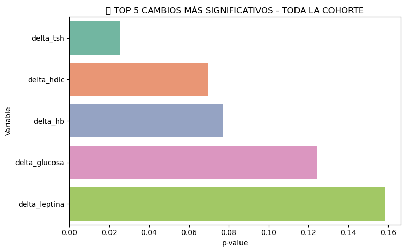
    


    C:\Users\randy\AppData\Local\Temp\ipykernel_5644\1552173487.py:11: FutureWarning: 
    
    Passing `palette` without assigning `hue` is deprecated and will be removed in v0.14.0. Assign the `y` variable to `hue` and set `legend=False` for the same effect.
    
      sns.barplot(data=top5, y='variable', x='p_value', palette='Set2')
    C:\Users\randy\AppData\Local\Temp\ipykernel_5644\1552173487.py:15: UserWarning: Glyph 129382 (\N{BROCCOLI}) missing from font(s) DejaVu Sans.
      plt.tight_layout()
    c:\Users\randy\.conda\envs\pit\lib\site-packages\IPython\core\pylabtools.py:152: UserWarning: Glyph 129382 (\N{BROCCOLI}) missing from font(s) DejaVu Sans.
      fig.canvas.print_figure(bytes_io, **kw)
    


    
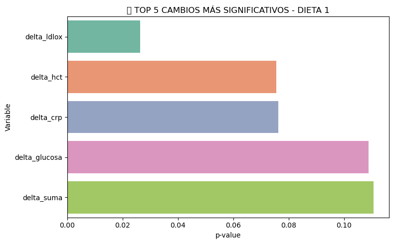
    


    C:\Users\randy\AppData\Local\Temp\ipykernel_5644\1552173487.py:11: FutureWarning: 
    
    Passing `palette` without assigning `hue` is deprecated and will be removed in v0.14.0. Assign the `y` variable to `hue` and set `legend=False` for the same effect.
    
      sns.barplot(data=top5, y='variable', x='p_value', palette='Set2')
    C:\Users\randy\AppData\Local\Temp\ipykernel_5644\1552173487.py:15: UserWarning: Glyph 127831 (\N{POULTRY LEG}) missing from font(s) DejaVu Sans.
      plt.tight_layout()
    c:\Users\randy\.conda\envs\pit\lib\site-packages\IPython\core\pylabtools.py:152: UserWarning: Glyph 127831 (\N{POULTRY LEG}) missing from font(s) DejaVu Sans.
      fig.canvas.print_figure(bytes_io, **kw)
    


    
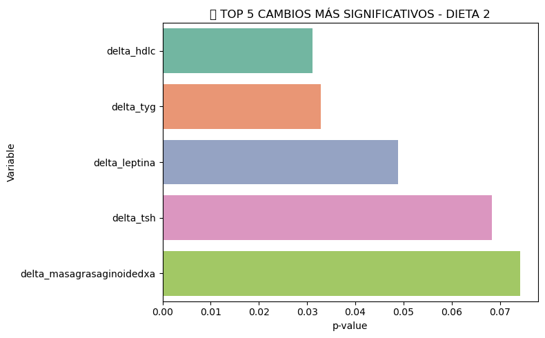
    


### Boxplots


```python
import seaborn as sns
import matplotlib.pyplot as plt

# Función para graficar top 5 variables desde un DataFrame de resultados
def graficar_top5(df_resultados, df_cambios_base, titulo):
    top_vars = df_resultados.sort_values(by='p_value').head(5)['variable'].tolist()

    for var in top_vars:
        plt.figure(figsize=(7, 5))
        sns.boxplot(data=df_cambios_base, x='cluster', y=var, palette='Set2')
        p_val = df_resultados[df_resultados['variable'] == var]['p_value'].values[0]
        plt.title(f"{titulo}\n{var} (p = {p_val})")
        plt.xlabel("Cluster")
        plt.ylabel(var)
        plt.tight_layout()
        plt.show()

# Llamadas para cada grupo
graficar_top5(df_resultados_delta_total, df_cambios_filtrado, "TOP 5 CAMBIOS - TODA LA COHORTE")
graficar_top5(df_resultados_delta_dieta1, df_cambios_filtrado[df_cambios_filtrado['dieta'] == 0], "TOP 5 CAMBIOS - DIETA 1")
graficar_top5(df_resultados_delta_dieta2, df_cambios_filtrado[df_cambios_filtrado['dieta'] == 1], "TOP 5 CAMBIOS - DIETA 2")

```

    C:\Users\randy\AppData\Local\Temp\ipykernel_5644\768319483.py:10: FutureWarning: 
    
    Passing `palette` without assigning `hue` is deprecated and will be removed in v0.14.0. Assign the `x` variable to `hue` and set `legend=False` for the same effect.
    
      sns.boxplot(data=df_cambios_base, x='cluster', y=var, palette='Set2')
    


    
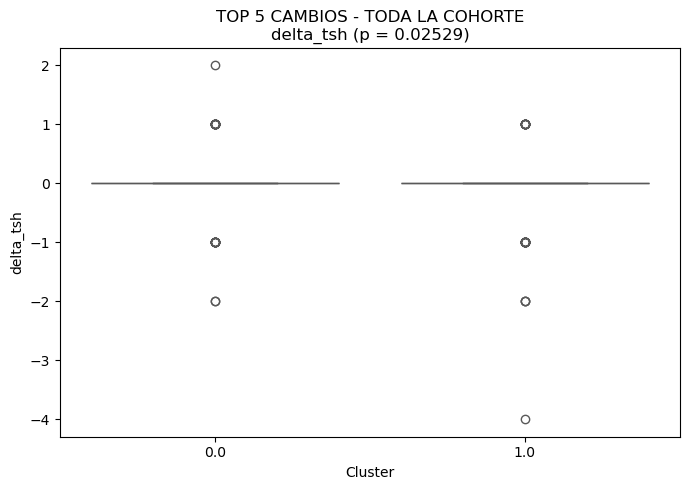
    


    C:\Users\randy\AppData\Local\Temp\ipykernel_5644\768319483.py:10: FutureWarning: 
    
    Passing `palette` without assigning `hue` is deprecated and will be removed in v0.14.0. Assign the `x` variable to `hue` and set `legend=False` for the same effect.
    
      sns.boxplot(data=df_cambios_base, x='cluster', y=var, palette='Set2')
    


    
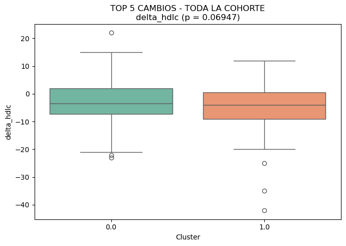
    


    C:\Users\randy\AppData\Local\Temp\ipykernel_5644\768319483.py:10: FutureWarning: 
    
    Passing `palette` without assigning `hue` is deprecated and will be removed in v0.14.0. Assign the `x` variable to `hue` and set `legend=False` for the same effect.
    
      sns.boxplot(data=df_cambios_base, x='cluster', y=var, palette='Set2')
    


    
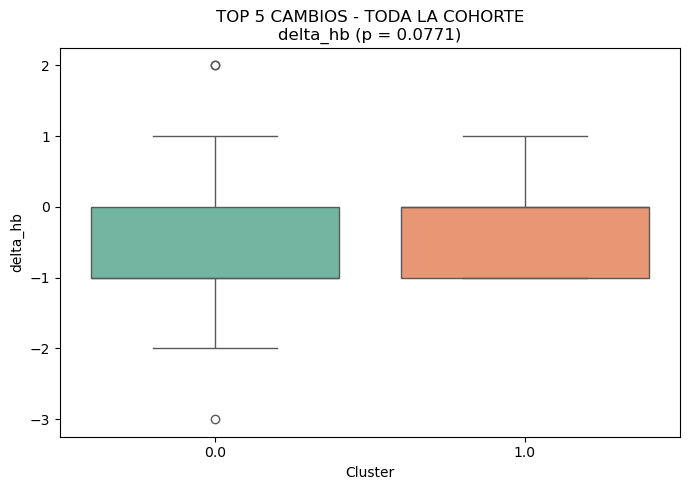
    


    C:\Users\randy\AppData\Local\Temp\ipykernel_5644\768319483.py:10: FutureWarning: 
    
    Passing `palette` without assigning `hue` is deprecated and will be removed in v0.14.0. Assign the `x` variable to `hue` and set `legend=False` for the same effect.
    
      sns.boxplot(data=df_cambios_base, x='cluster', y=var, palette='Set2')
    


    
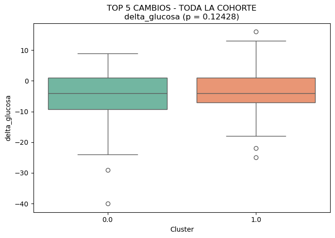
    


    C:\Users\randy\AppData\Local\Temp\ipykernel_5644\768319483.py:10: FutureWarning: 
    
    Passing `palette` without assigning `hue` is deprecated and will be removed in v0.14.0. Assign the `x` variable to `hue` and set `legend=False` for the same effect.
    
      sns.boxplot(data=df_cambios_base, x='cluster', y=var, palette='Set2')
    


    
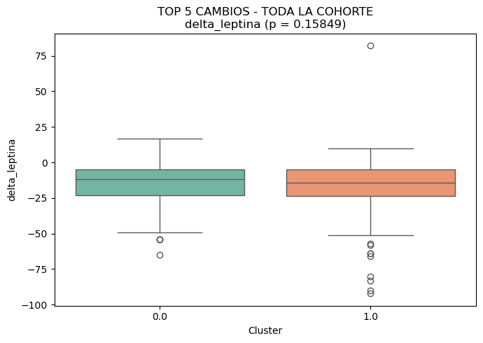
    


    C:\Users\randy\AppData\Local\Temp\ipykernel_5644\768319483.py:10: FutureWarning: 
    
    Passing `palette` without assigning `hue` is deprecated and will be removed in v0.14.0. Assign the `x` variable to `hue` and set `legend=False` for the same effect.
    
      sns.boxplot(data=df_cambios_base, x='cluster', y=var, palette='Set2')
    


    
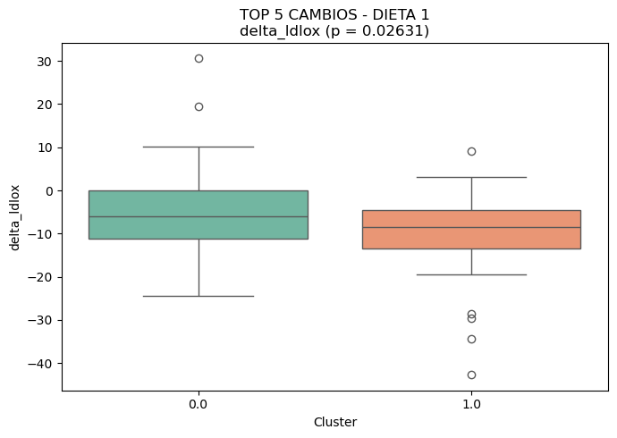
    


    C:\Users\randy\AppData\Local\Temp\ipykernel_5644\768319483.py:10: FutureWarning: 
    
    Passing `palette` without assigning `hue` is deprecated and will be removed in v0.14.0. Assign the `x` variable to `hue` and set `legend=False` for the same effect.
    
      sns.boxplot(data=df_cambios_base, x='cluster', y=var, palette='Set2')
    


    
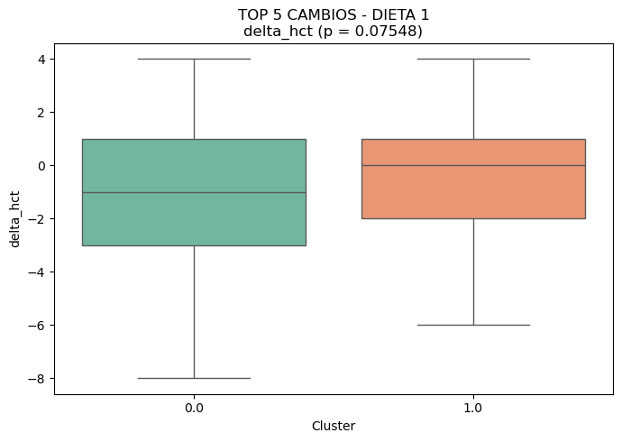
    


    C:\Users\randy\AppData\Local\Temp\ipykernel_5644\768319483.py:10: FutureWarning: 
    
    Passing `palette` without assigning `hue` is deprecated and will be removed in v0.14.0. Assign the `x` variable to `hue` and set `legend=False` for the same effect.
    
      sns.boxplot(data=df_cambios_base, x='cluster', y=var, palette='Set2')
    


    
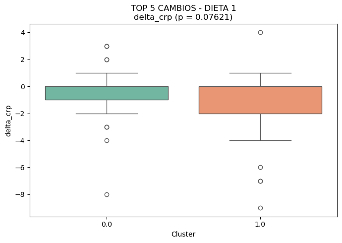
    


    C:\Users\randy\AppData\Local\Temp\ipykernel_5644\768319483.py:10: FutureWarning: 
    
    Passing `palette` without assigning `hue` is deprecated and will be removed in v0.14.0. Assign the `x` variable to `hue` and set `legend=False` for the same effect.
    
      sns.boxplot(data=df_cambios_base, x='cluster', y=var, palette='Set2')
    


    
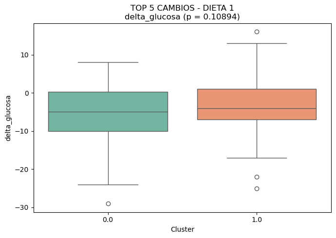
    


    C:\Users\randy\AppData\Local\Temp\ipykernel_5644\768319483.py:10: FutureWarning: 
    
    Passing `palette` without assigning `hue` is deprecated and will be removed in v0.14.0. Assign the `x` variable to `hue` and set `legend=False` for the same effect.
    
      sns.boxplot(data=df_cambios_base, x='cluster', y=var, palette='Set2')
    


    
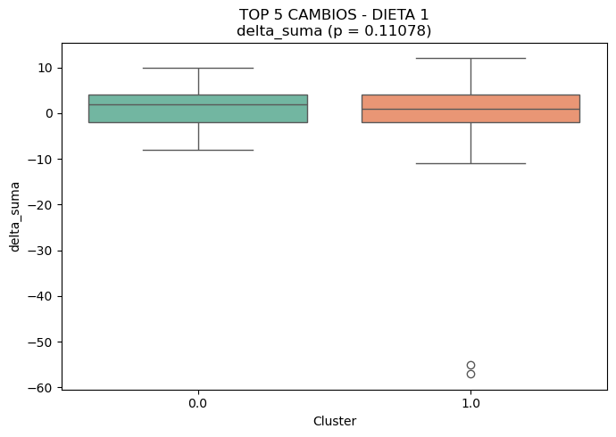
    


    C:\Users\randy\AppData\Local\Temp\ipykernel_5644\768319483.py:10: FutureWarning: 
    
    Passing `palette` without assigning `hue` is deprecated and will be removed in v0.14.0. Assign the `x` variable to `hue` and set `legend=False` for the same effect.
    
      sns.boxplot(data=df_cambios_base, x='cluster', y=var, palette='Set2')
    


    
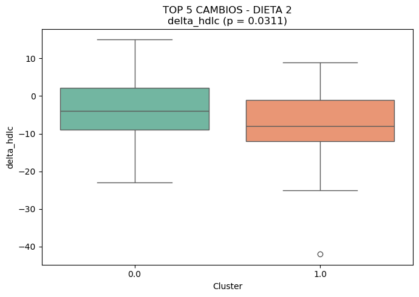
    


    C:\Users\randy\AppData\Local\Temp\ipykernel_5644\768319483.py:10: FutureWarning: 
    
    Passing `palette` without assigning `hue` is deprecated and will be removed in v0.14.0. Assign the `x` variable to `hue` and set `legend=False` for the same effect.
    
      sns.boxplot(data=df_cambios_base, x='cluster', y=var, palette='Set2')
    


    
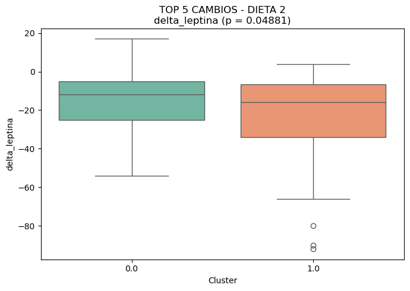
    


    C:\Users\randy\AppData\Local\Temp\ipykernel_5644\768319483.py:10: FutureWarning: 
    
    Passing `palette` without assigning `hue` is deprecated and will be removed in v0.14.0. Assign the `x` variable to `hue` and set `legend=False` for the same effect.
    
      sns.boxplot(data=df_cambios_base, x='cluster', y=var, palette='Set2')
    


    
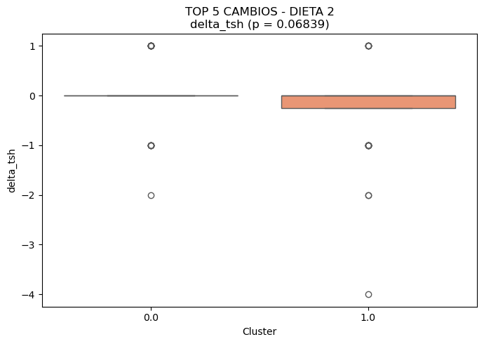
    


    C:\Users\randy\AppData\Local\Temp\ipykernel_5644\768319483.py:10: FutureWarning: 
    
    Passing `palette` without assigning `hue` is deprecated and will be removed in v0.14.0. Assign the `x` variable to `hue` and set `legend=False` for the same effect.
    
      sns.boxplot(data=df_cambios_base, x='cluster', y=var, palette='Set2')
    


    
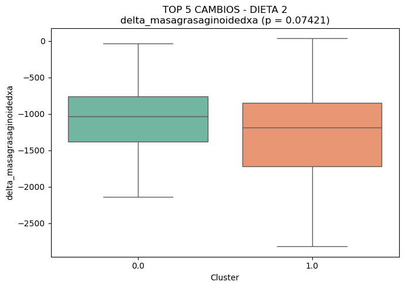
    


    C:\Users\randy\AppData\Local\Temp\ipykernel_5644\768319483.py:10: FutureWarning: 
    
    Passing `palette` without assigning `hue` is deprecated and will be removed in v0.14.0. Assign the `x` variable to `hue` and set `legend=False` for the same effect.
    
      sns.boxplot(data=df_cambios_base, x='cluster', y=var, palette='Set2')
    


    
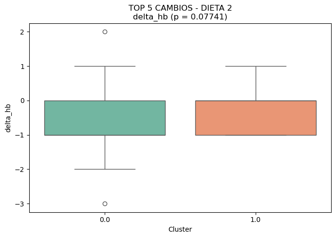
    


## 6.7 Preguntas ejemplo

### Pregunta 1
En V1, ¿era el peso corporal del cluster 1 diferente al del cluster 2?
Interpretación: No hay diferencias significativas en el peso inicial entre los dos clusters. Ambos grupos tenían un peso medio muy similar en el momento basal.


```python
# PREGUNTA 1: ¿Diferencia de peso en V1 entre clusters?

from scipy.stats import ks_2samp, ttest_ind, mannwhitneyu

# Filtrar filas válidas
df_v1_peso = df_clinico_microbiota_v1.dropna(subset=['peso1', 'cluster']).copy()
df_v1_peso['cluster'] = df_v1_peso['cluster'].astype(int)

# Separar por cluster
peso_0 = df_v1_peso[df_v1_peso['cluster'] == 0]['peso1']
peso_1 = df_v1_peso[df_v1_peso['cluster'] == 1]['peso1']

# Test de normalidad para ver qué prueba usar
ks_peso = ks_2samp(peso_0, peso_1).pvalue

if ks_peso > 0.05:
    test_name = "t-test"
    p_valor = ttest_ind(peso_0, peso_1, equal_var=False).pvalue
else:
    test_name = "Mann-Whitney"
    p_valor = mannwhitneyu(peso_0, peso_1, alternative='two-sided').pvalue

print("📌 Peso en V1 por cluster")
print(f"Test usado: {test_name}")
print(f"p-value: {p_valor:.5f}")
print(f"Media cluster 0: {peso_0.mean():.2f}")
print(f"Media cluster 1: {peso_1.mean():.2f}")

```

    📌 Peso en V1 por cluster
    Test usado: t-test
    p-value: 0.73290
    Media cluster 0: 86.86
    Media cluster 1: 87.44
    

### Pregunta 2
El cambio de peso corporal entre V1 y V3 en la población total, ¿fue diferente entre el cluster 1 y el cluster 2?
Interpretación: Tampoco se observan diferencias significativas entre los clusters en la evolución del peso durante el estudio, considerando a toda la cohorte.


```python
# PREGUNTA 2: Diferencia en el cambio de peso (V3 - V1) en toda la cohorte

df_delta_total = df_cambios_filtrado.dropna(subset=['delta_peso', 'cluster']).copy()
df_delta_total['cluster'] = df_delta_total['cluster'].astype(int)

peso0 = df_delta_total[df_delta_total['cluster'] == 0]['delta_peso']
peso1 = df_delta_total[df_delta_total['cluster'] == 1]['delta_peso']

ks_p = ks_2samp(peso0, peso1).pvalue

if ks_p > 0.05:
    test = "t-test"
    pval = ttest_ind(peso0, peso1, equal_var=False).pvalue
else:
    test = "Mann-Whitney"
    pval = mannwhitneyu(peso0, peso1, alternative='two-sided').pvalue

print("📌 Cambio de peso en TODA LA COHORTE")
print(f"Test usado: {test}")
print(f"p-value: {pval:.5f}")
print(f"Media cluster 0: {peso0.mean():.2f}")
print(f"Media cluster 1: {peso1.mean():.2f}")

```

    📌 Cambio de peso en TODA LA COHORTE
    Test usado: t-test
    p-value: 0.70699
    Media cluster 0: -8.35
    Media cluster 1: -8.55
    

### Pregunta 3
El cambio de peso corporal de los que siguieron la dieta 1, ¿fue diferente entre el cluster 1 y el cluster 2?
Interpretación: En los individuos asignados a la dieta 1, el cambio de peso fue muy similar entre ambos clusters. No hay diferencias estadísticamente significativas.


```python
# PREGUNTA 3: Diferencia en el cambio de peso en dieta 1

df_d1 = df_cambios_filtrado[(df_cambios_filtrado['dieta'] == 0) & df_cambios_filtrado['delta_peso'].notna() & df_cambios_filtrado['cluster'].notna()].copy()
df_d1['cluster'] = df_d1['cluster'].astype(int)

p0 = df_d1[df_d1['cluster'] == 0]['delta_peso']
p1 = df_d1[df_d1['cluster'] == 1]['delta_peso']

ks_p = ks_2samp(p0, p1).pvalue

if ks_p > 0.05:
    test = "t-test"
    pval = ttest_ind(p0, p1, equal_var=False).pvalue
else:
    test = "Mann-Whitney"
    pval = mannwhitneyu(p0, p1, alternative='two-sided').pvalue

print("📌 Cambio de peso en DIETA 1")
print(f"Test usado: {test}")
print(f"p-value: {pval:.5f}")
print(f"Media cluster 0: {p0.mean():.2f}")
print(f"Media cluster 1: {p1.mean():.2f}")

```

    📌 Cambio de peso en DIETA 1
    Test usado: t-test
    p-value: 0.89308
    Media cluster 0: -8.35
    Media cluster 1: -8.23
    

### Pregunta 4
El cambio de peso corporal de los que siguieron la dieta 2, ¿fue diferente entre el cluster 1 y el cluster 2?Interpretación: Tampoco hay diferencias significativas entre clusters dentro del grupo que siguió la dieta 2.


```python
# PREGUNTA 4: Diferencia en el cambio de peso en dieta 2

df_d2 = df_cambios_filtrado[(df_cambios_filtrado['dieta'] == 1) & df_cambios_filtrado['delta_peso'].notna() & df_cambios_filtrado['cluster'].notna()].copy()
df_d2['cluster'] = df_d2['cluster'].astype(int)

p0 = df_d2[df_d2['cluster'] == 0]['delta_peso']
p1 = df_d2[df_d2['cluster'] == 1]['delta_peso']

ks_p = ks_2samp(p0, p1).pvalue

if ks_p > 0.05:
    test = "t-test"
    pval = ttest_ind(p0, p1, equal_var=False).pvalue
else:
    test = "Mann-Whitney"
    pval = mannwhitneyu(p0, p1, alternative='two-sided').pvalue

print("📌 Cambio de peso en DIETA 2")
print(f"Test usado: {test}")
print(f"p-value: {pval:.5f}")
print(f"Media cluster 0: {p0.mean():.2f}")
print(f"Media cluster 1: {p1.mean():.2f}")

```

    📌 Cambio de peso en DIETA 2
    Test usado: t-test
    p-value: 0.41273
    Media cluster 0: -8.34
    Media cluster 1: -8.96
    

### Pregunta 5
¿Hay diferencia significativa de peso de V3 a V1?Interpretación: Sí, el peso ha disminuido de forma muy significativa entre el inicio (V1) y el final (V3) del estudio. El peso medio ha bajado de 87.55 kg a 79.21 kg, con un cambio medio de -8.34 kg. Esta reducción es global, independiente del cluster o dieta.


```python
from scipy.stats import ttest_rel, wilcoxon

# Filtrar sujetos con ambos pesos disponibles
df_peso = df_clinico_microbiota_v1[['id', 'peso1']].merge(
    df_clinico_microbiota_v3[['id', 'peso3']], on='id', how='inner'
).dropna()

peso_v1 = df_peso['peso1']
peso_v3 = df_peso['peso3']
delta = peso_v3 - peso_v1

# Ver si las diferencias siguen una distribución normal
ks_p = ks_2samp(peso_v3, peso_v1).pvalue

if ks_p > 0.05:
    test = "t-test pareado"
    pval = ttest_rel(peso_v3, peso_v1).pvalue
else:
    test = "Wilcoxon"
    pval = wilcoxon(peso_v3, peso_v1).pvalue

print("📌 ¿Hay diferencia de peso entre V3 y V1?")
print(f"Test usado: {test}")
print(f"p-value: {pval:.100f}")
print(f"Peso medio en V1: {peso_v1.mean():.2f}")
print(f"Peso medio en V3: {peso_v3.mean():.2f}")
print(f"Media del cambio (V3 - V1): {delta.mean():.2f}")

```

    📌 ¿Hay diferencia de peso entre V3 y V1?
    Test usado: Wilcoxon
    p-value: 0.0000000000000000000000000000000000000022063154301788666549620208624164761399040252460199931588324661
    Peso medio en V1: 87.55
    Peso medio en V3: 79.21
    Media del cambio (V3 - V1): -8.34
    

## 🧪 Análisis de diferencias en cambios (V3-V1) entre clústeres

A continuación se analizan los resultados obtenidos tras comparar los cambios en variables clínicas entre los dos clústeres de microbiota, tanto en la cohorte completa como separados por dieta, conforme a lo indicado por Fermín.

---

### ✅ 1. Cohorte completa (sin dividir por dieta)
**Top 5 variables con mayor diferencia significativa entre clústeres:**

| Variable        | p-value  | Media Cluster 0 | Media Cluster 1 | Interpretación |
|----------------|----------|------------------|------------------|----------------|
| `delta_tsh`    | 0.025    | 0.04             | -0.18            | Disminución mayor de TSH en el clúster 1. Puede indicar una modulación distinta del eje tiroides. |
| `delta_hdlc`   | 0.069    | -2.68            | -4.75            | HDL bajó más en el clúster 1 → indicador desfavorable a nivel cardiovascular. |
| `delta_hb`     | 0.077    | -0.40            | -0.21            | Leve bajada de hemoglobina más pronunciada en clúster 0. |
| `delta_glucosa`| 0.124    | -4.95            | -3.30            | Ambos mejoran, pero el clúster 0 lo hace en mayor medida. |
| `delta_leptina`| 0.158    | -14.99           | -18.91           | Mayor descenso en leptina en clúster 1 → posible mayor pérdida de grasa o mayor sensibilidad. |

**🧾 Conclusión:** El clúster 1 muestra una respuesta metabólica más marcada en varias variables hormonales y metabólicas.

---

### ✅ 2. Dieta 1
**Top 5 variables con mayor diferencia significativa entre clústeres:**

| Variable        | p-value  | Media Cluster 0 | Media Cluster 1 | Interpretación |
|----------------|----------|------------------|------------------|----------------|
| `delta_ldlox`  | 0.026    | -5.04            | -9.97            | Reducción más intensa de LDL oxidado en clúster 1 → mejoría cardiovascular. |
| `delta_hct`    | 0.075    | -1.33            | -0.31            | Ligera bajada del hematocrito, más en clúster 0. |
| `delta_crp`    | 0.076    | -0.32            | -1.07            | Reducción más pronunciada de la inflamación en clúster 1 (PCR). |
| `delta_glucosa`| 0.108    | -5.72            | -3.05            | Mayor mejoría glucémica en clúster 0. |
| `delta_suma`   | 0.110    | 1.46             | -1.38            | Mejora en cronotipo (matutinidad) más marcada en clúster 0. |

**🧾 Conclusión:** En dieta 1, el clúster 1 mejora inflamación y perfil lipídico; el clúster 0 mejora parámetros glucémicos y conductuales.

---

### ✅ 3. Dieta 2
**Top 5 variables con mayor diferencia significativa entre clústeres:**

| Variable                    | p-value  | Media Cluster 0 | Media Cluster 1 | Interpretación |
|----------------------------|----------|------------------|------------------|----------------|
| `delta_hdlc`               | 0.031    | -3.50            | -7.11            | Descenso de HDL más marcado en clúster 1 (no favorable). |
| `delta_tyg`                | 0.032    | 0.03             | -0.16            | Mejoría del índice TYG en clúster 1. |
| `delta_leptina`            | 0.048    | -15.47           | -23.73           | Mayor descenso de leptina en clúster 1 → indicativo de pérdida grasa. |
| `delta_tsh`                | 0.068    | 0.03             | -0.25            | Disminución mayor de TSH en clúster 1. |
| `delta_masagrasaginoidedxa`| 0.074    | -1057.44         | -1264.67         | Mayor pérdida de grasa ginecoide en clúster 1. |

**🧾 Conclusión:** En dieta 2, el clúster 1 muestra una mayor pérdida de grasa y una mejor respuesta en indicadores hormonales/metabólicos.

---

### 🧠 Conclusión global
- El **clúster 1** tiende a mostrar **respuestas más pronunciadas** en indicadores metabólicos clave (leptina, TSH, glucosa, inflamación).
- Hay una clara **interacción entre dieta y microbiota**: la dieta no impacta igual dependiendo del microbiotipo del sujeto.
- Los resultados sugieren que la **composición de la microbiota podría modular la eficacia de la intervención dietética**, especialmente en términos de pérdida de grasa y mejora de parámetros inflamatorios.


