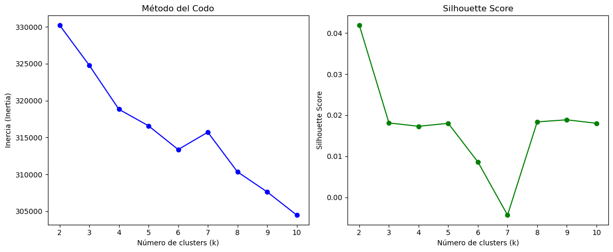
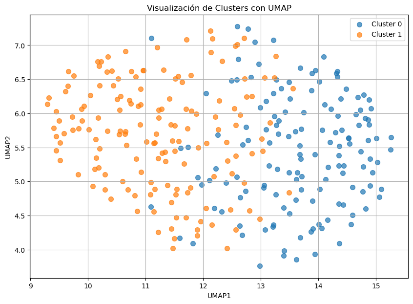

# 2. Modelado abundancias v1


## 2.1 Cargar y transformar de nuevo la tabla abundancias


```python
import pandas as pd

# 1. Cargar tabla original
ruta_microbiota = r"C:\Users\randy\Desktop\MC2\TFM\data\MICROBIOTA\V1\AbundanciasOB2G_HM297_gg2_V1.csv"
microbiota_abundancias = pd.read_csv(ruta_microbiota, sep=";")
microbiota_abundancias = microbiota_abundancias.set_index('#NAME')

print("✔️ Tabla cargada:", microbiota_abundancias.shape)
microbiota_abundancias

```


```python
# 2. Eliminar duplicados del índice
microbiota_abundancias = microbiota_abundancias[~microbiota_abundancias.index.duplicated(keep='first')]
print("✔️ Tabla sin duplicados:", microbiota_abundancias.shape)

microbiota_abundancias
```

    ✔️ Tabla sin duplicados: (1439, 297)
    


<div>
<style scoped>
    .dataframe tbody tr th:only-of-type {
        vertical-align: middle;
    }

    .dataframe tbody tr th {
        vertical-align: top;
    }

    .dataframe thead th {
        text-align: right;
    }
</style>
<table border="1" class="dataframe">
  <thead>
    <tr style="text-align: right;">
      <th></th>
      <th>S001</th>
      <th>S002</th>
      <th>S003</th>
      <th>S004</th>
      <th>S006</th>
      <th>S007</th>
      <th>S008</th>
      <th>S009</th>
      <th>S011</th>
      <th>S013</th>
      <th>...</th>
      <th>S557</th>
      <th>S558</th>
      <th>S559</th>
      <th>S561</th>
      <th>S562</th>
      <th>S563</th>
      <th>S564</th>
      <th>S565</th>
      <th>S566</th>
      <th>S567</th>
    </tr>
    <tr>
      <th>#NAME</th>
      <th></th>
      <th></th>
      <th></th>
      <th></th>
      <th></th>
      <th></th>
      <th></th>
      <th></th>
      <th></th>
      <th></th>
      <th></th>
      <th></th>
      <th></th>
      <th></th>
      <th></th>
      <th></th>
      <th></th>
      <th></th>
      <th></th>
      <th></th>
      <th></th>
    </tr>
  </thead>
  <tbody>
    <tr>
      <th>d__Bacteria; p__Bacteroidota; c__Bacteroidia; o__Bacteroidales; f__Bacteroidaceae; g__Phocaeicola; s__Phocaeicola_vulgatus</th>
      <td>146</td>
      <td>5276</td>
      <td>0</td>
      <td>16470</td>
      <td>2621</td>
      <td>1041</td>
      <td>3939</td>
      <td>715</td>
      <td>29028</td>
      <td>5588</td>
      <td>...</td>
      <td>2768</td>
      <td>0</td>
      <td>0</td>
      <td>1355</td>
      <td>1401</td>
      <td>51895</td>
      <td>8557</td>
      <td>1473</td>
      <td>5429</td>
      <td>1015</td>
    </tr>
    <tr>
      <th>d__Bacteria; p__Bacteroidota; c__Bacteroidia; o__Bacteroidales; f__Bacteroidaceae; g__Phocaeicola; s__Phocaeicola_dorei</th>
      <td>6891</td>
      <td>75</td>
      <td>0</td>
      <td>3475</td>
      <td>1358</td>
      <td>0</td>
      <td>500</td>
      <td>0</td>
      <td>56156</td>
      <td>36840</td>
      <td>...</td>
      <td>10725</td>
      <td>3223</td>
      <td>45380</td>
      <td>7804</td>
      <td>973</td>
      <td>0</td>
      <td>489</td>
      <td>2661</td>
      <td>0</td>
      <td>20893</td>
    </tr>
    <tr>
      <th>d__Bacteria; p__Bacteroidota; c__Bacteroidia; o__Bacteroidales; f__Bacteroidaceae; g__Phocaeicola; s__Phocaeicola_coprocola</th>
      <td>7649</td>
      <td>0</td>
      <td>9838</td>
      <td>0</td>
      <td>33</td>
      <td>8109</td>
      <td>22</td>
      <td>4292</td>
      <td>0</td>
      <td>21678</td>
      <td>...</td>
      <td>13</td>
      <td>1820</td>
      <td>0</td>
      <td>0</td>
      <td>252</td>
      <td>0</td>
      <td>0</td>
      <td>1216</td>
      <td>0</td>
      <td>0</td>
    </tr>
    <tr>
      <th>d__Bacteria; p__Bacteroidota; c__Bacteroidia; o__Bacteroidales; f__Bacteroidaceae; g__Bacteroides; s__Bacteroides_uniformis</th>
      <td>0</td>
      <td>243</td>
      <td>0</td>
      <td>5403</td>
      <td>286</td>
      <td>3656</td>
      <td>11999</td>
      <td>447</td>
      <td>11778</td>
      <td>780</td>
      <td>...</td>
      <td>25645</td>
      <td>3037</td>
      <td>8384</td>
      <td>1893</td>
      <td>2132</td>
      <td>3591</td>
      <td>342</td>
      <td>88</td>
      <td>4856</td>
      <td>904</td>
    </tr>
    <tr>
      <th>d__Bacteria; p__Bacteroidota; c__Bacteroidia; o__Bacteroidales; f__Bacteroidaceae; g__Phocaeicola; s__Phocaeicola_plebeius</th>
      <td>0</td>
      <td>0</td>
      <td>10267</td>
      <td>0</td>
      <td>0</td>
      <td>16500</td>
      <td>0</td>
      <td>0</td>
      <td>0</td>
      <td>0</td>
      <td>...</td>
      <td>423</td>
      <td>0</td>
      <td>0</td>
      <td>0</td>
      <td>0</td>
      <td>0</td>
      <td>25</td>
      <td>2290</td>
      <td>0</td>
      <td>13</td>
    </tr>
    <tr>
      <th>...</th>
      <td>...</td>
      <td>...</td>
      <td>...</td>
      <td>...</td>
      <td>...</td>
      <td>...</td>
      <td>...</td>
      <td>...</td>
      <td>...</td>
      <td>...</td>
      <td>...</td>
      <td>...</td>
      <td>...</td>
      <td>...</td>
      <td>...</td>
      <td>...</td>
      <td>...</td>
      <td>...</td>
      <td>...</td>
      <td>...</td>
      <td>...</td>
    </tr>
    <tr>
      <th>d__Bacteria; p__Firmicutes; c__Clostridia; o__Oscillospirales; f__Oscillospiraceae; g__UBA738</th>
      <td>0</td>
      <td>0</td>
      <td>0</td>
      <td>0</td>
      <td>0</td>
      <td>0</td>
      <td>0</td>
      <td>0</td>
      <td>0</td>
      <td>0</td>
      <td>...</td>
      <td>0</td>
      <td>0</td>
      <td>0</td>
      <td>0</td>
      <td>0</td>
      <td>0</td>
      <td>0</td>
      <td>0</td>
      <td>0</td>
      <td>0</td>
    </tr>
    <tr>
      <th>d__Bacteria; p__Firmicutes; c__Bacilli; o__Bacillales; f__Planococcaceae; g__Planococcus</th>
      <td>0</td>
      <td>0</td>
      <td>0</td>
      <td>0</td>
      <td>0</td>
      <td>0</td>
      <td>0</td>
      <td>0</td>
      <td>0</td>
      <td>0</td>
      <td>...</td>
      <td>0</td>
      <td>0</td>
      <td>0</td>
      <td>0</td>
      <td>0</td>
      <td>0</td>
      <td>0</td>
      <td>0</td>
      <td>0</td>
      <td>0</td>
    </tr>
    <tr>
      <th>d__Bacteria; p__Bacteroidota; c__Bacteroidia; o__Bacteroidales; f__Muribaculaceae; g__Paramuribaculum</th>
      <td>0</td>
      <td>0</td>
      <td>0</td>
      <td>0</td>
      <td>0</td>
      <td>0</td>
      <td>0</td>
      <td>0</td>
      <td>0</td>
      <td>0</td>
      <td>...</td>
      <td>0</td>
      <td>0</td>
      <td>0</td>
      <td>0</td>
      <td>0</td>
      <td>0</td>
      <td>0</td>
      <td>0</td>
      <td>0</td>
      <td>0</td>
    </tr>
    <tr>
      <th>d__Bacteria; p__Firmicutes; c__Clostridia; o__Oscillospirales; f__Oscillospiraceae; g__Sporobacter; s__Sporobacter_termitidis</th>
      <td>0</td>
      <td>0</td>
      <td>0</td>
      <td>0</td>
      <td>0</td>
      <td>0</td>
      <td>0</td>
      <td>0</td>
      <td>0</td>
      <td>0</td>
      <td>...</td>
      <td>0</td>
      <td>0</td>
      <td>0</td>
      <td>0</td>
      <td>0</td>
      <td>0</td>
      <td>0</td>
      <td>0</td>
      <td>0</td>
      <td>0</td>
    </tr>
    <tr>
      <th>d__Bacteria; p__Proteobacteria; c__Gammaproteobacteria; o__Burkholderiales; f__Burkholderiaceae; g__Ramlibacter; s__Caenimonas_terrae</th>
      <td>0</td>
      <td>0</td>
      <td>0</td>
      <td>0</td>
      <td>0</td>
      <td>0</td>
      <td>0</td>
      <td>0</td>
      <td>0</td>
      <td>0</td>
      <td>...</td>
      <td>0</td>
      <td>0</td>
      <td>0</td>
      <td>1</td>
      <td>0</td>
      <td>0</td>
      <td>0</td>
      <td>0</td>
      <td>0</td>
      <td>0</td>
    </tr>
  </tbody>
</table>
<p>1439 rows × 297 columns</p>
</div>


```python
# 3. Crear tabla binaria: 1 si hay al menos 4 unidades
microbiota_binaria = (microbiota_abundancias >= 4).astype(int)

# 4. Calcular prevalencia por bacteria
prevalencia = microbiota_binaria.sum(axis=1) / microbiota_binaria.shape[1] * 100

# 5. Seleccionar bacterias con prevalencia >=20%
bacterias_filtradas = prevalencia[prevalencia >= 20].index.tolist()

# 6. Filtrar realmente la tabla
microbiota_filtrada = microbiota_abundancias.loc[bacterias_filtradas]

# 7. Transponer para tener sujetos como filas
microbiota_filtrada_t = microbiota_filtrada.T

print(f"✔️ Bacterias seleccionadas tras filtro de prevalencia ≥20%: {len(bacterias_filtradas)}")
print("✔️ Nueva forma de la tabla:", microbiota_filtrada_t.shape)
microbiota_filtrada_t
```

    ✔️ Bacterias seleccionadas tras filtro de prevalencia ≥20%: 239
    ✔️ Nueva forma de la tabla: (297, 239)
    


<div>
<style scoped>
    .dataframe tbody tr th:only-of-type {
        vertical-align: middle;
    }

    .dataframe tbody tr th {
        vertical-align: top;
    }

    .dataframe thead th {
        text-align: right;
    }
</style>
<table border="1" class="dataframe">
  <thead>
    <tr style="text-align: right;">
      <th>#NAME</th>
      <th>d__Bacteria; p__Bacteroidota; c__Bacteroidia; o__Bacteroidales; f__Bacteroidaceae; g__Phocaeicola; s__Phocaeicola_vulgatus</th>
      <th>d__Bacteria; p__Bacteroidota; c__Bacteroidia; o__Bacteroidales; f__Bacteroidaceae; g__Phocaeicola; s__Phocaeicola_dorei</th>
      <th>d__Bacteria; p__Bacteroidota; c__Bacteroidia; o__Bacteroidales; f__Bacteroidaceae; g__Phocaeicola; s__Phocaeicola_coprocola</th>
      <th>d__Bacteria; p__Bacteroidota; c__Bacteroidia; o__Bacteroidales; f__Bacteroidaceae; g__Bacteroides; s__Bacteroides_uniformis</th>
      <th>d__Bacteria; p__Bacteroidota; c__Bacteroidia; o__Bacteroidales; f__Bacteroidaceae; g__Phocaeicola; s__Phocaeicola_plebeius</th>
      <th>d__Bacteria; p__Bacteroidota; c__Bacteroidia; o__Bacteroidales; f__Rikenellaceae; g__Alistipes; s__Alistipes_putredinis</th>
      <th>d__Bacteria; p__Bacteroidota; c__Bacteroidia; o__Bacteroidales; f__Tannerellaceae; g__Parabacteroides; s__Parabacteroides_merdae</th>
      <th>d__Bacteria; p__Bacteroidota; c__Bacteroidia; o__Bacteroidales; f__Bacteroidaceae; g__Prevotella; s__Prevotella_copri</th>
      <th>d__Bacteria; p__Firmicutes; c__Clostridia; o__Oscillospirales; f__Ruminococcaceae; g__Faecalibacterium; s__Faecalibacterium_prausnitzii</th>
      <th>d__Bacteria; p__Firmicutes; c__Clostridia; o__Lachnospirales; f__Lachnospiraceae; g__Agathobacter; s__Agathobacter_rectalis</th>
      <th>...</th>
      <th>d__Bacteria; p__Firmicutes; c__Clostridia; o__Lachnospirales; f__Lachnospiraceae; g__Blautia; s__Blautia_sp900066505</th>
      <th>d__Bacteria; p__Firmicutes; c__Clostridia; o__Oscillospirales; f__Ruminococcaceae; g__Anaerotruncus; s__Anaerotruncus_massiliensis</th>
      <th>d__Bacteria; p__Firmicutes; c__Bacilli; o__Lactobacillales; f__Aerococcaceae; g__Granulicatella; s__Granulicatella_adiacens</th>
      <th>d__Bacteria; p__Firmicutes; c__Clostridia; o__Oscillospirales; f__Oscillospiraceae; g__Enterenecus</th>
      <th>d__Bacteria; p__Firmicutes; c__Clostridia; o__Lachnospirales; f__Lachnospiraceae; g__Ventrisoma</th>
      <th>d__Bacteria; p__Firmicutes; c__Clostridia; o__Lachnospirales; f__Lachnospiraceae; g__Coprococcus</th>
      <th>d__Bacteria; p__Firmicutes; c__Clostridia; o__Oscillospirales; f__Acutalibacteraceae; g__Hydrogeniiclostridium</th>
      <th>d__Bacteria; p__Firmicutes; c__Clostridia; o__Oscillospirales; f__Ruminococcaceae; g__Anaerotruncus; s__Anaerotruncus_sp003612625</th>
      <th>d__Bacteria; p__Patescibacteria; c__Saccharimonadia; o__Saccharimonadales; f__Nanosynbacteraceae; g__Nanosynbacter</th>
      <th>d__Bacteria; p__Firmicutes; c__Clostridia; o__Oscillospirales; f__Ruminococcaceae; g__Acetanaerobacterium; s__Acetanaerobacterium_elongatum</th>
    </tr>
  </thead>
  <tbody>
    <tr>
      <th>S001</th>
      <td>146</td>
      <td>6891</td>
      <td>7649</td>
      <td>0</td>
      <td>0</td>
      <td>31</td>
      <td>3778</td>
      <td>0</td>
      <td>1210</td>
      <td>1682</td>
      <td>...</td>
      <td>0</td>
      <td>0</td>
      <td>0</td>
      <td>0</td>
      <td>0</td>
      <td>0</td>
      <td>0</td>
      <td>0</td>
      <td>10</td>
      <td>0</td>
    </tr>
    <tr>
      <th>S002</th>
      <td>5276</td>
      <td>75</td>
      <td>0</td>
      <td>243</td>
      <td>0</td>
      <td>1023</td>
      <td>431</td>
      <td>15230</td>
      <td>164</td>
      <td>32</td>
      <td>...</td>
      <td>0</td>
      <td>0</td>
      <td>0</td>
      <td>7</td>
      <td>0</td>
      <td>0</td>
      <td>0</td>
      <td>0</td>
      <td>0</td>
      <td>0</td>
    </tr>
    <tr>
      <th>S003</th>
      <td>0</td>
      <td>0</td>
      <td>9838</td>
      <td>0</td>
      <td>10267</td>
      <td>0</td>
      <td>3041</td>
      <td>0</td>
      <td>53</td>
      <td>259</td>
      <td>...</td>
      <td>0</td>
      <td>0</td>
      <td>0</td>
      <td>0</td>
      <td>0</td>
      <td>0</td>
      <td>0</td>
      <td>0</td>
      <td>0</td>
      <td>0</td>
    </tr>
    <tr>
      <th>S004</th>
      <td>16470</td>
      <td>3475</td>
      <td>0</td>
      <td>5403</td>
      <td>0</td>
      <td>5799</td>
      <td>7019</td>
      <td>0</td>
      <td>690</td>
      <td>13421</td>
      <td>...</td>
      <td>23</td>
      <td>0</td>
      <td>0</td>
      <td>29</td>
      <td>9</td>
      <td>5</td>
      <td>7</td>
      <td>0</td>
      <td>3</td>
      <td>0</td>
    </tr>
    <tr>
      <th>S006</th>
      <td>2621</td>
      <td>1358</td>
      <td>33</td>
      <td>286</td>
      <td>0</td>
      <td>0</td>
      <td>1568</td>
      <td>25</td>
      <td>1523</td>
      <td>390</td>
      <td>...</td>
      <td>0</td>
      <td>6</td>
      <td>28</td>
      <td>0</td>
      <td>0</td>
      <td>23</td>
      <td>0</td>
      <td>0</td>
      <td>0</td>
      <td>8</td>
    </tr>
    <tr>
      <th>...</th>
      <td>...</td>
      <td>...</td>
      <td>...</td>
      <td>...</td>
      <td>...</td>
      <td>...</td>
      <td>...</td>
      <td>...</td>
      <td>...</td>
      <td>...</td>
      <td>...</td>
      <td>...</td>
      <td>...</td>
      <td>...</td>
      <td>...</td>
      <td>...</td>
      <td>...</td>
      <td>...</td>
      <td>...</td>
      <td>...</td>
      <td>...</td>
    </tr>
    <tr>
      <th>S563</th>
      <td>51895</td>
      <td>0</td>
      <td>0</td>
      <td>3591</td>
      <td>0</td>
      <td>0</td>
      <td>0</td>
      <td>0</td>
      <td>0</td>
      <td>0</td>
      <td>...</td>
      <td>0</td>
      <td>0</td>
      <td>9</td>
      <td>0</td>
      <td>0</td>
      <td>0</td>
      <td>0</td>
      <td>0</td>
      <td>12</td>
      <td>0</td>
    </tr>
    <tr>
      <th>S564</th>
      <td>8557</td>
      <td>489</td>
      <td>0</td>
      <td>342</td>
      <td>25</td>
      <td>1212</td>
      <td>2064</td>
      <td>0</td>
      <td>2310</td>
      <td>6009</td>
      <td>...</td>
      <td>31</td>
      <td>52</td>
      <td>12</td>
      <td>0</td>
      <td>12</td>
      <td>17</td>
      <td>37</td>
      <td>0</td>
      <td>7</td>
      <td>0</td>
    </tr>
    <tr>
      <th>S565</th>
      <td>1473</td>
      <td>2661</td>
      <td>1216</td>
      <td>88</td>
      <td>2290</td>
      <td>2197</td>
      <td>840</td>
      <td>5007</td>
      <td>1262</td>
      <td>823</td>
      <td>...</td>
      <td>0</td>
      <td>0</td>
      <td>0</td>
      <td>8</td>
      <td>0</td>
      <td>0</td>
      <td>0</td>
      <td>0</td>
      <td>0</td>
      <td>0</td>
    </tr>
    <tr>
      <th>S566</th>
      <td>5429</td>
      <td>0</td>
      <td>0</td>
      <td>4856</td>
      <td>0</td>
      <td>7597</td>
      <td>2396</td>
      <td>24</td>
      <td>1193</td>
      <td>576</td>
      <td>...</td>
      <td>32</td>
      <td>0</td>
      <td>0</td>
      <td>0</td>
      <td>0</td>
      <td>0</td>
      <td>12</td>
      <td>0</td>
      <td>0</td>
      <td>0</td>
    </tr>
    <tr>
      <th>S567</th>
      <td>1015</td>
      <td>20893</td>
      <td>0</td>
      <td>904</td>
      <td>13</td>
      <td>4348</td>
      <td>1628</td>
      <td>0</td>
      <td>868</td>
      <td>147</td>
      <td>...</td>
      <td>23</td>
      <td>7</td>
      <td>5</td>
      <td>17</td>
      <td>0</td>
      <td>0</td>
      <td>6</td>
      <td>0</td>
      <td>2</td>
      <td>0</td>
    </tr>
  </tbody>
</table>
<p>297 rows × 239 columns</p>
</div>


### 2.1.1 CLR


```python
import numpy as np
import pandas as pd


# 1. Evitar ceros sumando +1 y asi evitamos el log(0) = infinito
microbiota_ready = microbiota_filtrada_t + 1

# 2. Definir la función CLR
def clr_transform(df):
    log_df = np.log(df)  # Logaritmo natural
    geometric_mean = log_df.mean(axis=1)  # Media logarítmica por fila
    clr_values = log_df.subtract(geometric_mean, axis=0)  # Restar la media logarítmica a cada valor
    return clr_values

# 3. Aplicar la transformación CLR
microbiota_clr = clr_transform(microbiota_ready)

print("✔️ CLR aplicado correctamente:", microbiota_clr.shape)

# 4. (Opcional) Guardar la matriz CLR transformada para usar después
ruta_salida = r'C:\Users\randy\Desktop\MC2\TFM\data\tablas_generadas\procesadas\procesadas_microbiota\microbiota_CLR.csv'
microbiota_clr.to_csv(ruta_salida)

print(f"✔️ Matriz CLR guardada en {ruta_salida}")
microbiota_clr
```

    ✔️ CLR aplicado correctamente: (297, 239)
    ✔️ Matriz CLR guardada en C:\Users\randy\Desktop\MC2\TFM\data\tablas_generadas\procesadas\procesadas_microbiota\microbiota_CLR.csv
    


<div>
<style scoped>
    .dataframe tbody tr th:only-of-type {
        vertical-align: middle;
    }

    .dataframe tbody tr th {
        vertical-align: top;
    }

    .dataframe thead th {
        text-align: right;
    }
</style>
<table border="1" class="dataframe">
  <thead>
    <tr style="text-align: right;">
      <th>#NAME</th>
      <th>d__Bacteria; p__Bacteroidota; c__Bacteroidia; o__Bacteroidales; f__Bacteroidaceae; g__Phocaeicola; s__Phocaeicola_vulgatus</th>
      <th>d__Bacteria; p__Bacteroidota; c__Bacteroidia; o__Bacteroidales; f__Bacteroidaceae; g__Phocaeicola; s__Phocaeicola_dorei</th>
      <th>d__Bacteria; p__Bacteroidota; c__Bacteroidia; o__Bacteroidales; f__Bacteroidaceae; g__Phocaeicola; s__Phocaeicola_coprocola</th>
      <th>d__Bacteria; p__Bacteroidota; c__Bacteroidia; o__Bacteroidales; f__Bacteroidaceae; g__Bacteroides; s__Bacteroides_uniformis</th>
      <th>d__Bacteria; p__Bacteroidota; c__Bacteroidia; o__Bacteroidales; f__Bacteroidaceae; g__Phocaeicola; s__Phocaeicola_plebeius</th>
      <th>d__Bacteria; p__Bacteroidota; c__Bacteroidia; o__Bacteroidales; f__Rikenellaceae; g__Alistipes; s__Alistipes_putredinis</th>
      <th>d__Bacteria; p__Bacteroidota; c__Bacteroidia; o__Bacteroidales; f__Tannerellaceae; g__Parabacteroides; s__Parabacteroides_merdae</th>
      <th>d__Bacteria; p__Bacteroidota; c__Bacteroidia; o__Bacteroidales; f__Bacteroidaceae; g__Prevotella; s__Prevotella_copri</th>
      <th>d__Bacteria; p__Firmicutes; c__Clostridia; o__Oscillospirales; f__Ruminococcaceae; g__Faecalibacterium; s__Faecalibacterium_prausnitzii</th>
      <th>d__Bacteria; p__Firmicutes; c__Clostridia; o__Lachnospirales; f__Lachnospiraceae; g__Agathobacter; s__Agathobacter_rectalis</th>
      <th>...</th>
      <th>d__Bacteria; p__Firmicutes; c__Clostridia; o__Lachnospirales; f__Lachnospiraceae; g__Blautia; s__Blautia_sp900066505</th>
      <th>d__Bacteria; p__Firmicutes; c__Clostridia; o__Oscillospirales; f__Ruminococcaceae; g__Anaerotruncus; s__Anaerotruncus_massiliensis</th>
      <th>d__Bacteria; p__Firmicutes; c__Bacilli; o__Lactobacillales; f__Aerococcaceae; g__Granulicatella; s__Granulicatella_adiacens</th>
      <th>d__Bacteria; p__Firmicutes; c__Clostridia; o__Oscillospirales; f__Oscillospiraceae; g__Enterenecus</th>
      <th>d__Bacteria; p__Firmicutes; c__Clostridia; o__Lachnospirales; f__Lachnospiraceae; g__Ventrisoma</th>
      <th>d__Bacteria; p__Firmicutes; c__Clostridia; o__Lachnospirales; f__Lachnospiraceae; g__Coprococcus</th>
      <th>d__Bacteria; p__Firmicutes; c__Clostridia; o__Oscillospirales; f__Acutalibacteraceae; g__Hydrogeniiclostridium</th>
      <th>d__Bacteria; p__Firmicutes; c__Clostridia; o__Oscillospirales; f__Ruminococcaceae; g__Anaerotruncus; s__Anaerotruncus_sp003612625</th>
      <th>d__Bacteria; p__Patescibacteria; c__Saccharimonadia; o__Saccharimonadales; f__Nanosynbacteraceae; g__Nanosynbacter</th>
      <th>d__Bacteria; p__Firmicutes; c__Clostridia; o__Oscillospirales; f__Ruminococcaceae; g__Acetanaerobacterium; s__Acetanaerobacterium_elongatum</th>
    </tr>
  </thead>
  <tbody>
    <tr>
      <th>S001</th>
      <td>2.823663</td>
      <td>6.671347</td>
      <td>6.775692</td>
      <td>-2.166769</td>
      <td>-2.166769</td>
      <td>1.298967</td>
      <td>6.070445</td>
      <td>-2.166769</td>
      <td>4.932432</td>
      <td>5.261564</td>
      <td>...</td>
      <td>-2.166769</td>
      <td>-2.166769</td>
      <td>-2.166769</td>
      <td>-2.166769</td>
      <td>-2.166769</td>
      <td>-2.166769</td>
      <td>-2.166769</td>
      <td>-2.166769</td>
      <td>0.231126</td>
      <td>-2.166769</td>
    </tr>
    <tr>
      <th>S002</th>
      <td>6.787194</td>
      <td>2.546814</td>
      <td>-1.783919</td>
      <td>3.713249</td>
      <td>-1.783919</td>
      <td>5.147553</td>
      <td>4.284507</td>
      <td>7.847169</td>
      <td>3.322027</td>
      <td>1.712589</td>
      <td>...</td>
      <td>-1.783919</td>
      <td>-1.783919</td>
      <td>-1.783919</td>
      <td>0.295523</td>
      <td>-1.783919</td>
      <td>-1.783919</td>
      <td>-1.783919</td>
      <td>-1.783919</td>
      <td>-1.783919</td>
      <td>-1.783919</td>
    </tr>
    <tr>
      <th>S003</th>
      <td>-0.815333</td>
      <td>-0.815333</td>
      <td>8.378776</td>
      <td>-0.815333</td>
      <td>8.421454</td>
      <td>-0.815333</td>
      <td>7.204937</td>
      <td>-0.815333</td>
      <td>3.173651</td>
      <td>4.745348</td>
      <td>...</td>
      <td>-0.815333</td>
      <td>-0.815333</td>
      <td>-0.815333</td>
      <td>-0.815333</td>
      <td>-0.815333</td>
      <td>-0.815333</td>
      <td>-0.815333</td>
      <td>-0.815333</td>
      <td>-0.815333</td>
      <td>-0.815333</td>
    </tr>
    <tr>
      <th>S004</th>
      <td>6.312904</td>
      <td>4.757185</td>
      <td>-3.396453</td>
      <td>5.198442</td>
      <td>-3.396453</td>
      <td>5.269161</td>
      <td>5.460066</td>
      <td>-3.396453</td>
      <td>3.141687</td>
      <td>6.108198</td>
      <td>...</td>
      <td>-0.218399</td>
      <td>-3.396453</td>
      <td>-3.396453</td>
      <td>0.004745</td>
      <td>-1.093867</td>
      <td>-1.604693</td>
      <td>-1.317011</td>
      <td>-3.396453</td>
      <td>-2.010158</td>
      <td>-3.396453</td>
    </tr>
    <tr>
      <th>S006</th>
      <td>5.063829</td>
      <td>4.406641</td>
      <td>0.718497</td>
      <td>2.851619</td>
      <td>-2.807863</td>
      <td>-2.807863</td>
      <td>4.550330</td>
      <td>0.450233</td>
      <td>4.521230</td>
      <td>3.160844</td>
      <td>...</td>
      <td>-2.807863</td>
      <td>-0.861953</td>
      <td>0.559432</td>
      <td>-2.807863</td>
      <td>-2.807863</td>
      <td>0.370190</td>
      <td>-2.807863</td>
      <td>-2.807863</td>
      <td>-2.807863</td>
      <td>-0.610639</td>
    </tr>
    <tr>
      <th>...</th>
      <td>...</td>
      <td>...</td>
      <td>...</td>
      <td>...</td>
      <td>...</td>
      <td>...</td>
      <td>...</td>
      <td>...</td>
      <td>...</td>
      <td>...</td>
      <td>...</td>
      <td>...</td>
      <td>...</td>
      <td>...</td>
      <td>...</td>
      <td>...</td>
      <td>...</td>
      <td>...</td>
      <td>...</td>
      <td>...</td>
      <td>...</td>
    </tr>
    <tr>
      <th>S563</th>
      <td>9.849590</td>
      <td>-1.007407</td>
      <td>-1.007407</td>
      <td>7.179058</td>
      <td>-1.007407</td>
      <td>-1.007407</td>
      <td>-1.007407</td>
      <td>-1.007407</td>
      <td>-1.007407</td>
      <td>-1.007407</td>
      <td>...</td>
      <td>-1.007407</td>
      <td>-1.007407</td>
      <td>1.295178</td>
      <td>-1.007407</td>
      <td>-1.007407</td>
      <td>-1.007407</td>
      <td>-1.007407</td>
      <td>-1.007407</td>
      <td>1.557543</td>
      <td>-1.007407</td>
    </tr>
    <tr>
      <th>S564</th>
      <td>6.217724</td>
      <td>3.357508</td>
      <td>-2.836897</td>
      <td>3.000833</td>
      <td>0.421199</td>
      <td>4.263954</td>
      <td>4.795988</td>
      <td>-2.836897</td>
      <td>4.908538</td>
      <td>5.864283</td>
      <td>...</td>
      <td>0.628838</td>
      <td>1.133394</td>
      <td>-0.271948</td>
      <td>-2.836897</td>
      <td>-0.271948</td>
      <td>0.053474</td>
      <td>0.800689</td>
      <td>-2.836897</td>
      <td>-0.757456</td>
      <td>-2.836897</td>
    </tr>
    <tr>
      <th>S565</th>
      <td>5.334716</td>
      <td>5.925814</td>
      <td>5.143125</td>
      <td>2.527617</td>
      <td>5.775725</td>
      <td>5.734284</td>
      <td>4.773573</td>
      <td>6.557773</td>
      <td>5.180226</td>
      <td>4.753152</td>
      <td>...</td>
      <td>-1.961019</td>
      <td>-1.961019</td>
      <td>-1.961019</td>
      <td>0.236206</td>
      <td>-1.961019</td>
      <td>-1.961019</td>
      <td>-1.961019</td>
      <td>-1.961019</td>
      <td>-1.961019</td>
      <td>-1.961019</td>
    </tr>
    <tr>
      <th>S566</th>
      <td>5.765611</td>
      <td>-2.834083</td>
      <td>-2.834083</td>
      <td>5.654093</td>
      <td>-2.834083</td>
      <td>6.101557</td>
      <td>4.947890</td>
      <td>0.384793</td>
      <td>4.250981</td>
      <td>3.523759</td>
      <td>...</td>
      <td>0.662424</td>
      <td>-2.834083</td>
      <td>-2.834083</td>
      <td>-2.834083</td>
      <td>-2.834083</td>
      <td>-2.834083</td>
      <td>-0.269134</td>
      <td>-2.834083</td>
      <td>-2.834083</td>
      <td>-2.834083</td>
    </tr>
    <tr>
      <th>S567</th>
      <td>3.979134</td>
      <td>7.002723</td>
      <td>-2.944495</td>
      <td>3.863440</td>
      <td>-0.305437</td>
      <td>5.433207</td>
      <td>4.451227</td>
      <td>-2.944495</td>
      <td>3.822848</td>
      <td>2.052718</td>
      <td>...</td>
      <td>0.233559</td>
      <td>-0.865053</td>
      <td>-1.152735</td>
      <td>-0.054123</td>
      <td>-2.944495</td>
      <td>-2.944495</td>
      <td>-0.998585</td>
      <td>-2.944495</td>
      <td>-1.845882</td>
      <td>-2.944495</td>
    </tr>
  </tbody>
</table>
<p>297 rows × 239 columns</p>
</div>


## 2.2 Aplicación y representación de kmeans


```python
import pandas as pd
import numpy as np
from sklearn.cluster import KMeans
from sklearn.metrics import silhouette_score
import matplotlib.pyplot as plt
ruta_clr = r'C:\Users\randy\Desktop\MC2\TFM\data\tablas_generadas\procesadas\procesadas_microbiota\microbiota_CLR.csv'
microbiota_clr = pd.read_csv(ruta_clr, index_col=0)

print("✔️ Matriz CLR cargada:", microbiota_clr.shape)

```

    ✔️ Matriz CLR cargada: (297, 239)
    

### 2.2.2 Método del codo 


```python
# Probar distintos números de clusters
inertia = []
silhouette = []
K = range(2, 11)  # probamos entre 2 y 10 clusters

for k in K:
    kmeans = KMeans(n_clusters=k, random_state=42)
    kmeans.fit(microbiota_clr)
    inertia.append(kmeans.inertia_)  # medida interna (dentro del cluster)
    silhouette.append(silhouette_score(microbiota_clr, kmeans.labels_))  # medida externa (entre clusters)

# Graficar método del codo
plt.figure(figsize=(12,5))

plt.subplot(1,2,1)
plt.plot(K, inertia, 'bo-')
plt.xlabel('Número de clusters (k)')
plt.ylabel('Inercia (Inertia)')
plt.title('Método del Codo')

plt.subplot(1,2,2)
plt.plot(K, silhouette, 'go-')
plt.xlabel('Número de clusters (k)')
plt.ylabel('Silhouette Score')
plt.title('Silhouette Score')

plt.tight_layout()
plt.show()

```

    c:\Users\randy\.conda\envs\pit\lib\site-packages\sklearn\cluster\_kmeans.py:1429: UserWarning: KMeans is known to have a memory leak on Windows with MKL, when there are less chunks than available threads. You can avoid it by setting the environment variable OMP_NUM_THREADS=2.
      warnings.warn(
    c:\Users\randy\.conda\envs\pit\lib\site-packages\sklearn\cluster\_kmeans.py:1429: UserWarning: KMeans is known to have a memory leak on Windows with MKL, when there are less chunks than available threads. You can avoid it by setting the environment variable OMP_NUM_THREADS=2.
      warnings.warn(
    c:\Users\randy\.conda\envs\pit\lib\site-packages\sklearn\cluster\_kmeans.py:1429: UserWarning: KMeans is known to have a memory leak on Windows with MKL, when there are less chunks than available threads. You can avoid it by setting the environment variable OMP_NUM_THREADS=2.
      warnings.warn(
    c:\Users\randy\.conda\envs\pit\lib\site-packages\sklearn\cluster\_kmeans.py:1429: UserWarning: KMeans is known to have a memory leak on Windows with MKL, when there are less chunks than available threads. You can avoid it by setting the environment variable OMP_NUM_THREADS=2.
      warnings.warn(
    c:\Users\randy\.conda\envs\pit\lib\site-packages\sklearn\cluster\_kmeans.py:1429: UserWarning: KMeans is known to have a memory leak on Windows with MKL, when there are less chunks than available threads. You can avoid it by setting the environment variable OMP_NUM_THREADS=2.
      warnings.warn(
    c:\Users\randy\.conda\envs\pit\lib\site-packages\sklearn\cluster\_kmeans.py:1429: UserWarning: KMeans is known to have a memory leak on Windows with MKL, when there are less chunks than available threads. You can avoid it by setting the environment variable OMP_NUM_THREADS=2.
      warnings.warn(
    c:\Users\randy\.conda\envs\pit\lib\site-packages\sklearn\cluster\_kmeans.py:1429: UserWarning: KMeans is known to have a memory leak on Windows with MKL, when there are less chunks than available threads. You can avoid it by setting the environment variable OMP_NUM_THREADS=2.
      warnings.warn(
    c:\Users\randy\.conda\envs\pit\lib\site-packages\sklearn\cluster\_kmeans.py:1429: UserWarning: KMeans is known to have a memory leak on Windows with MKL, when there are less chunks than available threads. You can avoid it by setting the environment variable OMP_NUM_THREADS=2.
      warnings.warn(
    c:\Users\randy\.conda\envs\pit\lib\site-packages\sklearn\cluster\_kmeans.py:1429: UserWarning: KMeans is known to have a memory leak on Windows with MKL, when there are less chunks than available threads. You can avoid it by setting the environment variable OMP_NUM_THREADS=2.
      warnings.warn(
    


    

    


### 2.2.3 Aplicación de kmeans


```python
# Elegimos el número óptimo de clusters
k_optimo = 2  # (ajusta después de ver la gráfica)

# Aplicar KMeans definitivo
kmeans_final = KMeans(n_clusters=k_optimo, random_state=42)
clusters = kmeans_final.fit_predict(microbiota_clr)

# Añadir los clusters a los sujetos en una copia
microbiota_clr_clusters = microbiota_clr.copy()
# Añadir los clusters a los sujetos
microbiota_clr_clusters['cluster'] = clusters

print("✔️ Clustering terminado. Ejemplo de asignación de clusters:")
print(microbiota_clr_clusters['cluster'].value_counts())

# Guardar la tabla con las nuevas columnas (estaran los clusteres), Guardar la matriz CLR transformada para usar después
ruta_salida = r'C:\Users\randy\Desktop\MC2\TFM\data\tablas_generadas\procesadas\procesadas_microbiota\microbiota_CLR_clusters.csv'
microbiota_clr_clusters.to_csv(ruta_salida)

print(f"✔️ Matriz CLR guardada en {ruta_salida}")
microbiota_clr_clusters

```

    ✔️ Clustering terminado. Ejemplo de asignación de clusters:
    cluster
    1    156
    0    141
    Name: count, dtype: int64
    ✔️ Matriz CLR guardada en C:\Users\randy\Desktop\MC2\TFM\data\tablas_generadas\procesadas\procesadas_microbiota\microbiota_CLR_clusters.csv
    

    c:\Users\randy\.conda\envs\pit\lib\site-packages\sklearn\cluster\_kmeans.py:1429: UserWarning: KMeans is known to have a memory leak on Windows with MKL, when there are less chunks than available threads. You can avoid it by setting the environment variable OMP_NUM_THREADS=2.
      warnings.warn(
    


<div>
<style scoped>
    .dataframe tbody tr th:only-of-type {
        vertical-align: middle;
    }

    .dataframe tbody tr th {
        vertical-align: top;
    }

    .dataframe thead th {
        text-align: right;
    }
</style>
<table border="1" class="dataframe">
  <thead>
    <tr style="text-align: right;">
      <th></th>
      <th>d__Bacteria; p__Bacteroidota; c__Bacteroidia; o__Bacteroidales; f__Bacteroidaceae; g__Phocaeicola; s__Phocaeicola_vulgatus</th>
      <th>d__Bacteria; p__Bacteroidota; c__Bacteroidia; o__Bacteroidales; f__Bacteroidaceae; g__Phocaeicola; s__Phocaeicola_dorei</th>
      <th>d__Bacteria; p__Bacteroidota; c__Bacteroidia; o__Bacteroidales; f__Bacteroidaceae; g__Phocaeicola; s__Phocaeicola_coprocola</th>
      <th>d__Bacteria; p__Bacteroidota; c__Bacteroidia; o__Bacteroidales; f__Bacteroidaceae; g__Bacteroides; s__Bacteroides_uniformis</th>
      <th>d__Bacteria; p__Bacteroidota; c__Bacteroidia; o__Bacteroidales; f__Bacteroidaceae; g__Phocaeicola; s__Phocaeicola_plebeius</th>
      <th>d__Bacteria; p__Bacteroidota; c__Bacteroidia; o__Bacteroidales; f__Rikenellaceae; g__Alistipes; s__Alistipes_putredinis</th>
      <th>d__Bacteria; p__Bacteroidota; c__Bacteroidia; o__Bacteroidales; f__Tannerellaceae; g__Parabacteroides; s__Parabacteroides_merdae</th>
      <th>d__Bacteria; p__Bacteroidota; c__Bacteroidia; o__Bacteroidales; f__Bacteroidaceae; g__Prevotella; s__Prevotella_copri</th>
      <th>d__Bacteria; p__Firmicutes; c__Clostridia; o__Oscillospirales; f__Ruminococcaceae; g__Faecalibacterium; s__Faecalibacterium_prausnitzii</th>
      <th>d__Bacteria; p__Firmicutes; c__Clostridia; o__Lachnospirales; f__Lachnospiraceae; g__Agathobacter; s__Agathobacter_rectalis</th>
      <th>...</th>
      <th>d__Bacteria; p__Firmicutes; c__Clostridia; o__Oscillospirales; f__Ruminococcaceae; g__Anaerotruncus; s__Anaerotruncus_massiliensis</th>
      <th>d__Bacteria; p__Firmicutes; c__Bacilli; o__Lactobacillales; f__Aerococcaceae; g__Granulicatella; s__Granulicatella_adiacens</th>
      <th>d__Bacteria; p__Firmicutes; c__Clostridia; o__Oscillospirales; f__Oscillospiraceae; g__Enterenecus</th>
      <th>d__Bacteria; p__Firmicutes; c__Clostridia; o__Lachnospirales; f__Lachnospiraceae; g__Ventrisoma</th>
      <th>d__Bacteria; p__Firmicutes; c__Clostridia; o__Lachnospirales; f__Lachnospiraceae; g__Coprococcus</th>
      <th>d__Bacteria; p__Firmicutes; c__Clostridia; o__Oscillospirales; f__Acutalibacteraceae; g__Hydrogeniiclostridium</th>
      <th>d__Bacteria; p__Firmicutes; c__Clostridia; o__Oscillospirales; f__Ruminococcaceae; g__Anaerotruncus; s__Anaerotruncus_sp003612625</th>
      <th>d__Bacteria; p__Patescibacteria; c__Saccharimonadia; o__Saccharimonadales; f__Nanosynbacteraceae; g__Nanosynbacter</th>
      <th>d__Bacteria; p__Firmicutes; c__Clostridia; o__Oscillospirales; f__Ruminococcaceae; g__Acetanaerobacterium; s__Acetanaerobacterium_elongatum</th>
      <th>cluster</th>
    </tr>
  </thead>
  <tbody>
    <tr>
      <th>S001</th>
      <td>2.823663</td>
      <td>6.671347</td>
      <td>6.775692</td>
      <td>-2.166769</td>
      <td>-2.166769</td>
      <td>1.298967</td>
      <td>6.070445</td>
      <td>-2.166769</td>
      <td>4.932432</td>
      <td>5.261564</td>
      <td>...</td>
      <td>-2.166769</td>
      <td>-2.166769</td>
      <td>-2.166769</td>
      <td>-2.166769</td>
      <td>-2.166769</td>
      <td>-2.166769</td>
      <td>-2.166769</td>
      <td>0.231126</td>
      <td>-2.166769</td>
      <td>1</td>
    </tr>
    <tr>
      <th>S002</th>
      <td>6.787194</td>
      <td>2.546814</td>
      <td>-1.783919</td>
      <td>3.713249</td>
      <td>-1.783919</td>
      <td>5.147553</td>
      <td>4.284507</td>
      <td>7.847169</td>
      <td>3.322027</td>
      <td>1.712589</td>
      <td>...</td>
      <td>-1.783919</td>
      <td>-1.783919</td>
      <td>0.295523</td>
      <td>-1.783919</td>
      <td>-1.783919</td>
      <td>-1.783919</td>
      <td>-1.783919</td>
      <td>-1.783919</td>
      <td>-1.783919</td>
      <td>0</td>
    </tr>
    <tr>
      <th>S003</th>
      <td>-0.815333</td>
      <td>-0.815333</td>
      <td>8.378776</td>
      <td>-0.815333</td>
      <td>8.421454</td>
      <td>-0.815333</td>
      <td>7.204937</td>
      <td>-0.815333</td>
      <td>3.173651</td>
      <td>4.745348</td>
      <td>...</td>
      <td>-0.815333</td>
      <td>-0.815333</td>
      <td>-0.815333</td>
      <td>-0.815333</td>
      <td>-0.815333</td>
      <td>-0.815333</td>
      <td>-0.815333</td>
      <td>-0.815333</td>
      <td>-0.815333</td>
      <td>1</td>
    </tr>
    <tr>
      <th>S004</th>
      <td>6.312904</td>
      <td>4.757185</td>
      <td>-3.396453</td>
      <td>5.198442</td>
      <td>-3.396453</td>
      <td>5.269161</td>
      <td>5.460066</td>
      <td>-3.396453</td>
      <td>3.141687</td>
      <td>6.108198</td>
      <td>...</td>
      <td>-3.396453</td>
      <td>-3.396453</td>
      <td>0.004745</td>
      <td>-1.093867</td>
      <td>-1.604693</td>
      <td>-1.317011</td>
      <td>-3.396453</td>
      <td>-2.010158</td>
      <td>-3.396453</td>
      <td>0</td>
    </tr>
    <tr>
      <th>S006</th>
      <td>5.063829</td>
      <td>4.406641</td>
      <td>0.718497</td>
      <td>2.851619</td>
      <td>-2.807863</td>
      <td>-2.807863</td>
      <td>4.550330</td>
      <td>0.450233</td>
      <td>4.521230</td>
      <td>3.160844</td>
      <td>...</td>
      <td>-0.861953</td>
      <td>0.559432</td>
      <td>-2.807863</td>
      <td>-2.807863</td>
      <td>0.370190</td>
      <td>-2.807863</td>
      <td>-2.807863</td>
      <td>-2.807863</td>
      <td>-0.610639</td>
      <td>0</td>
    </tr>
    <tr>
      <th>...</th>
      <td>...</td>
      <td>...</td>
      <td>...</td>
      <td>...</td>
      <td>...</td>
      <td>...</td>
      <td>...</td>
      <td>...</td>
      <td>...</td>
      <td>...</td>
      <td>...</td>
      <td>...</td>
      <td>...</td>
      <td>...</td>
      <td>...</td>
      <td>...</td>
      <td>...</td>
      <td>...</td>
      <td>...</td>
      <td>...</td>
      <td>...</td>
    </tr>
    <tr>
      <th>S563</th>
      <td>9.849590</td>
      <td>-1.007407</td>
      <td>-1.007407</td>
      <td>7.179058</td>
      <td>-1.007407</td>
      <td>-1.007407</td>
      <td>-1.007407</td>
      <td>-1.007407</td>
      <td>-1.007407</td>
      <td>-1.007407</td>
      <td>...</td>
      <td>-1.007407</td>
      <td>1.295178</td>
      <td>-1.007407</td>
      <td>-1.007407</td>
      <td>-1.007407</td>
      <td>-1.007407</td>
      <td>-1.007407</td>
      <td>1.557543</td>
      <td>-1.007407</td>
      <td>1</td>
    </tr>
    <tr>
      <th>S564</th>
      <td>6.217724</td>
      <td>3.357508</td>
      <td>-2.836897</td>
      <td>3.000833</td>
      <td>0.421199</td>
      <td>4.263954</td>
      <td>4.795988</td>
      <td>-2.836897</td>
      <td>4.908538</td>
      <td>5.864283</td>
      <td>...</td>
      <td>1.133394</td>
      <td>-0.271948</td>
      <td>-2.836897</td>
      <td>-0.271948</td>
      <td>0.053474</td>
      <td>0.800689</td>
      <td>-2.836897</td>
      <td>-0.757456</td>
      <td>-2.836897</td>
      <td>1</td>
    </tr>
    <tr>
      <th>S565</th>
      <td>5.334716</td>
      <td>5.925814</td>
      <td>5.143125</td>
      <td>2.527617</td>
      <td>5.775725</td>
      <td>5.734284</td>
      <td>4.773573</td>
      <td>6.557773</td>
      <td>5.180226</td>
      <td>4.753152</td>
      <td>...</td>
      <td>-1.961019</td>
      <td>-1.961019</td>
      <td>0.236206</td>
      <td>-1.961019</td>
      <td>-1.961019</td>
      <td>-1.961019</td>
      <td>-1.961019</td>
      <td>-1.961019</td>
      <td>-1.961019</td>
      <td>1</td>
    </tr>
    <tr>
      <th>S566</th>
      <td>5.765611</td>
      <td>-2.834083</td>
      <td>-2.834083</td>
      <td>5.654093</td>
      <td>-2.834083</td>
      <td>6.101557</td>
      <td>4.947890</td>
      <td>0.384793</td>
      <td>4.250981</td>
      <td>3.523759</td>
      <td>...</td>
      <td>-2.834083</td>
      <td>-2.834083</td>
      <td>-2.834083</td>
      <td>-2.834083</td>
      <td>-2.834083</td>
      <td>-0.269134</td>
      <td>-2.834083</td>
      <td>-2.834083</td>
      <td>-2.834083</td>
      <td>0</td>
    </tr>
    <tr>
      <th>S567</th>
      <td>3.979134</td>
      <td>7.002723</td>
      <td>-2.944495</td>
      <td>3.863440</td>
      <td>-0.305437</td>
      <td>5.433207</td>
      <td>4.451227</td>
      <td>-2.944495</td>
      <td>3.822848</td>
      <td>2.052718</td>
      <td>...</td>
      <td>-0.865053</td>
      <td>-1.152735</td>
      <td>-0.054123</td>
      <td>-2.944495</td>
      <td>-2.944495</td>
      <td>-0.998585</td>
      <td>-2.944495</td>
      <td>-1.845882</td>
      <td>-2.944495</td>
      <td>0</td>
    </tr>
  </tbody>
</table>
<p>297 rows × 240 columns</p>
</div>


### 2.2.4 Visualización de clusters

#### PCA


```python
import pandas as pd
import numpy as np
from sklearn.decomposition import PCA
import matplotlib.pyplot as plt

# Recordatorio: microbiota_clr debe tener los datos CLR + la columna 'cluster'

# 1. Separar features y labels
X = microbiota_clr_clusters.drop('cluster', axis=1)  # Solo las bacterias
y = microbiota_clr_clusters['cluster']  # El cluster asignado

# 2. Aplicar PCA para reducir a 2 componentes
pca = PCA(n_components=2)
X_pca = pca.fit_transform(X)

# 3. Convertir a DataFrame para facilidad de plot
pca_df = pd.DataFrame(data=X_pca, columns=['PC1', 'PC2'])
pca_df['cluster'] = y.values

# 4. Pintar gráfico de dispersión
plt.figure(figsize=(10,7))
colors = ['red', 'blue']  # Puedes cambiar colores si quieres

for cluster in sorted(pca_df['cluster'].unique()):
    subset = pca_df[pca_df['cluster'] == cluster]
    plt.scatter(subset['PC1'], subset['PC2'], 
                label=f'Cluster {cluster}', 
                alpha=0.7, s=50)

plt.title('Visualización de Clusters tras PCA')
plt.xlabel(f'PC1 ({pca.explained_variance_ratio_[0]*100:.2f}% varianza)')
plt.ylabel(f'PC2 ({pca.explained_variance_ratio_[1]*100:.2f}% varianza)')
plt.legend()
plt.grid(True)
plt.show()

```


    

    


#### UMAP


```python
import umap
import matplotlib.pyplot as plt
import pandas as pd

# 1. Asegúrate de tener microbiota_clr con 'cluster' asignado
X = microbiota_clr_clusters.drop('cluster', axis=1)
y = microbiota_clr_clusters['cluster']

# 2. Aplicar UMAP
umap_model = umap.UMAP(n_neighbors=15, min_dist=0.1, random_state=42)
X_umap = umap_model.fit_transform(X)

# 3. Crear DataFrame para graficar
umap_df = pd.DataFrame(X_umap, columns=['UMAP1', 'UMAP2'])
umap_df['cluster'] = y.values

# 4. Graficar
plt.figure(figsize=(10,7))
colors = ['red', 'blue']

for cluster in sorted(umap_df['cluster'].unique()):
    subset = umap_df[umap_df['cluster'] == cluster]
    plt.scatter(subset['UMAP1'], subset['UMAP2'], 
                label=f'Cluster {cluster}', 
                alpha=0.7, s=50)

plt.title('Visualización de Clusters con UMAP')
plt.xlabel('UMAP1')
plt.ylabel('UMAP2')
plt.legend()
plt.grid(True)
plt.show()

```

    c:\Users\randy\.conda\envs\pit\lib\site-packages\umap\umap_.py:1952: UserWarning: n_jobs value 1 overridden to 1 by setting random_state. Use no seed for parallelism.
      warn(
    


    

    


```python
#UMAP SIGUIENDO EL UMAP GENERADO EN DBSCAN PARA COMPROBAR QUE TIENEN LA MISMA ESCALA Y SOLO DIFIEREN EN LA COLORACION DE CLUSTERES
import matplotlib.pyplot as plt
import pandas as pd

# 1. Usamos la misma proyección UMAP generada en el análisis de HDBSCAN
# Asegúrate de tener X_umap y microbiota_clr['cluster'] ya definidos

# 2. Crear DataFrame con esa proyección
umap_df_kmeans = pd.DataFrame(X_umap, columns=['UMAP1', 'UMAP2'])
umap_df_kmeans['cluster'] = microbiota_clr_clusters['cluster'].values  # Clusters de KMeans

# 3. Graficar los clusters KMeans sobre esa proyección
plt.figure(figsize=(10,7))
colors = ['red', 'blue']

for cluster in sorted(umap_df_kmeans['cluster'].unique()):
    subset = umap_df_kmeans[umap_df_kmeans['cluster'] == cluster]
    plt.scatter(subset['UMAP1'], subset['UMAP2'], 
                label=f'Cluster {cluster}', 
                alpha=0.7, s=50)

plt.title('Visualización de Clusters KMeans sobre la misma proyección UMAP')
plt.xlabel('UMAP1')
plt.ylabel('UMAP2')
plt.legend()
plt.grid(True)
plt.show()

```


    

    


### 2.2.5 ¿Que pacientes están en cada cluster? ¿y bacterias?


```python

cluster_0 = microbiota_clr_clusters[microbiota_clr_clusters['cluster'] == 0]
cluster_1 = microbiota_clr_clusters[microbiota_clr_clusters['cluster'] == 1]

# Separar pacientes por cluster
cluster_0 = microbiota_clr_clusters[microbiota_clr_clusters['cluster'] == 0]
cluster_1 = microbiota_clr_clusters[microbiota_clr_clusters['cluster'] == 1]

# Listar IDs de pacientes en cada cluster
pacientes_cluster_0 = cluster_0.index.tolist()
pacientes_cluster_1 = cluster_1.index.tolist()

# Mostrar algunos para comprobar
print(f"Pacientes en Cluster 0: {pacientes_cluster_0[:5]} ... (total {len(pacientes_cluster_0)})")
print(f"Pacientes en Cluster 1: {pacientes_cluster_1[:5]} ... (total {len(pacientes_cluster_1)})")


```

    Pacientes en Cluster 0: ['S002', 'S004', 'S006', 'S008', 'S009'] ... (total 141)
    Pacientes en Cluster 1: ['S001', 'S003', 'S007', 'S011', 'S013'] ... (total 156)
    


```python
# Calcular la media de CLR por bacteria en cada cluster
bacterias_cluster_mean = microbiota_clr_clusters.drop('cluster', axis=1).groupby(microbiota_clr_clusters['cluster']).mean().T

# Calcular la diferencia absoluta entre medias
bacterias_cluster_mean['abs_diff'] = abs(bacterias_cluster_mean[0] - bacterias_cluster_mean[1])

# Ordenar bacterias por mayor diferencia
top_bacterias_diferenciales = bacterias_cluster_mean.sort_values('abs_diff', ascending=False)

# Ver las 10 bacterias más diferenciales
top_bacterias_diferenciales 

```


<div>
<style scoped>
    .dataframe tbody tr th:only-of-type {
        vertical-align: middle;
    }

    .dataframe tbody tr th {
        vertical-align: top;
    }

    .dataframe thead th {
        text-align: right;
    }
</style>
<table border="1" class="dataframe">
  <thead>
    <tr style="text-align: right;">
      <th>cluster</th>
      <th>0</th>
      <th>1</th>
      <th>abs_diff</th>
    </tr>
  </thead>
  <tbody>
    <tr>
      <th>d__Bacteria; p__Firmicutes; c__Clostridia; o__Oscillospirales; f__Oscillospiraceae; g__Vescimonas</th>
      <td>3.733369</td>
      <td>-0.432278</td>
      <td>4.165647</td>
    </tr>
    <tr>
      <th>d__Bacteria; p__Firmicutes; c__Clostridia; o__Oscillospirales; f__Ruminococcaceae; g__Angelakisella; s__Angelakisella_massiliensis</th>
      <td>2.007162</td>
      <td>-1.479906</td>
      <td>3.487068</td>
    </tr>
    <tr>
      <th>d__Bacteria; p__Firmicutes; c__Clostridia; o__Oscillospirales; f__Oscillospiraceae; g__ER4; s__ER4_sp900317525</th>
      <td>3.081658</td>
      <td>0.088915</td>
      <td>2.992743</td>
    </tr>
    <tr>
      <th>d__Bacteria; p__Firmicutes; c__Clostridia; o__Oscillospirales; f__Oscillospiraceae; g__Lawsonibacter</th>
      <td>-1.148360</td>
      <td>1.600635</td>
      <td>2.748996</td>
    </tr>
    <tr>
      <th>d__Bacteria; p__Firmicutes; c__Clostridia; o__Christensenellales; f__CAG-74; g__SFMI01</th>
      <td>2.033288</td>
      <td>-0.593357</td>
      <td>2.626645</td>
    </tr>
    <tr>
      <th>...</th>
      <td>...</td>
      <td>...</td>
      <td>...</td>
    </tr>
    <tr>
      <th>d__Bacteria; p__Firmicutes; c__Clostridia; o__Lachnospirales; f__Lachnospiraceae</th>
      <td>2.228499</td>
      <td>2.184204</td>
      <td>0.044295</td>
    </tr>
    <tr>
      <th>d__Bacteria; p__Firmicutes; c__Clostridia; o__Lachnospirales; f__Lachnospiraceae; g__Dorea; s__Dorea_longicatena</th>
      <td>3.103961</td>
      <td>3.071601</td>
      <td>0.032360</td>
    </tr>
    <tr>
      <th>d__Bacteria; p__Firmicutes; c__Clostridia; o__Lachnospirales; f__Lachnospiraceae; g__Eubacterium; s__Eubacterium_sp000434315</th>
      <td>-1.373634</td>
      <td>-1.347608</td>
      <td>0.026026</td>
    </tr>
    <tr>
      <th>d__Bacteria; p__Firmicutes; c__Clostridia; o__Lachnospirales; f__Lachnospiraceae; g__Lachnospira; s__Lachnospira_rogosae</th>
      <td>2.925073</td>
      <td>2.943932</td>
      <td>0.018860</td>
    </tr>
    <tr>
      <th>d__Bacteria; p__Firmicutes; c__Bacilli; o__Erysipelotrichales; f__Coprobacillaceae; g__Faecalibacillus; s__Faecalibacillus_intestinalis</th>
      <td>1.620107</td>
      <td>1.627044</td>
      <td>0.006937</td>
    </tr>
  </tbody>
</table>
<p>239 rows × 3 columns</p>
</div>


#### distribucion de bacterias


```python
import matplotlib.pyplot as plt
import seaborn as sns

# Nos quedamos con las 10 bacterias más diferenciales
top_10_bacterias = top_bacterias_diferenciales.head(10).index.tolist()

# Dibujar boxplots para cada bacteria
for bacteria in top_10_bacterias:
    plt.figure(figsize=(8,5))
    sns.boxplot(x=microbiota_clr_clusters['cluster'], y=microbiota_clr_clusters[bacteria])
    plt.title(f'Distribución de {bacteria} por Cluster')
    plt.xlabel('Cluster')
    plt.ylabel('CLR Abundancia')
    plt.grid(True)
    plt.show()

```


    

    


    

    


    

    


    

    


    

    


    

    


    

    


    

    


    

    


    

    


#### pero, ¿es significativo?


```python
from scipy.stats import mannwhitneyu

# Crear una tabla resumen para almacenar resultados
resultados_test = []

for bacteria in top_10_bacterias:
    datos_0 = microbiota_clr_clusters[microbiota_clr_clusters['cluster'] == 0][bacteria]
    datos_1 = microbiota_clr_clusters[microbiota_clr_clusters['cluster'] == 1][bacteria]
    
    # Test Mann-Whitney
    stat, p_value = mannwhitneyu(datos_0, datos_1, alternative='two-sided')
    
    resultados_test.append({
        'Bacteria': bacteria,
        'P-valor': p_value
    })

# Convertir a DataFrame para ver mejor
df_resultados_test = pd.DataFrame(resultados_test).sort_values('P-valor')

# Mostrar los resultados
print(df_resultados_test)

```

                                                Bacteria       P-valor
    3  d__Bacteria; p__Firmicutes; c__Clostridia; o__...  1.407183e-27
    0  d__Bacteria; p__Firmicutes; c__Clostridia; o__...  8.745305e-27
    2  d__Bacteria; p__Firmicutes; c__Clostridia; o__...  5.086274e-22
    6  d__Bacteria; p__Firmicutes; c__Clostridia; o__...  2.301232e-20
    7  d__Bacteria; p__Firmicutes; c__Clostridia; o__...  1.504950e-19
    1  d__Bacteria; p__Firmicutes; c__Clostridia; o__...  4.079168e-19
    5  d__Bacteria; p__Firmicutes; c__Clostridia; o__...  1.983084e-16
    9  d__Bacteria; p__Firmicutes; c__Clostridia; o__...  4.703639e-16
    4  d__Bacteria; p__Firmicutes; c__Clostridia; o__...  4.956855e-14
    8  d__Bacteria; p__Firmicutes; c__Clostridia; o__...  8.656201e-09
    

## 2.3 Aplicación y visualización de HDBSCAN

### 2.3.1 Aplicación de HDBSCAN

### 2.3.2 visualización 


```python
import umap
import hdbscan
import pandas as pd
import matplotlib.pyplot as plt
import seaborn as sns

# 1. Quitar columna 'cluster' de KMeans si existe
X_hdbscan = microbiota_clr.drop(columns=['cluster', 'cluster_hdbscan'], errors='ignore')

# 2. Aplicar UMAP para reducir a 2 dimensiones (ideal para visualización)
umap_model = umap.UMAP(n_neighbors=15, min_dist=0.1, n_components=2, random_state=42)
X_umap = umap_model.fit_transform(X_hdbscan) #ME GUIARE EN ESTO PARA COMPARAR UMAPS

# 3. Aplicar HDBSCAN sobre espacio reducido
clusterer = hdbscan.HDBSCAN(min_cluster_size=10, min_samples=5)
hdb_labels = clusterer.fit_predict(X_umap)

# 4. Añadir etiquetas de cluster al DataFrame original
microbiota_clr['cluster_hdbscan_umap'] = hdb_labels

# 5. Crear DataFrame de UMAP para visualizar
umap_df = pd.DataFrame(X_umap, columns=['UMAP1', 'UMAP2'])
umap_df['cluster'] = hdb_labels

# 6. Graficar los clusters
plt.figure(figsize=(10, 7))
palette = sns.color_palette("husl", len(umap_df['cluster'].unique()))
sns.scatterplot(data=umap_df, x='UMAP1', y='UMAP2', hue='cluster', palette=palette, s=50, alpha=0.8)

plt.title("Visualización de clusters HDBSCAN sobre UMAP (2D)")
plt.legend(title='Cluster HDBSCAN')
plt.grid(True)
plt.show()

# 7. Mostrar cuántos clusters encontró
print("Resumen de muestras por cluster:")
print(umap_df['cluster'].value_counts())

```

    c:\Users\randy\.conda\envs\pit\lib\site-packages\umap\umap_.py:1952: UserWarning: n_jobs value 1 overridden to 1 by setting random_state. Use no seed for parallelism.
      warn(
    


    

    


    Resumen de muestras por cluster:
    cluster
    -1    139
     4     72
     3     33
     1     24
     2     15
     0     14
    Name: count, dtype: int64
    


```python
import umap
import hdbscan

# 1. Reducimos a 10 dimensiones con UMAP
umap_model = umap.UMAP(n_neighbors=15, min_dist=0.1, n_components=10, random_state=42)
X_umap = umap_model.fit_transform(X_hdbscan)

# 2. Aplicamos HDBSCAN sobre el espacio reducido
clusterer = hdbscan.HDBSCAN(min_cluster_size=10, min_samples=5)
hdb_labels = clusterer.fit_predict(X_umap)

# 3. Guardamos resultados
microbiota_clr_clusters['cluster_hdbscan_umap'] = hdb_labels

# Ver cuántos clusters encontró
print(pd.Series(hdb_labels).value_counts())
```

    c:\Users\randy\.conda\envs\pit\lib\site-packages\umap\umap_.py:1952: UserWarning: n_jobs value 1 overridden to 1 by setting random_state. Use no seed for parallelism.
      warn(
    

    -1    117
     2     85
     3     47
     4     24
     1     13
     0     11
    Name: count, dtype: int64
    

## 2.4 Aplicación y visualización de DBSCAN

#### Aplicación DBSCAN


```python
import umap
from sklearn.cluster import DBSCAN
import pandas as pd
import matplotlib.pyplot as plt
import seaborn as sns

# 1. Asegúrate de tener la matriz CLR sin columnas de clustering previas
X_dbscan = microbiota_clr.drop(columns=['cluster', 'cluster_dbscan', 'cluster_hdbscan_umap'], errors='ignore')

# 2. Reducir a 2 dimensiones con UMAP (para visualización)
umap_model = umap.UMAP(n_neighbors=15, min_dist=0.1, n_components=2, random_state=42)
X_umap = umap_model.fit_transform(X_dbscan)

# 3. Aplicar DBSCAN
dbscan = DBSCAN(eps=0.3, min_samples=5)
db_labels = dbscan.fit_predict(X_umap)

# 4. Añadir etiquetas al DataFrame original
microbiota_clr['cluster_dbscan'] = db_labels

# 5. Crear DataFrame para visualización
umap_df_dbscan = pd.DataFrame(X_umap, columns=['UMAP1', 'UMAP2'])
umap_df_dbscan['cluster'] = db_labels

# 6. Visualizar resultados
plt.figure(figsize=(10, 7))
palette = sns.color_palette("husl", len(set(db_labels)))
sns.scatterplot(data=umap_df_dbscan, x='UMAP1', y='UMAP2', hue='cluster', palette=palette, s=50, alpha=0.8)

plt.title("Visualización de clusters DBSCAN sobre UMAP (2D)")
plt.legend(title='Cluster DBSCAN', bbox_to_anchor=(1.05, 1), loc='upper left')
plt.grid(True)
plt.tight_layout()
plt.show()

# 7. Ver resumen de clusters
print("Clusters detectados por DBSCAN:")
print(pd.Series(db_labels).value_counts())


```

    c:\Users\randy\.conda\envs\pit\lib\site-packages\umap\umap_.py:1952: UserWarning: n_jobs value 1 overridden to 1 by setting random_state. Use no seed for parallelism.
      warn(
    


    

    


    Clusters detectados por DBSCAN:
     0    166
     1     81
    -1     25
     5      6
     2      5
     3      5
     4      5
     6      4
    Name: count, dtype: int64
    

# 2.1 Clusters abundancias v1 + tabla clinica v1

## 2.1.1 cargar tabla microbiota_clr_clusters


```python
import pandas as pd

# Ruta del archivo generado
ruta_clusters = r'C:\Users\randy\Desktop\MC2\TFM\data\tablas_generadas\procesadas\procesadas_microbiota\microbiota_CLR_clusters.csv'

# Cargar la tabla asegurando que el índice se lee correctamente como columna
df_clusters = pd.read_csv(ruta_clusters, index_col=0)

# Resetear índice si los IDs están como índice, y renombrarlo si hace falta
df_clusters.reset_index(inplace=True)
df_clusters.rename(columns={"index": "id"}, inplace=True)  # Solo si la columna quedó con nombre 'index'

# Confirmar estructura
print(df_clusters[['id', 'cluster']].head())
df_clusters
```

         id  cluster
    0  S001        1
    1  S002        0
    2  S003        1
    3  S004        0
    4  S006        0
    


<div>
<style scoped>
    .dataframe tbody tr th:only-of-type {
        vertical-align: middle;
    }

    .dataframe tbody tr th {
        vertical-align: top;
    }

    .dataframe thead th {
        text-align: right;
    }
</style>
<table border="1" class="dataframe">
  <thead>
    <tr style="text-align: right;">
      <th></th>
      <th>id</th>
      <th>d__Bacteria; p__Bacteroidota; c__Bacteroidia; o__Bacteroidales; f__Bacteroidaceae; g__Phocaeicola; s__Phocaeicola_vulgatus</th>
      <th>d__Bacteria; p__Bacteroidota; c__Bacteroidia; o__Bacteroidales; f__Bacteroidaceae; g__Phocaeicola; s__Phocaeicola_dorei</th>
      <th>d__Bacteria; p__Bacteroidota; c__Bacteroidia; o__Bacteroidales; f__Bacteroidaceae; g__Phocaeicola; s__Phocaeicola_coprocola</th>
      <th>d__Bacteria; p__Bacteroidota; c__Bacteroidia; o__Bacteroidales; f__Bacteroidaceae; g__Bacteroides; s__Bacteroides_uniformis</th>
      <th>d__Bacteria; p__Bacteroidota; c__Bacteroidia; o__Bacteroidales; f__Bacteroidaceae; g__Phocaeicola; s__Phocaeicola_plebeius</th>
      <th>d__Bacteria; p__Bacteroidota; c__Bacteroidia; o__Bacteroidales; f__Rikenellaceae; g__Alistipes; s__Alistipes_putredinis</th>
      <th>d__Bacteria; p__Bacteroidota; c__Bacteroidia; o__Bacteroidales; f__Tannerellaceae; g__Parabacteroides; s__Parabacteroides_merdae</th>
      <th>d__Bacteria; p__Bacteroidota; c__Bacteroidia; o__Bacteroidales; f__Bacteroidaceae; g__Prevotella; s__Prevotella_copri</th>
      <th>d__Bacteria; p__Firmicutes; c__Clostridia; o__Oscillospirales; f__Ruminococcaceae; g__Faecalibacterium; s__Faecalibacterium_prausnitzii</th>
      <th>...</th>
      <th>d__Bacteria; p__Firmicutes; c__Clostridia; o__Oscillospirales; f__Ruminococcaceae; g__Anaerotruncus; s__Anaerotruncus_massiliensis</th>
      <th>d__Bacteria; p__Firmicutes; c__Bacilli; o__Lactobacillales; f__Aerococcaceae; g__Granulicatella; s__Granulicatella_adiacens</th>
      <th>d__Bacteria; p__Firmicutes; c__Clostridia; o__Oscillospirales; f__Oscillospiraceae; g__Enterenecus</th>
      <th>d__Bacteria; p__Firmicutes; c__Clostridia; o__Lachnospirales; f__Lachnospiraceae; g__Ventrisoma</th>
      <th>d__Bacteria; p__Firmicutes; c__Clostridia; o__Lachnospirales; f__Lachnospiraceae; g__Coprococcus</th>
      <th>d__Bacteria; p__Firmicutes; c__Clostridia; o__Oscillospirales; f__Acutalibacteraceae; g__Hydrogeniiclostridium</th>
      <th>d__Bacteria; p__Firmicutes; c__Clostridia; o__Oscillospirales; f__Ruminococcaceae; g__Anaerotruncus; s__Anaerotruncus_sp003612625</th>
      <th>d__Bacteria; p__Patescibacteria; c__Saccharimonadia; o__Saccharimonadales; f__Nanosynbacteraceae; g__Nanosynbacter</th>
      <th>d__Bacteria; p__Firmicutes; c__Clostridia; o__Oscillospirales; f__Ruminococcaceae; g__Acetanaerobacterium; s__Acetanaerobacterium_elongatum</th>
      <th>cluster</th>
    </tr>
  </thead>
  <tbody>
    <tr>
      <th>0</th>
      <td>S001</td>
      <td>2.823663</td>
      <td>6.671347</td>
      <td>6.775692</td>
      <td>-2.166769</td>
      <td>-2.166769</td>
      <td>1.298967</td>
      <td>6.070445</td>
      <td>-2.166769</td>
      <td>4.932432</td>
      <td>...</td>
      <td>-2.166769</td>
      <td>-2.166769</td>
      <td>-2.166769</td>
      <td>-2.166769</td>
      <td>-2.166769</td>
      <td>-2.166769</td>
      <td>-2.166769</td>
      <td>0.231126</td>
      <td>-2.166769</td>
      <td>1</td>
    </tr>
    <tr>
      <th>1</th>
      <td>S002</td>
      <td>6.787194</td>
      <td>2.546814</td>
      <td>-1.783919</td>
      <td>3.713249</td>
      <td>-1.783919</td>
      <td>5.147553</td>
      <td>4.284507</td>
      <td>7.847169</td>
      <td>3.322027</td>
      <td>...</td>
      <td>-1.783919</td>
      <td>-1.783919</td>
      <td>0.295523</td>
      <td>-1.783919</td>
      <td>-1.783919</td>
      <td>-1.783919</td>
      <td>-1.783919</td>
      <td>-1.783919</td>
      <td>-1.783919</td>
      <td>0</td>
    </tr>
    <tr>
      <th>2</th>
      <td>S003</td>
      <td>-0.815333</td>
      <td>-0.815333</td>
      <td>8.378776</td>
      <td>-0.815333</td>
      <td>8.421454</td>
      <td>-0.815333</td>
      <td>7.204937</td>
      <td>-0.815333</td>
      <td>3.173651</td>
      <td>...</td>
      <td>-0.815333</td>
      <td>-0.815333</td>
      <td>-0.815333</td>
      <td>-0.815333</td>
      <td>-0.815333</td>
      <td>-0.815333</td>
      <td>-0.815333</td>
      <td>-0.815333</td>
      <td>-0.815333</td>
      <td>1</td>
    </tr>
    <tr>
      <th>3</th>
      <td>S004</td>
      <td>6.312904</td>
      <td>4.757185</td>
      <td>-3.396453</td>
      <td>5.198442</td>
      <td>-3.396453</td>
      <td>5.269161</td>
      <td>5.460066</td>
      <td>-3.396453</td>
      <td>3.141687</td>
      <td>...</td>
      <td>-3.396453</td>
      <td>-3.396453</td>
      <td>0.004745</td>
      <td>-1.093867</td>
      <td>-1.604693</td>
      <td>-1.317011</td>
      <td>-3.396453</td>
      <td>-2.010158</td>
      <td>-3.396453</td>
      <td>0</td>
    </tr>
    <tr>
      <th>4</th>
      <td>S006</td>
      <td>5.063829</td>
      <td>4.406641</td>
      <td>0.718497</td>
      <td>2.851619</td>
      <td>-2.807863</td>
      <td>-2.807863</td>
      <td>4.550330</td>
      <td>0.450233</td>
      <td>4.521230</td>
      <td>...</td>
      <td>-0.861953</td>
      <td>0.559432</td>
      <td>-2.807863</td>
      <td>-2.807863</td>
      <td>0.370190</td>
      <td>-2.807863</td>
      <td>-2.807863</td>
      <td>-2.807863</td>
      <td>-0.610639</td>
      <td>0</td>
    </tr>
    <tr>
      <th>...</th>
      <td>...</td>
      <td>...</td>
      <td>...</td>
      <td>...</td>
      <td>...</td>
      <td>...</td>
      <td>...</td>
      <td>...</td>
      <td>...</td>
      <td>...</td>
      <td>...</td>
      <td>...</td>
      <td>...</td>
      <td>...</td>
      <td>...</td>
      <td>...</td>
      <td>...</td>
      <td>...</td>
      <td>...</td>
      <td>...</td>
      <td>...</td>
    </tr>
    <tr>
      <th>292</th>
      <td>S563</td>
      <td>9.849590</td>
      <td>-1.007407</td>
      <td>-1.007407</td>
      <td>7.179058</td>
      <td>-1.007407</td>
      <td>-1.007407</td>
      <td>-1.007407</td>
      <td>-1.007407</td>
      <td>-1.007407</td>
      <td>...</td>
      <td>-1.007407</td>
      <td>1.295178</td>
      <td>-1.007407</td>
      <td>-1.007407</td>
      <td>-1.007407</td>
      <td>-1.007407</td>
      <td>-1.007407</td>
      <td>1.557543</td>
      <td>-1.007407</td>
      <td>1</td>
    </tr>
    <tr>
      <th>293</th>
      <td>S564</td>
      <td>6.217724</td>
      <td>3.357508</td>
      <td>-2.836897</td>
      <td>3.000833</td>
      <td>0.421199</td>
      <td>4.263954</td>
      <td>4.795988</td>
      <td>-2.836897</td>
      <td>4.908538</td>
      <td>...</td>
      <td>1.133394</td>
      <td>-0.271948</td>
      <td>-2.836897</td>
      <td>-0.271948</td>
      <td>0.053474</td>
      <td>0.800689</td>
      <td>-2.836897</td>
      <td>-0.757456</td>
      <td>-2.836897</td>
      <td>1</td>
    </tr>
    <tr>
      <th>294</th>
      <td>S565</td>
      <td>5.334716</td>
      <td>5.925814</td>
      <td>5.143125</td>
      <td>2.527617</td>
      <td>5.775725</td>
      <td>5.734284</td>
      <td>4.773573</td>
      <td>6.557773</td>
      <td>5.180226</td>
      <td>...</td>
      <td>-1.961019</td>
      <td>-1.961019</td>
      <td>0.236206</td>
      <td>-1.961019</td>
      <td>-1.961019</td>
      <td>-1.961019</td>
      <td>-1.961019</td>
      <td>-1.961019</td>
      <td>-1.961019</td>
      <td>1</td>
    </tr>
    <tr>
      <th>295</th>
      <td>S566</td>
      <td>5.765611</td>
      <td>-2.834083</td>
      <td>-2.834083</td>
      <td>5.654093</td>
      <td>-2.834083</td>
      <td>6.101557</td>
      <td>4.947890</td>
      <td>0.384793</td>
      <td>4.250981</td>
      <td>...</td>
      <td>-2.834083</td>
      <td>-2.834083</td>
      <td>-2.834083</td>
      <td>-2.834083</td>
      <td>-2.834083</td>
      <td>-0.269134</td>
      <td>-2.834083</td>
      <td>-2.834083</td>
      <td>-2.834083</td>
      <td>0</td>
    </tr>
    <tr>
      <th>296</th>
      <td>S567</td>
      <td>3.979134</td>
      <td>7.002723</td>
      <td>-2.944495</td>
      <td>3.863440</td>
      <td>-0.305437</td>
      <td>5.433207</td>
      <td>4.451227</td>
      <td>-2.944495</td>
      <td>3.822848</td>
      <td>...</td>
      <td>-0.865053</td>
      <td>-1.152735</td>
      <td>-0.054123</td>
      <td>-2.944495</td>
      <td>-2.944495</td>
      <td>-0.998585</td>
      <td>-2.944495</td>
      <td>-1.845882</td>
      <td>-2.944495</td>
      <td>0</td>
    </tr>
  </tbody>
</table>
<p>297 rows × 241 columns</p>
</div>


```python
import pandas as pd

# Ruta del archivo clínico
ruta_clinica = r'C:\Users\randy\Desktop\MC2\TFM\data\tablas_generadas\procesadas\procesadas_final\df_visita1_final.csv'

# Cargar tabla clínica
df_visita1_final = pd.read_csv(ruta_clinica)

# reviso contenido
print(df_visita1_final.shape)
df_visita1_final

```

    (297, 95)
    


<div>
<style scoped>
    .dataframe tbody tr th:only-of-type {
        vertical-align: middle;
    }

    .dataframe tbody tr th {
        vertical-align: top;
    }

    .dataframe thead th {
        text-align: right;
    }
</style>
<table border="1" class="dataframe">
  <thead>
    <tr style="text-align: right;">
      <th></th>
      <th>id</th>
      <th>visita0</th>
      <th>fechanac</th>
      <th>sexo</th>
      <th>nivelestudios</th>
      <th>situacionlaboral</th>
      <th>horariolaboral</th>
      <th>numerohijos</th>
      <th>madobesidad</th>
      <th>maddiabetes</th>
      <th>...</th>
      <th>masagrasatroncodxa1</th>
      <th>masagrasaandroidedxa1</th>
      <th>masagrasaginoidedxa1</th>
      <th>masavatdxa1</th>
      <th>volumenvatdxa1</th>
      <th>pas1_1</th>
      <th>pad1_1</th>
      <th>pas1_2</th>
      <th>pad1_2</th>
      <th>caloriasdieta</th>
    </tr>
  </thead>
  <tbody>
    <tr>
      <th>0</th>
      <td>1</td>
      <td>11/11/2015</td>
      <td>1/26/1961</td>
      <td>mujer</td>
      <td>estudios primarios</td>
      <td>Tiempo completo</td>
      <td>Partido</td>
      <td>3.0</td>
      <td>No antecedentes</td>
      <td>No antecedentes</td>
      <td>...</td>
      <td>24587.0</td>
      <td>3945.0</td>
      <td>7129.0</td>
      <td>1796.0</td>
      <td>1904.0</td>
      <td>124.0</td>
      <td>77.0</td>
      <td>129.0</td>
      <td>87.0</td>
      <td>1400.0</td>
    </tr>
    <tr>
      <th>1</th>
      <td>2</td>
      <td>11/16/2015</td>
      <td>3/6/1984</td>
      <td>hombre</td>
      <td>bachiller o FP</td>
      <td>Tiempo completo</td>
      <td>3 turnos</td>
      <td>0.0</td>
      <td>No antecedentes</td>
      <td>No antecedentes</td>
      <td>...</td>
      <td>19940.0</td>
      <td>3686.0</td>
      <td>5703.0</td>
      <td>1694.0</td>
      <td>1796.0</td>
      <td>133.0</td>
      <td>106.0</td>
      <td>133.0</td>
      <td>65.0</td>
      <td>1900.0</td>
    </tr>
    <tr>
      <th>2</th>
      <td>3</td>
      <td>11/19/2015</td>
      <td>7/14/1962</td>
      <td>hombre</td>
      <td>estudios primarios</td>
      <td>Paro</td>
      <td>No procede</td>
      <td>2.0</td>
      <td>Si antecedentes</td>
      <td>Si antecedentes</td>
      <td>...</td>
      <td>28281.0</td>
      <td>5104.0</td>
      <td>5963.0</td>
      <td>3050.0</td>
      <td>3233.0</td>
      <td>175.0</td>
      <td>93.0</td>
      <td>178.0</td>
      <td>91.0</td>
      <td>1800.0</td>
    </tr>
    <tr>
      <th>3</th>
      <td>4</td>
      <td>11/18/2015</td>
      <td>5/12/1949</td>
      <td>hombre</td>
      <td>bachiller o FP</td>
      <td>Jubilado/a</td>
      <td>No procede</td>
      <td>3.0</td>
      <td>No antecedentes</td>
      <td>No antecedentes</td>
      <td>...</td>
      <td>22212.0</td>
      <td>4192.0</td>
      <td>4373.0</td>
      <td>3757.0</td>
      <td>3982.0</td>
      <td>128.0</td>
      <td>78.0</td>
      <td>145.0</td>
      <td>78.0</td>
      <td>1600.0</td>
    </tr>
    <tr>
      <th>4</th>
      <td>6</td>
      <td>11/20/2015</td>
      <td>3/30/1956</td>
      <td>mujer</td>
      <td>estudios primarios</td>
      <td>Tiempo completo</td>
      <td>2 turnos</td>
      <td>3.0</td>
      <td>Si antecedentes</td>
      <td>Si antecedentes</td>
      <td>...</td>
      <td>26111.0</td>
      <td>3975.0</td>
      <td>6186.0</td>
      <td>983.0</td>
      <td>1042.0</td>
      <td>140.0</td>
      <td>90.0</td>
      <td>140.0</td>
      <td>90.0</td>
      <td>1400.0</td>
    </tr>
    <tr>
      <th>...</th>
      <td>...</td>
      <td>...</td>
      <td>...</td>
      <td>...</td>
      <td>...</td>
      <td>...</td>
      <td>...</td>
      <td>...</td>
      <td>...</td>
      <td>...</td>
      <td>...</td>
      <td>...</td>
      <td>...</td>
      <td>...</td>
      <td>...</td>
      <td>...</td>
      <td>...</td>
      <td>...</td>
      <td>...</td>
      <td>...</td>
      <td>...</td>
    </tr>
    <tr>
      <th>292</th>
      <td>314</td>
      <td>2/13/2017</td>
      <td>10/15/1966</td>
      <td>hombre</td>
      <td>Universidad</td>
      <td>Tiempo completo</td>
      <td>Partido</td>
      <td>1.0</td>
      <td>Si antecedentes</td>
      <td>No antecedentes</td>
      <td>...</td>
      <td>14944.0</td>
      <td>2688.0</td>
      <td>3490.0</td>
      <td>1367.0</td>
      <td>1449.0</td>
      <td>138.0</td>
      <td>98.0</td>
      <td>123.0</td>
      <td>94.0</td>
      <td>1500.0</td>
    </tr>
    <tr>
      <th>293</th>
      <td>315</td>
      <td>2/13/2017</td>
      <td>9/10/1990</td>
      <td>mujer</td>
      <td>bachiller o FP</td>
      <td>A tiempo parcial</td>
      <td>2 turnos</td>
      <td>0.0</td>
      <td>No antecedentes</td>
      <td>No antecedentes</td>
      <td>...</td>
      <td>16720.0</td>
      <td>2942.0</td>
      <td>7260.0</td>
      <td>437.0</td>
      <td>463.0</td>
      <td>124.0</td>
      <td>78.0</td>
      <td>129.0</td>
      <td>72.0</td>
      <td>1500.0</td>
    </tr>
    <tr>
      <th>294</th>
      <td>316</td>
      <td>2/14/2017</td>
      <td>7/24/1965</td>
      <td>hombre</td>
      <td>estudios primarios</td>
      <td>Tiempo completo</td>
      <td>Partido</td>
      <td>3.0</td>
      <td>No antecedentes</td>
      <td>Si antecedentes</td>
      <td>...</td>
      <td>21521.0</td>
      <td>3727.0</td>
      <td>4991.0</td>
      <td>2787.0</td>
      <td>2954.0</td>
      <td>140.0</td>
      <td>76.0</td>
      <td>135.0</td>
      <td>76.0</td>
      <td>1700.0</td>
    </tr>
    <tr>
      <th>295</th>
      <td>317</td>
      <td>2/15/2017</td>
      <td>9/1/1976</td>
      <td>mujer</td>
      <td>bachiller o FP</td>
      <td>Tiempo completo</td>
      <td>Continuo</td>
      <td>2.0</td>
      <td>No antecedentes</td>
      <td>No antecedentes</td>
      <td>...</td>
      <td>24179.0</td>
      <td>4256.0</td>
      <td>9140.0</td>
      <td>1094.0</td>
      <td>1160.0</td>
      <td>150.0</td>
      <td>105.0</td>
      <td>140.0</td>
      <td>99.0</td>
      <td>1700.0</td>
    </tr>
    <tr>
      <th>296</th>
      <td>318</td>
      <td>2/15/2017</td>
      <td>8/6/1989</td>
      <td>mujer</td>
      <td>Universidad</td>
      <td>Paro</td>
      <td>No procede</td>
      <td>0.0</td>
      <td>Si antecedentes</td>
      <td>No antecedentes</td>
      <td>...</td>
      <td>28150.0</td>
      <td>5283.0</td>
      <td>9828.0</td>
      <td>1937.0</td>
      <td>2053.0</td>
      <td>123.0</td>
      <td>88.0</td>
      <td>120.0</td>
      <td>92.0</td>
      <td>1700.0</td>
    </tr>
  </tbody>
</table>
<p>297 rows × 95 columns</p>
</div>


## 2.1.2 Unir tabla df_clusters y clinica 1


```python
# Antes de unir la tabla debo modificar algunos aspectos de df_clusters

# Filtrar los IDs hasta 'S317'
df_clusters_filtrado = df_clusters[df_clusters['id'].str.extract(r'S(\d+)')[0].astype(int) <= 317].copy()

# 2. Crear nueva columna 'id_num' como número entero
df_clusters_filtrado['id_num'] = df_clusters_filtrado['id'].str.extract(r'S(\d+)')[0].astype(int)

# 3. Asegurar que en df_visita1_final la columna 'id' también es entera
df_visita1_final['id'] = df_visita1_final['id'].astype(int)

# 4. Merge: unir datos clínicos con clusters
df_clusters_clinica1 = df_visita1_final.merge(
    df_clusters_filtrado,
    left_on='id',
    right_on='id_num',
    how='inner'
)


# 5. Confirmar resultado
print(df_clusters_clinica1.shape)
df_clusters_clinica1.head()
# ESTA ES LA TABLA RESULTANTE DE UNIR LA TABLA CLINICA V1 Y LOS CLUSTERS DE MICROBIOTA V1 , necesito convertir algunas columnas a numericas


```

    (231, 337)
    


<div>
<style scoped>
    .dataframe tbody tr th:only-of-type {
        vertical-align: middle;
    }

    .dataframe tbody tr th {
        vertical-align: top;
    }

    .dataframe thead th {
        text-align: right;
    }
</style>
<table border="1" class="dataframe">
  <thead>
    <tr style="text-align: right;">
      <th></th>
      <th>id_x</th>
      <th>visita0</th>
      <th>fechanac</th>
      <th>sexo</th>
      <th>nivelestudios</th>
      <th>situacionlaboral</th>
      <th>horariolaboral</th>
      <th>numerohijos</th>
      <th>madobesidad</th>
      <th>maddiabetes</th>
      <th>...</th>
      <th>d__Bacteria; p__Firmicutes; c__Bacilli; o__Lactobacillales; f__Aerococcaceae; g__Granulicatella; s__Granulicatella_adiacens</th>
      <th>d__Bacteria; p__Firmicutes; c__Clostridia; o__Oscillospirales; f__Oscillospiraceae; g__Enterenecus</th>
      <th>d__Bacteria; p__Firmicutes; c__Clostridia; o__Lachnospirales; f__Lachnospiraceae; g__Ventrisoma</th>
      <th>d__Bacteria; p__Firmicutes; c__Clostridia; o__Lachnospirales; f__Lachnospiraceae; g__Coprococcus</th>
      <th>d__Bacteria; p__Firmicutes; c__Clostridia; o__Oscillospirales; f__Acutalibacteraceae; g__Hydrogeniiclostridium</th>
      <th>d__Bacteria; p__Firmicutes; c__Clostridia; o__Oscillospirales; f__Ruminococcaceae; g__Anaerotruncus; s__Anaerotruncus_sp003612625</th>
      <th>d__Bacteria; p__Patescibacteria; c__Saccharimonadia; o__Saccharimonadales; f__Nanosynbacteraceae; g__Nanosynbacter</th>
      <th>d__Bacteria; p__Firmicutes; c__Clostridia; o__Oscillospirales; f__Ruminococcaceae; g__Acetanaerobacterium; s__Acetanaerobacterium_elongatum</th>
      <th>cluster</th>
      <th>id_num</th>
    </tr>
  </thead>
  <tbody>
    <tr>
      <th>0</th>
      <td>1</td>
      <td>11/11/2015</td>
      <td>1/26/1961</td>
      <td>mujer</td>
      <td>estudios primarios</td>
      <td>Tiempo completo</td>
      <td>Partido</td>
      <td>3.0</td>
      <td>No antecedentes</td>
      <td>No antecedentes</td>
      <td>...</td>
      <td>-2.166769</td>
      <td>-2.166769</td>
      <td>-2.166769</td>
      <td>-2.166769</td>
      <td>-2.166769</td>
      <td>-2.166769</td>
      <td>0.231126</td>
      <td>-2.166769</td>
      <td>1</td>
      <td>1</td>
    </tr>
    <tr>
      <th>1</th>
      <td>2</td>
      <td>11/16/2015</td>
      <td>3/6/1984</td>
      <td>hombre</td>
      <td>bachiller o FP</td>
      <td>Tiempo completo</td>
      <td>3 turnos</td>
      <td>0.0</td>
      <td>No antecedentes</td>
      <td>No antecedentes</td>
      <td>...</td>
      <td>-1.783919</td>
      <td>0.295523</td>
      <td>-1.783919</td>
      <td>-1.783919</td>
      <td>-1.783919</td>
      <td>-1.783919</td>
      <td>-1.783919</td>
      <td>-1.783919</td>
      <td>0</td>
      <td>2</td>
    </tr>
    <tr>
      <th>2</th>
      <td>3</td>
      <td>11/19/2015</td>
      <td>7/14/1962</td>
      <td>hombre</td>
      <td>estudios primarios</td>
      <td>Paro</td>
      <td>No procede</td>
      <td>2.0</td>
      <td>Si antecedentes</td>
      <td>Si antecedentes</td>
      <td>...</td>
      <td>-0.815333</td>
      <td>-0.815333</td>
      <td>-0.815333</td>
      <td>-0.815333</td>
      <td>-0.815333</td>
      <td>-0.815333</td>
      <td>-0.815333</td>
      <td>-0.815333</td>
      <td>1</td>
      <td>3</td>
    </tr>
    <tr>
      <th>3</th>
      <td>4</td>
      <td>11/18/2015</td>
      <td>5/12/1949</td>
      <td>hombre</td>
      <td>bachiller o FP</td>
      <td>Jubilado/a</td>
      <td>No procede</td>
      <td>3.0</td>
      <td>No antecedentes</td>
      <td>No antecedentes</td>
      <td>...</td>
      <td>-3.396453</td>
      <td>0.004745</td>
      <td>-1.093867</td>
      <td>-1.604693</td>
      <td>-1.317011</td>
      <td>-3.396453</td>
      <td>-2.010158</td>
      <td>-3.396453</td>
      <td>0</td>
      <td>4</td>
    </tr>
    <tr>
      <th>4</th>
      <td>6</td>
      <td>11/20/2015</td>
      <td>3/30/1956</td>
      <td>mujer</td>
      <td>estudios primarios</td>
      <td>Tiempo completo</td>
      <td>2 turnos</td>
      <td>3.0</td>
      <td>Si antecedentes</td>
      <td>Si antecedentes</td>
      <td>...</td>
      <td>0.559432</td>
      <td>-2.807863</td>
      <td>-2.807863</td>
      <td>0.370190</td>
      <td>-2.807863</td>
      <td>-2.807863</td>
      <td>-2.807863</td>
      <td>-0.610639</td>
      <td>0</td>
      <td>6</td>
    </tr>
  </tbody>
</table>
<p>5 rows × 337 columns</p>
</div>


## 2.1.3 Convertir categoricas a numericas en df_clusters_clinical1 (tabla resultante)


```python
# Copiar para trabajar sobre una versión limpia
df = df_clusters_clinica1.copy()

# 1. dieta: hiperproteica = 1, hipolipídica = 2
#df['dieta_num'] = df['dieta'].replace({
    #'Dieta 1 o hiperproteica': 1,
    #'Dieta 2 o hipolip�dica': 2,  # versión con carácter mal codificado
    #'Dieta 2 o hipolipídica': 2   # si ya está bien escrita en algunas filas
#}) 

# 2. habitoalcohol: no = 0, sí = 1
df['habitoalcohol_num'] = df['habitoalcohol'].replace({
    'No toma alcohol habitualmente': 0,
    'Toma alcohol habitualmente': 1
})

# 3. fumar: nunca = 0, antecedentes = 1, actualmente = 2
df['fumar_num'] = df['fumar'].replace({
    'No ha fumado nunca': 0,
    'Antecedentes fumador': 1,
    'Fuma actualmente': 2
})

# 4. suplementnut: no = 0, sí = 1
df['suplementnut_num'] = df['suplementnut'].replace({
    'No suplementaci�n': 0,
    'Si suplementaci�n': 1,
    'No suplementación': 0,
    'Si suplementación': 1
})

# 5. tratafarmaco: no = 0, sí = 1
df['tratafarmaco_num'] = df['tratafarmaco'].replace({
    'No tratamiento': 0,
    'Si tratamiento': 1
})

# 6. sexo: mujer = 0, hombre = 1
df['sexo_num'] = df['sexo'].replace({
    'mujer': 0,
    'hombre': 1
})

# Confirmar con un vistazo rápido
df[['habitoalcohol_num', 'fumar_num', 'suplementnut_num', 'tratafarmaco_num', 'sexo_num']].head()
df_clusters_clinica1 = df.copy()
df_clusters_clinica1

```

    C:\Users\randy\AppData\Local\Temp\ipykernel_14612\938763199.py:12: FutureWarning: Downcasting behavior in `replace` is deprecated and will be removed in a future version. To retain the old behavior, explicitly call `result.infer_objects(copy=False)`. To opt-in to the future behavior, set `pd.set_option('future.no_silent_downcasting', True)`
      df['habitoalcohol_num'] = df['habitoalcohol'].replace({
    C:\Users\randy\AppData\Local\Temp\ipykernel_14612\938763199.py:18: FutureWarning: Downcasting behavior in `replace` is deprecated and will be removed in a future version. To retain the old behavior, explicitly call `result.infer_objects(copy=False)`. To opt-in to the future behavior, set `pd.set_option('future.no_silent_downcasting', True)`
      df['fumar_num'] = df['fumar'].replace({
    C:\Users\randy\AppData\Local\Temp\ipykernel_14612\938763199.py:25: FutureWarning: Downcasting behavior in `replace` is deprecated and will be removed in a future version. To retain the old behavior, explicitly call `result.infer_objects(copy=False)`. To opt-in to the future behavior, set `pd.set_option('future.no_silent_downcasting', True)`
      df['suplementnut_num'] = df['suplementnut'].replace({
    C:\Users\randy\AppData\Local\Temp\ipykernel_14612\938763199.py:33: FutureWarning: Downcasting behavior in `replace` is deprecated and will be removed in a future version. To retain the old behavior, explicitly call `result.infer_objects(copy=False)`. To opt-in to the future behavior, set `pd.set_option('future.no_silent_downcasting', True)`
      df['tratafarmaco_num'] = df['tratafarmaco'].replace({
    C:\Users\randy\AppData\Local\Temp\ipykernel_14612\938763199.py:39: FutureWarning: Downcasting behavior in `replace` is deprecated and will be removed in a future version. To retain the old behavior, explicitly call `result.infer_objects(copy=False)`. To opt-in to the future behavior, set `pd.set_option('future.no_silent_downcasting', True)`
      df['sexo_num'] = df['sexo'].replace({
    


<div>
<style scoped>
    .dataframe tbody tr th:only-of-type {
        vertical-align: middle;
    }

    .dataframe tbody tr th {
        vertical-align: top;
    }

    .dataframe thead th {
        text-align: right;
    }
</style>
<table border="1" class="dataframe">
  <thead>
    <tr style="text-align: right;">
      <th></th>
      <th>id_x</th>
      <th>visita0</th>
      <th>fechanac</th>
      <th>sexo</th>
      <th>nivelestudios</th>
      <th>situacionlaboral</th>
      <th>horariolaboral</th>
      <th>numerohijos</th>
      <th>madobesidad</th>
      <th>maddiabetes</th>
      <th>...</th>
      <th>d__Bacteria; p__Firmicutes; c__Clostridia; o__Oscillospirales; f__Ruminococcaceae; g__Anaerotruncus; s__Anaerotruncus_sp003612625</th>
      <th>d__Bacteria; p__Patescibacteria; c__Saccharimonadia; o__Saccharimonadales; f__Nanosynbacteraceae; g__Nanosynbacter</th>
      <th>d__Bacteria; p__Firmicutes; c__Clostridia; o__Oscillospirales; f__Ruminococcaceae; g__Acetanaerobacterium; s__Acetanaerobacterium_elongatum</th>
      <th>cluster</th>
      <th>id_num</th>
      <th>habitoalcohol_num</th>
      <th>fumar_num</th>
      <th>suplementnut_num</th>
      <th>tratafarmaco_num</th>
      <th>sexo_num</th>
    </tr>
  </thead>
  <tbody>
    <tr>
      <th>0</th>
      <td>1</td>
      <td>11/11/2015</td>
      <td>1/26/1961</td>
      <td>mujer</td>
      <td>estudios primarios</td>
      <td>Tiempo completo</td>
      <td>Partido</td>
      <td>3.0</td>
      <td>No antecedentes</td>
      <td>No antecedentes</td>
      <td>...</td>
      <td>-2.166769</td>
      <td>0.231126</td>
      <td>-2.166769</td>
      <td>1</td>
      <td>1</td>
      <td>1</td>
      <td>0</td>
      <td>0</td>
      <td>0</td>
      <td>0</td>
    </tr>
    <tr>
      <th>1</th>
      <td>2</td>
      <td>11/16/2015</td>
      <td>3/6/1984</td>
      <td>hombre</td>
      <td>bachiller o FP</td>
      <td>Tiempo completo</td>
      <td>3 turnos</td>
      <td>0.0</td>
      <td>No antecedentes</td>
      <td>No antecedentes</td>
      <td>...</td>
      <td>-1.783919</td>
      <td>-1.783919</td>
      <td>-1.783919</td>
      <td>0</td>
      <td>2</td>
      <td>1</td>
      <td>1</td>
      <td>0</td>
      <td>0</td>
      <td>1</td>
    </tr>
    <tr>
      <th>2</th>
      <td>3</td>
      <td>11/19/2015</td>
      <td>7/14/1962</td>
      <td>hombre</td>
      <td>estudios primarios</td>
      <td>Paro</td>
      <td>No procede</td>
      <td>2.0</td>
      <td>Si antecedentes</td>
      <td>Si antecedentes</td>
      <td>...</td>
      <td>-0.815333</td>
      <td>-0.815333</td>
      <td>-0.815333</td>
      <td>1</td>
      <td>3</td>
      <td>0</td>
      <td>2</td>
      <td>0</td>
      <td>1</td>
      <td>1</td>
    </tr>
    <tr>
      <th>3</th>
      <td>4</td>
      <td>11/18/2015</td>
      <td>5/12/1949</td>
      <td>hombre</td>
      <td>bachiller o FP</td>
      <td>Jubilado/a</td>
      <td>No procede</td>
      <td>3.0</td>
      <td>No antecedentes</td>
      <td>No antecedentes</td>
      <td>...</td>
      <td>-3.396453</td>
      <td>-2.010158</td>
      <td>-3.396453</td>
      <td>0</td>
      <td>4</td>
      <td>1</td>
      <td>2</td>
      <td>0</td>
      <td>1</td>
      <td>1</td>
    </tr>
    <tr>
      <th>4</th>
      <td>6</td>
      <td>11/20/2015</td>
      <td>3/30/1956</td>
      <td>mujer</td>
      <td>estudios primarios</td>
      <td>Tiempo completo</td>
      <td>2 turnos</td>
      <td>3.0</td>
      <td>Si antecedentes</td>
      <td>Si antecedentes</td>
      <td>...</td>
      <td>-2.807863</td>
      <td>-2.807863</td>
      <td>-0.610639</td>
      <td>0</td>
      <td>6</td>
      <td>0</td>
      <td>1</td>
      <td>0</td>
      <td>1</td>
      <td>0</td>
    </tr>
    <tr>
      <th>...</th>
      <td>...</td>
      <td>...</td>
      <td>...</td>
      <td>...</td>
      <td>...</td>
      <td>...</td>
      <td>...</td>
      <td>...</td>
      <td>...</td>
      <td>...</td>
      <td>...</td>
      <td>...</td>
      <td>...</td>
      <td>...</td>
      <td>...</td>
      <td>...</td>
      <td>...</td>
      <td>...</td>
      <td>...</td>
      <td>...</td>
      <td>...</td>
    </tr>
    <tr>
      <th>226</th>
      <td>313</td>
      <td>2/10/2017</td>
      <td>5/20/1970</td>
      <td>mujer</td>
      <td>Universidad</td>
      <td>Tiempo completo</td>
      <td>Continuo</td>
      <td>2.0</td>
      <td>No antecedentes</td>
      <td>No antecedentes</td>
      <td>...</td>
      <td>-2.524138</td>
      <td>-2.524138</td>
      <td>-0.732379</td>
      <td>1</td>
      <td>313</td>
      <td>1</td>
      <td>1</td>
      <td>0</td>
      <td>0</td>
      <td>0</td>
    </tr>
    <tr>
      <th>227</th>
      <td>314</td>
      <td>2/13/2017</td>
      <td>10/15/1966</td>
      <td>hombre</td>
      <td>Universidad</td>
      <td>Tiempo completo</td>
      <td>Partido</td>
      <td>1.0</td>
      <td>Si antecedentes</td>
      <td>No antecedentes</td>
      <td>...</td>
      <td>-2.280297</td>
      <td>-0.894003</td>
      <td>-2.280297</td>
      <td>0</td>
      <td>314</td>
      <td>1</td>
      <td>2</td>
      <td>0</td>
      <td>0</td>
      <td>1</td>
    </tr>
    <tr>
      <th>228</th>
      <td>315</td>
      <td>2/13/2017</td>
      <td>9/10/1990</td>
      <td>mujer</td>
      <td>bachiller o FP</td>
      <td>A tiempo parcial</td>
      <td>2 turnos</td>
      <td>0.0</td>
      <td>No antecedentes</td>
      <td>No antecedentes</td>
      <td>...</td>
      <td>-2.354722</td>
      <td>-2.354722</td>
      <td>-2.354722</td>
      <td>1</td>
      <td>315</td>
      <td>0</td>
      <td>1</td>
      <td>0</td>
      <td>0</td>
      <td>0</td>
    </tr>
    <tr>
      <th>229</th>
      <td>316</td>
      <td>2/14/2017</td>
      <td>7/24/1965</td>
      <td>hombre</td>
      <td>estudios primarios</td>
      <td>Tiempo completo</td>
      <td>Partido</td>
      <td>3.0</td>
      <td>No antecedentes</td>
      <td>Si antecedentes</td>
      <td>...</td>
      <td>-2.437355</td>
      <td>-2.437355</td>
      <td>-0.240130</td>
      <td>0</td>
      <td>316</td>
      <td>0</td>
      <td>2</td>
      <td>0</td>
      <td>1</td>
      <td>1</td>
    </tr>
    <tr>
      <th>230</th>
      <td>317</td>
      <td>2/15/2017</td>
      <td>9/1/1976</td>
      <td>mujer</td>
      <td>bachiller o FP</td>
      <td>Tiempo completo</td>
      <td>Continuo</td>
      <td>2.0</td>
      <td>No antecedentes</td>
      <td>No antecedentes</td>
      <td>...</td>
      <td>-2.448725</td>
      <td>-0.502814</td>
      <td>-2.448725</td>
      <td>0</td>
      <td>317</td>
      <td>1</td>
      <td>2</td>
      <td>0</td>
      <td>1</td>
      <td>0</td>
    </tr>
  </tbody>
</table>
<p>231 rows × 342 columns</p>
</div>


```python
# Ruta de salida
ruta_guardado = r'C:\Users\randy\Desktop\MC2\TFM\data\tablas_generadas\procesadas\procesadas_unión\visita1_microbiota\df_clusters_clinica1.csv'

# Guardar como CSV
df_clusters_clinica1.to_csv(ruta_guardado, index=False)

print(f"✔️ Tabla guardada correctamente en:\n{ruta_guardado}")

```

    ✔️ Tabla guardada correctamente en:
    C:\Users\randy\Desktop\MC2\TFM\data\tablas_generadas\procesadas\procesadas_unión\visita1_microbiota\df_clusters_clinica1.csv
    

## 2.1.4 Análisis estadísticos
Aplicaremos shapiro wilk para ver si estamos ante una columna con distribución normal o no. 
- Si es normal: T-test
- Si no es normal: U de Mann-Whitney

### 2.1.4.1 ¿TODO A LA VEZ?
DEFINITIVAMENTE NO, puede haber problemas de multicolinealidad.


```python
import pandas as pd
import numpy as np
from scipy.stats import ttest_ind, mannwhitneyu, shapiro

# Cargar el DataFrame completo
ruta_guardado = r'C:\Users\randy\Desktop\MC2\TFM\data\tablas_generadas\procesadas\procesadas_unión\visita1_microbiota\df_clusters_clinica1.csv'
df = pd.read_csv(ruta_guardado)

# Asegurarse de que 'cluster' es numérico
df['cluster'] = df['cluster'].astype(int)

# Seleccionar todas las columnas numéricas
columnas_numericas = df.select_dtypes(include=['int64', 'float64']).columns.tolist()

# Excluir solo las columnas identificativas
columnas_excluir = ['id_x', 'id_num']
variables_estudio = [col for col in columnas_numericas if col not in columnas_excluir]

# Lista para almacenar los resultados
resultados = []

# Comparar cada variable entre cluster 0 y cluster 1
for var in variables_estudio:
    grupo0 = df[df['cluster'] == 0][var].dropna()
    grupo1 = df[df['cluster'] == 1][var].dropna()

    # Saltar variables con muy pocos datos
    if len(grupo0) < 3 or len(grupo1) < 3:
        continue

    # Shapiro-Wilk test para normalidad
    p_shapiro_0 = shapiro(grupo0)[1] if len(grupo0) <= 5000 else np.nan
    p_shapiro_1 = shapiro(grupo1)[1] if len(grupo1) <= 5000 else np.nan

    normal_0 = p_shapiro_0 > 0.05
    normal_1 = p_shapiro_1 > 0.05

    # Selección del test
    if normal_0 and normal_1:
        test = 't-test'
        stat, pval = ttest_ind(grupo0, grupo1)
    else:
        test = 'mannwhitney'
        stat, pval = mannwhitneyu(grupo0, grupo1, alternative='two-sided')

    resultados.append({
        'variable': var,
        'media_cluster_0': grupo0.mean(),
        'media_cluster_1': grupo1.mean(),
        'test_usado': test,
        'p_shapiro_0': p_shapiro_0,
        'p_shapiro_1': p_shapiro_1,
        'p_value': pval
    })

# Crear el DataFrame de resultados y ordenar
df_resultados_pvalor1 = pd.DataFrame(resultados)
df_resultados_pvalor1 = df_resultados_pvalor1.sort_values('p_value')

# Mostrar resumen
print("\n✅ Resultados del análisis entre clusters (todas las variables numéricas incluidas):\n")
print(df_resultados_pvalor1.to_string(index=False))
df_resultados_pvalor1

```

    
    ✅ Resultados del análisis entre clusters (todas las variables numéricas incluidas):
    
                                                                                                                                                       variable  media_cluster_0  media_cluster_1  test_usado  p_shapiro_0  p_shapiro_1      p_value
                                                           d__Bacteria; p__Firmicutes; c__Clostridia; o__Oscillospirales; f__Oscillospiraceae; g__Lawsonibacter        -1.199868         1.494461 mannwhitney 4.581570e-04 2.407031e-03 9.333196e-21
                                                              d__Bacteria; p__Firmicutes; c__Clostridia; o__Oscillospirales; f__Oscillospiraceae; g__Vescimonas         3.720322        -0.400240 mannwhitney 6.714284e-11 5.974530e-11 2.538555e-20
                                                 d__Bacteria; p__Firmicutes; c__Clostridia; o__Oscillospirales; f__Oscillospiraceae; g__ER4; s__ER4_sp900317525         3.093899        -0.024504 mannwhitney 7.310942e-08 1.689670e-07 1.220677e-19
                               d__Bacteria; p__Firmicutes; c__Clostridia; o__Oscillospirales; f__Oscillospiraceae; g__Dysosmobacter; s__Dysosmobacter_welbionis         1.449277         2.941210 mannwhitney 6.363813e-03 1.964557e-03 1.311968e-17
                              d__Bacteria; p__Firmicutes; c__Clostridia; o__Oscillospirales; f__Ruminococcaceae; g__Anaerotruncus; s__Anaerotruncus_colihominis        -2.327685        -0.523081 mannwhitney 4.447211e-03 2.281096e-04 1.023526e-16
                             d__Bacteria; p__Firmicutes; c__Clostridia; o__Oscillospirales; f__Ruminococcaceae; g__Angelakisella; s__Angelakisella_massiliensis         2.065769        -1.500768 mannwhitney 9.314635e-11 7.133942e-12 2.798229e-16
                                                              d__Bacteria; p__Firmicutes; c__Clostridia; o__Lachnospirales; f__Lachnospiraceae; g__Ruminococcus        -2.253100         0.099353 mannwhitney 2.050399e-09 2.593870e-04 5.637093e-16
                                         d__Bacteria; p__Firmicutes; c__Clostridia; o__Oscillospirales; f__Acutalibacteraceae; g__UBA737; s__UBA737_sp900547445         0.852106        -1.486282 mannwhitney 2.135634e-03 2.144512e-09 1.344858e-15
                             d__Bacteria; p__Firmicutes; c__Clostridia; o__Oscillospirales; f__Oscillospiraceae; g__Lawsonibacter; s__Lawsonibacter_sp000177015        -2.553556        -0.699850 mannwhitney 1.416954e-07 5.492319e-09 1.388574e-15
                                                               d__Bacteria; p__Firmicutes; c__Clostridia; o__Lachnospirales; f__Lachnospiraceae; g__Clostridium        -2.669605        -1.225914 mannwhitney 4.854533e-02 4.434150e-08 2.424453e-15
                                     d__Bacteria; p__Firmicutes; c__Clostridia; o__Oscillospirales; f__Acutalibacteraceae; g__UMGS1071; s__UMGS1071_sp900548305        -1.697578         0.359067 mannwhitney 3.889097e-07 2.216861e-06 1.334475e-13
                                                  d__Bacteria; p__Firmicutes; c__Bacilli; o__Erysipelotrichales; f__Coprobacillaceae; g__Erysipelatoclostridium        -2.274217        -0.697742 mannwhitney 2.243397e-06 4.870283e-05 1.374713e-13
                                d__Bacteria; p__Firmicutes; c__Clostridia; o__Lachnospirales; f__Lachnospiraceae; g__Enterocloster; s__Enterocloster_lavalensis        -2.336821        -0.946868 mannwhitney 8.725415e-06 5.501285e-06 2.313182e-12
                                     d__Bacteria; p__Firmicutes; c__Clostridia; o__Oscillospirales; f__Oscillospiraceae; g__Faecousia; s__Faecousia_sp000434635         2.480513         0.023844 mannwhitney 3.955281e-10 3.020238e-08 2.663058e-12
                                                                         d__Bacteria; p__Firmicutes; c__Clostridia; o__Christensenellales; f__CAG-74; g__SFMI01         2.024768        -0.740295 mannwhitney 1.871776e-06 2.163823e-09 3.476548e-12
                                         d__Bacteria; p__Firmicutes; c__Bacilli; o__Erysipelotrichales; f__Erysipelotrichaceae; g__Dielma; s__Dielma_fastidiosa        -2.322126        -0.970635 mannwhitney 7.175955e-05 1.959544e-04 6.775602e-12
                                                                                   d__Bacteria; p__Firmicutes; c__Clostridia; o__Christensenellales; f__CAG-138         0.203337        -1.705206 mannwhitney 1.589206e-03 9.821962e-14 4.633642e-11
                                          d__Bacteria; p__Firmicutes; c__Clostridia; o__Oscillospirales; f__Oscillospiraceae; g__Evtepia; s__Evtepia_gabavorous        -1.422527         0.154824 mannwhitney 2.714795e-07 5.161598e-05 3.207627e-10
                         d__Bacteria; p__Firmicutes; c__Clostridia; o__Lachnospirales; f__Lachnospiraceae; g__Mediterraneibacter; s__Mediterraneibacter_torques        -1.188938         0.642864 mannwhitney 2.738675e-05 2.256678e-04 6.741632e-10
                   d__Bacteria; p__Actinobacteriota; c__Actinomycetia; o__Actinomycetales; f__Bifidobacteriaceae; g__Bifidobacterium; s__Bifidobacterium_longum        -0.589689         1.267778 mannwhitney 9.311366e-07 1.110841e-06 7.636075e-10
                                                         d__Bacteria; p__Firmicutes; c__Clostridia; o__Oscillospirales; f__Acutalibacteraceae; g__Acutalibacter        -2.273342        -1.140373 mannwhitney 3.912028e-06 1.330486e-07 9.429100e-10
                                     d__Bacteria; p__Firmicutes; c__Clostridia; o__Oscillospirales; f__Oscillospiraceae; g__Vescimonas; s__Vescimonas_coprocola        -1.726072        -0.219965 mannwhitney 4.873702e-10 1.409292e-06 2.794103e-09
                     d__Bacteria; p__Firmicutes; c__Clostridia; o__Oscillospirales; f__Oscillospiraceae; g__Intestinimonas; s__Intestinimonas_butyriciproducens        -2.093761        -0.944709 mannwhitney 6.454548e-06 2.101976e-06 3.770627e-09
                                                   d__Bacteria; p__Firmicutes; c__Clostridia; o__Lachnospirales; f__CAG-274; g__CAG-274; s__CAG-274_sp900545305        -2.131681        -0.932351 mannwhitney 1.581774e-09 5.024057e-08 8.618191e-09
                                                                   d__Bacteria; p__Firmicutes; c__Clostridia; o__Lachnospirales; f__Lachnospiraceae; g__Blautia         2.984933         3.691175 mannwhitney 4.669232e-10 2.111903e-06 9.242989e-09
                                d__Bacteria; p__Firmicutes; c__Bacilli; o__Erysipelotrichales; f__Erysipelotrichaceae; g__Holdemania; s__Holdemania_sp900120005        -2.214214        -1.163463 mannwhitney 5.034029e-06 8.142956e-08 4.975649e-08
                                     d__Bacteria; p__Bacteroidota; c__Bacteroidia; o__Bacteroidales; f__Bacteroidaceae; g__Bacteroides; s__Bacteroides_fragilis        -1.842338        -0.132504 mannwhitney 2.521470e-11 2.361248e-11 5.682586e-08
                             d__Bacteria; p__Firmicutes; c__Clostridia; o__Oscillospirales; f__Oscillospiraceae; g__Dysosmobacter; s__Dysosmobacter_sp000403435         3.283982         1.274914 mannwhitney 1.380850e-12 1.206825e-07 1.004229e-07
                                                              d__Bacteria; p__Firmicutes; c__Clostridia; o__Oscillospirales; f__Oscillospiraceae; g__Onthomonas         0.077510        -1.613296 mannwhitney 1.522642e-06 1.581879e-10 1.181250e-07
                            d__Bacteria; p__Bacteroidota; c__Bacteroidia; o__Bacteroidales; f__Barnesiellaceae; g__Barnesiella; s__Barnesiella_intestinihominis        -1.454105         0.019285 mannwhitney 6.313512e-13 2.681779e-12 1.480588e-07
                                                 d__Bacteria; p__Firmicutes; c__Clostridia; o__Oscillospirales; f__Acutalibacteraceae; g__Hydrogeniiclostridium        -2.217847        -1.410758 mannwhitney 6.292979e-02 1.301439e-06 1.953805e-07
                                                                 d__Bacteria; p__Firmicutes; c__Clostridia; o__Lachnospirales; f__Lachnospiraceae; g__Merdisoma         0.060961        -1.036816 mannwhitney 3.056874e-06 1.702131e-05 2.126763e-07
                                 d__Bacteria; p__Firmicutes; c__Clostridia; o__Oscillospirales; f__Oscillospiraceae; g__Limivicinus; s__Limivicinus_sp002320035         1.782580         0.007382 mannwhitney 1.793585e-08 1.149657e-06 2.886544e-07
                                                   d__Bacteria; p__Firmicutes; c__Clostridia; o__Christensenellales; f__CAG-138; g__PeH17; s__PeH17_sp000435055         0.546058        -1.284096 mannwhitney 2.336349e-04 1.314657e-12 3.520032e-07
                             d__Bacteria; p__Bacteroidota; c__Bacteroidia; o__Bacteroidales; f__Bacteroidaceae; g__Bacteroides; s__Bacteroides_thetaiotaomicron         0.657921         2.196104 mannwhitney 9.812677e-07 7.706314e-07 7.009589e-07
                                             d__Bacteria; p__Patescibacteria; c__Saccharimonadia; o__Saccharimonadales; f__Nanosynbacteraceae; g__Nanosynbacter        -2.067327        -1.359588 mannwhitney 2.992024e-03 8.842124e-03 1.194362e-06
                                        d__Bacteria; p__Firmicutes; c__Clostridia; o__Christensenellales; f__CAG-74; g__Limiplasma; s__Limiplasma_merdipullorum        -0.708567        -1.804966 mannwhitney 3.696405e-03 1.458723e-08 1.206310e-06
                                     d__Bacteria; p__Firmicutes; c__Clostridia; o__Lachnospirales; f__Lachnospiraceae; g__Copromonas; s__Copromonas_sp000435795        -0.917241         0.464872 mannwhitney 6.763068e-09 1.489166e-07 1.413845e-06
                                 d__Bacteria; p__Firmicutes; c__Clostridia; o__Lachnospirales; f__Lachnospiraceae; g__Eubacterium; s__Eubacterium_plexicaudatum        -0.033946        -1.180482 mannwhitney 7.768263e-04 2.838056e-07 1.456405e-06
                    d__Bacteria; p__Firmicutes; c__Clostridia; o__Oscillospirales; f__Ruminococcaceae; g__Acetanaerobacterium; s__Acetanaerobacterium_elongatum        -2.123798        -1.457270 mannwhitney 2.101228e-02 3.728899e-02 2.114282e-06
                                          d__Bacteria; p__Firmicutes; c__Clostridia; o__Lachnospirales; f__Lachnospiraceae; g__Blautia; s__Blautia_massiliensis         2.656942         3.159707 mannwhitney 3.617483e-04 3.010348e-07 2.155846e-06
                                            d__Bacteria; p__Bacteroidota; c__Bacteroidia; o__Bacteroidales; f__Rikenellaceae; g__Alistipes; s__Alistipes_dispar        -1.376329        -0.145381 mannwhitney 7.681847e-08 2.816443e-07 2.966079e-06
                                                d__Bacteria; p__Firmicutes; c__Clostridia; o__Lachnospirales; f__Lachnospiraceae; g__Blautia; s__Blautia_faecis         1.836534         2.491667 mannwhitney 6.049668e-09 2.600000e-04 3.082179e-06
                                        d__Bacteria; p__Bacteroidota; c__Bacteroidia; o__Bacteroidales; f__Rikenellaceae; g__Alistipes; s__Alistipes_finegoldii        -0.543969         0.874808 mannwhitney 3.394564e-06 1.917425e-06 4.510026e-06
                                            d__Bacteria; p__Bacteroidota; c__Bacteroidia; o__Bacteroidales; f__Rikenellaceae; g__Alistipes; s__Alistipes_ihumii        -1.225229        -0.049001 mannwhitney 4.793471e-07 3.672387e-08 4.772575e-06
                     d__Bacteria; p__Firmicutes; c__Clostridia; o__Oscillospirales; f__Ruminococcaceae; g__Ruthenibacterium; s__Ruthenibacterium_lactatiformans        -0.137326         0.791557 mannwhitney 4.670497e-03 1.709428e-01 8.654339e-06
                                        d__Bacteria; p__Firmicutes; c__Clostridia; o__Lachnospirales; f__Lachnospiraceae; g__Clostridium; s__Clostridium_fessum         3.152846         3.471776 mannwhitney 5.106276e-06 1.783592e-10 1.001879e-05
                                    d__Bacteria; p__Firmicutes; c__Clostridia; o__Oscillospirales; f__Acutalibacteraceae; g__Clostridium; s__Clostridium_leptum        -1.776243        -0.834336 mannwhitney 1.506838e-04 2.021787e-06 1.011056e-05
                                             d__Bacteria; p__Firmicutes; c__Clostridia; o__Lachnospirales; f__Lachnospiraceae; g__CAG-95; s__CAG-95_sp900066375        -0.543784        -1.805700 mannwhitney 8.100946e-04 1.329717e-09 1.179908e-05
                                                              d__Bacteria; p__Firmicutes; c__Bacilli; o__Lactobacillales; f__Streptococcaceae; g__Streptococcus        -2.076283        -1.354257 mannwhitney 1.695734e-08 6.349596e-09 1.350956e-05
                                    d__Bacteria; p__Firmicutes; c__Bacilli; o__Lactobacillales; f__Aerococcaceae; g__Granulicatella; s__Granulicatella_adiacens        -2.040610        -1.389631 mannwhitney 9.579435e-06 5.586337e-04 1.559380e-05
                                        d__Bacteria; p__Firmicutes; c__Clostridia; o__Oscillospirales; f__CAG-272; g__Avispirillum; s__Avispirillum_sp011957885        -0.843228        -2.108992 mannwhitney 7.922985e-05 2.652824e-03 1.720085e-05
                                                                d__Bacteria; p__Firmicutes; c__Clostridia; o__Lachnospirales; f__Lachnospiraceae; g__Ventrisoma        -2.201939        -1.479207 mannwhitney 9.340867e-04 5.918036e-09 1.735453e-05
                                       d__Bacteria; p__Firmicutes; c__Clostridia; o__Oscillospirales; f__Acutalibacteraceae; g__UBA1417; s__UBA1417_sp003531055         0.554332        -0.449569 mannwhitney 8.927750e-05 2.624950e-04 2.090059e-05
                        d__Bacteria; p__Firmicutes; c__Clostridia; o__Oscillospirales; f__Oscillospiraceae; g__Lawsonibacter; s__Lawsonibacter_asaccharolyticus         0.053735         0.986665 mannwhitney 3.951340e-07 4.494005e-04 3.042777e-05
                                                                                               d__Bacteria; p__Firmicutes; c__Clostridia; o__TANB77; f__CAG-508         1.074991        -0.829004 mannwhitney 1.661041e-07 1.738940e-11 3.677623e-05
                                       d__Bacteria; p__Bacteroidota; c__Bacteroidia; o__Bacteroidales; f__Rikenellaceae; g__Alistipes; s__Alistipes_onderdonkii         1.342690         2.607641 mannwhitney 8.378371e-06 2.345769e-04 3.677623e-05
                             d__Bacteria; p__Actinobacteriota; c__Coriobacteriia; o__Coriobacteriales; f__Eggerthellaceae; g__CAG-1427; s__CAG-1427_sp000435475        -1.974569        -1.331000 mannwhitney 2.376530e-08 1.178639e-09 4.995172e-05
                               d__Bacteria; p__Firmicutes; c__Clostridia; o__Lachnospirales; f__Lachnospiraceae; g__Schaedlerella; s__Schaedlerella_sp900066545        -1.910371        -1.136133 mannwhitney 7.024928e-07 1.068727e-08 9.009531e-05
                                    d__Bacteria; p__Firmicutes; c__Clostridia; o__Peptostreptococcales; f__Anaerovoracaceae; g__CAG-238; s__CAG-238_sp900542245         0.211121        -0.845858 mannwhitney 5.897099e-06 1.051015e-06 9.775257e-05
                             d__Bacteria; p__Firmicutes; c__Clostridia; o__Oscillospirales; f__Oscillospiraceae; g__Lawsonibacter; s__Lawsonibacter_sp014287875         1.283705         0.170663 mannwhitney 1.241350e-06 3.382878e-05 1.103992e-04
                       d__Bacteria; p__Firmicutes; c__Clostridia; o__Oscillospirales; f__Ruminococcaceae; g__Negativibacillus; s__Negativibacillus_massiliensis        -1.431745        -0.581172 mannwhitney 1.201662e-08 9.119587e-09 1.103992e-04
                                                                 d__Bacteria; p__Firmicutes; c__Clostridia; o__Lachnospirales; f__Lachnospiraceae; g__Roseburia         1.217359         2.103736 mannwhitney 1.026181e-07 1.567123e-09 1.438590e-04
                                                 d__Bacteria; p__Firmicutes; c__Clostridia; o__Oscillospirales; f__Oscillospiraceae; g__ER4; s__ER4_sp000765235         3.256770         1.746272 mannwhitney 5.668574e-11 1.274952e-05 1.461669e-04
                                 d__Bacteria; p__Firmicutes; c__Clostridia; o__Lachnospirales; f__Lachnospiraceae; g__Butyribacter; s__Butyribacter_sp003529475         0.600663        -0.617202 mannwhitney 1.329608e-03 7.110240e-08 1.545218e-04
                                d__Bacteria; p__Bacteroidota; c__Bacteroidia; o__Bacteroidales; f__Bacteroidaceae; g__Bacteroides; s__Bacteroides_xylanisolvens        -1.653865        -0.958171 mannwhitney 1.133744e-09 6.056763e-11 1.569902e-04
                                   d__Bacteria; p__Firmicutes; c__Clostridia; o__Lachnospirales; f__Lachnospiraceae; g__Butyribacter; s__Butyribacter_intestini        -0.702607         0.413831 mannwhitney 2.745936e-07 2.659062e-07 1.852491e-04
                               d__Bacteria; p__Bacteroidota; c__Bacteroidia; o__Bacteroidales; f__Tannerellaceae; g__Parabacteroides; s__Parabacteroides_merdae         3.663032         4.035744 mannwhitney 2.773770e-12 2.948915e-10 2.082903e-04
           d__Bacteria; p__Proteobacteria; c__Gammaproteobacteria; o__Burkholderiales; f__Burkholderiaceae; g__Parasutterella; s__Parasutterella_gallistercoris        -0.892396         0.333076 mannwhitney 2.481278e-10 1.707766e-10 2.304104e-04
                                         d__Bacteria; p__Firmicutes; c__Negativicutes; o__Veillonellales; f__Dialisteraceae; g__Dialister; s__Dialister_invisus        -0.809951         0.323539 mannwhitney 5.407533e-10 2.997290e-09 2.667346e-04
                                           d__Bacteria; p__Bacteroidota; c__Bacteroidia; o__Bacteroidales; f__Bacteroidaceae; g__Prevotella; s__Prevotella_rara        -1.279932        -0.561258 mannwhitney 1.374993e-12 5.243208e-13 3.130962e-04
                                                                   d__Bacteria; p__Firmicutes; c__Clostridia; o__Oscillospirales; f__Ruminococcaceae; g__Phocea        -1.509661        -0.808109 mannwhitney 8.260330e-10 5.154884e-10 3.178846e-04
                                      d__Bacteria; p__Firmicutes; c__Clostridia; o__Lachnospirales; f__Lachnospiraceae; g__Anaerostipes; s__Anaerostipes_hadrus         1.586789         2.142829 mannwhitney 3.296980e-08 9.443414e-06 3.227414e-04
                               d__Bacteria; p__Firmicutes; c__Clostridia; o__Lachnospirales; f__Lachnospiraceae; g__Acetatifactor; s__Acetatifactor_sp900066565         3.473993         2.456657 mannwhitney 4.088285e-07 7.627680e-06 3.402929e-04
                               d__Bacteria; p__Firmicutes; c__Bacilli; o__Lactobacillales; f__Streptococcaceae; g__Streptococcus; s__Streptococcus_thermophilus        -1.127981        -0.246790 mannwhitney 3.173549e-09 4.105163e-08 3.402929e-04
                                                     d__Bacteria; p__Firmicutes; c__Clostridia; o__Oscillospirales; f__Acutalibacteraceae; g__Caproicibacterium        -1.797908        -1.167169 mannwhitney 1.077636e-05 8.963220e-08 5.318320e-04
                                   d__Bacteria; p__Firmicutes; c__Clostridia; o__Oscillospirales; f__Ruminococcaceae; g__Ruminococcus; s__Ruminococcus_callidus        -1.600218        -1.100842 mannwhitney 2.010385e-10 1.736177e-11 5.805915e-04
    d__Bacteria; p__Proteobacteria; c__Gammaproteobacteria; o__Burkholderiales; f__Burkholderiaceae; g__Duodenibacillus; s__Duodenibacillus_intestinigallinarum        -1.352057        -1.137667 mannwhitney 2.943499e-12 6.879282e-14 6.109247e-04
                                                                     d__Bacteria; p__Firmicutes; c__Clostridia; o__Oscillospirales; f__CAG-272; g__Avispirillum        -0.394316        -1.844084 mannwhitney 2.020462e-06 1.366259e-08 6.568228e-04
                                                         d__Bacteria; p__Firmicutes; c__Clostridia; o__Oscillospirales; f__Ruminococcaceae; g__Ruthenibacterium        -1.900108        -1.210147 mannwhitney 7.520209e-04 1.383577e-07 6.568228e-04
                                                           d__Bacteria; p__Firmicutes; c__Bacilli; o__Erysipelotrichales; f__Erysipelotrichaceae; g__Holdemania        -1.626194        -0.966053 mannwhitney 5.113966e-06 2.134923e-05 8.439353e-04
                                    d__Bacteria; p__Bacteroidota; c__Bacteroidia; o__Bacteroidales; f__Bacteroidaceae; g__Bacteroides; s__Bacteroides_uniformis         3.704467         4.224767 mannwhitney 3.022578e-08 2.187435e-08 8.559946e-04
                                     d__Bacteria; p__Firmicutes; c__Clostridia; o__Lachnospirales; f__Lachnospiraceae; g__Copromonas; s__Copromonas_sp900066535         2.650464         2.895901 mannwhitney 1.755624e-07 6.227656e-08 9.516627e-04
                                                                        d__Bacteria; p__Proteobacteria; c__Alphaproteobacteria; o__RF32; f__CAG-239; g__CAG-267        -0.800493        -0.347431 mannwhitney 1.819572e-10 1.722070e-10 1.141281e-03
                                      d__Bacteria; p__Firmicutes; c__Clostridia; o__Lachnospirales; f__Lachnospiraceae; g__Agathobacter; s__Agathobacter_faecis         2.294925         2.956953 mannwhitney 5.279053e-10 1.660029e-09 1.231559e-03
                                           d__Bacteria; p__Firmicutes; c__Clostridia; o__Lachnospirales; f__Lachnospiraceae; g__UBA3402; s__UBA3402_sp003478355         1.701052         0.549740 mannwhitney 2.815170e-09 1.571980e-07 1.231559e-03
                                     d__Bacteria; p__Firmicutes; c__Clostridia; o__Oscillospirales; f__Oscillospiraceae; g__Enterenecus; s__Enterenecus_faecium        -1.669755        -1.039233 mannwhitney 1.152050e-05 1.693269e-08 1.248666e-03
        d__Bacteria; p__Actinobacteriota; c__Actinomycetia; o__Actinomycetales; f__Bifidobacteriaceae; g__Bifidobacterium; s__Bifidobacterium_pseudocatenulatum        -0.838851         0.064241 mannwhitney 2.019554e-07 1.363648e-08 1.310281e-03
                                                              d__Bacteria; p__Bacteroidota; c__Bacteroidia; o__Bacteroidales; f__Bacteroidaceae; g__Bacteroides         1.120833         1.963581 mannwhitney 9.323085e-08 8.134976e-05 1.742800e-03
                       d__Bacteria; p__Firmicutes; c__Clostridia; o__Lachnospirales; f__Lachnospiraceae; g__Lachnoclostridium; s__Lachnoclostridium_sp900066555        -0.678407        -0.097518 mannwhitney 1.498481e-04 1.460099e-02 2.100346e-03
                             d__Bacteria; p__Bacteroidota; c__Bacteroidia; o__Bacteroidales; f__Marinifilaceae; g__Butyricimonas; s__Butyricimonas_faecihominis        -1.110104        -0.558354 mannwhitney 7.453929e-09 4.532963e-09 2.214213e-03
                                d__Bacteria; p__Bacteroidota; c__Bacteroidia; o__Bacteroidales; f__Coprobacteraceae; g__Coprobacter; s__Coprobacter_fastidiosus        -0.368520         0.414349 mannwhitney 2.638203e-06 7.331800e-08 2.318457e-03
                                                           d__Bacteria; p__Firmicutes; c__Clostridia; o__Lachnospirales; f__Lachnospiraceae; g__Anaerobutyricum         1.757097         1.860493 mannwhitney 1.722421e-08 1.063343e-09 2.799962e-03
                                    d__Bacteria; p__Bacteroidota; c__Bacteroidia; o__Bacteroidales; f__Bacteroidaceae; g__Bacteroides; s__Bacteroides_stercoris        -0.339435         0.454212 mannwhitney 4.552915e-09 3.977125e-10 3.163222e-03
                                  d__Bacteria; p__Firmicutes; c__Clostridia; o__Oscillospirales; f__Acutalibacteraceae; g__Ruminococcus; s__Ruminococcus_bromii        -1.111261        -0.748133 mannwhitney 2.865769e-10 8.184787e-12 3.286562e-03
                                                                 d__Bacteria; p__Bacteroidota; c__Bacteroidia; o__Bacteroidales; f__Rikenellaceae; g__Alistipes        -1.093467        -0.939507 mannwhitney 2.391601e-12 1.851266e-14 3.435987e-03
                                                                   d__Bacteria; p__Firmicutes; c__Clostridia; o__Oscillospirales; f__Ruminococcaceae; g__QAMM01        -0.968481        -1.746143 mannwhitney 4.271545e-04 1.791267e-08 3.546476e-03
                                                                        d__Bacteria; p__Firmicutes; c__Clostridia; o__Christensenellales; f__CAG-138; g__SFEL01        -0.271534        -1.886633 mannwhitney 2.685535e-07 9.711158e-13 3.546476e-03
                                           d__Bacteria; p__Firmicutes; c__Clostridia; o__Lachnospirales; f__Lachnospiraceae; g__CAG-317; s__CAG-317_sp000433215        -1.816108        -1.383269 mannwhitney 5.295779e-07 8.433091e-09 4.072047e-03
          d__Bacteria; p__Firmicutes; c__Negativicutes; o__Acidaminococcales; f__Acidaminococcaceae; g__Phascolarctobacterium; s__Phascolarctobacterium_faecium        -0.352469         0.503775 mannwhitney 2.501666e-09 7.167100e-10 4.333537e-03
                                             d__Bacteria; p__Proteobacteria; c__Gammaproteobacteria; o__Enterobacterales; f__Enterobacteriaceae; g__Escherichia         0.525258         1.373816 mannwhitney 1.579383e-02 2.700761e-02 4.442328e-03
                                                    d__Bacteria; p__Proteobacteria; c__Alphaproteobacteria; o__RF32; f__CAG-239; g__51-20; s__51-20_sp001917175        -0.558779        -0.029590 mannwhitney 4.140453e-10 2.321479e-10 4.581796e-03
                               d__Bacteria; p__Bacteroidota; c__Bacteroidia; o__Bacteroidales; f__Marinifilaceae; g__Butyricimonas; s__Butyricimonas_paravirosa        -0.831288        -0.236924 mannwhitney 8.321040e-08 1.679137e-08 4.783714e-03
                      d__Bacteria; p__Firmicutes; c__Clostridia; o__Oscillospirales; f__Butyricicoccaceae; g__Agathobaculum; s__Agathobaculum_butyriciproducens         1.273907         1.731558 mannwhitney 9.346496e-09 1.691846e-08 5.055147e-03
                                    d__Bacteria; p__Firmicutes; c__Clostridia; o__Lachnospirales; f__Lachnospiraceae; g__Eubacterium; s__Eubacterium_ventriosum         0.463884         1.000656 mannwhitney 4.198348e-06 4.741748e-07 5.243757e-03
                                   d__Bacteria; p__Firmicutes; c__Clostridia; o__Lachnospirales; f__Lachnospiraceae; g__Eubacterium; s__Eubacterium_sp003491505         0.899809        -0.113144 mannwhitney 2.096561e-06 1.374917e-07 5.538609e-03
                                       d__Bacteria; p__Bacteroidota; c__Bacteroidia; o__Bacteroidales; f__Bacteroidaceae; g__Bacteroides; s__Bacteroides_ovatus         0.638812         1.411360 mannwhitney 3.793350e-06 2.257397e-06 5.813171e-03
                          d__Bacteria; p__Firmicutes; c__Clostridia; o__Oscillospirales; f__Ruminococcaceae; g__Ruminiclostridium; s__Ruminiclostridium_siraeum         1.093667         0.037053 mannwhitney 3.757825e-04 1.818458e-05 5.813171e-03
                                   d__Bacteria; p__Firmicutes; c__Bacilli; o__Haloplasmatales; f__Turicibacteraceae; g__Turicibacter; s__Turicibacter_sanguinis        -1.749693        -1.428996 mannwhitney 3.014706e-08 8.685314e-10 5.848341e-03
                                                            d__Bacteria; p__Firmicutes; c__Clostridia; o__UBA1381; f__UBA1381; g__CAG-41; s__CAG-41_sp001941225         1.259639         1.630450 mannwhitney 2.807863e-06 4.337812e-08 6.792286e-03
                                       d__Bacteria; p__Bacteroidota; c__Bacteroidia; o__Bacteroidales; f__Bacteroidaceae; g__Bacteroides; s__Bacteroides_clarus        -0.951631        -0.318824 mannwhitney 3.630726e-08 3.610437e-09 6.792286e-03
                                                 d__Bacteria; p__Firmicutes; c__Clostridia; o__Lachnospirales; f__Lachnospiraceae; g__Blautia; s__Blautia_obeum         1.591925         1.956576 mannwhitney 2.604701e-06 2.455175e-05 7.122059e-03
                                 d__Bacteria; p__Bacteroidota; c__Bacteroidia; o__Bacteroidales; f__Marinifilaceae; g__Odoribacter; s__Odoribacter_splanchnicus         2.563732         2.868536 mannwhitney 2.711075e-09 2.064439e-08 7.164275e-03
                                       d__Bacteria; p__Firmicutes; c__Clostridia; o__Lachnospirales; f__Lachnospiraceae; g__Lachnospira; s__Lachnospira_rogosae         2.969589         3.377191 mannwhitney 2.074541e-08 2.850321e-07 7.206716e-03
                                                            d__Bacteria; p__Bacteroidota; c__Bacteroidia; o__Bacteroidales; f__Marinifilaceae; g__Butyricimonas        -1.681703        -1.327759 mannwhitney 4.082030e-09 8.942654e-11 7.292276e-03
                                d__Bacteria; p__Firmicutes; c__Clostridia; o__Oscillospirales; f__Ruminococcaceae; g__Ruminococcus; s__Ruminococcus_bicirculans        -0.744950         0.008434 mannwhitney 4.411107e-08 1.265622e-08 7.422325e-03
                                                        d__Bacteria; p__Firmicutes; c__Clostridia; o__Peptostreptococcales; f__Anaerovoracaceae; g__Eubacterium        -0.920211        -1.615895 mannwhitney 3.887152e-06 4.318333e-08 8.441324e-03
                                                   d__Bacteria; p__Firmicutes; c__Clostridia; o__Christensenellales; f__CAG-138; g__PeH17; s__PeH17_sp900542285        -0.355597        -1.942276 mannwhitney 3.061045e-08 6.009154e-12 9.312581e-03
                   d__Bacteria; p__Desulfobacterota; c__Desulfovibrionia; o__Desulfovibrionales; f__Desulfovibrionaceae; g__Bilophila; s__Bilophila_wadsworthia         1.525247         1.926489 mannwhitney 1.199712e-09 1.925773e-08 1.003207e-02
                                     d__Bacteria; p__Firmicutes; c__Clostridia; o__Lachnospirales; f__Lachnospiraceae; g__Roseburia; s__Roseburia_inulinivorans         2.651605         3.093103 mannwhitney 2.473615e-07 1.807143e-06 1.032172e-02
                                       d__Bacteria; p__Firmicutes; c__Clostridia; o__Oscillospirales; f__Acutalibacteraceae; g__CAG-177; s__CAG-177_sp003538135         0.968432        -0.674832 mannwhitney 1.268499e-08 3.339406e-10 1.061878e-02
                                                     d__Bacteria; p__Firmicutes; c__Clostridia; o__Oscillospirales; f__UBA644; g__UBA644; s__UBA644_sp002299265        -0.804377        -2.039457 mannwhitney 7.193079e-07 9.939763e-05 1.061878e-02
                   d__Bacteria; p__Proteobacteria; c__Gammaproteobacteria; o__Burkholderiales; f__Burkholderiaceae; g__Sutterella; s__Sutterella_wadsworthensis        -0.454645         0.276223 mannwhitney 1.044383e-09 5.099397e-10 1.080065e-02
                                        d__Bacteria; p__Bacteroidota; c__Bacteroidia; o__Bacteroidales; f__Bacteroidaceae; g__Phocaeicola; s__Phocaeicola_dorei         3.506100         3.890479 mannwhitney 4.398638e-08 2.748049e-09 1.162114e-02
                                    d__Bacteria; p__Firmicutes; c__Clostridia; o__Oscillospirales; f__Ruminococcaceae; g__Fimivivens; s__Fimivivens_sp900113995        -1.349063        -1.880663 mannwhitney 2.943201e-03 6.185868e-11 1.175216e-02
                                                          d__Bacteria; p__Firmicutes; c__Clostridia; o__Oscillospirales; f__Acutalibacteraceae; g__Ruminococcus        -0.384259         0.132196 mannwhitney 5.443952e-08 3.245730e-09 1.228944e-02
                                      d__Bacteria; p__Bacteroidota; c__Bacteroidia; o__Bacteroidales; f__Rikenellaceae; g__Alistipes; s__Alistipes_indistinctus         0.260479        -0.474783 mannwhitney 3.796289e-03 1.301772e-05 1.434522e-02
                                                                        d__Bacteria; p__Firmicutes; c__Clostridia; o__Peptostreptococcales; f__Anaerovoracaceae        -0.767049        -1.924201 mannwhitney 2.308017e-07 1.227930e-09 1.466241e-02
                           d__Bacteria; p__Bacteroidota; c__Bacteroidia; o__Bacteroidales; f__Tannerellaceae; g__Parabacteroides; s__Parabacteroides_distasonis         0.369581         1.080761 mannwhitney 6.404347e-08 1.508643e-09 1.625498e-02
                                        d__Bacteria; p__Bacteroidota; c__Bacteroidia; o__Bacteroidales; f__Rikenellaceae; g__Alistipes; s__Alistipes_putredinis         3.938607         4.106902 mannwhitney 4.440836e-12 9.622165e-11 1.752383e-02
                                                             d__Bacteria; p__Firmicutes; c__Clostridia; o__Oscillospirales; f__Ruminococcaceae; g__Ruminococcus        -1.564982        -1.476672 mannwhitney 8.041618e-10 7.336774e-12 2.075467e-02
                      d__Bacteria; p__Firmicutes; c__Clostridia; o__Lachnospirales; f__Lachnospiraceae; g__Fusicatenibacter; s__Fusicatenibacter_saccharivorans         3.298088         3.494644 mannwhitney 4.337175e-01 9.459805e-07 2.130379e-02
                                 d__Bacteria; p__Verrucomicrobiota; c__Lentisphaeria; o__Victivallales; f__Victivallaceae; g__Victivallis; s__Victivallis_lenta         0.123680        -0.626592 mannwhitney 2.960747e-05 1.125818e-07 2.209380e-02
                                                 d__Bacteria; p__Actinobacteriota; c__Coriobacteriia; o__Coriobacteriales; f__Coriobacteriaceae; g__Collinsella         1.201423         1.590328 mannwhitney 1.098214e-06 2.659878e-05 2.350748e-02
                               d__Bacteria; p__Firmicutes; c__Clostridia; o__Oscillospirales; f__Acutalibacteraceae; g__Eubacterium; s__Eubacterium_sp000436835        -1.413383        -1.400688 mannwhitney 1.669635e-09 1.046584e-11 2.780677e-02
                                                                     d__Bacteria; p__Firmicutes; c__Clostridia; o__Christensenellales; f__CAG-74; g__Onthenecus         0.484735        -0.174585 mannwhitney 2.597302e-08 1.105688e-05 2.880124e-02
                                     d__Bacteria; p__Bacteroidota; c__Bacteroidia; o__Bacteroidales; f__Bacteroidaceae; g__Phocaeicola; s__Phocaeicola_vulgatus         4.242771         4.242072 mannwhitney 2.113390e-10 5.239247e-10 3.391226e-02
                                    d__Bacteria; p__Bacteroidota; c__Bacteroidia; o__Bacteroidales; f__Bacteroidaceae; g__Bacteroides; s__Bacteroides_eggerthii        -0.483990        -0.172951 mannwhitney 3.102934e-09 4.746293e-11 3.737270e-02
                                                               d__Bacteria; p__Firmicutes; c__Clostridia; o__Lachnospirales; f__Lachnospiraceae; g__Eubacterium         0.870929         1.089578 mannwhitney 9.548233e-08 4.260259e-06 4.035333e-02
                                           d__Bacteria; p__Firmicutes; c__Clostridia; o__Lachnospirales; f__Lachnospiraceae; g__CAG-127; s__CAG-127_sp900319515         0.728911        -0.547994 mannwhitney 2.802145e-07 1.557211e-11 4.132516e-02
                                                                d__Bacteria; p__Firmicutes; c__Clostridia; o__Lachnospirales; f__Lachnospiraceae; g__Limivivens        -0.947271        -1.329089 mannwhitney 1.989334e-03 1.035218e-05 5.637641e-02
                                       d__Bacteria; p__Firmicutes; c__Clostridia; o__Oscillospirales; f__Acutalibacteraceae; g__UBA5905; s__UBA5905_sp002437905        -1.446588        -1.229848 mannwhitney 1.366782e-06 3.890458e-07 5.950440e-02
                             d__Bacteria; p__Actinobacteriota; c__Coriobacteriia; o__Coriobacteriales; f__Eggerthellaceae; g__CAG-1427; s__CAG-1427_sp000435675        -1.735953        -1.488212 mannwhitney 1.127033e-05 2.344030e-07 6.475062e-02
                        d__Bacteria; p__Firmicutes; c__Bacilli; o__Erysipelotrichales; f__Coprobacillaceae; g__Faecalibacillus; s__Faecalibacillus_intestinalis         1.539149         1.819241 mannwhitney 2.420434e-04 3.932448e-06 6.532440e-02
                             d__Bacteria; p__Firmicutes; c__Clostridia; o__Christensenellales; f__Borkfalkiaceae; g__Borkfalkia; s__Borkfalkia_ceftriaxoniphila        -1.330952        -1.079265 mannwhitney 1.823774e-05 3.087926e-04 6.561286e-02
                                      d__Bacteria; p__Firmicutes; c__Clostridia; o__Clostridiales; f__Clostridiaceae; g__Clostridium; s__Clostridium_disporicum         0.647996         0.111815 mannwhitney 2.465149e-05 2.968060e-06 7.508892e-02
                                            d__Bacteria; p__Bacteroidota; c__Bacteroidia; o__Bacteroidales; f__Rikenellaceae; g__Alistipes; s__Alistipes_shahii         1.212908         0.374247 mannwhitney 1.992823e-09 1.022344e-08 8.352036e-02
                                                                d__Bacteria; p__Firmicutes; c__Clostridia; o__Oscillospirales; f__Acutalibacteraceae; g__RUG762        -1.102129        -0.662182 mannwhitney 5.189231e-03 8.775881e-05 8.387296e-02
                                                                                                                                                    numerohijos         1.703704         1.508197 mannwhitney 1.758134e-09 6.801347e-10 8.656178e-02
                                   d__Bacteria; p__Bacteroidota; c__Bacteroidia; o__Bacteroidales; f__Bacteroidaceae; g__Bacteroides; s__Bacteroides_finegoldii        -1.077322        -1.104089 mannwhitney 5.360245e-10 2.595030e-14 8.968004e-02
                                                              d__Bacteria; p__Firmicutes; c__Bacilli; o__Haloplasmatales; f__Turicibacteraceae; g__Turicibacter        -1.356133        -0.973225 mannwhitney 2.674932e-05 6.422511e-08 9.005347e-02
                                       d__Bacteria; p__Bacteroidota; c__Bacteroidia; o__Bacteroidales; f__Bacteroidaceae; g__Bacteroides; s__Bacteroides_caccae        -0.334098        -0.269522 mannwhitney 5.926115e-11 1.853835e-11 9.193945e-02
              d__Bacteria; p__Firmicutes; c__Clostridia; o__Oscillospirales; f__Butyricicoccaceae; g__Pseudobutyricicoccus; s__Pseudobutyricicoccus_sp003477405        -1.613962        -1.373776 mannwhitney 3.396508e-04 2.556229e-07 9.699175e-02
                                                                d__Bacteria; p__Firmicutes; c__Clostridia; o__Lachnospirales; f__Lachnospiraceae; g__Howardella        -0.534882        -1.248567 mannwhitney 5.595872e-08 4.167204e-09 1.056196e-01
                  d__Bacteria; p__Actinobacteriota; c__Actinomycetia; o__Actinomycetales; f__Bifidobacteriaceae; g__Bifidobacterium; s__Bifidobacterium_bifidum        -1.347168        -1.135213 mannwhitney 1.179324e-07 7.224613e-10 1.064721e-01
                                                                      d__Bacteria; p__Firmicutes; c__Clostridia; o__Lachnospirales; f__Lachnospiraceae; g__COE1        -0.081590        -0.645657 mannwhitney 3.432054e-04 4.224878e-09 1.077611e-01
                                       d__Bacteria; p__Firmicutes; c__Clostridia; o__Lachnospirales; f__Lachnospiraceae; g__Lachnospira; s__Lachnospira_eligens         1.864530         1.216765 mannwhitney 3.330655e-08 1.505291e-07 1.086272e-01
                                                               d__Bacteria; p__Firmicutes; c__Clostridia; o__Oscillospirales; f__Acutalibacteraceae; g__UBA5905        -0.320815        -0.734995 mannwhitney 6.974067e-05 1.397057e-07 1.086272e-01
                                           d__Bacteria; p__Firmicutes; c__Clostridia; o__Lachnospirales; f__Lachnospiraceae; g__Blautia; s__Blautia_sp900066505        -1.643317        -1.482722 mannwhitney 1.507843e-04 2.627942e-04 1.189885e-01
                                                               d__Bacteria; p__Firmicutes; c__Clostridia; o__Lachnospirales; f__Lachnospiraceae; g__Coprococcus        -1.554141        -1.874980 mannwhitney 4.784369e-04 2.746634e-03 1.232479e-01
                                   d__Bacteria; p__Firmicutes; c__Clostridia; o__Lachnospirales; f__Lachnospiraceae; g__Eubacterium; s__Eubacterium_sp000434315        -1.423109        -1.330089 mannwhitney 1.703745e-07 8.006356e-10 1.256651e-01
                               d__Bacteria; p__Firmicutes; c__Clostridia; o__Lachnospirales; f__Lachnospiraceae; g__Enterocloster; s__Enterocloster_sp000431375         1.556570         1.623580 mannwhitney 2.265383e-08 7.060832e-05 1.301090e-01
                                          d__Bacteria; p__Proteobacteria; c__Alphaproteobacteria; o__RF32; f__CAG-239; g__Scatocola; s__Scatocola_faecipullorum        -0.923609        -1.092642 mannwhitney 8.002947e-11 1.040587e-13 1.331387e-01
                                                             d__Bacteria; p__Firmicutes; c__Clostridia; o__Christensenellales; f__Borkfalkiaceae; g__Borkfalkia        -1.182903        -1.073780 mannwhitney 4.423087e-07 1.898535e-08 1.458061e-01
                                                                                                                                                         pasos1      8711.266055      7920.155738 mannwhitney 2.564108e-11 1.218982e-08 1.466268e-01
                                               d__Bacteria; p__Firmicutes; c__Clostridia; o__Christensenellales; f__CAG-314; g__CAG-314; s__CAG-314_sp900551395        -1.130946        -1.600333 mannwhitney 1.500606e-10 1.644532e-14 1.507873e-01
             d__Bacteria; p__Actinobacteriota; c__Actinomycetia; o__Actinomycetales; f__Bifidobacteriaceae; g__Bifidobacterium; s__Bifidobacterium_adolescentis         1.114333         0.398650 mannwhitney 2.268993e-06 1.878979e-08 1.541795e-01
                                                         d__Bacteria; p__Firmicutes; c__Clostridia; o__Oscillospirales; f__Ruminococcaceae; g__Faecalibacterium         3.985604         3.765630 mannwhitney 6.548225e-03 3.344811e-10 1.599616e-01
                                                           d__Bacteria; p__Firmicutes; c__Clostridia; o__Oscillospirales; f__Oscillospiraceae; g__Dysosmobacter        -1.230554        -2.048509 mannwhitney 4.296899e-07 3.355466e-09 1.617278e-01
                                    d__Bacteria; p__Firmicutes; c__Clostridia; o__Lachnospirales; f__Lachnospiraceae; g__Agathobacter; s__Agathobacter_rectalis         4.134226         4.021278 mannwhitney 5.982583e-09 8.995106e-10 1.659062e-01
                                                                                                                                                         pad1_1        80.357798        78.393443      t-test 7.088801e-01 2.638124e-01 1.683685e-01
                                             d__Bacteria; p__Firmicutes; c__Clostridia; o__Lachnospirales; f__Lachnospiraceae; g__RUG115; s__RUG115_sp900066395        -0.334312        -0.887858 mannwhitney 1.286502e-04 4.807238e-10 1.745057e-01
                                                               d__Bacteria; p__Firmicutes; c__Clostridia; o__Lachnospirales; f__Lachnospiraceae; g__Lachnospira         0.830999         0.078665 mannwhitney 3.792668e-06 2.808157e-09 1.886851e-01
           d__Bacteria; p__Firmicutes; c__Clostridia; o__Oscillospirales; f__Acutalibacteraceae; g__Anaeromassilibacillus; s__Anaeromassilibacillus_sp001305115        -1.473647        -1.144953 mannwhitney 4.366449e-03 1.917867e-05 1.926958e-01
                              d__Bacteria; p__Firmicutes; c__Bacilli; o__Lactobacillales; f__Streptococcaceae; g__Streptococcus; s__Streptococcus_parasanguinis        -1.027357        -0.760898 mannwhitney 5.119032e-05 1.301989e-06 1.940465e-01
                                d__Bacteria; p__Firmicutes; c__Clostridia; o__Oscillospirales; f__Ruminococcaceae; g__Ruminococcus; s__Ruminococcus_sp000433635        -1.174345        -1.425916 mannwhitney 4.994625e-09 9.717642e-12 2.002108e-01
                             d__Bacteria; p__Firmicutes; c__Clostridia; o__Oscillospirales; f__Acutalibacteraceae; g__Ruminococcus; s__Ruminococcus_sp003438075        -0.893373        -1.269885 mannwhitney 1.406199e-10 2.126737e-14 2.002108e-01
                                      d__Bacteria; p__Bacteroidota; c__Bacteroidia; o__Bacteroidales; f__Rikenellaceae; g__Alistipes; s__Alistipes_senegalensis        -0.584955        -1.367755 mannwhitney 1.944990e-08 7.274825e-12 2.203005e-01
                             d__Bacteria; p__Firmicutes; c__Clostridia; o__Peptostreptococcales; f__Peptostreptococcaceae; g__Romboutsia; s__Romboutsia_ilealis         1.844230         1.856804 mannwhitney 2.580281e-06 4.240132e-05 2.217890e-01
                                                                 d__Bacteria; p__Firmicutes; c__Clostridia; o__Clostridiales; f__Clostridiaceae; g__Clostridium         0.240299         0.579902 mannwhitney 7.177102e-06 2.517056e-04 2.301041e-01
                                     d__Bacteria; p__Firmicutes; c__Clostridia; o__Lachnospirales; f__Lachnospiraceae; g__Limivivens; s__Limivivens_sp900066135         0.355246         0.008000 mannwhitney 1.094173e-04 1.939718e-05 2.355097e-01
                                           d__Bacteria; p__Firmicutes; c__Clostridia; o__Oscillospirales; f__Ruminococcaceae; g__Phocea; s__Phocea_massiliensis        -1.348469        -1.115338 mannwhitney 1.340799e-03 1.168211e-05 2.457857e-01
                                                                 d__Bacteria; p__Firmicutes; c__Clostridia; o__Oscillospirales; f__Ruminococcaceae; g__Gemmiger         2.639575         2.466133 mannwhitney 5.238250e-06 5.104952e-09 2.555467e-01
                                                                                                                                                         pad0_1       131.660550       129.032787 mannwhitney 9.470236e-02 7.660663e-03 2.616351e-01
                              d__Bacteria; p__Firmicutes; c__Clostridia; o__Oscillospirales; f__Ruminococcaceae; g__Anaerotruncus; s__Anaerotruncus_sp003612625        -1.636005        -1.846736 mannwhitney 1.727777e-03 1.895976e-04 2.758688e-01
                                                                                                                                           masagrasaginoidedxa1      5944.715596      6168.915254      t-test 3.901896e-01 8.244230e-01 2.759429e-01
                                          d__Bacteria; p__Firmicutes; c__Peptococcia; o__Peptococcales; f__Peptococcaceae; g__Peptococcus; s__Peptococcus_niger        -1.423494        -1.421195 mannwhitney 7.630973e-07 9.926095e-09 2.802376e-01
                                           d__Bacteria; p__Firmicutes; c__Clostridia; o__Lachnospirales; f__Lachnospiraceae; g__Roseburia; s__Roseburia_hominis         1.030882         0.453269 mannwhitney 7.927421e-06 2.809318e-07 2.855419e-01
                                   d__Bacteria; p__Firmicutes; c__Clostridia; o__Lachnospirales; f__Lachnospiraceae; g__Coprococcus; s__Coprococcus_sp000154245        -0.116233        -1.374956 mannwhitney 4.497561e-09 2.144064e-12 2.909138e-01
                                                            d__Bacteria; p__Firmicutes; c__Clostridia; o__Lachnospirales; f__Lachnospiraceae; g__Eisenbergiella        -0.201491        -0.022413 mannwhitney 5.556679e-06 1.130350e-05 2.918156e-01
                          d__Bacteria; p__Bacteroidota; c__Bacteroidia; o__Bacteroidales; f__Tannerellaceae; g__Parabacteroides; s__Parabacteroides_goldsteinii        -1.140479        -1.366067 mannwhitney 1.411809e-09 5.218331e-13 2.927194e-01
                                                                                                                                                  caloriasdieta      1486.111111      1522.131148 mannwhitney 1.814502e-06 1.560561e-06 2.989588e-01
                                               d__Bacteria; p__Firmicutes; c__Clostridia; o__Lachnospirales; f__Lachnospiraceae; g__Dorea; s__Dorea_longicatena         3.138244         2.974268 mannwhitney 5.343462e-07 4.794147e-11 3.009376e-01
                                                                                                                                                        altura0       165.449541       166.647541      t-test 3.613368e-01 5.689868e-01 3.037557e-01
                                                           d__Bacteria; p__Firmicutes; c__Bacilli; o__ML615J-28; f__CAG-313; g__CAG-313; s__CAG-313_sp000433035        -1.136715        -1.654200 mannwhitney 7.428356e-11 5.032356e-14 3.055690e-01
                                             d__Bacteria; p__Proteobacteria; c__Gammaproteobacteria; o__Burkholderiales; f__Burkholderiaceae; g__Parasutterella         1.390945         1.701657 mannwhitney 4.993611e-05 1.633993e-05 3.065010e-01
                                           d__Bacteria; p__Firmicutes; c__Clostridia; o__Lachnospirales; f__Lachnospiraceae; g__Dorea; s__Dorea_formicigenerans         1.529879         1.589275 mannwhitney 6.039146e-01 3.651178e-03 3.074348e-01
                                                                 d__Bacteria; p__Firmicutes; c__Clostridia; o__Oscillospirales; f__Oscillospiraceae; g__Evtepia        -1.104180        -1.703224 mannwhitney 9.591598e-08 6.679466e-10 3.274797e-01
                                                                                                                                               tratafarmaco_num         0.339450         0.401639 mannwhitney 8.063313e-16 3.002723e-16 3.306594e-01
                                                d__Bacteria; p__Proteobacteria; c__Gammaproteobacteria; o__Enterobacterales; f__Pasteurellaceae; g__Haemophilus        -0.062921         0.205678 mannwhitney 6.431916e-04 1.061786e-04 3.423055e-01
                                      d__Bacteria; p__Firmicutes; c__Clostridia; o__Lachnospirales; f__Lachnospiraceae; g__Coprococcus; s__Coprococcus_eutactus        -0.190995        -1.025232 mannwhitney 3.119209e-08 6.197839e-11 3.433089e-01
                                                            d__Bacteria; p__Firmicutes; c__Clostridia; o__Oscillospirales; f__Ruminococcaceae; g__Anaerotruncus        -1.390024        -1.414376 mannwhitney 2.376503e-06 8.808222e-09 3.443142e-01
                                               d__Bacteria; p__Firmicutes; c__Clostridia; o__Peptostreptococcales; f__Peptostreptococcaceae; g__Intestinibacter         0.842513         1.102654 mannwhitney 9.531245e-04 2.914096e-04 3.473413e-01
                            d__Bacteria; p__Firmicutes; c__Clostridia; o__Peptostreptococcales; f__Anaerovoracaceae; g__Copromorpha; s__Copromorpha_sp900066305        -1.318129        -1.155111 mannwhitney 2.018638e-02 9.752412e-05 3.648135e-01
                               d__Bacteria; p__Firmicutes; c__Bacilli; o__Lactobacillales; f__Streptococcaceae; g__Streptococcus; s__Streptococcus_vestibularis        -0.256421         0.001338 mannwhitney 2.116403e-04 5.125305e-04 3.732225e-01
                                                                                                                                                      cadera1_2       111.000000       112.295082 mannwhitney 5.747957e-01 4.603024e-02 3.769929e-01
                             d__Bacteria; p__Bacteroidota; c__Bacteroidia; o__Bacteroidales; f__Bacteroidaceae; g__Bacteroides; s__Bacteroides_cellulosilyticus         0.406353         0.649711 mannwhitney 1.023337e-05 8.789656e-08 3.785385e-01
                                                             d__Bacteria; p__Firmicutes; c__Clostridia; o__Oscillospirales; f__Oscillospiraceae; g__Enterenecus        -1.588766        -1.811977 mannwhitney 2.666368e-04 1.554296e-06 3.785385e-01
                                          d__Bacteria; p__Bacteroidota; c__Bacteroidia; o__Bacteroidales; f__Bacteroidaceae; g__Prevotella; s__Prevotella_copri         0.546383        -0.632253 mannwhitney 1.729291e-08 1.087440e-12 3.903968e-01
                                                             d__Bacteria; p__Firmicutes; c__Clostridia; o__Lachnospirales; f__Lachnospiraceae; g__Oliverpabstia         0.889045         0.379978 mannwhitney 7.277803e-10 5.200749e-07 4.002649e-01
                        d__Bacteria; p__Cyanobacteria; c__Vampirovibrionia; o__Gastranaerophilales; f__Gastranaerophilaceae; g__CAG-196; s__CAG-196_sp002102975        -0.549794        -0.865002 mannwhitney 1.890706e-09 4.192232e-13 4.058115e-01
                                                                                                                                                      cadera1_1       110.981651       112.245902 mannwhitney 4.744706e-01 1.654334e-02 4.098229e-01
                                   d__Bacteria; p__Bacteroidota; c__Bacteroidia; o__Bacteroidales; f__Coprobacteraceae; g__Coprobacter; s__Coprobacter_secundus        -0.914550        -0.803003 mannwhitney 1.988710e-05 2.907600e-08 4.136532e-01
                                                                                                                                                      cadera1_3       110.935780       112.155738 mannwhitney 4.615388e-01 2.494153e-02 4.262419e-01
                                                                                                                                                         pad0_2       127.768519       125.836066 mannwhitney 4.312781e-03 7.743182e-04 4.333028e-01
                                                                                                                                                     cintura1_2       102.348624       101.278689      t-test 7.748347e-01 1.243652e-01 4.375994e-01
                                                                                                                                                     cintura1_3       102.376147       101.344262      t-test 6.468277e-01 1.279959e-01 4.550028e-01
                      d__Bacteria; p__Actinobacteriota; c__Coriobacteriia; o__Coriobacteriales; f__Eggerthellaceae; g__Slackia; s__Slackia_isoflavoniconvertens        -1.140313        -1.402962 mannwhitney 9.087465e-05 1.926542e-07 4.553763e-01
                                                           d__Bacteria; p__Firmicutes; c__Clostridia; o__TANB77; f__CAG-508; g__CAG-269; s__CAG-269_sp000431335        -0.790612        -1.521701 mannwhitney 2.965678e-10 3.562616e-15 4.661655e-01
        d__Bacteria; p__Proteobacteria; c__Gammaproteobacteria; o__Burkholderiales; f__Burkholderiaceae; g__Parasutterella; s__Parasutterella_excrementihominis        -0.878445        -1.101552 mannwhitney 2.804546e-08 1.032739e-11 4.661655e-01
                                                                                                                                                          BMI_0        31.743119        31.352459 mannwhitney 6.065096e-03 3.961344e-03 4.747377e-01
                                                                                                                                                     cintura1_1       102.256881       101.278689      t-test 5.464193e-01 1.130396e-01 4.792518e-01
                              d__Bacteria; p__Verrucomicrobiota; c__Lentisphaeria; o__Victivallales; f__Victivallaceae; g__Victivallis; s__Victivallis_vadensis        -1.136323        -1.660000 mannwhitney 2.400444e-06 4.447425e-09 4.844590e-01
                                                                                                                                                         pad1_2        79.495327        78.553719      t-test 5.573605e-01 2.380395e-01 5.011981e-01
                                                                                                                                                         pas1_1       128.788991       127.926230 mannwhitney 4.561084e-02 8.281532e-08 5.036508e-01
                                                                                                                                                    d__Bacteria        -1.152258        -1.556327 mannwhitney 9.703732e-07 1.947547e-09 5.145200e-01
                                                                                                                                                    masavatdxa1      1454.137615      1423.847458 mannwhitney 3.945337e-05 9.219429e-06 5.180786e-01
                                                                                                                                                      fumar_num         0.862385         0.795082 mannwhitney 8.729234e-11 7.784042e-12 5.182348e-01
                                                                               d__Bacteria; p__Firmicutes; c__Clostridia; o__Lachnospirales; f__Lachnospiraceae         2.297400         2.125695 mannwhitney 4.285707e-06 4.628412e-08 5.196228e-01
                                                                                                                                                 volumenvatdxa1      1541.385321      1509.313559 mannwhitney 3.964779e-05 9.213687e-06 5.207016e-01
                                                                                                                                                    mettotal_V0        23.743119        26.172131 mannwhitney 4.195057e-08 3.314602e-10 5.226608e-01
                               d__Bacteria; p__Firmicutes; c__Bacilli; o__Erysipelotrichales; f__Erysipelotrichaceae; g__Holdemanella; s__Holdemanella_biformis        -0.676120        -1.162729 mannwhitney 1.540789e-10 3.673567e-12 5.363853e-01
                                                                       d__Bacteria; p__Proteobacteria; c__Alphaproteobacteria; o__RF32; f__CAG-239; g__CAJLXD01        -0.534138        -1.268228 mannwhitney 8.966512e-11 1.240731e-14 5.573831e-01
                                                                                                                                                          BMI_1        31.678899        31.393443 mannwhitney 9.135903e-03 8.589997e-04 5.765911e-01
                  d__Bacteria; p__Verrucomicrobiota; c__Verrucomicrobiae; o__Verrucomicrobiales; f__Akkermansiaceae; g__Akkermansia; s__Akkermansia_muciniphila         0.439598         0.314186 mannwhitney 3.490606e-08 1.777344e-07 5.896110e-01
                                                               d__Bacteria; p__Firmicutes; c__Clostridia; o__Lachnospirales; f__Lachnospiraceae; g__Bariatricus         2.899024         2.581982 mannwhitney 1.537173e-01 5.008565e-10 6.240670e-01
                                                                                                                                              habitoalcohol_num         0.605505         0.573770 mannwhitney 2.229648e-15 4.081844e-16 6.261847e-01
                                                                                         d__Bacteria; p__Firmicutes; c__SHA-98; o__DTU014; f__DTU014; g__DTU014        -1.370569        -1.556037 mannwhitney 2.784922e-07 2.501088e-09 6.352740e-01
                                                                                                                                                  aguacorporal1        39.256881        40.196721 mannwhitney 3.662017e-06 3.684314e-08 6.353784e-01
                                     d__Bacteria; p__Bacteroidota; c__Bacteroidia; o__Bacteroidales; f__Bacteroidaceae; g__Phocaeicola; s__Phocaeicola_plebeius         0.637982         0.478433 mannwhitney 1.028377e-08 4.253855e-12 6.394984e-01
                                                                                                                                                     masamagra1        53.844037        54.975410 mannwhitney 3.568936e-07 3.553974e-08 6.412799e-01
                                                               d__Bacteria; p__Firmicutes; c__Clostridia; o__Oscillospirales; f__Acutalibacteraceae; g__CAG-217        -0.498028        -0.899489 mannwhitney 5.748222e-08 9.542919e-12 6.479823e-01
                                                    d__Bacteria; p__Firmicutes; c__Clostridia; o__Oscillospirales; f__CAG-382; g__SFLA01; s__SFLA01_sp004553575        -1.318724        -1.792170 mannwhitney 7.584931e-07 2.367722e-07 6.565122e-01
                                     d__Bacteria; p__Bacteroidota; c__Bacteroidia; o__Bacteroidales; f__Rikenellaceae; g__Tidjanibacter; s__Tidjanibacter_inops         0.021376        -0.130382 mannwhitney 1.103010e-04 1.099106e-08 6.607941e-01
                                         d__Bacteria; p__Firmicutes; c__Clostridia; o__Oscillospirales; f__Ruminococcaceae; g__Gemmiger; s__Gemmiger_qucibialis         3.376410         2.740376 mannwhitney 2.263469e-06 3.464320e-08 6.650871e-01
                                                                                                                                                         pas0_1        85.752294        85.221311      t-test 3.320684e-01 8.513985e-01 6.801505e-01
                                  d__Bacteria; p__Bacteroidota; c__Bacteroidia; o__Bacteroidales; f__Bacteroidaceae; g__Paraprevotella; s__Paraprevotella_clara        -0.034008        -0.597073 mannwhitney 4.112572e-09 1.785727e-12 6.823680e-01
                                                                                                                   d__Bacteria; p__Bacteroidota; c__Bacteroidia        -0.771981        -1.507992 mannwhitney 2.500966e-08 2.593093e-11 6.896185e-01
                                                                                                                                                  masagrasadxa1     36413.449541     36700.296610 mannwhitney 1.709874e-02 6.335501e-02 7.119976e-01
                             d__Bacteria; p__Firmicutes; c__Clostridia; o__Oscillospirales; f__Ruminococcaceae; g__Anaerotruncus; s__Anaerotruncus_massiliensis        -1.487420        -1.444280 mannwhitney 7.036663e-02 2.374063e-04 7.203760e-01
                                                                                                                                                     masagrasa1        33.073394        32.393443 mannwhitney 1.483872e-02 9.113293e-02 7.208644e-01
                                         d__Bacteria; p__Firmicutes; c__Clostridia; o__Lachnospirales; f__Lachnospiraceae; g__Coprococcus; s__Coprococcus_catus         1.725801         1.166625 mannwhitney 2.379429e-07 1.907514e-09 7.292502e-01
                                                                                                                                               suplementnut_num         0.137615         0.122951 mannwhitney 5.206838e-19 2.045120e-20 7.424888e-01
                                                                       d__Bacteria; p__Bacteroidota; c__Bacteroidia; o__Bacteroidales; f__UBA11471; g__UBA11471         0.036978        -0.313846 mannwhitney 6.618295e-09 1.800656e-10 7.486012e-01
                                   d__Bacteria; p__Firmicutes; c__Clostridia; o__Lachnospirales; f__Lachnospiraceae; g__Ventrimonas; s__Ventrimonas_sp003481825         1.943680         1.589479 mannwhitney 1.076953e-07 2.455618e-05 7.681118e-01
                                                                                                                                                       sexo_num         0.293578         0.311475 mannwhitney 2.521409e-16 4.663273e-17 7.690630e-01
                                    d__Bacteria; p__Bacteroidota; c__Bacteroidia; o__Bacteroidales; f__Bacteroidaceae; g__Phocaeicola; s__Phocaeicola_coprocola         1.851119         1.651188 mannwhitney 3.667353e-08 5.716644e-07 7.892885e-01
                                                                                                                                                   masaoseadxa1      2651.247706      2672.415254 mannwhitney 1.022754e-02 7.634307e-03 7.894538e-01
                                              d__Bacteria; p__Firmicutes; c__Clostridia; o__Peptostreptococcales; f__Peptostreptococcaceae; g__Terrisporobacter        -0.855026        -1.004968 mannwhitney 8.893277e-06 7.785390e-08 8.060381e-01
                                                                                                                                                          peso1        86.862385        87.442623 mannwhitney 3.115832e-02 9.132797e-03 8.567333e-01
                                         d__Bacteria; p__Firmicutes; c__Clostridia; o__Lachnospirales; f__Lachnospiraceae; g__UMGS1375; s__UMGS1375_sp900066615         1.245226         0.940735 mannwhitney 7.538722e-06 9.119074e-07 8.629906e-01
                                                                                                                                                         pas1_2       126.392523       127.049587 mannwhitney 1.764649e-02 4.789089e-02 8.768551e-01
                                                                                                                                                         pas0_2        84.518519        84.721311      t-test 3.027453e-01 5.500614e-02 8.790947e-01
                                                                                                                                                  masamagradxa1     47612.706422     47850.033898 mannwhitney 2.075225e-05 5.568850e-06 8.897924e-01
                              d__Bacteria; p__Firmicutes; c__Bacilli; o__Erysipelotrichales; f__Coprobacillaceae; g__Faecalibacillus; s__Faecalibacillus_faecis        -1.010239        -1.156071 mannwhitney 1.679398e-05 1.191671e-09 9.081484e-01
                        d__Bacteria; p__Firmicutes; c__Clostridia; o__Oscillospirales; f__Ruminococcaceae; g__Faecalibacterium; s__Faecalibacterium_prausnitzii         4.571136         3.993501 mannwhitney 1.766558e-01 7.654842e-12 9.237968e-01
                                                                d__Bacteria; p__Firmicutes; c__Clostridia; o__Lachnospirales; f__Lachnospiraceae; g__Porcincola         0.766321         0.471306 mannwhitney 2.189059e-08 1.505889e-08 9.253633e-01
                                   d__Bacteria; p__Firmicutes; c__Clostridia; o__Lachnospirales; f__Lachnospiraceae; g__Eubacterium; s__Eubacterium_sp000687695        -1.076720        -1.549730 mannwhitney 8.316528e-07 4.015408e-12 9.284973e-01
                                   d__Bacteria; p__Firmicutes; c__Clostridia; o__Oscillospirales; f__Acutalibacteraceae; g__Fimenecus; s__Fimenecus_sp000432435         1.126178         0.665482 mannwhitney 7.447685e-09 1.906642e-08 9.300647e-01
                        d__Bacteria; p__Firmicutes; c__Clostridia; o__Lachnospirales; f__Lachnospiraceae; g__Mediterraneibacter; s__Mediterraneibacter_lactaris        -0.102588        -0.381559 mannwhitney 1.416595e-07 6.979268e-08 9.347686e-01
                                 d__Bacteria; p__Bacteroidota; c__Bacteroidia; o__Bacteroidales; f__Bacteroidaceae; g__Phocaeicola; s__Phocaeicola_massiliensis         1.026294         0.615639 mannwhitney 7.167442e-08 5.519580e-11 9.394747e-01
                                                                                                                                            masagrasatroncodxa1     19740.165138     19839.940678 mannwhitney 4.668269e-02 5.726765e-03 9.395322e-01
                                                                                                                                          masagrasaandroidedxa1      3473.522936      3506.508475 mannwhitney 6.161921e-02 1.117815e-02 9.411416e-01
                                                                                                                                                          peso0        86.954128        87.336066 mannwhitney 3.972159e-02 1.758172e-02 9.512304e-01
                                   d__Bacteria; p__Firmicutes; c__Clostridia; o__Lachnospirales; f__Anaerotignaceae; g__Anaerotignum; s__Anaerotignum_faecicola         1.356713         1.005068 mannwhitney 4.465872e-09 8.986734e-08 9.787589e-01
                                          d__Bacteria; p__Bacteroidota; c__Bacteroidia; o__Bacteroidales; f__Rikenellaceae; g__Alistipes; s__Alistipes_communis         1.946330         1.811754 mannwhitney 1.585724e-09 2.969402e-05 9.819052e-01
                                       d__Bacteria; p__Bacteroidota; c__Bacteroidia; o__Bacteroidales; f__Bacteroidaceae; g__Bacteroides; s__Bacteroides_faecis         0.287832        -0.162781 mannwhitney 2.314362e-08 3.912605e-11 9.850517e-01
                          d__Bacteria; p__Firmicutes; c__Clostridia; o__Lachnospirales; f__Lachnospiraceae; g__Mediterraneibacter; s__Mediterraneibacter_faecis         1.596466         1.243019 mannwhitney 8.148293e-10 1.588786e-07 1.000000e+00
    


<div>
<style scoped>
    .dataframe tbody tr th:only-of-type {
        vertical-align: middle;
    }

    .dataframe tbody tr th {
        vertical-align: top;
    }

    .dataframe thead th {
        text-align: right;
    }
</style>
<table border="1" class="dataframe">
  <thead>
    <tr style="text-align: right;">
      <th></th>
      <th>variable</th>
      <th>media_cluster_0</th>
      <th>media_cluster_1</th>
      <th>test_usado</th>
      <th>p_shapiro_0</th>
      <th>p_shapiro_1</th>
      <th>p_value</th>
    </tr>
  </thead>
  <tbody>
    <tr>
      <th>174</th>
      <td>d__Bacteria; p__Firmicutes; c__Clostridia; o__...</td>
      <td>-1.199868</td>
      <td>1.494461</td>
      <td>mannwhitney</td>
      <td>4.581570e-04</td>
      <td>2.407031e-03</td>
      <td>9.333196e-21</td>
    </tr>
    <tr>
      <th>48</th>
      <td>d__Bacteria; p__Firmicutes; c__Clostridia; o__...</td>
      <td>3.720322</td>
      <td>-0.400240</td>
      <td>mannwhitney</td>
      <td>6.714284e-11</td>
      <td>5.974530e-11</td>
      <td>2.538555e-20</td>
    </tr>
    <tr>
      <th>77</th>
      <td>d__Bacteria; p__Firmicutes; c__Clostridia; o__...</td>
      <td>3.093899</td>
      <td>-0.024504</td>
      <td>mannwhitney</td>
      <td>7.310942e-08</td>
      <td>1.689670e-07</td>
      <td>1.220677e-19</td>
    </tr>
    <tr>
      <th>113</th>
      <td>d__Bacteria; p__Firmicutes; c__Clostridia; o__...</td>
      <td>1.449277</td>
      <td>2.941210</td>
      <td>mannwhitney</td>
      <td>6.363813e-03</td>
      <td>1.964557e-03</td>
      <td>1.311968e-17</td>
    </tr>
    <tr>
      <th>255</th>
      <td>d__Bacteria; p__Firmicutes; c__Clostridia; o__...</td>
      <td>-2.327685</td>
      <td>-0.523081</td>
      <td>mannwhitney</td>
      <td>4.447211e-03</td>
      <td>2.281096e-04</td>
      <td>1.023526e-16</td>
    </tr>
    <tr>
      <th>...</th>
      <td>...</td>
      <td>...</td>
      <td>...</td>
      <td>...</td>
      <td>...</td>
      <td>...</td>
      <td>...</td>
    </tr>
    <tr>
      <th>5</th>
      <td>peso0</td>
      <td>86.954128</td>
      <td>87.336066</td>
      <td>mannwhitney</td>
      <td>3.972159e-02</td>
      <td>1.758172e-02</td>
      <td>9.512304e-01</td>
    </tr>
    <tr>
      <th>124</th>
      <td>d__Bacteria; p__Firmicutes; c__Clostridia; o__...</td>
      <td>1.356713</td>
      <td>1.005068</td>
      <td>mannwhitney</td>
      <td>4.465872e-09</td>
      <td>8.986734e-08</td>
      <td>9.787589e-01</td>
    </tr>
    <tr>
      <th>104</th>
      <td>d__Bacteria; p__Bacteroidota; c__Bacteroidia; ...</td>
      <td>1.946330</td>
      <td>1.811754</td>
      <td>mannwhitney</td>
      <td>1.585724e-09</td>
      <td>2.969402e-05</td>
      <td>9.819052e-01</td>
    </tr>
    <tr>
      <th>93</th>
      <td>d__Bacteria; p__Bacteroidota; c__Bacteroidia; ...</td>
      <td>0.287832</td>
      <td>-0.162781</td>
      <td>mannwhitney</td>
      <td>2.314362e-08</td>
      <td>3.912605e-11</td>
      <td>9.850517e-01</td>
    </tr>
    <tr>
      <th>135</th>
      <td>d__Bacteria; p__Firmicutes; c__Clostridia; o__...</td>
      <td>1.596466</td>
      <td>1.243019</td>
      <td>mannwhitney</td>
      <td>8.148293e-10</td>
      <td>1.588786e-07</td>
      <td>1.000000e+00</td>
    </tr>
  </tbody>
</table>
<p>278 rows × 7 columns</p>
</div>


### 2.1.4.2 Separamos por un lado las variables clinicas de las de microbiota
Por un lado evaluaremos variables clinicas y por otro de microbiota


```python
# BLOQUE ANALISIS VARIABLES CLINICAS
import pandas as pd
import numpy as np
from scipy.stats import ttest_ind, mannwhitneyu, shapiro

# Cargar el DataFrame
ruta_guardado = r'C:\Users\randy\Desktop\MC2\TFM\data\tablas_generadas\procesadas\procesadas_unión\visita1_microbiota\df_clusters_clinica1.csv'
df = pd.read_csv(ruta_guardado)

# Asegurarse de que 'cluster' es numérico
df['cluster'] = df['cluster'].astype(int)

# Seleccionar columnas numéricas clínicas (NO microbiota)
columnas_numericas = df.select_dtypes(include=['int64', 'float64']).columns.tolist()
columnas_excluir = ['id_x', 'id_num', 'cluster']
columnas_clinicas = [col for col in columnas_numericas if not col.startswith('d__Bacteria') and col not in columnas_excluir]

# Lista de resultados
resultados_clinico = []

# Análisis estadístico por variable clínica
for var in columnas_clinicas:
    grupo0 = df[df['cluster'] == 0][var].dropna()
    grupo1 = df[df['cluster'] == 1][var].dropna()

    if len(grupo0) < 3 or len(grupo1) < 3:
        continue

    p_shapiro_0 = shapiro(grupo0)[1] if len(grupo0) <= 5000 else np.nan
    p_shapiro_1 = shapiro(grupo1)[1] if len(grupo1) <= 5000 else np.nan
    normal_0 = p_shapiro_0 > 0.05
    normal_1 = p_shapiro_1 > 0.05

    if normal_0 and normal_1:
        test = 't-test'
        stat, pval = ttest_ind(grupo0, grupo1)
    else:
        test = 'mannwhitney'
        stat, pval = mannwhitneyu(grupo0, grupo1, alternative='two-sided')

    resultados_clinico.append({
        'variable': var,
        'media_cluster_0': grupo0.mean(),
        'media_cluster_1': grupo1.mean(),
        'test_usado': test,
        'p_shapiro_0': p_shapiro_0,
        'p_shapiro_1': p_shapiro_1,
        'p_value': pval
    })

# Crear DataFrame ordenado por p-valor
df_resultados_pvalor1_clinico = pd.DataFrame(resultados_clinico).sort_values('p_value')

print("\n✅ Resultados clínicos entre clusters:\n")
print(df_resultados_pvalor1_clinico.to_string(index=False))

```

    
    ✅ Resultados clínicos entre clusters:
    
                 variable  media_cluster_0  media_cluster_1  test_usado  p_shapiro_0  p_shapiro_1  p_value
              numerohijos         1.703704         1.508197 mannwhitney 1.758134e-09 6.801347e-10 0.086562
                   pasos1      8711.266055      7920.155738 mannwhitney 2.564108e-11 1.218982e-08 0.146627
                   pad1_1        80.357798        78.393443      t-test 7.088801e-01 2.638124e-01 0.168368
                   pad0_1       131.660550       129.032787 mannwhitney 9.470236e-02 7.660663e-03 0.261635
     masagrasaginoidedxa1      5944.715596      6168.915254      t-test 3.901896e-01 8.244230e-01 0.275943
            caloriasdieta      1486.111111      1522.131148 mannwhitney 1.814502e-06 1.560561e-06 0.298959
                  altura0       165.449541       166.647541      t-test 3.613368e-01 5.689868e-01 0.303756
         tratafarmaco_num         0.339450         0.401639 mannwhitney 8.063313e-16 3.002723e-16 0.330659
                cadera1_2       111.000000       112.295082 mannwhitney 5.747957e-01 4.603024e-02 0.376993
                cadera1_1       110.981651       112.245902 mannwhitney 4.744706e-01 1.654334e-02 0.409823
                cadera1_3       110.935780       112.155738 mannwhitney 4.615388e-01 2.494153e-02 0.426242
                   pad0_2       127.768519       125.836066 mannwhitney 4.312781e-03 7.743182e-04 0.433303
               cintura1_2       102.348624       101.278689      t-test 7.748347e-01 1.243652e-01 0.437599
               cintura1_3       102.376147       101.344262      t-test 6.468277e-01 1.279959e-01 0.455003
                    BMI_0        31.743119        31.352459 mannwhitney 6.065096e-03 3.961344e-03 0.474738
               cintura1_1       102.256881       101.278689      t-test 5.464193e-01 1.130396e-01 0.479252
                   pad1_2        79.495327        78.553719      t-test 5.573605e-01 2.380395e-01 0.501198
                   pas1_1       128.788991       127.926230 mannwhitney 4.561084e-02 8.281532e-08 0.503651
              masavatdxa1      1454.137615      1423.847458 mannwhitney 3.945337e-05 9.219429e-06 0.518079
                fumar_num         0.862385         0.795082 mannwhitney 8.729234e-11 7.784042e-12 0.518235
           volumenvatdxa1      1541.385321      1509.313559 mannwhitney 3.964779e-05 9.213687e-06 0.520702
              mettotal_V0        23.743119        26.172131 mannwhitney 4.195057e-08 3.314602e-10 0.522661
                    BMI_1        31.678899        31.393443 mannwhitney 9.135903e-03 8.589997e-04 0.576591
        habitoalcohol_num         0.605505         0.573770 mannwhitney 2.229648e-15 4.081844e-16 0.626185
            aguacorporal1        39.256881        40.196721 mannwhitney 3.662017e-06 3.684314e-08 0.635378
               masamagra1        53.844037        54.975410 mannwhitney 3.568936e-07 3.553974e-08 0.641280
                   pas0_1        85.752294        85.221311      t-test 3.320684e-01 8.513985e-01 0.680150
            masagrasadxa1     36413.449541     36700.296610 mannwhitney 1.709874e-02 6.335501e-02 0.711998
               masagrasa1        33.073394        32.393443 mannwhitney 1.483872e-02 9.113293e-02 0.720864
         suplementnut_num         0.137615         0.122951 mannwhitney 5.206838e-19 2.045120e-20 0.742489
                 sexo_num         0.293578         0.311475 mannwhitney 2.521409e-16 4.663273e-17 0.769063
             masaoseadxa1      2651.247706      2672.415254 mannwhitney 1.022754e-02 7.634307e-03 0.789454
                    peso1        86.862385        87.442623 mannwhitney 3.115832e-02 9.132797e-03 0.856733
                   pas1_2       126.392523       127.049587 mannwhitney 1.764649e-02 4.789089e-02 0.876855
                   pas0_2        84.518519        84.721311      t-test 3.027453e-01 5.500614e-02 0.879095
            masamagradxa1     47612.706422     47850.033898 mannwhitney 2.075225e-05 5.568850e-06 0.889792
      masagrasatroncodxa1     19740.165138     19839.940678 mannwhitney 4.668269e-02 5.726765e-03 0.939532
    masagrasaandroidedxa1      3473.522936      3506.508475 mannwhitney 6.161921e-02 1.117815e-02 0.941142
                    peso0        86.954128        87.336066 mannwhitney 3.972159e-02 1.758172e-02 0.951230
    


```python
#BLOQUE ANALISIS MICROBIOTA
# Seleccionar columnas de microbiota CLR (empiezan por 'd__Bacteria')
columnas_microbiota = [col for col in df.columns if col.startswith('d__Bacteria')]

# Lista de resultados
resultados_microbiota = []

# Análisis estadístico por bacteria
for var in columnas_microbiota:
    grupo0 = df[df['cluster'] == 0][var].dropna()
    grupo1 = df[df['cluster'] == 1][var].dropna()

    if len(grupo0) < 3 or len(grupo1) < 3:
        continue

    p_shapiro_0 = shapiro(grupo0)[1] if len(grupo0) <= 5000 else np.nan
    p_shapiro_1 = shapiro(grupo1)[1] if len(grupo1) <= 5000 else np.nan
    normal_0 = p_shapiro_0 > 0.05
    normal_1 = p_shapiro_1 > 0.05

    if normal_0 and normal_1:
        test = 't-test'
        stat, pval = ttest_ind(grupo0, grupo1)
    else:
        test = 'mannwhitney'
        stat, pval = mannwhitneyu(grupo0, grupo1, alternative='two-sided')

    resultados_microbiota.append({
        'variable': var,
        'media_cluster_0': grupo0.mean(),
        'media_cluster_1': grupo1.mean(),
        'test_usado': test,
        'p_shapiro_0': p_shapiro_0,
        'p_shapiro_1': p_shapiro_1,
        'p_value': pval
    })

# Crear DataFrame ordenado por p-valor
df_resultados_pvalor1_microbiota = pd.DataFrame(resultados_microbiota).sort_values('p_value')

print("\n✅ Resultados microbiota entre clusters:\n")
print(df_resultados_pvalor1_microbiota.to_string(index=False))
df_resultados_pvalor1_microbiota

```

    
    ✅ Resultados microbiota entre clusters:
    
                                                                                                                                                       variable  media_cluster_0  media_cluster_1  test_usado  p_shapiro_0  p_shapiro_1      p_value
                                                           d__Bacteria; p__Firmicutes; c__Clostridia; o__Oscillospirales; f__Oscillospiraceae; g__Lawsonibacter        -1.199868         1.494461 mannwhitney 4.581570e-04 2.407031e-03 9.333196e-21
                                                              d__Bacteria; p__Firmicutes; c__Clostridia; o__Oscillospirales; f__Oscillospiraceae; g__Vescimonas         3.720322        -0.400240 mannwhitney 6.714284e-11 5.974530e-11 2.538555e-20
                                                 d__Bacteria; p__Firmicutes; c__Clostridia; o__Oscillospirales; f__Oscillospiraceae; g__ER4; s__ER4_sp900317525         3.093899        -0.024504 mannwhitney 7.310942e-08 1.689670e-07 1.220677e-19
                               d__Bacteria; p__Firmicutes; c__Clostridia; o__Oscillospirales; f__Oscillospiraceae; g__Dysosmobacter; s__Dysosmobacter_welbionis         1.449277         2.941210 mannwhitney 6.363813e-03 1.964557e-03 1.311968e-17
                              d__Bacteria; p__Firmicutes; c__Clostridia; o__Oscillospirales; f__Ruminococcaceae; g__Anaerotruncus; s__Anaerotruncus_colihominis        -2.327685        -0.523081 mannwhitney 4.447211e-03 2.281096e-04 1.023526e-16
                             d__Bacteria; p__Firmicutes; c__Clostridia; o__Oscillospirales; f__Ruminococcaceae; g__Angelakisella; s__Angelakisella_massiliensis         2.065769        -1.500768 mannwhitney 9.314635e-11 7.133942e-12 2.798229e-16
                                                              d__Bacteria; p__Firmicutes; c__Clostridia; o__Lachnospirales; f__Lachnospiraceae; g__Ruminococcus        -2.253100         0.099353 mannwhitney 2.050399e-09 2.593870e-04 5.637093e-16
                                         d__Bacteria; p__Firmicutes; c__Clostridia; o__Oscillospirales; f__Acutalibacteraceae; g__UBA737; s__UBA737_sp900547445         0.852106        -1.486282 mannwhitney 2.135634e-03 2.144512e-09 1.344858e-15
                             d__Bacteria; p__Firmicutes; c__Clostridia; o__Oscillospirales; f__Oscillospiraceae; g__Lawsonibacter; s__Lawsonibacter_sp000177015        -2.553556        -0.699850 mannwhitney 1.416954e-07 5.492319e-09 1.388574e-15
                                                               d__Bacteria; p__Firmicutes; c__Clostridia; o__Lachnospirales; f__Lachnospiraceae; g__Clostridium        -2.669605        -1.225914 mannwhitney 4.854533e-02 4.434150e-08 2.424453e-15
                                     d__Bacteria; p__Firmicutes; c__Clostridia; o__Oscillospirales; f__Acutalibacteraceae; g__UMGS1071; s__UMGS1071_sp900548305        -1.697578         0.359067 mannwhitney 3.889097e-07 2.216861e-06 1.334475e-13
                                                  d__Bacteria; p__Firmicutes; c__Bacilli; o__Erysipelotrichales; f__Coprobacillaceae; g__Erysipelatoclostridium        -2.274217        -0.697742 mannwhitney 2.243397e-06 4.870283e-05 1.374713e-13
                                d__Bacteria; p__Firmicutes; c__Clostridia; o__Lachnospirales; f__Lachnospiraceae; g__Enterocloster; s__Enterocloster_lavalensis        -2.336821        -0.946868 mannwhitney 8.725415e-06 5.501285e-06 2.313182e-12
                                     d__Bacteria; p__Firmicutes; c__Clostridia; o__Oscillospirales; f__Oscillospiraceae; g__Faecousia; s__Faecousia_sp000434635         2.480513         0.023844 mannwhitney 3.955281e-10 3.020238e-08 2.663058e-12
                                                                         d__Bacteria; p__Firmicutes; c__Clostridia; o__Christensenellales; f__CAG-74; g__SFMI01         2.024768        -0.740295 mannwhitney 1.871776e-06 2.163823e-09 3.476548e-12
                                         d__Bacteria; p__Firmicutes; c__Bacilli; o__Erysipelotrichales; f__Erysipelotrichaceae; g__Dielma; s__Dielma_fastidiosa        -2.322126        -0.970635 mannwhitney 7.175955e-05 1.959544e-04 6.775602e-12
                                                                                   d__Bacteria; p__Firmicutes; c__Clostridia; o__Christensenellales; f__CAG-138         0.203337        -1.705206 mannwhitney 1.589206e-03 9.821962e-14 4.633642e-11
                                          d__Bacteria; p__Firmicutes; c__Clostridia; o__Oscillospirales; f__Oscillospiraceae; g__Evtepia; s__Evtepia_gabavorous        -1.422527         0.154824 mannwhitney 2.714795e-07 5.161598e-05 3.207627e-10
                         d__Bacteria; p__Firmicutes; c__Clostridia; o__Lachnospirales; f__Lachnospiraceae; g__Mediterraneibacter; s__Mediterraneibacter_torques        -1.188938         0.642864 mannwhitney 2.738675e-05 2.256678e-04 6.741632e-10
                   d__Bacteria; p__Actinobacteriota; c__Actinomycetia; o__Actinomycetales; f__Bifidobacteriaceae; g__Bifidobacterium; s__Bifidobacterium_longum        -0.589689         1.267778 mannwhitney 9.311366e-07 1.110841e-06 7.636075e-10
                                                         d__Bacteria; p__Firmicutes; c__Clostridia; o__Oscillospirales; f__Acutalibacteraceae; g__Acutalibacter        -2.273342        -1.140373 mannwhitney 3.912028e-06 1.330486e-07 9.429100e-10
                                     d__Bacteria; p__Firmicutes; c__Clostridia; o__Oscillospirales; f__Oscillospiraceae; g__Vescimonas; s__Vescimonas_coprocola        -1.726072        -0.219965 mannwhitney 4.873702e-10 1.409292e-06 2.794103e-09
                     d__Bacteria; p__Firmicutes; c__Clostridia; o__Oscillospirales; f__Oscillospiraceae; g__Intestinimonas; s__Intestinimonas_butyriciproducens        -2.093761        -0.944709 mannwhitney 6.454548e-06 2.101976e-06 3.770627e-09
                                                   d__Bacteria; p__Firmicutes; c__Clostridia; o__Lachnospirales; f__CAG-274; g__CAG-274; s__CAG-274_sp900545305        -2.131681        -0.932351 mannwhitney 1.581774e-09 5.024057e-08 8.618191e-09
                                                                   d__Bacteria; p__Firmicutes; c__Clostridia; o__Lachnospirales; f__Lachnospiraceae; g__Blautia         2.984933         3.691175 mannwhitney 4.669232e-10 2.111903e-06 9.242989e-09
                                d__Bacteria; p__Firmicutes; c__Bacilli; o__Erysipelotrichales; f__Erysipelotrichaceae; g__Holdemania; s__Holdemania_sp900120005        -2.214214        -1.163463 mannwhitney 5.034029e-06 8.142956e-08 4.975649e-08
                                     d__Bacteria; p__Bacteroidota; c__Bacteroidia; o__Bacteroidales; f__Bacteroidaceae; g__Bacteroides; s__Bacteroides_fragilis        -1.842338        -0.132504 mannwhitney 2.521470e-11 2.361248e-11 5.682586e-08
                             d__Bacteria; p__Firmicutes; c__Clostridia; o__Oscillospirales; f__Oscillospiraceae; g__Dysosmobacter; s__Dysosmobacter_sp000403435         3.283982         1.274914 mannwhitney 1.380850e-12 1.206825e-07 1.004229e-07
                                                              d__Bacteria; p__Firmicutes; c__Clostridia; o__Oscillospirales; f__Oscillospiraceae; g__Onthomonas         0.077510        -1.613296 mannwhitney 1.522642e-06 1.581879e-10 1.181250e-07
                            d__Bacteria; p__Bacteroidota; c__Bacteroidia; o__Bacteroidales; f__Barnesiellaceae; g__Barnesiella; s__Barnesiella_intestinihominis        -1.454105         0.019285 mannwhitney 6.313512e-13 2.681779e-12 1.480588e-07
                                                 d__Bacteria; p__Firmicutes; c__Clostridia; o__Oscillospirales; f__Acutalibacteraceae; g__Hydrogeniiclostridium        -2.217847        -1.410758 mannwhitney 6.292979e-02 1.301439e-06 1.953805e-07
                                                                 d__Bacteria; p__Firmicutes; c__Clostridia; o__Lachnospirales; f__Lachnospiraceae; g__Merdisoma         0.060961        -1.036816 mannwhitney 3.056874e-06 1.702131e-05 2.126763e-07
                                 d__Bacteria; p__Firmicutes; c__Clostridia; o__Oscillospirales; f__Oscillospiraceae; g__Limivicinus; s__Limivicinus_sp002320035         1.782580         0.007382 mannwhitney 1.793585e-08 1.149657e-06 2.886544e-07
                                                   d__Bacteria; p__Firmicutes; c__Clostridia; o__Christensenellales; f__CAG-138; g__PeH17; s__PeH17_sp000435055         0.546058        -1.284096 mannwhitney 2.336349e-04 1.314657e-12 3.520032e-07
                             d__Bacteria; p__Bacteroidota; c__Bacteroidia; o__Bacteroidales; f__Bacteroidaceae; g__Bacteroides; s__Bacteroides_thetaiotaomicron         0.657921         2.196104 mannwhitney 9.812677e-07 7.706314e-07 7.009589e-07
                                             d__Bacteria; p__Patescibacteria; c__Saccharimonadia; o__Saccharimonadales; f__Nanosynbacteraceae; g__Nanosynbacter        -2.067327        -1.359588 mannwhitney 2.992024e-03 8.842124e-03 1.194362e-06
                                        d__Bacteria; p__Firmicutes; c__Clostridia; o__Christensenellales; f__CAG-74; g__Limiplasma; s__Limiplasma_merdipullorum        -0.708567        -1.804966 mannwhitney 3.696405e-03 1.458723e-08 1.206310e-06
                                     d__Bacteria; p__Firmicutes; c__Clostridia; o__Lachnospirales; f__Lachnospiraceae; g__Copromonas; s__Copromonas_sp000435795        -0.917241         0.464872 mannwhitney 6.763068e-09 1.489166e-07 1.413845e-06
                                 d__Bacteria; p__Firmicutes; c__Clostridia; o__Lachnospirales; f__Lachnospiraceae; g__Eubacterium; s__Eubacterium_plexicaudatum        -0.033946        -1.180482 mannwhitney 7.768263e-04 2.838056e-07 1.456405e-06
                    d__Bacteria; p__Firmicutes; c__Clostridia; o__Oscillospirales; f__Ruminococcaceae; g__Acetanaerobacterium; s__Acetanaerobacterium_elongatum        -2.123798        -1.457270 mannwhitney 2.101228e-02 3.728899e-02 2.114282e-06
                                          d__Bacteria; p__Firmicutes; c__Clostridia; o__Lachnospirales; f__Lachnospiraceae; g__Blautia; s__Blautia_massiliensis         2.656942         3.159707 mannwhitney 3.617483e-04 3.010348e-07 2.155846e-06
                                            d__Bacteria; p__Bacteroidota; c__Bacteroidia; o__Bacteroidales; f__Rikenellaceae; g__Alistipes; s__Alistipes_dispar        -1.376329        -0.145381 mannwhitney 7.681847e-08 2.816443e-07 2.966079e-06
                                                d__Bacteria; p__Firmicutes; c__Clostridia; o__Lachnospirales; f__Lachnospiraceae; g__Blautia; s__Blautia_faecis         1.836534         2.491667 mannwhitney 6.049668e-09 2.600000e-04 3.082179e-06
                                        d__Bacteria; p__Bacteroidota; c__Bacteroidia; o__Bacteroidales; f__Rikenellaceae; g__Alistipes; s__Alistipes_finegoldii        -0.543969         0.874808 mannwhitney 3.394564e-06 1.917425e-06 4.510026e-06
                                            d__Bacteria; p__Bacteroidota; c__Bacteroidia; o__Bacteroidales; f__Rikenellaceae; g__Alistipes; s__Alistipes_ihumii        -1.225229        -0.049001 mannwhitney 4.793471e-07 3.672387e-08 4.772575e-06
                     d__Bacteria; p__Firmicutes; c__Clostridia; o__Oscillospirales; f__Ruminococcaceae; g__Ruthenibacterium; s__Ruthenibacterium_lactatiformans        -0.137326         0.791557 mannwhitney 4.670497e-03 1.709428e-01 8.654339e-06
                                        d__Bacteria; p__Firmicutes; c__Clostridia; o__Lachnospirales; f__Lachnospiraceae; g__Clostridium; s__Clostridium_fessum         3.152846         3.471776 mannwhitney 5.106276e-06 1.783592e-10 1.001879e-05
                                    d__Bacteria; p__Firmicutes; c__Clostridia; o__Oscillospirales; f__Acutalibacteraceae; g__Clostridium; s__Clostridium_leptum        -1.776243        -0.834336 mannwhitney 1.506838e-04 2.021787e-06 1.011056e-05
                                             d__Bacteria; p__Firmicutes; c__Clostridia; o__Lachnospirales; f__Lachnospiraceae; g__CAG-95; s__CAG-95_sp900066375        -0.543784        -1.805700 mannwhitney 8.100946e-04 1.329717e-09 1.179908e-05
                                                              d__Bacteria; p__Firmicutes; c__Bacilli; o__Lactobacillales; f__Streptococcaceae; g__Streptococcus        -2.076283        -1.354257 mannwhitney 1.695734e-08 6.349596e-09 1.350956e-05
                                    d__Bacteria; p__Firmicutes; c__Bacilli; o__Lactobacillales; f__Aerococcaceae; g__Granulicatella; s__Granulicatella_adiacens        -2.040610        -1.389631 mannwhitney 9.579435e-06 5.586337e-04 1.559380e-05
                                        d__Bacteria; p__Firmicutes; c__Clostridia; o__Oscillospirales; f__CAG-272; g__Avispirillum; s__Avispirillum_sp011957885        -0.843228        -2.108992 mannwhitney 7.922985e-05 2.652824e-03 1.720085e-05
                                                                d__Bacteria; p__Firmicutes; c__Clostridia; o__Lachnospirales; f__Lachnospiraceae; g__Ventrisoma        -2.201939        -1.479207 mannwhitney 9.340867e-04 5.918036e-09 1.735453e-05
                                       d__Bacteria; p__Firmicutes; c__Clostridia; o__Oscillospirales; f__Acutalibacteraceae; g__UBA1417; s__UBA1417_sp003531055         0.554332        -0.449569 mannwhitney 8.927750e-05 2.624950e-04 2.090059e-05
                        d__Bacteria; p__Firmicutes; c__Clostridia; o__Oscillospirales; f__Oscillospiraceae; g__Lawsonibacter; s__Lawsonibacter_asaccharolyticus         0.053735         0.986665 mannwhitney 3.951340e-07 4.494005e-04 3.042777e-05
                                       d__Bacteria; p__Bacteroidota; c__Bacteroidia; o__Bacteroidales; f__Rikenellaceae; g__Alistipes; s__Alistipes_onderdonkii         1.342690         2.607641 mannwhitney 8.378371e-06 2.345769e-04 3.677623e-05
                                                                                               d__Bacteria; p__Firmicutes; c__Clostridia; o__TANB77; f__CAG-508         1.074991        -0.829004 mannwhitney 1.661041e-07 1.738940e-11 3.677623e-05
                             d__Bacteria; p__Actinobacteriota; c__Coriobacteriia; o__Coriobacteriales; f__Eggerthellaceae; g__CAG-1427; s__CAG-1427_sp000435475        -1.974569        -1.331000 mannwhitney 2.376530e-08 1.178639e-09 4.995172e-05
                               d__Bacteria; p__Firmicutes; c__Clostridia; o__Lachnospirales; f__Lachnospiraceae; g__Schaedlerella; s__Schaedlerella_sp900066545        -1.910371        -1.136133 mannwhitney 7.024928e-07 1.068727e-08 9.009531e-05
                                    d__Bacteria; p__Firmicutes; c__Clostridia; o__Peptostreptococcales; f__Anaerovoracaceae; g__CAG-238; s__CAG-238_sp900542245         0.211121        -0.845858 mannwhitney 5.897099e-06 1.051015e-06 9.775257e-05
                             d__Bacteria; p__Firmicutes; c__Clostridia; o__Oscillospirales; f__Oscillospiraceae; g__Lawsonibacter; s__Lawsonibacter_sp014287875         1.283705         0.170663 mannwhitney 1.241350e-06 3.382878e-05 1.103992e-04
                       d__Bacteria; p__Firmicutes; c__Clostridia; o__Oscillospirales; f__Ruminococcaceae; g__Negativibacillus; s__Negativibacillus_massiliensis        -1.431745        -0.581172 mannwhitney 1.201662e-08 9.119587e-09 1.103992e-04
                                                                 d__Bacteria; p__Firmicutes; c__Clostridia; o__Lachnospirales; f__Lachnospiraceae; g__Roseburia         1.217359         2.103736 mannwhitney 1.026181e-07 1.567123e-09 1.438590e-04
                                                 d__Bacteria; p__Firmicutes; c__Clostridia; o__Oscillospirales; f__Oscillospiraceae; g__ER4; s__ER4_sp000765235         3.256770         1.746272 mannwhitney 5.668574e-11 1.274952e-05 1.461669e-04
                                 d__Bacteria; p__Firmicutes; c__Clostridia; o__Lachnospirales; f__Lachnospiraceae; g__Butyribacter; s__Butyribacter_sp003529475         0.600663        -0.617202 mannwhitney 1.329608e-03 7.110240e-08 1.545218e-04
                                d__Bacteria; p__Bacteroidota; c__Bacteroidia; o__Bacteroidales; f__Bacteroidaceae; g__Bacteroides; s__Bacteroides_xylanisolvens        -1.653865        -0.958171 mannwhitney 1.133744e-09 6.056763e-11 1.569902e-04
                                   d__Bacteria; p__Firmicutes; c__Clostridia; o__Lachnospirales; f__Lachnospiraceae; g__Butyribacter; s__Butyribacter_intestini        -0.702607         0.413831 mannwhitney 2.745936e-07 2.659062e-07 1.852491e-04
                               d__Bacteria; p__Bacteroidota; c__Bacteroidia; o__Bacteroidales; f__Tannerellaceae; g__Parabacteroides; s__Parabacteroides_merdae         3.663032         4.035744 mannwhitney 2.773770e-12 2.948915e-10 2.082903e-04
           d__Bacteria; p__Proteobacteria; c__Gammaproteobacteria; o__Burkholderiales; f__Burkholderiaceae; g__Parasutterella; s__Parasutterella_gallistercoris        -0.892396         0.333076 mannwhitney 2.481278e-10 1.707766e-10 2.304104e-04
                                         d__Bacteria; p__Firmicutes; c__Negativicutes; o__Veillonellales; f__Dialisteraceae; g__Dialister; s__Dialister_invisus        -0.809951         0.323539 mannwhitney 5.407533e-10 2.997290e-09 2.667346e-04
                                           d__Bacteria; p__Bacteroidota; c__Bacteroidia; o__Bacteroidales; f__Bacteroidaceae; g__Prevotella; s__Prevotella_rara        -1.279932        -0.561258 mannwhitney 1.374993e-12 5.243208e-13 3.130962e-04
                                                                   d__Bacteria; p__Firmicutes; c__Clostridia; o__Oscillospirales; f__Ruminococcaceae; g__Phocea        -1.509661        -0.808109 mannwhitney 8.260330e-10 5.154884e-10 3.178846e-04
                                      d__Bacteria; p__Firmicutes; c__Clostridia; o__Lachnospirales; f__Lachnospiraceae; g__Anaerostipes; s__Anaerostipes_hadrus         1.586789         2.142829 mannwhitney 3.296980e-08 9.443414e-06 3.227414e-04
                               d__Bacteria; p__Firmicutes; c__Clostridia; o__Lachnospirales; f__Lachnospiraceae; g__Acetatifactor; s__Acetatifactor_sp900066565         3.473993         2.456657 mannwhitney 4.088285e-07 7.627680e-06 3.402929e-04
                               d__Bacteria; p__Firmicutes; c__Bacilli; o__Lactobacillales; f__Streptococcaceae; g__Streptococcus; s__Streptococcus_thermophilus        -1.127981        -0.246790 mannwhitney 3.173549e-09 4.105163e-08 3.402929e-04
                                                     d__Bacteria; p__Firmicutes; c__Clostridia; o__Oscillospirales; f__Acutalibacteraceae; g__Caproicibacterium        -1.797908        -1.167169 mannwhitney 1.077636e-05 8.963220e-08 5.318320e-04
                                   d__Bacteria; p__Firmicutes; c__Clostridia; o__Oscillospirales; f__Ruminococcaceae; g__Ruminococcus; s__Ruminococcus_callidus        -1.600218        -1.100842 mannwhitney 2.010385e-10 1.736177e-11 5.805915e-04
    d__Bacteria; p__Proteobacteria; c__Gammaproteobacteria; o__Burkholderiales; f__Burkholderiaceae; g__Duodenibacillus; s__Duodenibacillus_intestinigallinarum        -1.352057        -1.137667 mannwhitney 2.943499e-12 6.879282e-14 6.109247e-04
                                                                     d__Bacteria; p__Firmicutes; c__Clostridia; o__Oscillospirales; f__CAG-272; g__Avispirillum        -0.394316        -1.844084 mannwhitney 2.020462e-06 1.366259e-08 6.568228e-04
                                                         d__Bacteria; p__Firmicutes; c__Clostridia; o__Oscillospirales; f__Ruminococcaceae; g__Ruthenibacterium        -1.900108        -1.210147 mannwhitney 7.520209e-04 1.383577e-07 6.568228e-04
                                                           d__Bacteria; p__Firmicutes; c__Bacilli; o__Erysipelotrichales; f__Erysipelotrichaceae; g__Holdemania        -1.626194        -0.966053 mannwhitney 5.113966e-06 2.134923e-05 8.439353e-04
                                    d__Bacteria; p__Bacteroidota; c__Bacteroidia; o__Bacteroidales; f__Bacteroidaceae; g__Bacteroides; s__Bacteroides_uniformis         3.704467         4.224767 mannwhitney 3.022578e-08 2.187435e-08 8.559946e-04
                                     d__Bacteria; p__Firmicutes; c__Clostridia; o__Lachnospirales; f__Lachnospiraceae; g__Copromonas; s__Copromonas_sp900066535         2.650464         2.895901 mannwhitney 1.755624e-07 6.227656e-08 9.516627e-04
                                                                        d__Bacteria; p__Proteobacteria; c__Alphaproteobacteria; o__RF32; f__CAG-239; g__CAG-267        -0.800493        -0.347431 mannwhitney 1.819572e-10 1.722070e-10 1.141281e-03
                                      d__Bacteria; p__Firmicutes; c__Clostridia; o__Lachnospirales; f__Lachnospiraceae; g__Agathobacter; s__Agathobacter_faecis         2.294925         2.956953 mannwhitney 5.279053e-10 1.660029e-09 1.231559e-03
                                           d__Bacteria; p__Firmicutes; c__Clostridia; o__Lachnospirales; f__Lachnospiraceae; g__UBA3402; s__UBA3402_sp003478355         1.701052         0.549740 mannwhitney 2.815170e-09 1.571980e-07 1.231559e-03
                                     d__Bacteria; p__Firmicutes; c__Clostridia; o__Oscillospirales; f__Oscillospiraceae; g__Enterenecus; s__Enterenecus_faecium        -1.669755        -1.039233 mannwhitney 1.152050e-05 1.693269e-08 1.248666e-03
        d__Bacteria; p__Actinobacteriota; c__Actinomycetia; o__Actinomycetales; f__Bifidobacteriaceae; g__Bifidobacterium; s__Bifidobacterium_pseudocatenulatum        -0.838851         0.064241 mannwhitney 2.019554e-07 1.363648e-08 1.310281e-03
                                                              d__Bacteria; p__Bacteroidota; c__Bacteroidia; o__Bacteroidales; f__Bacteroidaceae; g__Bacteroides         1.120833         1.963581 mannwhitney 9.323085e-08 8.134976e-05 1.742800e-03
                       d__Bacteria; p__Firmicutes; c__Clostridia; o__Lachnospirales; f__Lachnospiraceae; g__Lachnoclostridium; s__Lachnoclostridium_sp900066555        -0.678407        -0.097518 mannwhitney 1.498481e-04 1.460099e-02 2.100346e-03
                             d__Bacteria; p__Bacteroidota; c__Bacteroidia; o__Bacteroidales; f__Marinifilaceae; g__Butyricimonas; s__Butyricimonas_faecihominis        -1.110104        -0.558354 mannwhitney 7.453929e-09 4.532963e-09 2.214213e-03
                                d__Bacteria; p__Bacteroidota; c__Bacteroidia; o__Bacteroidales; f__Coprobacteraceae; g__Coprobacter; s__Coprobacter_fastidiosus        -0.368520         0.414349 mannwhitney 2.638203e-06 7.331800e-08 2.318457e-03
                                                           d__Bacteria; p__Firmicutes; c__Clostridia; o__Lachnospirales; f__Lachnospiraceae; g__Anaerobutyricum         1.757097         1.860493 mannwhitney 1.722421e-08 1.063343e-09 2.799962e-03
                                    d__Bacteria; p__Bacteroidota; c__Bacteroidia; o__Bacteroidales; f__Bacteroidaceae; g__Bacteroides; s__Bacteroides_stercoris        -0.339435         0.454212 mannwhitney 4.552915e-09 3.977125e-10 3.163222e-03
                                  d__Bacteria; p__Firmicutes; c__Clostridia; o__Oscillospirales; f__Acutalibacteraceae; g__Ruminococcus; s__Ruminococcus_bromii        -1.111261        -0.748133 mannwhitney 2.865769e-10 8.184787e-12 3.286562e-03
                                                                 d__Bacteria; p__Bacteroidota; c__Bacteroidia; o__Bacteroidales; f__Rikenellaceae; g__Alistipes        -1.093467        -0.939507 mannwhitney 2.391601e-12 1.851266e-14 3.435987e-03
                                                                   d__Bacteria; p__Firmicutes; c__Clostridia; o__Oscillospirales; f__Ruminococcaceae; g__QAMM01        -0.968481        -1.746143 mannwhitney 4.271545e-04 1.791267e-08 3.546476e-03
                                                                        d__Bacteria; p__Firmicutes; c__Clostridia; o__Christensenellales; f__CAG-138; g__SFEL01        -0.271534        -1.886633 mannwhitney 2.685535e-07 9.711158e-13 3.546476e-03
                                           d__Bacteria; p__Firmicutes; c__Clostridia; o__Lachnospirales; f__Lachnospiraceae; g__CAG-317; s__CAG-317_sp000433215        -1.816108        -1.383269 mannwhitney 5.295779e-07 8.433091e-09 4.072047e-03
          d__Bacteria; p__Firmicutes; c__Negativicutes; o__Acidaminococcales; f__Acidaminococcaceae; g__Phascolarctobacterium; s__Phascolarctobacterium_faecium        -0.352469         0.503775 mannwhitney 2.501666e-09 7.167100e-10 4.333537e-03
                                             d__Bacteria; p__Proteobacteria; c__Gammaproteobacteria; o__Enterobacterales; f__Enterobacteriaceae; g__Escherichia         0.525258         1.373816 mannwhitney 1.579383e-02 2.700761e-02 4.442328e-03
                                                    d__Bacteria; p__Proteobacteria; c__Alphaproteobacteria; o__RF32; f__CAG-239; g__51-20; s__51-20_sp001917175        -0.558779        -0.029590 mannwhitney 4.140453e-10 2.321479e-10 4.581796e-03
                               d__Bacteria; p__Bacteroidota; c__Bacteroidia; o__Bacteroidales; f__Marinifilaceae; g__Butyricimonas; s__Butyricimonas_paravirosa        -0.831288        -0.236924 mannwhitney 8.321040e-08 1.679137e-08 4.783714e-03
                      d__Bacteria; p__Firmicutes; c__Clostridia; o__Oscillospirales; f__Butyricicoccaceae; g__Agathobaculum; s__Agathobaculum_butyriciproducens         1.273907         1.731558 mannwhitney 9.346496e-09 1.691846e-08 5.055147e-03
                                    d__Bacteria; p__Firmicutes; c__Clostridia; o__Lachnospirales; f__Lachnospiraceae; g__Eubacterium; s__Eubacterium_ventriosum         0.463884         1.000656 mannwhitney 4.198348e-06 4.741748e-07 5.243757e-03
                                   d__Bacteria; p__Firmicutes; c__Clostridia; o__Lachnospirales; f__Lachnospiraceae; g__Eubacterium; s__Eubacterium_sp003491505         0.899809        -0.113144 mannwhitney 2.096561e-06 1.374917e-07 5.538609e-03
                          d__Bacteria; p__Firmicutes; c__Clostridia; o__Oscillospirales; f__Ruminococcaceae; g__Ruminiclostridium; s__Ruminiclostridium_siraeum         1.093667         0.037053 mannwhitney 3.757825e-04 1.818458e-05 5.813171e-03
                                       d__Bacteria; p__Bacteroidota; c__Bacteroidia; o__Bacteroidales; f__Bacteroidaceae; g__Bacteroides; s__Bacteroides_ovatus         0.638812         1.411360 mannwhitney 3.793350e-06 2.257397e-06 5.813171e-03
                                   d__Bacteria; p__Firmicutes; c__Bacilli; o__Haloplasmatales; f__Turicibacteraceae; g__Turicibacter; s__Turicibacter_sanguinis        -1.749693        -1.428996 mannwhitney 3.014706e-08 8.685314e-10 5.848341e-03
                                       d__Bacteria; p__Bacteroidota; c__Bacteroidia; o__Bacteroidales; f__Bacteroidaceae; g__Bacteroides; s__Bacteroides_clarus        -0.951631        -0.318824 mannwhitney 3.630726e-08 3.610437e-09 6.792286e-03
                                                            d__Bacteria; p__Firmicutes; c__Clostridia; o__UBA1381; f__UBA1381; g__CAG-41; s__CAG-41_sp001941225         1.259639         1.630450 mannwhitney 2.807863e-06 4.337812e-08 6.792286e-03
                                                 d__Bacteria; p__Firmicutes; c__Clostridia; o__Lachnospirales; f__Lachnospiraceae; g__Blautia; s__Blautia_obeum         1.591925         1.956576 mannwhitney 2.604701e-06 2.455175e-05 7.122059e-03
                                 d__Bacteria; p__Bacteroidota; c__Bacteroidia; o__Bacteroidales; f__Marinifilaceae; g__Odoribacter; s__Odoribacter_splanchnicus         2.563732         2.868536 mannwhitney 2.711075e-09 2.064439e-08 7.164275e-03
                                       d__Bacteria; p__Firmicutes; c__Clostridia; o__Lachnospirales; f__Lachnospiraceae; g__Lachnospira; s__Lachnospira_rogosae         2.969589         3.377191 mannwhitney 2.074541e-08 2.850321e-07 7.206716e-03
                                                            d__Bacteria; p__Bacteroidota; c__Bacteroidia; o__Bacteroidales; f__Marinifilaceae; g__Butyricimonas        -1.681703        -1.327759 mannwhitney 4.082030e-09 8.942654e-11 7.292276e-03
                                d__Bacteria; p__Firmicutes; c__Clostridia; o__Oscillospirales; f__Ruminococcaceae; g__Ruminococcus; s__Ruminococcus_bicirculans        -0.744950         0.008434 mannwhitney 4.411107e-08 1.265622e-08 7.422325e-03
                                                        d__Bacteria; p__Firmicutes; c__Clostridia; o__Peptostreptococcales; f__Anaerovoracaceae; g__Eubacterium        -0.920211        -1.615895 mannwhitney 3.887152e-06 4.318333e-08 8.441324e-03
                                                   d__Bacteria; p__Firmicutes; c__Clostridia; o__Christensenellales; f__CAG-138; g__PeH17; s__PeH17_sp900542285        -0.355597        -1.942276 mannwhitney 3.061045e-08 6.009154e-12 9.312581e-03
                   d__Bacteria; p__Desulfobacterota; c__Desulfovibrionia; o__Desulfovibrionales; f__Desulfovibrionaceae; g__Bilophila; s__Bilophila_wadsworthia         1.525247         1.926489 mannwhitney 1.199712e-09 1.925773e-08 1.003207e-02
                                     d__Bacteria; p__Firmicutes; c__Clostridia; o__Lachnospirales; f__Lachnospiraceae; g__Roseburia; s__Roseburia_inulinivorans         2.651605         3.093103 mannwhitney 2.473615e-07 1.807143e-06 1.032172e-02
                                       d__Bacteria; p__Firmicutes; c__Clostridia; o__Oscillospirales; f__Acutalibacteraceae; g__CAG-177; s__CAG-177_sp003538135         0.968432        -0.674832 mannwhitney 1.268499e-08 3.339406e-10 1.061878e-02
                                                     d__Bacteria; p__Firmicutes; c__Clostridia; o__Oscillospirales; f__UBA644; g__UBA644; s__UBA644_sp002299265        -0.804377        -2.039457 mannwhitney 7.193079e-07 9.939763e-05 1.061878e-02
                   d__Bacteria; p__Proteobacteria; c__Gammaproteobacteria; o__Burkholderiales; f__Burkholderiaceae; g__Sutterella; s__Sutterella_wadsworthensis        -0.454645         0.276223 mannwhitney 1.044383e-09 5.099397e-10 1.080065e-02
                                        d__Bacteria; p__Bacteroidota; c__Bacteroidia; o__Bacteroidales; f__Bacteroidaceae; g__Phocaeicola; s__Phocaeicola_dorei         3.506100         3.890479 mannwhitney 4.398638e-08 2.748049e-09 1.162114e-02
                                    d__Bacteria; p__Firmicutes; c__Clostridia; o__Oscillospirales; f__Ruminococcaceae; g__Fimivivens; s__Fimivivens_sp900113995        -1.349063        -1.880663 mannwhitney 2.943201e-03 6.185868e-11 1.175216e-02
                                                          d__Bacteria; p__Firmicutes; c__Clostridia; o__Oscillospirales; f__Acutalibacteraceae; g__Ruminococcus        -0.384259         0.132196 mannwhitney 5.443952e-08 3.245730e-09 1.228944e-02
                                      d__Bacteria; p__Bacteroidota; c__Bacteroidia; o__Bacteroidales; f__Rikenellaceae; g__Alistipes; s__Alistipes_indistinctus         0.260479        -0.474783 mannwhitney 3.796289e-03 1.301772e-05 1.434522e-02
                                                                        d__Bacteria; p__Firmicutes; c__Clostridia; o__Peptostreptococcales; f__Anaerovoracaceae        -0.767049        -1.924201 mannwhitney 2.308017e-07 1.227930e-09 1.466241e-02
                           d__Bacteria; p__Bacteroidota; c__Bacteroidia; o__Bacteroidales; f__Tannerellaceae; g__Parabacteroides; s__Parabacteroides_distasonis         0.369581         1.080761 mannwhitney 6.404347e-08 1.508643e-09 1.625498e-02
                                        d__Bacteria; p__Bacteroidota; c__Bacteroidia; o__Bacteroidales; f__Rikenellaceae; g__Alistipes; s__Alistipes_putredinis         3.938607         4.106902 mannwhitney 4.440836e-12 9.622165e-11 1.752383e-02
                                                             d__Bacteria; p__Firmicutes; c__Clostridia; o__Oscillospirales; f__Ruminococcaceae; g__Ruminococcus        -1.564982        -1.476672 mannwhitney 8.041618e-10 7.336774e-12 2.075467e-02
                      d__Bacteria; p__Firmicutes; c__Clostridia; o__Lachnospirales; f__Lachnospiraceae; g__Fusicatenibacter; s__Fusicatenibacter_saccharivorans         3.298088         3.494644 mannwhitney 4.337175e-01 9.459805e-07 2.130379e-02
                                 d__Bacteria; p__Verrucomicrobiota; c__Lentisphaeria; o__Victivallales; f__Victivallaceae; g__Victivallis; s__Victivallis_lenta         0.123680        -0.626592 mannwhitney 2.960747e-05 1.125818e-07 2.209380e-02
                                                 d__Bacteria; p__Actinobacteriota; c__Coriobacteriia; o__Coriobacteriales; f__Coriobacteriaceae; g__Collinsella         1.201423         1.590328 mannwhitney 1.098214e-06 2.659878e-05 2.350748e-02
                               d__Bacteria; p__Firmicutes; c__Clostridia; o__Oscillospirales; f__Acutalibacteraceae; g__Eubacterium; s__Eubacterium_sp000436835        -1.413383        -1.400688 mannwhitney 1.669635e-09 1.046584e-11 2.780677e-02
                                                                     d__Bacteria; p__Firmicutes; c__Clostridia; o__Christensenellales; f__CAG-74; g__Onthenecus         0.484735        -0.174585 mannwhitney 2.597302e-08 1.105688e-05 2.880124e-02
                                     d__Bacteria; p__Bacteroidota; c__Bacteroidia; o__Bacteroidales; f__Bacteroidaceae; g__Phocaeicola; s__Phocaeicola_vulgatus         4.242771         4.242072 mannwhitney 2.113390e-10 5.239247e-10 3.391226e-02
                                    d__Bacteria; p__Bacteroidota; c__Bacteroidia; o__Bacteroidales; f__Bacteroidaceae; g__Bacteroides; s__Bacteroides_eggerthii        -0.483990        -0.172951 mannwhitney 3.102934e-09 4.746293e-11 3.737270e-02
                                                               d__Bacteria; p__Firmicutes; c__Clostridia; o__Lachnospirales; f__Lachnospiraceae; g__Eubacterium         0.870929         1.089578 mannwhitney 9.548233e-08 4.260259e-06 4.035333e-02
                                           d__Bacteria; p__Firmicutes; c__Clostridia; o__Lachnospirales; f__Lachnospiraceae; g__CAG-127; s__CAG-127_sp900319515         0.728911        -0.547994 mannwhitney 2.802145e-07 1.557211e-11 4.132516e-02
                                                                d__Bacteria; p__Firmicutes; c__Clostridia; o__Lachnospirales; f__Lachnospiraceae; g__Limivivens        -0.947271        -1.329089 mannwhitney 1.989334e-03 1.035218e-05 5.637641e-02
                                       d__Bacteria; p__Firmicutes; c__Clostridia; o__Oscillospirales; f__Acutalibacteraceae; g__UBA5905; s__UBA5905_sp002437905        -1.446588        -1.229848 mannwhitney 1.366782e-06 3.890458e-07 5.950440e-02
                             d__Bacteria; p__Actinobacteriota; c__Coriobacteriia; o__Coriobacteriales; f__Eggerthellaceae; g__CAG-1427; s__CAG-1427_sp000435675        -1.735953        -1.488212 mannwhitney 1.127033e-05 2.344030e-07 6.475062e-02
                        d__Bacteria; p__Firmicutes; c__Bacilli; o__Erysipelotrichales; f__Coprobacillaceae; g__Faecalibacillus; s__Faecalibacillus_intestinalis         1.539149         1.819241 mannwhitney 2.420434e-04 3.932448e-06 6.532440e-02
                             d__Bacteria; p__Firmicutes; c__Clostridia; o__Christensenellales; f__Borkfalkiaceae; g__Borkfalkia; s__Borkfalkia_ceftriaxoniphila        -1.330952        -1.079265 mannwhitney 1.823774e-05 3.087926e-04 6.561286e-02
                                      d__Bacteria; p__Firmicutes; c__Clostridia; o__Clostridiales; f__Clostridiaceae; g__Clostridium; s__Clostridium_disporicum         0.647996         0.111815 mannwhitney 2.465149e-05 2.968060e-06 7.508892e-02
                                            d__Bacteria; p__Bacteroidota; c__Bacteroidia; o__Bacteroidales; f__Rikenellaceae; g__Alistipes; s__Alistipes_shahii         1.212908         0.374247 mannwhitney 1.992823e-09 1.022344e-08 8.352036e-02
                                                                d__Bacteria; p__Firmicutes; c__Clostridia; o__Oscillospirales; f__Acutalibacteraceae; g__RUG762        -1.102129        -0.662182 mannwhitney 5.189231e-03 8.775881e-05 8.387296e-02
                                   d__Bacteria; p__Bacteroidota; c__Bacteroidia; o__Bacteroidales; f__Bacteroidaceae; g__Bacteroides; s__Bacteroides_finegoldii        -1.077322        -1.104089 mannwhitney 5.360245e-10 2.595030e-14 8.968004e-02
                                                              d__Bacteria; p__Firmicutes; c__Bacilli; o__Haloplasmatales; f__Turicibacteraceae; g__Turicibacter        -1.356133        -0.973225 mannwhitney 2.674932e-05 6.422511e-08 9.005347e-02
                                       d__Bacteria; p__Bacteroidota; c__Bacteroidia; o__Bacteroidales; f__Bacteroidaceae; g__Bacteroides; s__Bacteroides_caccae        -0.334098        -0.269522 mannwhitney 5.926115e-11 1.853835e-11 9.193945e-02
              d__Bacteria; p__Firmicutes; c__Clostridia; o__Oscillospirales; f__Butyricicoccaceae; g__Pseudobutyricicoccus; s__Pseudobutyricicoccus_sp003477405        -1.613962        -1.373776 mannwhitney 3.396508e-04 2.556229e-07 9.699175e-02
                                                                d__Bacteria; p__Firmicutes; c__Clostridia; o__Lachnospirales; f__Lachnospiraceae; g__Howardella        -0.534882        -1.248567 mannwhitney 5.595872e-08 4.167204e-09 1.056196e-01
                  d__Bacteria; p__Actinobacteriota; c__Actinomycetia; o__Actinomycetales; f__Bifidobacteriaceae; g__Bifidobacterium; s__Bifidobacterium_bifidum        -1.347168        -1.135213 mannwhitney 1.179324e-07 7.224613e-10 1.064721e-01
                                                                      d__Bacteria; p__Firmicutes; c__Clostridia; o__Lachnospirales; f__Lachnospiraceae; g__COE1        -0.081590        -0.645657 mannwhitney 3.432054e-04 4.224878e-09 1.077611e-01
                                                               d__Bacteria; p__Firmicutes; c__Clostridia; o__Oscillospirales; f__Acutalibacteraceae; g__UBA5905        -0.320815        -0.734995 mannwhitney 6.974067e-05 1.397057e-07 1.086272e-01
                                       d__Bacteria; p__Firmicutes; c__Clostridia; o__Lachnospirales; f__Lachnospiraceae; g__Lachnospira; s__Lachnospira_eligens         1.864530         1.216765 mannwhitney 3.330655e-08 1.505291e-07 1.086272e-01
                                           d__Bacteria; p__Firmicutes; c__Clostridia; o__Lachnospirales; f__Lachnospiraceae; g__Blautia; s__Blautia_sp900066505        -1.643317        -1.482722 mannwhitney 1.507843e-04 2.627942e-04 1.189885e-01
                                                               d__Bacteria; p__Firmicutes; c__Clostridia; o__Lachnospirales; f__Lachnospiraceae; g__Coprococcus        -1.554141        -1.874980 mannwhitney 4.784369e-04 2.746634e-03 1.232479e-01
                                   d__Bacteria; p__Firmicutes; c__Clostridia; o__Lachnospirales; f__Lachnospiraceae; g__Eubacterium; s__Eubacterium_sp000434315        -1.423109        -1.330089 mannwhitney 1.703745e-07 8.006356e-10 1.256651e-01
                               d__Bacteria; p__Firmicutes; c__Clostridia; o__Lachnospirales; f__Lachnospiraceae; g__Enterocloster; s__Enterocloster_sp000431375         1.556570         1.623580 mannwhitney 2.265383e-08 7.060832e-05 1.301090e-01
                                          d__Bacteria; p__Proteobacteria; c__Alphaproteobacteria; o__RF32; f__CAG-239; g__Scatocola; s__Scatocola_faecipullorum        -0.923609        -1.092642 mannwhitney 8.002947e-11 1.040587e-13 1.331387e-01
                                                             d__Bacteria; p__Firmicutes; c__Clostridia; o__Christensenellales; f__Borkfalkiaceae; g__Borkfalkia        -1.182903        -1.073780 mannwhitney 4.423087e-07 1.898535e-08 1.458061e-01
                                               d__Bacteria; p__Firmicutes; c__Clostridia; o__Christensenellales; f__CAG-314; g__CAG-314; s__CAG-314_sp900551395        -1.130946        -1.600333 mannwhitney 1.500606e-10 1.644532e-14 1.507873e-01
             d__Bacteria; p__Actinobacteriota; c__Actinomycetia; o__Actinomycetales; f__Bifidobacteriaceae; g__Bifidobacterium; s__Bifidobacterium_adolescentis         1.114333         0.398650 mannwhitney 2.268993e-06 1.878979e-08 1.541795e-01
                                                         d__Bacteria; p__Firmicutes; c__Clostridia; o__Oscillospirales; f__Ruminococcaceae; g__Faecalibacterium         3.985604         3.765630 mannwhitney 6.548225e-03 3.344811e-10 1.599616e-01
                                                           d__Bacteria; p__Firmicutes; c__Clostridia; o__Oscillospirales; f__Oscillospiraceae; g__Dysosmobacter        -1.230554        -2.048509 mannwhitney 4.296899e-07 3.355466e-09 1.617278e-01
                                    d__Bacteria; p__Firmicutes; c__Clostridia; o__Lachnospirales; f__Lachnospiraceae; g__Agathobacter; s__Agathobacter_rectalis         4.134226         4.021278 mannwhitney 5.982583e-09 8.995106e-10 1.659062e-01
                                             d__Bacteria; p__Firmicutes; c__Clostridia; o__Lachnospirales; f__Lachnospiraceae; g__RUG115; s__RUG115_sp900066395        -0.334312        -0.887858 mannwhitney 1.286502e-04 4.807238e-10 1.745057e-01
                                                               d__Bacteria; p__Firmicutes; c__Clostridia; o__Lachnospirales; f__Lachnospiraceae; g__Lachnospira         0.830999         0.078665 mannwhitney 3.792668e-06 2.808157e-09 1.886851e-01
           d__Bacteria; p__Firmicutes; c__Clostridia; o__Oscillospirales; f__Acutalibacteraceae; g__Anaeromassilibacillus; s__Anaeromassilibacillus_sp001305115        -1.473647        -1.144953 mannwhitney 4.366449e-03 1.917867e-05 1.926958e-01
                              d__Bacteria; p__Firmicutes; c__Bacilli; o__Lactobacillales; f__Streptococcaceae; g__Streptococcus; s__Streptococcus_parasanguinis        -1.027357        -0.760898 mannwhitney 5.119032e-05 1.301989e-06 1.940465e-01
                             d__Bacteria; p__Firmicutes; c__Clostridia; o__Oscillospirales; f__Acutalibacteraceae; g__Ruminococcus; s__Ruminococcus_sp003438075        -0.893373        -1.269885 mannwhitney 1.406199e-10 2.126737e-14 2.002108e-01
                                d__Bacteria; p__Firmicutes; c__Clostridia; o__Oscillospirales; f__Ruminococcaceae; g__Ruminococcus; s__Ruminococcus_sp000433635        -1.174345        -1.425916 mannwhitney 4.994625e-09 9.717642e-12 2.002108e-01
                                      d__Bacteria; p__Bacteroidota; c__Bacteroidia; o__Bacteroidales; f__Rikenellaceae; g__Alistipes; s__Alistipes_senegalensis        -0.584955        -1.367755 mannwhitney 1.944990e-08 7.274825e-12 2.203005e-01
                             d__Bacteria; p__Firmicutes; c__Clostridia; o__Peptostreptococcales; f__Peptostreptococcaceae; g__Romboutsia; s__Romboutsia_ilealis         1.844230         1.856804 mannwhitney 2.580281e-06 4.240132e-05 2.217890e-01
                                                                 d__Bacteria; p__Firmicutes; c__Clostridia; o__Clostridiales; f__Clostridiaceae; g__Clostridium         0.240299         0.579902 mannwhitney 7.177102e-06 2.517056e-04 2.301041e-01
                                     d__Bacteria; p__Firmicutes; c__Clostridia; o__Lachnospirales; f__Lachnospiraceae; g__Limivivens; s__Limivivens_sp900066135         0.355246         0.008000 mannwhitney 1.094173e-04 1.939718e-05 2.355097e-01
                                           d__Bacteria; p__Firmicutes; c__Clostridia; o__Oscillospirales; f__Ruminococcaceae; g__Phocea; s__Phocea_massiliensis        -1.348469        -1.115338 mannwhitney 1.340799e-03 1.168211e-05 2.457857e-01
                                                                 d__Bacteria; p__Firmicutes; c__Clostridia; o__Oscillospirales; f__Ruminococcaceae; g__Gemmiger         2.639575         2.466133 mannwhitney 5.238250e-06 5.104952e-09 2.555467e-01
                              d__Bacteria; p__Firmicutes; c__Clostridia; o__Oscillospirales; f__Ruminococcaceae; g__Anaerotruncus; s__Anaerotruncus_sp003612625        -1.636005        -1.846736 mannwhitney 1.727777e-03 1.895976e-04 2.758688e-01
                                          d__Bacteria; p__Firmicutes; c__Peptococcia; o__Peptococcales; f__Peptococcaceae; g__Peptococcus; s__Peptococcus_niger        -1.423494        -1.421195 mannwhitney 7.630973e-07 9.926095e-09 2.802376e-01
                                           d__Bacteria; p__Firmicutes; c__Clostridia; o__Lachnospirales; f__Lachnospiraceae; g__Roseburia; s__Roseburia_hominis         1.030882         0.453269 mannwhitney 7.927421e-06 2.809318e-07 2.855419e-01
                                   d__Bacteria; p__Firmicutes; c__Clostridia; o__Lachnospirales; f__Lachnospiraceae; g__Coprococcus; s__Coprococcus_sp000154245        -0.116233        -1.374956 mannwhitney 4.497561e-09 2.144064e-12 2.909138e-01
                                                            d__Bacteria; p__Firmicutes; c__Clostridia; o__Lachnospirales; f__Lachnospiraceae; g__Eisenbergiella        -0.201491        -0.022413 mannwhitney 5.556679e-06 1.130350e-05 2.918156e-01
                          d__Bacteria; p__Bacteroidota; c__Bacteroidia; o__Bacteroidales; f__Tannerellaceae; g__Parabacteroides; s__Parabacteroides_goldsteinii        -1.140479        -1.366067 mannwhitney 1.411809e-09 5.218331e-13 2.927194e-01
                                               d__Bacteria; p__Firmicutes; c__Clostridia; o__Lachnospirales; f__Lachnospiraceae; g__Dorea; s__Dorea_longicatena         3.138244         2.974268 mannwhitney 5.343462e-07 4.794147e-11 3.009376e-01
                                                           d__Bacteria; p__Firmicutes; c__Bacilli; o__ML615J-28; f__CAG-313; g__CAG-313; s__CAG-313_sp000433035        -1.136715        -1.654200 mannwhitney 7.428356e-11 5.032356e-14 3.055690e-01
                                             d__Bacteria; p__Proteobacteria; c__Gammaproteobacteria; o__Burkholderiales; f__Burkholderiaceae; g__Parasutterella         1.390945         1.701657 mannwhitney 4.993611e-05 1.633993e-05 3.065010e-01
                                           d__Bacteria; p__Firmicutes; c__Clostridia; o__Lachnospirales; f__Lachnospiraceae; g__Dorea; s__Dorea_formicigenerans         1.529879         1.589275 mannwhitney 6.039146e-01 3.651178e-03 3.074348e-01
                                                                 d__Bacteria; p__Firmicutes; c__Clostridia; o__Oscillospirales; f__Oscillospiraceae; g__Evtepia        -1.104180        -1.703224 mannwhitney 9.591598e-08 6.679466e-10 3.274797e-01
                                                d__Bacteria; p__Proteobacteria; c__Gammaproteobacteria; o__Enterobacterales; f__Pasteurellaceae; g__Haemophilus        -0.062921         0.205678 mannwhitney 6.431916e-04 1.061786e-04 3.423055e-01
                                      d__Bacteria; p__Firmicutes; c__Clostridia; o__Lachnospirales; f__Lachnospiraceae; g__Coprococcus; s__Coprococcus_eutactus        -0.190995        -1.025232 mannwhitney 3.119209e-08 6.197839e-11 3.433089e-01
                                                            d__Bacteria; p__Firmicutes; c__Clostridia; o__Oscillospirales; f__Ruminococcaceae; g__Anaerotruncus        -1.390024        -1.414376 mannwhitney 2.376503e-06 8.808222e-09 3.443142e-01
                                               d__Bacteria; p__Firmicutes; c__Clostridia; o__Peptostreptococcales; f__Peptostreptococcaceae; g__Intestinibacter         0.842513         1.102654 mannwhitney 9.531245e-04 2.914096e-04 3.473413e-01
                            d__Bacteria; p__Firmicutes; c__Clostridia; o__Peptostreptococcales; f__Anaerovoracaceae; g__Copromorpha; s__Copromorpha_sp900066305        -1.318129        -1.155111 mannwhitney 2.018638e-02 9.752412e-05 3.648135e-01
                               d__Bacteria; p__Firmicutes; c__Bacilli; o__Lactobacillales; f__Streptococcaceae; g__Streptococcus; s__Streptococcus_vestibularis        -0.256421         0.001338 mannwhitney 2.116403e-04 5.125305e-04 3.732225e-01
                                                             d__Bacteria; p__Firmicutes; c__Clostridia; o__Oscillospirales; f__Oscillospiraceae; g__Enterenecus        -1.588766        -1.811977 mannwhitney 2.666368e-04 1.554296e-06 3.785385e-01
                             d__Bacteria; p__Bacteroidota; c__Bacteroidia; o__Bacteroidales; f__Bacteroidaceae; g__Bacteroides; s__Bacteroides_cellulosilyticus         0.406353         0.649711 mannwhitney 1.023337e-05 8.789656e-08 3.785385e-01
                                          d__Bacteria; p__Bacteroidota; c__Bacteroidia; o__Bacteroidales; f__Bacteroidaceae; g__Prevotella; s__Prevotella_copri         0.546383        -0.632253 mannwhitney 1.729291e-08 1.087440e-12 3.903968e-01
                                                             d__Bacteria; p__Firmicutes; c__Clostridia; o__Lachnospirales; f__Lachnospiraceae; g__Oliverpabstia         0.889045         0.379978 mannwhitney 7.277803e-10 5.200749e-07 4.002649e-01
                        d__Bacteria; p__Cyanobacteria; c__Vampirovibrionia; o__Gastranaerophilales; f__Gastranaerophilaceae; g__CAG-196; s__CAG-196_sp002102975        -0.549794        -0.865002 mannwhitney 1.890706e-09 4.192232e-13 4.058115e-01
                                   d__Bacteria; p__Bacteroidota; c__Bacteroidia; o__Bacteroidales; f__Coprobacteraceae; g__Coprobacter; s__Coprobacter_secundus        -0.914550        -0.803003 mannwhitney 1.988710e-05 2.907600e-08 4.136532e-01
                      d__Bacteria; p__Actinobacteriota; c__Coriobacteriia; o__Coriobacteriales; f__Eggerthellaceae; g__Slackia; s__Slackia_isoflavoniconvertens        -1.140313        -1.402962 mannwhitney 9.087465e-05 1.926542e-07 4.553763e-01
                                                           d__Bacteria; p__Firmicutes; c__Clostridia; o__TANB77; f__CAG-508; g__CAG-269; s__CAG-269_sp000431335        -0.790612        -1.521701 mannwhitney 2.965678e-10 3.562616e-15 4.661655e-01
        d__Bacteria; p__Proteobacteria; c__Gammaproteobacteria; o__Burkholderiales; f__Burkholderiaceae; g__Parasutterella; s__Parasutterella_excrementihominis        -0.878445        -1.101552 mannwhitney 2.804546e-08 1.032739e-11 4.661655e-01
                              d__Bacteria; p__Verrucomicrobiota; c__Lentisphaeria; o__Victivallales; f__Victivallaceae; g__Victivallis; s__Victivallis_vadensis        -1.136323        -1.660000 mannwhitney 2.400444e-06 4.447425e-09 4.844590e-01
                                                                                                                                                    d__Bacteria        -1.152258        -1.556327 mannwhitney 9.703732e-07 1.947547e-09 5.145200e-01
                                                                               d__Bacteria; p__Firmicutes; c__Clostridia; o__Lachnospirales; f__Lachnospiraceae         2.297400         2.125695 mannwhitney 4.285707e-06 4.628412e-08 5.196228e-01
                               d__Bacteria; p__Firmicutes; c__Bacilli; o__Erysipelotrichales; f__Erysipelotrichaceae; g__Holdemanella; s__Holdemanella_biformis        -0.676120        -1.162729 mannwhitney 1.540789e-10 3.673567e-12 5.363853e-01
                                                                       d__Bacteria; p__Proteobacteria; c__Alphaproteobacteria; o__RF32; f__CAG-239; g__CAJLXD01        -0.534138        -1.268228 mannwhitney 8.966512e-11 1.240731e-14 5.573831e-01
                  d__Bacteria; p__Verrucomicrobiota; c__Verrucomicrobiae; o__Verrucomicrobiales; f__Akkermansiaceae; g__Akkermansia; s__Akkermansia_muciniphila         0.439598         0.314186 mannwhitney 3.490606e-08 1.777344e-07 5.896110e-01
                                                               d__Bacteria; p__Firmicutes; c__Clostridia; o__Lachnospirales; f__Lachnospiraceae; g__Bariatricus         2.899024         2.581982 mannwhitney 1.537173e-01 5.008565e-10 6.240670e-01
                                                                                         d__Bacteria; p__Firmicutes; c__SHA-98; o__DTU014; f__DTU014; g__DTU014        -1.370569        -1.556037 mannwhitney 2.784922e-07 2.501088e-09 6.352740e-01
                                     d__Bacteria; p__Bacteroidota; c__Bacteroidia; o__Bacteroidales; f__Bacteroidaceae; g__Phocaeicola; s__Phocaeicola_plebeius         0.637982         0.478433 mannwhitney 1.028377e-08 4.253855e-12 6.394984e-01
                                                               d__Bacteria; p__Firmicutes; c__Clostridia; o__Oscillospirales; f__Acutalibacteraceae; g__CAG-217        -0.498028        -0.899489 mannwhitney 5.748222e-08 9.542919e-12 6.479823e-01
                                                    d__Bacteria; p__Firmicutes; c__Clostridia; o__Oscillospirales; f__CAG-382; g__SFLA01; s__SFLA01_sp004553575        -1.318724        -1.792170 mannwhitney 7.584931e-07 2.367722e-07 6.565122e-01
                                     d__Bacteria; p__Bacteroidota; c__Bacteroidia; o__Bacteroidales; f__Rikenellaceae; g__Tidjanibacter; s__Tidjanibacter_inops         0.021376        -0.130382 mannwhitney 1.103010e-04 1.099106e-08 6.607941e-01
                                         d__Bacteria; p__Firmicutes; c__Clostridia; o__Oscillospirales; f__Ruminococcaceae; g__Gemmiger; s__Gemmiger_qucibialis         3.376410         2.740376 mannwhitney 2.263469e-06 3.464320e-08 6.650871e-01
                                  d__Bacteria; p__Bacteroidota; c__Bacteroidia; o__Bacteroidales; f__Bacteroidaceae; g__Paraprevotella; s__Paraprevotella_clara        -0.034008        -0.597073 mannwhitney 4.112572e-09 1.785727e-12 6.823680e-01
                                                                                                                   d__Bacteria; p__Bacteroidota; c__Bacteroidia        -0.771981        -1.507992 mannwhitney 2.500966e-08 2.593093e-11 6.896185e-01
                             d__Bacteria; p__Firmicutes; c__Clostridia; o__Oscillospirales; f__Ruminococcaceae; g__Anaerotruncus; s__Anaerotruncus_massiliensis        -1.487420        -1.444280 mannwhitney 7.036663e-02 2.374063e-04 7.203760e-01
                                         d__Bacteria; p__Firmicutes; c__Clostridia; o__Lachnospirales; f__Lachnospiraceae; g__Coprococcus; s__Coprococcus_catus         1.725801         1.166625 mannwhitney 2.379429e-07 1.907514e-09 7.292502e-01
                                                                       d__Bacteria; p__Bacteroidota; c__Bacteroidia; o__Bacteroidales; f__UBA11471; g__UBA11471         0.036978        -0.313846 mannwhitney 6.618295e-09 1.800656e-10 7.486012e-01
                                   d__Bacteria; p__Firmicutes; c__Clostridia; o__Lachnospirales; f__Lachnospiraceae; g__Ventrimonas; s__Ventrimonas_sp003481825         1.943680         1.589479 mannwhitney 1.076953e-07 2.455618e-05 7.681118e-01
                                    d__Bacteria; p__Bacteroidota; c__Bacteroidia; o__Bacteroidales; f__Bacteroidaceae; g__Phocaeicola; s__Phocaeicola_coprocola         1.851119         1.651188 mannwhitney 3.667353e-08 5.716644e-07 7.892885e-01
                                              d__Bacteria; p__Firmicutes; c__Clostridia; o__Peptostreptococcales; f__Peptostreptococcaceae; g__Terrisporobacter        -0.855026        -1.004968 mannwhitney 8.893277e-06 7.785390e-08 8.060381e-01
                                         d__Bacteria; p__Firmicutes; c__Clostridia; o__Lachnospirales; f__Lachnospiraceae; g__UMGS1375; s__UMGS1375_sp900066615         1.245226         0.940735 mannwhitney 7.538722e-06 9.119074e-07 8.629906e-01
                              d__Bacteria; p__Firmicutes; c__Bacilli; o__Erysipelotrichales; f__Coprobacillaceae; g__Faecalibacillus; s__Faecalibacillus_faecis        -1.010239        -1.156071 mannwhitney 1.679398e-05 1.191671e-09 9.081484e-01
                        d__Bacteria; p__Firmicutes; c__Clostridia; o__Oscillospirales; f__Ruminococcaceae; g__Faecalibacterium; s__Faecalibacterium_prausnitzii         4.571136         3.993501 mannwhitney 1.766558e-01 7.654842e-12 9.237968e-01
                                                                d__Bacteria; p__Firmicutes; c__Clostridia; o__Lachnospirales; f__Lachnospiraceae; g__Porcincola         0.766321         0.471306 mannwhitney 2.189059e-08 1.505889e-08 9.253633e-01
                                   d__Bacteria; p__Firmicutes; c__Clostridia; o__Lachnospirales; f__Lachnospiraceae; g__Eubacterium; s__Eubacterium_sp000687695        -1.076720        -1.549730 mannwhitney 8.316528e-07 4.015408e-12 9.284973e-01
                                   d__Bacteria; p__Firmicutes; c__Clostridia; o__Oscillospirales; f__Acutalibacteraceae; g__Fimenecus; s__Fimenecus_sp000432435         1.126178         0.665482 mannwhitney 7.447685e-09 1.906642e-08 9.300647e-01
                        d__Bacteria; p__Firmicutes; c__Clostridia; o__Lachnospirales; f__Lachnospiraceae; g__Mediterraneibacter; s__Mediterraneibacter_lactaris        -0.102588        -0.381559 mannwhitney 1.416595e-07 6.979268e-08 9.347686e-01
                                 d__Bacteria; p__Bacteroidota; c__Bacteroidia; o__Bacteroidales; f__Bacteroidaceae; g__Phocaeicola; s__Phocaeicola_massiliensis         1.026294         0.615639 mannwhitney 7.167442e-08 5.519580e-11 9.394747e-01
                                   d__Bacteria; p__Firmicutes; c__Clostridia; o__Lachnospirales; f__Anaerotignaceae; g__Anaerotignum; s__Anaerotignum_faecicola         1.356713         1.005068 mannwhitney 4.465872e-09 8.986734e-08 9.787589e-01
                                          d__Bacteria; p__Bacteroidota; c__Bacteroidia; o__Bacteroidales; f__Rikenellaceae; g__Alistipes; s__Alistipes_communis         1.946330         1.811754 mannwhitney 1.585724e-09 2.969402e-05 9.819052e-01
                                       d__Bacteria; p__Bacteroidota; c__Bacteroidia; o__Bacteroidales; f__Bacteroidaceae; g__Bacteroides; s__Bacteroides_faecis         0.287832        -0.162781 mannwhitney 2.314362e-08 3.912605e-11 9.850517e-01
                          d__Bacteria; p__Firmicutes; c__Clostridia; o__Lachnospirales; f__Lachnospiraceae; g__Mediterraneibacter; s__Mediterraneibacter_faecis         1.596466         1.243019 mannwhitney 8.148293e-10 1.588786e-07 1.000000e+00
    


<div>
<style scoped>
    .dataframe tbody tr th:only-of-type {
        vertical-align: middle;
    }

    .dataframe tbody tr th {
        vertical-align: top;
    }

    .dataframe thead th {
        text-align: right;
    }
</style>
<table border="1" class="dataframe">
  <thead>
    <tr style="text-align: right;">
      <th></th>
      <th>variable</th>
      <th>media_cluster_0</th>
      <th>media_cluster_1</th>
      <th>test_usado</th>
      <th>p_shapiro_0</th>
      <th>p_shapiro_1</th>
      <th>p_value</th>
    </tr>
  </thead>
  <tbody>
    <tr>
      <th>140</th>
      <td>d__Bacteria; p__Firmicutes; c__Clostridia; o__...</td>
      <td>-1.199868</td>
      <td>1.494461</td>
      <td>mannwhitney</td>
      <td>4.581570e-04</td>
      <td>2.407031e-03</td>
      <td>9.333196e-21</td>
    </tr>
    <tr>
      <th>14</th>
      <td>d__Bacteria; p__Firmicutes; c__Clostridia; o__...</td>
      <td>3.720322</td>
      <td>-0.400240</td>
      <td>mannwhitney</td>
      <td>6.714284e-11</td>
      <td>5.974530e-11</td>
      <td>2.538555e-20</td>
    </tr>
    <tr>
      <th>43</th>
      <td>d__Bacteria; p__Firmicutes; c__Clostridia; o__...</td>
      <td>3.093899</td>
      <td>-0.024504</td>
      <td>mannwhitney</td>
      <td>7.310942e-08</td>
      <td>1.689670e-07</td>
      <td>1.220677e-19</td>
    </tr>
    <tr>
      <th>79</th>
      <td>d__Bacteria; p__Firmicutes; c__Clostridia; o__...</td>
      <td>1.449277</td>
      <td>2.941210</td>
      <td>mannwhitney</td>
      <td>6.363813e-03</td>
      <td>1.964557e-03</td>
      <td>1.311968e-17</td>
    </tr>
    <tr>
      <th>221</th>
      <td>d__Bacteria; p__Firmicutes; c__Clostridia; o__...</td>
      <td>-2.327685</td>
      <td>-0.523081</td>
      <td>mannwhitney</td>
      <td>4.447211e-03</td>
      <td>2.281096e-04</td>
      <td>1.023526e-16</td>
    </tr>
    <tr>
      <th>...</th>
      <td>...</td>
      <td>...</td>
      <td>...</td>
      <td>...</td>
      <td>...</td>
      <td>...</td>
      <td>...</td>
    </tr>
    <tr>
      <th>20</th>
      <td>d__Bacteria; p__Bacteroidota; c__Bacteroidia; ...</td>
      <td>1.026294</td>
      <td>0.615639</td>
      <td>mannwhitney</td>
      <td>7.167442e-08</td>
      <td>5.519580e-11</td>
      <td>9.394747e-01</td>
    </tr>
    <tr>
      <th>90</th>
      <td>d__Bacteria; p__Firmicutes; c__Clostridia; o__...</td>
      <td>1.356713</td>
      <td>1.005068</td>
      <td>mannwhitney</td>
      <td>4.465872e-09</td>
      <td>8.986734e-08</td>
      <td>9.787589e-01</td>
    </tr>
    <tr>
      <th>70</th>
      <td>d__Bacteria; p__Bacteroidota; c__Bacteroidia; ...</td>
      <td>1.946330</td>
      <td>1.811754</td>
      <td>mannwhitney</td>
      <td>1.585724e-09</td>
      <td>2.969402e-05</td>
      <td>9.819052e-01</td>
    </tr>
    <tr>
      <th>59</th>
      <td>d__Bacteria; p__Bacteroidota; c__Bacteroidia; ...</td>
      <td>0.287832</td>
      <td>-0.162781</td>
      <td>mannwhitney</td>
      <td>2.314362e-08</td>
      <td>3.912605e-11</td>
      <td>9.850517e-01</td>
    </tr>
    <tr>
      <th>101</th>
      <td>d__Bacteria; p__Firmicutes; c__Clostridia; o__...</td>
      <td>1.596466</td>
      <td>1.243019</td>
      <td>mannwhitney</td>
      <td>8.148293e-10</td>
      <td>1.588786e-07</td>
      <td>1.000000e+00</td>
    </tr>
  </tbody>
</table>
<p>239 rows × 7 columns</p>
</div>


```python
# Guardar resultados clínicos
ruta_clinico = r'C:\Users\randy\Desktop\MC2\TFM\data\tablas_generadas\procesadas\resultados\tablas_pvalores\v1\df_resultados_pvalor1_clinico.csv'
df_resultados_pvalor1_clinico.to_csv(ruta_clinico, index=False)
print(f"✔️ Resultados clínicos guardados en:\n{ruta_clinico}")

# Guardar resultados microbiota
ruta_microbiota = r'C:\Users\randy\Desktop\MC2\TFM\data\tablas_generadas\procesadas\resultados\tablas_pvalores\v1\df_resultados_pvalor1_microbiota.csv'
df_resultados_pvalor1_microbiota.to_csv(ruta_microbiota, index=False)
print(f"✔️ Resultados de microbiota guardados en:\n{ruta_microbiota}")

```

    ✔️ Resultados clínicos guardados en:
    C:\Users\randy\Desktop\MC2\TFM\data\tablas_generadas\procesadas\resultados\tablas_pvalores\v1\df_resultados_pvalor1_clinico.csv
    ✔️ Resultados de microbiota guardados en:
    C:\Users\randy\Desktop\MC2\TFM\data\tablas_generadas\procesadas\resultados\tablas_pvalores\v1\df_resultados_pvalor1_microbiota.csv
    


```python
# visualizacion de bacterias diferenciadores entre clusters
import pandas as pd
import numpy as np
import matplotlib.pyplot as plt

# Cargar tabla de resultados microbiota (ajusta ruta si ya tienes el DataFrame cargado)
ruta_microbiota = r'C:\Users\randy\Desktop\MC2\TFM\data\tablas_generadas\procesadas\resultados\tablas_pvalores\v1\df_resultados_pvalor1_microbiota.csv'
df_resultados_pvalor1_microbiota = pd.read_csv(ruta_microbiota)

# Seleccionar los 10 taxones más significativos
top_taxones = df_resultados_pvalor1_microbiota.sort_values("p_value").head(10)

# Crear gráfico de barras horizontales
plt.figure(figsize=(20, 6))
plt.barh(top_taxones["variable"], -np.log10(top_taxones["p_value"]), color='skyblue')
plt.xlabel('-log10(p-valor)')
plt.title('Top 10 taxones diferenciadores entre clusters')
plt.gca().invert_yaxis()  # Mostrar el más significativo arriba
plt.tight_layout()
plt.show()


```


    

    


```python
import seaborn as sns

# Cargar el DataFrame original con microbiota y clusters
ruta_completo = r'C:\Users\randy\Desktop\MC2\TFM\data\tablas_generadas\procesadas\procesadas_unión\visita1_microbiota\df_clusters_clinica1.csv'
df_clusters_clinica1 = pd.read_csv(ruta_completo)

# Obtener los nombres de los 8 taxones más significativos
top3_taxones = df_resultados_pvalor1_microbiota.sort_values("p_value").head(8)["variable"].tolist()

# Crear boxplots para cada uno
plt.figure(figsize=(12, 5))
for i, taxon in enumerate(top3_taxones):
    plt.subplot(1, 8, i+1)
    sns.boxplot(x='cluster', y=taxon, data=df_clusters_clinica1)
    plt.title(taxon.split(';')[-1])  # Mostrar solo el nombre final del taxón
    plt.xlabel('Cluster')
    plt.ylabel('CLR')

plt.tight_layout()
plt.show()

```


    

    


### 2.1.4.3 Aplicación de FDR


```python
import pandas as pd
from statsmodels.stats.multitest import multipletests

# Cargar tabla de resultados microbiota (ajusta la ruta si ya está en memoria)
ruta_microbiota = r'C:\Users\randy\Desktop\MC2\TFM\data\tablas_generadas\procesadas\resultados\tablas_pvalores\v1\df_resultados_pvalor1_microbiota.csv'
df_resultados_pvalor1_microbiota = pd.read_csv(ruta_microbiota)

# Aplicar corrección FDR (Benjamini-Hochberg) a los p-valores
pvals = df_resultados_pvalor1_microbiota["p_value"].values
_, p_adj, _, _ = multipletests(pvals, alpha=0.05, method='fdr_bh')

# Añadir columna con p-valores ajustados
df_resultados_pvalor1_microbiota["p_adj"] = p_adj

# Crear nueva tabla final ordenada por significancia ajustada
df_resultados_pvalor1_microbiota_fdr = df_resultados_pvalor1_microbiota.sort_values("p_adj")

# Mostrar resumen
print("\n✅ Taxones significativos tras corrección Benjamini-Hochberg (FDR < 0.05):\n")
print(df_resultados_pvalor1_microbiota_fdr[df_resultados_pvalor1_microbiota_fdr["p_adj"] < 0.05].to_string(index=False))
df_resultados_pvalor1_microbiota_fdr
```

    
    ✅ Taxones significativos tras corrección Benjamini-Hochberg (FDR < 0.05):
    
                                                                                                                                                       variable  media_cluster_0  media_cluster_1  test_usado  p_shapiro_0  p_shapiro_1      p_value        p_adj
                                                           d__Bacteria; p__Firmicutes; c__Clostridia; o__Oscillospirales; f__Oscillospiraceae; g__Lawsonibacter        -1.199868         1.494461 mannwhitney 4.581570e-04 2.407031e-03 9.333196e-21 2.230634e-18
                                                              d__Bacteria; p__Firmicutes; c__Clostridia; o__Oscillospirales; f__Oscillospiraceae; g__Vescimonas         3.720322        -0.400240 mannwhitney 6.714284e-11 5.974530e-11 2.538555e-20 3.033574e-18
                                                 d__Bacteria; p__Firmicutes; c__Clostridia; o__Oscillospirales; f__Oscillospiraceae; g__ER4; s__ER4_sp900317525         3.093899        -0.024504 mannwhitney 7.310942e-08 1.689670e-07 1.220677e-19 9.724723e-18
                               d__Bacteria; p__Firmicutes; c__Clostridia; o__Oscillospirales; f__Oscillospiraceae; g__Dysosmobacter; s__Dysosmobacter_welbionis         1.449277         2.941210 mannwhitney 6.363813e-03 1.964557e-03 1.311968e-17 7.839006e-16
                              d__Bacteria; p__Firmicutes; c__Clostridia; o__Oscillospirales; f__Ruminococcaceae; g__Anaerotruncus; s__Anaerotruncus_colihominis        -2.327685        -0.523081 mannwhitney 4.447211e-03 2.281096e-04 1.023526e-16 4.892454e-15
                             d__Bacteria; p__Firmicutes; c__Clostridia; o__Oscillospirales; f__Ruminococcaceae; g__Angelakisella; s__Angelakisella_massiliensis         2.065769        -1.500768 mannwhitney 9.314635e-11 7.133942e-12 2.798229e-16 1.114628e-14
                                                              d__Bacteria; p__Firmicutes; c__Clostridia; o__Lachnospirales; f__Lachnospiraceae; g__Ruminococcus        -2.253100         0.099353 mannwhitney 2.050399e-09 2.593870e-04 5.637093e-16 1.924664e-14
                                         d__Bacteria; p__Firmicutes; c__Clostridia; o__Oscillospirales; f__Acutalibacteraceae; g__UBA737; s__UBA737_sp900547445         0.852106        -1.486282 mannwhitney 2.135634e-03 2.144512e-09 1.344858e-15 3.687436e-14
                             d__Bacteria; p__Firmicutes; c__Clostridia; o__Oscillospirales; f__Oscillospiraceae; g__Lawsonibacter; s__Lawsonibacter_sp000177015        -2.553556        -0.699850 mannwhitney 1.416954e-07 5.492319e-09 1.388574e-15 3.687436e-14
                                                               d__Bacteria; p__Firmicutes; c__Clostridia; o__Lachnospirales; f__Lachnospiraceae; g__Clostridium        -2.669605        -1.225914 mannwhitney 4.854533e-02 4.434150e-08 2.424453e-15 5.794443e-14
                                     d__Bacteria; p__Firmicutes; c__Clostridia; o__Oscillospirales; f__Acutalibacteraceae; g__UMGS1071; s__UMGS1071_sp900548305        -1.697578         0.359067 mannwhitney 3.889097e-07 2.216861e-06 1.334475e-13 2.737969e-12
                                                  d__Bacteria; p__Firmicutes; c__Bacilli; o__Erysipelotrichales; f__Coprobacillaceae; g__Erysipelatoclostridium        -2.274217        -0.697742 mannwhitney 2.243397e-06 4.870283e-05 1.374713e-13 2.737969e-12
                                d__Bacteria; p__Firmicutes; c__Clostridia; o__Lachnospirales; f__Lachnospiraceae; g__Enterocloster; s__Enterocloster_lavalensis        -2.336821        -0.946868 mannwhitney 8.725415e-06 5.501285e-06 2.313182e-12 4.252697e-11
                                     d__Bacteria; p__Firmicutes; c__Clostridia; o__Oscillospirales; f__Oscillospiraceae; g__Faecousia; s__Faecousia_sp000434635         2.480513         0.023844 mannwhitney 3.955281e-10 3.020238e-08 2.663058e-12 4.546220e-11
                                                                         d__Bacteria; p__Firmicutes; c__Clostridia; o__Christensenellales; f__CAG-74; g__SFMI01         2.024768        -0.740295 mannwhitney 1.871776e-06 2.163823e-09 3.476548e-12 5.539300e-11
                                         d__Bacteria; p__Firmicutes; c__Bacilli; o__Erysipelotrichales; f__Erysipelotrichaceae; g__Dielma; s__Dielma_fastidiosa        -2.322126        -0.970635 mannwhitney 7.175955e-05 1.959544e-04 6.775602e-12 1.012106e-10
                                                                                   d__Bacteria; p__Firmicutes; c__Clostridia; o__Christensenellales; f__CAG-138         0.203337        -1.705206 mannwhitney 1.589206e-03 9.821962e-14 4.633642e-11 6.514355e-10
                                          d__Bacteria; p__Firmicutes; c__Clostridia; o__Oscillospirales; f__Oscillospiraceae; g__Evtepia; s__Evtepia_gabavorous        -1.422527         0.154824 mannwhitney 2.714795e-07 5.161598e-05 3.207627e-10 4.259016e-09
                         d__Bacteria; p__Firmicutes; c__Clostridia; o__Lachnospirales; f__Lachnospiraceae; g__Mediterraneibacter; s__Mediterraneibacter_torques        -1.188938         0.642864 mannwhitney 2.738675e-05 2.256678e-04 6.741632e-10 8.480263e-09
                   d__Bacteria; p__Actinobacteriota; c__Actinomycetia; o__Actinomycetales; f__Bifidobacteriaceae; g__Bifidobacterium; s__Bifidobacterium_longum        -0.589689         1.267778 mannwhitney 9.311366e-07 1.110841e-06 7.636075e-10 9.125110e-09
                                                         d__Bacteria; p__Firmicutes; c__Clostridia; o__Oscillospirales; f__Acutalibacteraceae; g__Acutalibacter        -2.273342        -1.140373 mannwhitney 3.912028e-06 1.330486e-07 9.429100e-10 1.073121e-08
                                     d__Bacteria; p__Firmicutes; c__Clostridia; o__Oscillospirales; f__Oscillospiraceae; g__Vescimonas; s__Vescimonas_coprocola        -1.726072        -0.219965 mannwhitney 4.873702e-10 1.409292e-06 2.794103e-09 3.035412e-08
                     d__Bacteria; p__Firmicutes; c__Clostridia; o__Oscillospirales; f__Oscillospiraceae; g__Intestinimonas; s__Intestinimonas_butyriciproducens        -2.093761        -0.944709 mannwhitney 6.454548e-06 2.101976e-06 3.770627e-09 3.918173e-08
                                                   d__Bacteria; p__Firmicutes; c__Clostridia; o__Lachnospirales; f__CAG-274; g__CAG-274; s__CAG-274_sp900545305        -2.131681        -0.932351 mannwhitney 1.581774e-09 5.024057e-08 8.618191e-09 8.582282e-08
                                                                   d__Bacteria; p__Firmicutes; c__Clostridia; o__Lachnospirales; f__Lachnospiraceae; g__Blautia         2.984933         3.691175 mannwhitney 4.669232e-10 2.111903e-06 9.242989e-09 8.836297e-08
                                d__Bacteria; p__Firmicutes; c__Bacilli; o__Erysipelotrichales; f__Erysipelotrichaceae; g__Holdemania; s__Holdemania_sp900120005        -2.214214        -1.163463 mannwhitney 5.034029e-06 8.142956e-08 4.975649e-08 4.573770e-07
                                     d__Bacteria; p__Bacteroidota; c__Bacteroidia; o__Bacteroidales; f__Bacteroidaceae; g__Bacteroides; s__Bacteroides_fragilis        -1.842338        -0.132504 mannwhitney 2.521470e-11 2.361248e-11 5.682586e-08 5.030141e-07
                             d__Bacteria; p__Firmicutes; c__Clostridia; o__Oscillospirales; f__Oscillospiraceae; g__Dysosmobacter; s__Dysosmobacter_sp000403435         3.283982         1.274914 mannwhitney 1.380850e-12 1.206825e-07 1.004229e-07 8.571815e-07
                                                              d__Bacteria; p__Firmicutes; c__Clostridia; o__Oscillospirales; f__Oscillospiraceae; g__Onthomonas         0.077510        -1.613296 mannwhitney 1.522642e-06 1.581879e-10 1.181250e-07 9.735125e-07
                            d__Bacteria; p__Bacteroidota; c__Bacteroidia; o__Bacteroidales; f__Barnesiellaceae; g__Barnesiella; s__Barnesiella_intestinihominis        -1.454105         0.019285 mannwhitney 6.313512e-13 2.681779e-12 1.480588e-07 1.179535e-06
                                                 d__Bacteria; p__Firmicutes; c__Clostridia; o__Oscillospirales; f__Acutalibacteraceae; g__Hydrogeniiclostridium        -2.217847        -1.410758 mannwhitney 6.292979e-02 1.301439e-06 1.953805e-07 1.506321e-06
                                                                 d__Bacteria; p__Firmicutes; c__Clostridia; o__Lachnospirales; f__Lachnospiraceae; g__Merdisoma         0.060961        -1.036816 mannwhitney 3.056874e-06 1.702131e-05 2.126763e-07 1.588426e-06
                                 d__Bacteria; p__Firmicutes; c__Clostridia; o__Oscillospirales; f__Oscillospiraceae; g__Limivicinus; s__Limivicinus_sp002320035         1.782580         0.007382 mannwhitney 1.793585e-08 1.149657e-06 2.886544e-07 2.090558e-06
                                                   d__Bacteria; p__Firmicutes; c__Clostridia; o__Christensenellales; f__CAG-138; g__PeH17; s__PeH17_sp000435055         0.546058        -1.284096 mannwhitney 2.336349e-04 1.314657e-12 3.520032e-07 2.474375e-06
                             d__Bacteria; p__Bacteroidota; c__Bacteroidia; o__Bacteroidales; f__Bacteroidaceae; g__Bacteroides; s__Bacteroides_thetaiotaomicron         0.657921         2.196104 mannwhitney 9.812677e-07 7.706314e-07 7.009589e-07 4.786548e-06
                                             d__Bacteria; p__Patescibacteria; c__Saccharimonadia; o__Saccharimonadales; f__Nanosynbacteraceae; g__Nanosynbacter        -2.067327        -1.359588 mannwhitney 2.992024e-03 8.842124e-03 1.194362e-06 7.792109e-06
                                        d__Bacteria; p__Firmicutes; c__Clostridia; o__Christensenellales; f__CAG-74; g__Limiplasma; s__Limiplasma_merdipullorum        -0.708567        -1.804966 mannwhitney 3.696405e-03 1.458723e-08 1.206310e-06 7.792109e-06
                                     d__Bacteria; p__Firmicutes; c__Clostridia; o__Lachnospirales; f__Lachnospiraceae; g__Copromonas; s__Copromonas_sp000435795        -0.917241         0.464872 mannwhitney 6.763068e-09 1.489166e-07 1.413845e-06 8.892340e-06
                                 d__Bacteria; p__Firmicutes; c__Clostridia; o__Lachnospirales; f__Lachnospiraceae; g__Eubacterium; s__Eubacterium_plexicaudatum        -0.033946        -1.180482 mannwhitney 7.768263e-04 2.838056e-07 1.456405e-06 8.925146e-06
                    d__Bacteria; p__Firmicutes; c__Clostridia; o__Oscillospirales; f__Ruminococcaceae; g__Acetanaerobacterium; s__Acetanaerobacterium_elongatum        -2.123798        -1.457270 mannwhitney 2.101228e-02 3.728899e-02 2.114282e-06 1.256701e-05
                                          d__Bacteria; p__Firmicutes; c__Clostridia; o__Lachnospirales; f__Lachnospiraceae; g__Blautia; s__Blautia_massiliensis         2.656942         3.159707 mannwhitney 3.617483e-04 3.010348e-07 2.155846e-06 1.256701e-05
                                            d__Bacteria; p__Bacteroidota; c__Bacteroidia; o__Bacteroidales; f__Rikenellaceae; g__Alistipes; s__Alistipes_dispar        -1.376329        -0.145381 mannwhitney 7.681847e-08 2.816443e-07 2.966079e-06 1.687840e-05
                                                d__Bacteria; p__Firmicutes; c__Clostridia; o__Lachnospirales; f__Lachnospiraceae; g__Blautia; s__Blautia_faecis         1.836534         2.491667 mannwhitney 6.049668e-09 2.600000e-04 3.082179e-06 1.713118e-05
                                        d__Bacteria; p__Bacteroidota; c__Bacteroidia; o__Bacteroidales; f__Rikenellaceae; g__Alistipes; s__Alistipes_finegoldii        -0.543969         0.874808 mannwhitney 3.394564e-06 1.917425e-06 4.510026e-06 2.449764e-05
                                            d__Bacteria; p__Bacteroidota; c__Bacteroidia; o__Bacteroidales; f__Rikenellaceae; g__Alistipes; s__Alistipes_ihumii        -1.225229        -0.049001 mannwhitney 4.793471e-07 3.672387e-08 4.772575e-06 2.534768e-05
                     d__Bacteria; p__Firmicutes; c__Clostridia; o__Oscillospirales; f__Ruminococcaceae; g__Ruthenibacterium; s__Ruthenibacterium_lactatiformans        -0.137326         0.791557 mannwhitney 4.670497e-03 1.709428e-01 8.654339e-06 4.496494e-05
                                        d__Bacteria; p__Firmicutes; c__Clostridia; o__Lachnospirales; f__Lachnospiraceae; g__Clostridium; s__Clostridium_fessum         3.152846         3.471776 mannwhitney 5.106276e-06 1.783592e-10 1.001879e-05 5.034219e-05
                                    d__Bacteria; p__Firmicutes; c__Clostridia; o__Oscillospirales; f__Acutalibacteraceae; g__Clostridium; s__Clostridium_leptum        -1.776243        -0.834336 mannwhitney 1.506838e-04 2.021787e-06 1.011056e-05 5.034219e-05
                                             d__Bacteria; p__Firmicutes; c__Clostridia; o__Lachnospirales; f__Lachnospiraceae; g__CAG-95; s__CAG-95_sp900066375        -0.543784        -1.805700 mannwhitney 8.100946e-04 1.329717e-09 1.179908e-05 5.755063e-05
                                                              d__Bacteria; p__Firmicutes; c__Bacilli; o__Lactobacillales; f__Streptococcaceae; g__Streptococcus        -2.076283        -1.354257 mannwhitney 1.695734e-08 6.349596e-09 1.350956e-05 6.457569e-05
                                    d__Bacteria; p__Firmicutes; c__Bacilli; o__Lactobacillales; f__Aerococcaceae; g__Granulicatella; s__Granulicatella_adiacens        -2.040610        -1.389631 mannwhitney 9.579435e-06 5.586337e-04 1.559380e-05 7.307681e-05
                                        d__Bacteria; p__Firmicutes; c__Clostridia; o__Oscillospirales; f__CAG-272; g__Avispirillum; s__Avispirillum_sp011957885        -0.843228        -2.108992 mannwhitney 7.922985e-05 2.652824e-03 1.720085e-05 7.825909e-05
                                                                d__Bacteria; p__Firmicutes; c__Clostridia; o__Lachnospirales; f__Lachnospiraceae; g__Ventrisoma        -2.201939        -1.479207 mannwhitney 9.340867e-04 5.918036e-09 1.735453e-05 7.825909e-05
                                       d__Bacteria; p__Firmicutes; c__Clostridia; o__Oscillospirales; f__Acutalibacteraceae; g__UBA1417; s__UBA1417_sp003531055         0.554332        -0.449569 mannwhitney 8.927750e-05 2.624950e-04 2.090059e-05 9.250448e-05
                        d__Bacteria; p__Firmicutes; c__Clostridia; o__Oscillospirales; f__Oscillospiraceae; g__Lawsonibacter; s__Lawsonibacter_asaccharolyticus         0.053735         0.986665 mannwhitney 3.951340e-07 4.494005e-04 3.042777e-05 1.322225e-04
                                       d__Bacteria; p__Bacteroidota; c__Bacteroidia; o__Bacteroidales; f__Rikenellaceae; g__Alistipes; s__Alistipes_onderdonkii         1.342690         2.607641 mannwhitney 8.378371e-06 2.345769e-04 3.677623e-05 1.542021e-04
                                                                                               d__Bacteria; p__Firmicutes; c__Clostridia; o__TANB77; f__CAG-508         1.074991        -0.829004 mannwhitney 1.661041e-07 1.738940e-11 3.677623e-05 1.542021e-04
                             d__Bacteria; p__Actinobacteriota; c__Coriobacteriia; o__Coriobacteriales; f__Eggerthellaceae; g__CAG-1427; s__CAG-1427_sp000435475        -1.974569        -1.331000 mannwhitney 2.376530e-08 1.178639e-09 4.995172e-05 2.058355e-04
                               d__Bacteria; p__Firmicutes; c__Clostridia; o__Lachnospirales; f__Lachnospiraceae; g__Schaedlerella; s__Schaedlerella_sp900066545        -1.910371        -1.136133 mannwhitney 7.024928e-07 1.068727e-08 9.009531e-05 3.649623e-04
                                    d__Bacteria; p__Firmicutes; c__Clostridia; o__Peptostreptococcales; f__Anaerovoracaceae; g__CAG-238; s__CAG-238_sp900542245         0.211121        -0.845858 mannwhitney 5.897099e-06 1.051015e-06 9.775257e-05 3.893811e-04
                             d__Bacteria; p__Firmicutes; c__Clostridia; o__Oscillospirales; f__Oscillospiraceae; g__Lawsonibacter; s__Lawsonibacter_sp014287875         1.283705         0.170663 mannwhitney 1.241350e-06 3.382878e-05 1.103992e-04 4.255711e-04
                       d__Bacteria; p__Firmicutes; c__Clostridia; o__Oscillospirales; f__Ruminococcaceae; g__Negativibacillus; s__Negativibacillus_massiliensis        -1.431745        -0.581172 mannwhitney 1.201662e-08 9.119587e-09 1.103992e-04 4.255711e-04
                                                                 d__Bacteria; p__Firmicutes; c__Clostridia; o__Lachnospirales; f__Lachnospiraceae; g__Roseburia         1.217359         2.103736 mannwhitney 1.026181e-07 1.567123e-09 1.438590e-04 5.457510e-04
                                                 d__Bacteria; p__Firmicutes; c__Clostridia; o__Oscillospirales; f__Oscillospiraceae; g__ER4; s__ER4_sp000765235         3.256770         1.746272 mannwhitney 5.668574e-11 1.274952e-05 1.461669e-04 5.458419e-04
                                 d__Bacteria; p__Firmicutes; c__Clostridia; o__Lachnospirales; f__Lachnospiraceae; g__Butyribacter; s__Butyribacter_sp003529475         0.600663        -0.617202 mannwhitney 1.329608e-03 7.110240e-08 1.545218e-04 5.681646e-04
                                d__Bacteria; p__Bacteroidota; c__Bacteroidia; o__Bacteroidales; f__Bacteroidaceae; g__Bacteroides; s__Bacteroides_xylanisolvens        -1.653865        -0.958171 mannwhitney 1.133744e-09 6.056763e-11 1.569902e-04 5.684949e-04
                                   d__Bacteria; p__Firmicutes; c__Clostridia; o__Lachnospirales; f__Lachnospiraceae; g__Butyribacter; s__Butyribacter_intestini        -0.702607         0.413831 mannwhitney 2.745936e-07 2.659062e-07 1.852491e-04 6.608140e-04
                               d__Bacteria; p__Bacteroidota; c__Bacteroidia; o__Bacteroidales; f__Tannerellaceae; g__Parabacteroides; s__Parabacteroides_merdae         3.663032         4.035744 mannwhitney 2.773770e-12 2.948915e-10 2.082903e-04 7.320790e-04
           d__Bacteria; p__Proteobacteria; c__Gammaproteobacteria; o__Burkholderiales; f__Burkholderiaceae; g__Parasutterella; s__Parasutterella_gallistercoris        -0.892396         0.333076 mannwhitney 2.481278e-10 1.707766e-10 2.304104e-04 7.980881e-04
                                         d__Bacteria; p__Firmicutes; c__Negativicutes; o__Veillonellales; f__Dialisteraceae; g__Dialister; s__Dialister_invisus        -0.809951         0.323539 mannwhitney 5.407533e-10 2.997290e-09 2.667346e-04 9.107083e-04
                                           d__Bacteria; p__Bacteroidota; c__Bacteroidia; o__Bacteroidales; f__Bacteroidaceae; g__Prevotella; s__Prevotella_rara        -1.279932        -0.561258 mannwhitney 1.374993e-12 5.243208e-13 3.130962e-04 1.053943e-03
                                                                   d__Bacteria; p__Firmicutes; c__Clostridia; o__Oscillospirales; f__Ruminococcaceae; g__Phocea        -1.509661        -0.808109 mannwhitney 8.260330e-10 5.154884e-10 3.178846e-04 1.055200e-03
                                      d__Bacteria; p__Firmicutes; c__Clostridia; o__Lachnospirales; f__Lachnospiraceae; g__Anaerostipes; s__Anaerostipes_hadrus         1.586789         2.142829 mannwhitney 3.296980e-08 9.443414e-06 3.227414e-04 1.056647e-03
                               d__Bacteria; p__Firmicutes; c__Bacilli; o__Lactobacillales; f__Streptococcaceae; g__Streptococcus; s__Streptococcus_thermophilus        -1.127981        -0.246790 mannwhitney 3.173549e-09 4.105163e-08 3.402929e-04 1.084400e-03
                               d__Bacteria; p__Firmicutes; c__Clostridia; o__Lachnospirales; f__Lachnospiraceae; g__Acetatifactor; s__Acetatifactor_sp900066565         3.473993         2.456657 mannwhitney 4.088285e-07 7.627680e-06 3.402929e-04 1.084400e-03
                                                     d__Bacteria; p__Firmicutes; c__Clostridia; o__Oscillospirales; f__Acutalibacteraceae; g__Caproicibacterium        -1.797908        -1.167169 mannwhitney 1.077636e-05 8.963220e-08 5.318320e-04 1.672472e-03
                                   d__Bacteria; p__Firmicutes; c__Clostridia; o__Oscillospirales; f__Ruminococcaceae; g__Ruminococcus; s__Ruminococcus_callidus        -1.600218        -1.100842 mannwhitney 2.010385e-10 1.736177e-11 5.805915e-04 1.802096e-03
    d__Bacteria; p__Proteobacteria; c__Gammaproteobacteria; o__Burkholderiales; f__Burkholderiaceae; g__Duodenibacillus; s__Duodenibacillus_intestinigallinarum        -1.352057        -1.137667 mannwhitney 2.943499e-12 6.879282e-14 6.109247e-04 1.871936e-03
                                                                     d__Bacteria; p__Firmicutes; c__Clostridia; o__Oscillospirales; f__CAG-272; g__Avispirillum        -0.394316        -1.844084 mannwhitney 2.020462e-06 1.366259e-08 6.568228e-04 1.962258e-03
                                                         d__Bacteria; p__Firmicutes; c__Clostridia; o__Oscillospirales; f__Ruminococcaceae; g__Ruthenibacterium        -1.900108        -1.210147 mannwhitney 7.520209e-04 1.383577e-07 6.568228e-04 1.962258e-03
                                                           d__Bacteria; p__Firmicutes; c__Bacilli; o__Erysipelotrichales; f__Erysipelotrichaceae; g__Holdemania        -1.626194        -0.966053 mannwhitney 5.113966e-06 2.134923e-05 8.439353e-04 2.490130e-03
                                    d__Bacteria; p__Bacteroidota; c__Bacteroidia; o__Bacteroidales; f__Bacteroidaceae; g__Bacteroides; s__Bacteroides_uniformis         3.704467         4.224767 mannwhitney 3.022578e-08 2.187435e-08 8.559946e-04 2.494911e-03
                                     d__Bacteria; p__Firmicutes; c__Clostridia; o__Lachnospirales; f__Lachnospiraceae; g__Copromonas; s__Copromonas_sp900066535         2.650464         2.895901 mannwhitney 1.755624e-07 6.227656e-08 9.516627e-04 2.740330e-03
                                                                        d__Bacteria; p__Proteobacteria; c__Alphaproteobacteria; o__RF32; f__CAG-239; g__CAG-267        -0.800493        -0.347431 mannwhitney 1.819572e-10 1.722070e-10 1.141281e-03 3.247217e-03
                                      d__Bacteria; p__Firmicutes; c__Clostridia; o__Lachnospirales; f__Lachnospiraceae; g__Agathobacter; s__Agathobacter_faecis         2.294925         2.956953 mannwhitney 5.279053e-10 1.660029e-09 1.231559e-03 3.422590e-03
                                           d__Bacteria; p__Firmicutes; c__Clostridia; o__Lachnospirales; f__Lachnospiraceae; g__UBA3402; s__UBA3402_sp003478355         1.701052         0.549740 mannwhitney 2.815170e-09 1.571980e-07 1.231559e-03 3.422590e-03
                                     d__Bacteria; p__Firmicutes; c__Clostridia; o__Oscillospirales; f__Oscillospiraceae; g__Enterenecus; s__Enterenecus_faecium        -1.669755        -1.039233 mannwhitney 1.152050e-05 1.693269e-08 1.248666e-03 3.430243e-03
        d__Bacteria; p__Actinobacteriota; c__Actinomycetia; o__Actinomycetales; f__Bifidobacteriaceae; g__Bifidobacterium; s__Bifidobacterium_pseudocatenulatum        -0.838851         0.064241 mannwhitney 2.019554e-07 1.363648e-08 1.310281e-03 3.558603e-03
                                                              d__Bacteria; p__Bacteroidota; c__Bacteroidia; o__Bacteroidales; f__Bacteroidaceae; g__Bacteroides         1.120833         1.963581 mannwhitney 9.323085e-08 8.134976e-05 1.742800e-03 4.680104e-03
                       d__Bacteria; p__Firmicutes; c__Clostridia; o__Lachnospirales; f__Lachnospiraceae; g__Lachnoclostridium; s__Lachnoclostridium_sp900066555        -0.678407        -0.097518 mannwhitney 1.498481e-04 1.460099e-02 2.100346e-03 5.577586e-03
                             d__Bacteria; p__Bacteroidota; c__Bacteroidia; o__Bacteroidales; f__Marinifilaceae; g__Butyricimonas; s__Butyricimonas_faecihominis        -1.110104        -0.558354 mannwhitney 7.453929e-09 4.532963e-09 2.214213e-03 5.815350e-03
                                d__Bacteria; p__Bacteroidota; c__Bacteroidia; o__Bacteroidales; f__Coprobacteraceae; g__Coprobacter; s__Coprobacter_fastidiosus        -0.368520         0.414349 mannwhitney 2.638203e-06 7.331800e-08 2.318457e-03 6.022949e-03
                                                           d__Bacteria; p__Firmicutes; c__Clostridia; o__Lachnospirales; f__Lachnospiraceae; g__Anaerobutyricum         1.757097         1.860493 mannwhitney 1.722421e-08 1.063343e-09 2.799962e-03 7.195602e-03
                                    d__Bacteria; p__Bacteroidota; c__Bacteroidia; o__Bacteroidales; f__Bacteroidaceae; g__Bacteroides; s__Bacteroides_stercoris        -0.339435         0.454212 mannwhitney 4.552915e-09 3.977125e-10 3.163222e-03 8.042661e-03
                                  d__Bacteria; p__Firmicutes; c__Clostridia; o__Oscillospirales; f__Acutalibacteraceae; g__Ruminococcus; s__Ruminococcus_bromii        -1.111261        -0.748133 mannwhitney 2.865769e-10 8.184787e-12 3.286562e-03 8.268299e-03
                                                                 d__Bacteria; p__Bacteroidota; c__Bacteroidia; o__Bacteroidales; f__Rikenellaceae; g__Alistipes        -1.093467        -0.939507 mannwhitney 2.391601e-12 1.851266e-14 3.435987e-03 8.554175e-03
                                                                   d__Bacteria; p__Firmicutes; c__Clostridia; o__Oscillospirales; f__Ruminococcaceae; g__QAMM01        -0.968481        -1.746143 mannwhitney 4.271545e-04 1.791267e-08 3.546476e-03 8.649059e-03
                                                                        d__Bacteria; p__Firmicutes; c__Clostridia; o__Christensenellales; f__CAG-138; g__SFEL01        -0.271534        -1.886633 mannwhitney 2.685535e-07 9.711158e-13 3.546476e-03 8.649059e-03
                                           d__Bacteria; p__Firmicutes; c__Clostridia; o__Lachnospirales; f__Lachnospiraceae; g__CAG-317; s__CAG-317_sp000433215        -1.816108        -1.383269 mannwhitney 5.295779e-07 8.433091e-09 4.072047e-03 9.830497e-03
          d__Bacteria; p__Firmicutes; c__Negativicutes; o__Acidaminococcales; f__Acidaminococcaceae; g__Phascolarctobacterium; s__Phascolarctobacterium_faecium        -0.352469         0.503775 mannwhitney 2.501666e-09 7.167100e-10 4.333537e-03 1.035715e-02
                                             d__Bacteria; p__Proteobacteria; c__Gammaproteobacteria; o__Enterobacterales; f__Enterobacteriaceae; g__Escherichia         0.525258         1.373816 mannwhitney 1.579383e-02 2.700761e-02 4.442328e-03 1.051204e-02
                                                    d__Bacteria; p__Proteobacteria; c__Alphaproteobacteria; o__RF32; f__CAG-239; g__51-20; s__51-20_sp001917175        -0.558779        -0.029590 mannwhitney 4.140453e-10 2.321479e-10 4.581796e-03 1.073578e-02
                               d__Bacteria; p__Bacteroidota; c__Bacteroidia; o__Bacteroidales; f__Marinifilaceae; g__Butyricimonas; s__Butyricimonas_paravirosa        -0.831288        -0.236924 mannwhitney 8.321040e-08 1.679137e-08 4.783714e-03 1.110007e-02
                      d__Bacteria; p__Firmicutes; c__Clostridia; o__Oscillospirales; f__Butyricicoccaceae; g__Agathobaculum; s__Agathobaculum_butyriciproducens         1.273907         1.731558 mannwhitney 9.346496e-09 1.691846e-08 5.055147e-03 1.161712e-02
                                    d__Bacteria; p__Firmicutes; c__Clostridia; o__Lachnospirales; f__Lachnospiraceae; g__Eubacterium; s__Eubacterium_ventriosum         0.463884         1.000656 mannwhitney 4.198348e-06 4.741748e-07 5.243757e-03 1.193579e-02
                                   d__Bacteria; p__Firmicutes; c__Clostridia; o__Lachnospirales; f__Lachnospiraceae; g__Eubacterium; s__Eubacterium_sp003491505         0.899809        -0.113144 mannwhitney 2.096561e-06 1.374917e-07 5.538609e-03 1.248800e-02
                          d__Bacteria; p__Firmicutes; c__Clostridia; o__Oscillospirales; f__Ruminococcaceae; g__Ruminiclostridium; s__Ruminiclostridium_siraeum         1.093667         0.037053 mannwhitney 3.757825e-04 1.818458e-05 5.813171e-03 1.282343e-02
                                       d__Bacteria; p__Bacteroidota; c__Bacteroidia; o__Bacteroidales; f__Bacteroidaceae; g__Bacteroides; s__Bacteroides_ovatus         0.638812         1.411360 mannwhitney 3.793350e-06 2.257397e-06 5.813171e-03 1.282343e-02
                                   d__Bacteria; p__Firmicutes; c__Bacilli; o__Haloplasmatales; f__Turicibacteraceae; g__Turicibacter; s__Turicibacter_sanguinis        -1.749693        -1.428996 mannwhitney 3.014706e-08 8.685314e-10 5.848341e-03 1.282343e-02
                                       d__Bacteria; p__Bacteroidota; c__Bacteroidia; o__Bacteroidales; f__Bacteroidaceae; g__Bacteroides; s__Bacteroides_clarus        -0.951631        -0.318824 mannwhitney 3.630726e-08 3.610437e-09 6.792286e-03 1.462483e-02
                                                            d__Bacteria; p__Firmicutes; c__Clostridia; o__UBA1381; f__UBA1381; g__CAG-41; s__CAG-41_sp001941225         1.259639         1.630450 mannwhitney 2.807863e-06 4.337812e-08 6.792286e-03 1.462483e-02
                                                 d__Bacteria; p__Firmicutes; c__Clostridia; o__Lachnospirales; f__Lachnospiraceae; g__Blautia; s__Blautia_obeum         1.591925         1.956576 mannwhitney 2.604701e-06 2.455175e-05 7.122059e-03 1.510882e-02
                                 d__Bacteria; p__Bacteroidota; c__Bacteroidia; o__Bacteroidales; f__Marinifilaceae; g__Odoribacter; s__Odoribacter_splanchnicus         2.563732         2.868536 mannwhitney 2.711075e-09 2.064439e-08 7.164275e-03 1.510882e-02
                                       d__Bacteria; p__Firmicutes; c__Clostridia; o__Lachnospirales; f__Lachnospiraceae; g__Lachnospira; s__Lachnospira_rogosae         2.969589         3.377191 mannwhitney 2.074541e-08 2.850321e-07 7.206716e-03 1.510882e-02
                                                            d__Bacteria; p__Bacteroidota; c__Bacteroidia; o__Bacteroidales; f__Marinifilaceae; g__Butyricimonas        -1.681703        -1.327759 mannwhitney 4.082030e-09 8.942654e-11 7.292276e-03 1.515525e-02
                                d__Bacteria; p__Firmicutes; c__Clostridia; o__Oscillospirales; f__Ruminococcaceae; g__Ruminococcus; s__Ruminococcus_bicirculans        -0.744950         0.008434 mannwhitney 4.411107e-08 1.265622e-08 7.422325e-03 1.529255e-02
                                                        d__Bacteria; p__Firmicutes; c__Clostridia; o__Peptostreptococcales; f__Anaerovoracaceae; g__Eubacterium        -0.920211        -1.615895 mannwhitney 3.887152e-06 4.318333e-08 8.441324e-03 1.724339e-02
                                                   d__Bacteria; p__Firmicutes; c__Clostridia; o__Christensenellales; f__CAG-138; g__PeH17; s__PeH17_sp900542285        -0.355597        -1.942276 mannwhitney 3.061045e-08 6.009154e-12 9.312581e-03 1.886192e-02
                   d__Bacteria; p__Desulfobacterota; c__Desulfovibrionia; o__Desulfovibrionales; f__Desulfovibrionaceae; g__Bilophila; s__Bilophila_wadsworthia         1.525247         1.926489 mannwhitney 1.199712e-09 1.925773e-08 1.003207e-02 2.014844e-02
                                     d__Bacteria; p__Firmicutes; c__Clostridia; o__Lachnospirales; f__Lachnospiraceae; g__Roseburia; s__Roseburia_inulinivorans         2.651605         3.093103 mannwhitney 2.473615e-07 1.807143e-06 1.032172e-02 2.055742e-02
                                       d__Bacteria; p__Firmicutes; c__Clostridia; o__Oscillospirales; f__Acutalibacteraceae; g__CAG-177; s__CAG-177_sp003538135         0.968432        -0.674832 mannwhitney 1.268499e-08 3.339406e-10 1.061878e-02 2.080237e-02
                                                     d__Bacteria; p__Firmicutes; c__Clostridia; o__Oscillospirales; f__UBA644; g__UBA644; s__UBA644_sp002299265        -0.804377        -2.039457 mannwhitney 7.193079e-07 9.939763e-05 1.061878e-02 2.080237e-02
                   d__Bacteria; p__Proteobacteria; c__Gammaproteobacteria; o__Burkholderiales; f__Burkholderiaceae; g__Sutterella; s__Sutterella_wadsworthensis        -0.454645         0.276223 mannwhitney 1.044383e-09 5.099397e-10 1.080065e-02 2.098663e-02
                                        d__Bacteria; p__Bacteroidota; c__Bacteroidia; o__Bacteroidales; f__Bacteroidaceae; g__Phocaeicola; s__Phocaeicola_dorei         3.506100         3.890479 mannwhitney 4.398638e-08 2.748049e-09 1.162114e-02 2.239881e-02
                                    d__Bacteria; p__Firmicutes; c__Clostridia; o__Oscillospirales; f__Ruminococcaceae; g__Fimivivens; s__Fimivivens_sp900113995        -1.349063        -1.880663 mannwhitney 2.943201e-03 6.185868e-11 1.175216e-02 2.247013e-02
                                                          d__Bacteria; p__Firmicutes; c__Clostridia; o__Oscillospirales; f__Acutalibacteraceae; g__Ruminococcus        -0.384259         0.132196 mannwhitney 5.443952e-08 3.245730e-09 1.228944e-02 2.331093e-02
                                      d__Bacteria; p__Bacteroidota; c__Bacteroidia; o__Bacteroidales; f__Rikenellaceae; g__Alistipes; s__Alistipes_indistinctus         0.260479        -0.474783 mannwhitney 3.796289e-03 1.301772e-05 1.434522e-02 2.699613e-02
                                                                        d__Bacteria; p__Firmicutes; c__Clostridia; o__Peptostreptococcales; f__Anaerovoracaceae        -0.767049        -1.924201 mannwhitney 2.308017e-07 1.227930e-09 1.466241e-02 2.737748e-02
                           d__Bacteria; p__Bacteroidota; c__Bacteroidia; o__Bacteroidales; f__Tannerellaceae; g__Parabacteroides; s__Parabacteroides_distasonis         0.369581         1.080761 mannwhitney 6.404347e-08 1.508643e-09 1.625498e-02 3.011582e-02
                                        d__Bacteria; p__Bacteroidota; c__Bacteroidia; o__Bacteroidales; f__Rikenellaceae; g__Alistipes; s__Alistipes_putredinis         3.938607         4.106902 mannwhitney 4.440836e-12 9.622165e-11 1.752383e-02 3.221689e-02
                                                             d__Bacteria; p__Firmicutes; c__Clostridia; o__Oscillospirales; f__Ruminococcaceae; g__Ruminococcus        -1.564982        -1.476672 mannwhitney 8.041618e-10 7.336774e-12 2.075467e-02 3.786538e-02
                      d__Bacteria; p__Firmicutes; c__Clostridia; o__Lachnospirales; f__Lachnospiraceae; g__Fusicatenibacter; s__Fusicatenibacter_saccharivorans         3.298088         3.494644 mannwhitney 4.337175e-01 9.459805e-07 2.130379e-02 3.857277e-02
                                 d__Bacteria; p__Verrucomicrobiota; c__Lentisphaeria; o__Victivallales; f__Victivallaceae; g__Victivallis; s__Victivallis_lenta         0.123680        -0.626592 mannwhitney 2.960747e-05 1.125818e-07 2.209380e-02 3.970240e-02
                                                 d__Bacteria; p__Actinobacteriota; c__Coriobacteriia; o__Coriobacteriales; f__Coriobacteriaceae; g__Collinsella         1.201423         1.590328 mannwhitney 1.098214e-06 2.659878e-05 2.350748e-02 4.192751e-02
                               d__Bacteria; p__Firmicutes; c__Clostridia; o__Oscillospirales; f__Acutalibacteraceae; g__Eubacterium; s__Eubacterium_sp000436835        -1.413383        -1.400688 mannwhitney 1.669635e-09 1.046584e-11 2.780677e-02 4.922827e-02
    


```python
# Definir ruta de salida
ruta_fdr = r'C:\Users\randy\Desktop\MC2\TFM\data\tablas_generadas\procesadas\resultados\tablas_pvalores\v1\df_resultados_pvalor1_microbiota_fdr.csv'

# Guardar como CSV
df_resultados_pvalor1_microbiota_fdr.to_csv(ruta_fdr, index=False)

print(f"✔️ Tabla con p-valores ajustados guardada correctamente en:\n{ruta_fdr}")

```

    ✔️ Tabla con p-valores ajustados guardada correctamente en:
    C:\Users\randy\Desktop\MC2\TFM\data\tablas_generadas\procesadas\resultados\tablas_pvalores\v1\df_resultados_pvalor1_microbiota_fdr.csv
    
